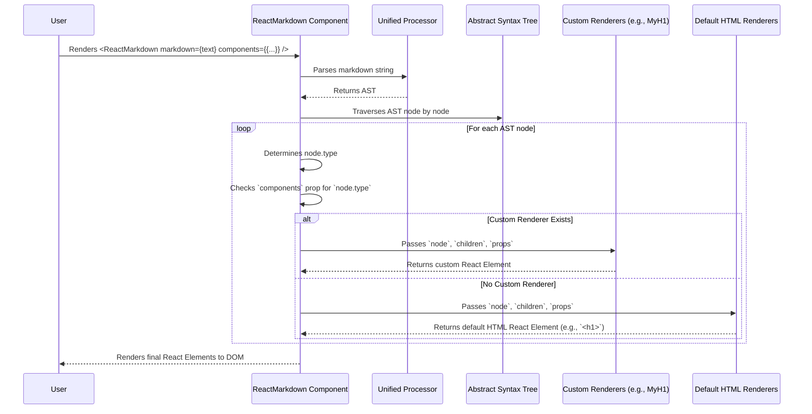

# Chapter 5: Component Map / Custom Renderers

In the previous chapter, we delved into the fundamental concept of the [AST (Abstract Syntax Tree) Node](chapter_04.md), understanding how your raw Markdown text is transformed into a structured, tree-like representation. Each node in this tree represents a distinct element, from a simple paragraph to a complex link or an image. While this AST provides the *structure*, it doesn't inherently dictate *how* these elements should visually appear on a web page. That's where the **Component Map** and **Custom Renderers** come into play.

---

### Problem & Motivation

Imagine you have a beautifully styled design system, and every `<h1>` tag on your website needs to conform to a very specific look and feel, perhaps involving custom fonts, colors, and even an icon. Standard browser `<h1>` elements are plain and won't cut it. Similarly, you might want all links (`<a>` tags) to open in a new tab by default or images (`` tags) to use a custom component for lazy loading or responsive handling.

The default behavior of `react-markdown` is to map AST nodes directly to standard HTML elements (e.g., an `heading` node with `depth: 1` becomes an `<h1>`, a `paragraph` node becomes a `<p>`, a `link` node becomes an `<a>`). While functional, this approach lacks the flexibility required for highly customized user interfaces or integration with existing component libraries. The core problem is the need for *control* over the final rendered output beyond basic HTML tags.

This is why the **Component Map / Custom Renderers** are crucial for `react-markdown`. They empower you to intercept the rendering process for any AST node type and supply your own React component, solving the problem of rigid default rendering. For instance, we'll guide through a concrete use case in this chapter: transforming a simple Markdown heading like `# Hello World` into a custom-styled React component, ensuring it fits perfectly within our fictional design system.

---

### Core Concept Explanation

At its heart, `react-markdown`'s rendering process involves traversing the AST and, for each node it encounters, deciding which React component should render it. The **Component Map**, exposed via the `components` prop, is precisely the mechanism for overriding these default decisions. It's an object where each key corresponds to an AST node type (often mirroring common HTML tag names like `h1`, `p`, `a`, `img`, `li`, `ul`, `code`, etc.), and its value is a React component (functional or class-based) that you provide.

When `react-markdown` processes an AST node, it first checks if a custom renderer for that node's type exists in the `components` prop. If found, your custom component is used. If not, it falls back to its internal default renderer, which typically produces a standard HTML element. This allows for selective customization, letting you override only the elements you care about while keeping defaults for others.

Your **Custom Renderers** are regular React components. When `react-markdown` invokes them, it passes several important props:
*   `node`: The AST node object itself, containing type, position, data, and potentially other specific attributes (e.g., `url` for a link, `alt` for an image, `lang` for a code block).
*   `children`: An array of React elements representing the rendered content *nested* within the current node. For example, a `<h1>` node might have text children, and a `<ul>` node would have `<li>` children. It's critical to render `children` within your custom component if you want the content of the Markdown element to appear.
*   Other HTML-like props: Depending on the node type, props like `href`, `src`, `title`, `alt`, `className`, `id`, `style`, etc., might be passed, corresponding to standard HTML attributes.

By leveraging the `components` prop, `react-markdown` provides an incredibly powerful and flexible way to integrate Markdown content seamlessly into any React application, no matter how unique its design or component library.

---

### Practical Usage Examples

Let's illustrate how to use the `components` prop to customize the rendering of Markdown elements. We'll start with our motivating use case: styling `h1` headings.

First, let's see how `react-markdown` renders a basic H1 by default:

```jsx
import React from 'react';
import ReactMarkdown from 'react-markdown';

function App() {
  const markdown = '# Hello World';
  return <ReactMarkdown>{markdown}</ReactMarkdown>;
}

export default App;
```
**Expected Output:** A standard browser-rendered `<h1>Hello World</h1>`.

Now, let's introduce a custom renderer for `h1` to give it a unique style.

**Example 1: Customizing an `h1` Heading**

We'll create a simple functional component `MyH1` that will render our `h1` differently.

```jsx
import React from 'react';
import ReactMarkdown from 'react-markdown';

// Our custom H1 renderer component
const MyH1 = ({ children }) => (
  <h1 style={{ color: 'purple', textDecoration: 'underline' }}>
    {children}
  </h1>
);

function App() {
  const markdown = '# Custom Styled Heading';
  return (
    <ReactMarkdown
      components={{
        h1: MyH1, // Map the 'h1' AST node type to our 'MyH1' component
      }}
    >
      {markdown}
    </ReactMarkdown>
  );
}

export default App;
```
**Explanation:**
1.  We define `MyH1` as a functional React component.
2.  Crucially, it accepts and renders `children`. If we didn't render `children`, the text "Custom Styled Heading" would not appear.
3.  We pass an object to the `components` prop where the key `h1` matches the AST node type for a level 1 heading, and its value is our `MyH1` component.

**Expected Output:** An `<h1>` element with purple, underlined text "Custom Styled Heading".

**Example 2: Customizing Links to Open in New Tabs**

Let's make all Markdown links (`<a>` tags) automatically open in a new browser tab.

```jsx
import React from 'react';
import ReactMarkdown from 'react-markdown';

// Custom link renderer
const MyLink = ({ href, children }) => (
  <a href={href} target="_blank" rel="noopener noreferrer">
    {children}
  </a>
);

function App() {
  const markdown = '[Visit Example.com](https://example.com)';
  return (
    <ReactMarkdown
      components={{
        a: MyLink, // Map 'a' (link) AST node to MyLink
      }}
    >
      {markdown}
    </ReactMarkdown>
  );
}

export default App;
```
**Explanation:**
1.  Our `MyLink` component accepts `href` (the link URL) and `children` (the link text) as props.
2.  We explicitly set `target="_blank"` and `rel="noopener noreferrer"` for security and accessibility.
3.  The `a` key in `components` ensures `MyLink` is used for all Markdown links.

**Expected Output:** An `<a>` element with text "Visit Example.com" that, when clicked, opens `https://example.com` in a new tab.

**Example 3: Accessing the Full Node Object for Conditional Rendering**

Sometimes you need more information than just standard HTML attributes. The `node` prop provides the full AST node object.

```jsx
import React from 'react';
import ReactMarkdown from 'react-markdown';

// Custom paragraph renderer that highlights if it's the first paragraph
const MyParagraph = ({ node, children }) => {
  // Check if it's the very first paragraph in the document
  // (This is a simplified check for demonstration)
  const isFirstParagraph = node.position && node.position.start.line === 1;

  return (
    <p style={{ fontWeight: isFirstParagraph ? 'bold' : 'normal' }}>
      {children}
    </p>
  );
};

function App() {
  const markdown = `This is the first paragraph.
  
This is the second paragraph.`;
  return (
    <ReactMarkdown
      components={{
        p: MyParagraph,
      }}
    >
      {markdown}
    </ReactMarkdown>
  );
}

export default App;
```
**Explanation:**
1.  The `MyParagraph` component receives the `node` prop, which contains information like `node.position`.
2.  We use `node.position.start.line` to make a (simplified) determination if it's the first paragraph.
3.  The first paragraph will be rendered with bold text, while subsequent paragraphs will be normal.

**Expected Output:** Two paragraphs, where "This is the first paragraph." is bold, and "This is the second paragraph." is not.

---

### Internal Implementation Walkthrough

The journey from Markdown string to custom-rendered React elements involves a well-defined sequence orchestrated by `react-markdown`.

1.  **Markdown Parsing & AST Generation**: As covered in previous chapters, the input Markdown string is first processed by `remark` and `rehype` (via `unified`) to generate an AST. Each node in this AST has a `type` property (e.g., `'paragraph'`, `'heading'`, `'link'`).

2.  **Component Map Registration**: When you pass the `components` prop to `ReactMarkdown`, it registers these custom renderers internally. This map essentially tells `react-markdown`, "for this specific AST node type, use *my* React component instead of your default."

3.  **AST Traversal and Rendering Strategy**: `react-markdown` then performs a depth-first traversal of the generated AST. For each AST node it encounters:
    *   It inspects the `node.type`.
    *   It checks its internal registry (which includes your `components` prop) to see if a custom renderer is specified for that `type`.

4.  **Renderer Selection**:
    *   **Custom Renderer Found**: If a matching custom component is found in your `components` prop (e.g., `h1: MyH1`), `react-markdown` will instantiate your `MyH1` component.
    *   **Default Renderer Used**: If no custom component is found for the `node.type`, `react-markdown` falls back to its built-in default renderer, which typically maps directly to standard HTML elements (e.g., `h1` to `<h1>`, `p` to `<p>`).

5.  **Prop Generation and Passing**: Before calling your custom renderer (or its default), `react-markdown` gathers all relevant data from the AST node and its children. It constructs the props that will be passed to your component, including:
    *   `node`: The original AST node object.
    *   `children`: The recursively rendered React elements of the child nodes.
    *   Specific HTML attributes: `href`, `src`, `alt`, `title`, `className`, etc., extracted from the AST node's properties.

6.  **Component Instantiation and DOM Update**: Your custom React component is then invoked with these props, returning React elements. These elements are ultimately reconciled by React and updated in the browser's DOM.

Here's a simplified sequence diagram illustrating the process:



---

### System Integration

The `components` prop acts as a critical bridge between the parsed [AST (Abstract Syntax Tree) Node](chapter_04.md) and the final rendered React elements. It directly consumes the structured information from the AST and translates it into your desired UI components.

*   **Input from AST**: Each AST node, with its `type` and associated data, serves as the direct input for selecting and populating the props of a renderer. Without a well-formed AST, the component map would have nothing to interpret.
*   **Output to React's Virtual DOM**: The React elements returned by your custom renderers (or the default ones) are fed directly into React's rendering pipeline, eventually resulting in updates to the browser's DOM.
*   **Interaction with [Rendering Control (Skipping & Unwrapping)](chapter_06.md)**: While `components` lets you *replace* a renderer, the next chapter, "Rendering Control," will show you how to *prevent* rendering specific nodes entirely or *unwrap* them, effectively removing their parent HTML tag but keeping their children. This provides even finer-grained control.
*   **Influence from [Processor Plugins](chapter_07.md)**: It's important to note that processor plugins (like `remark-gfm` or `rehype-highlight`) can *modify* the AST before `react-markdown` even begins its rendering traversal. This means a plugin might change a node's type or add new node types, which you can then target with custom renderers in your `components` prop. For example, a plugin might introduce a `footnote` node type, for which you'd then write a `footnote` custom renderer.

---

### Best Practices & Tips

*   **Always Render `children`**: For most custom renderers, forgetting to include `{children}` in your JSX is a common mistake that will result in empty components. If you want the content of the Markdown element (e.g., the text inside an `<h1>`, the items inside a `<ul>`), make sure to render the `children` prop.
*   **Spread Remaining Props**: Many AST nodes correspond to HTML elements that accept a wide range of standard attributes (`className`, `id`, `style`, `title`, `data-*`, etc.). `react-markdown` passes these down. It's good practice to spread any additional props onto your root element to ensure full compatibility:
    ```jsx
    const MyH1 = ({ node, children, ...props }) => (
      <h1 style={{ color: 'blue' }} {...props}>
        {children}
      </h1>
    );
    ```
*   **Keep Renderers Pure and Simple**: Custom renderers should ideally be pure functions of their props. Avoid complex state management or side effects within them if possible, as this can lead to unpredictable behavior during AST traversal and rendering.
*   **Memoize for Performance**: If your custom renderers are computationally expensive or if `react-markdown` is rendering very large documents, consider memoizing your components using `React.memo` to prevent unnecessary re-renders.
    ```jsx
    const MyMemoizedH1 = React.memo(({ children }) => (
      <h1 style={{ color: 'blue' }}>{children}</h1>
    ));
    // then use: components={{ h1: MyMemoizedH1 }}
    ```
*   **Avoid Recursive `ReactMarkdown` in Renderers**: Be extremely cautious if you decide to render another `<ReactMarkdown>` component *within* a custom renderer. This can easily lead to infinite loops unless you carefully control the input Markdown for the nested component to avoid re-rendering the same node type.
*   **Accessibility (a11y)**: When creating custom renderers, pay attention to accessibility. Ensure your custom components still provide proper semantics, ARIA attributes, and keyboard navigation where necessary, especially for interactive elements like links, buttons, and forms.
*   **Leverage `node` for Advanced Logic**: The `node` prop gives you full access to the underlying AST object. This is invaluable for advanced conditional rendering, debugging, or integrating with other tools that understand `unist` nodes.

---

### Chapter Conclusion

The `components` prop, providing the **Component Map** and enabling **Custom Renderers**, is one of `react-markdown`'s most powerful features. It transforms `react-markdown` from a simple Markdown-to-HTML converter into a highly adaptable tool that can seamlessly integrate Markdown content into any React application's design system. By understanding how to map AST node types to your own React components, you gain fine-grained control over the visual presentation and behavior of your rendered Markdown. This flexibility is essential for creating robust, maintainable, and visually consistent user interfaces.

Having learned how to replace default renderers with custom ones, our next step is to explore even deeper control over the rendering process. In the upcoming chapter, we'll examine how to entirely skip certain nodes or unwrap them, providing ways to selectively remove or flatten elements in the final output. This will further enhance your ability to tailor `react-markdown`'s behavior to precise requirements.

[Rendering Control (Skipping & Unwrapping)](chapter_06.md)