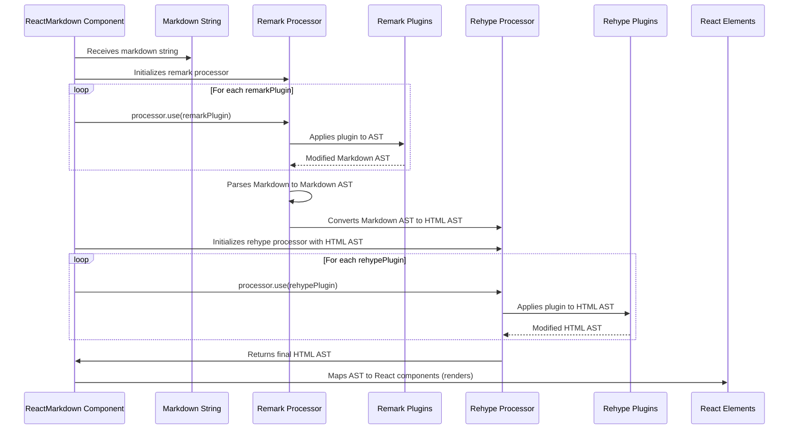

# Chapter 7: Processor Plugins

In the previous chapter, we explored [Rendering Control (Skipping & Unwrapping)](chapter_06.md), gaining fine-grained authority over which parts of our Markdown content are ultimately rendered into React elements. While skipping and unwrapping provide control over *what* gets rendered, they don't address the fundamental structure or content *before* rendering. What if we need to add new Markdown features, transform existing ones, or apply complex formatting logic to our content *during* the parsing phase?

---

### Problem & Motivation

The standard Markdown specification, while widely adopted, doesn't cover every possible formatting need. For instance, you might want to:
*   Add support for **GitHub Flavored Markdown (GFM)** features like task lists, tables, or strikethrough.
*   Implement **syntax highlighting** for code blocks, a crucial feature for any technical documentation.
*   Create **custom block types** like admonitions (notes, warnings, tips) that aren't part of standard Markdown.
*   Automatically generate **table of contents** or add custom IDs to headings.

Without a mechanism to extend or modify the Markdown parsing pipeline, `react-markdown` would be limited to basic Markdown rendering. This would force developers to preprocess their Markdown text manually before passing it to `react-markdown`, or to implement complex logic within custom renderers, which isn't ideal for transformations that happen at the AST level.

**Consider this real-world problem:** We want to display code snippets in our documentation with proper syntax highlighting, similar to how platforms like GitHub or documentation sites do. Standard Markdown treats code blocks as simple preformatted text. We need a way to transform these code blocks into something that can be styled for highlighting, typically by adding specific CSS classes or wrapping elements. This transformation needs to happen *before* `react-markdown` attempts to render the final HTML.

---

### Core Concept Explanation

Processor plugins are modular functions that extend or modify the behavior of the underlying Markdown and HTML processors used by `react-markdown`: **remark** (for Markdown) and **rehype** (for HTML). They operate directly on the **Abstract Syntax Tree (AST)** (as introduced in [Chapter 4: AST (Abstract Syntax Tree) Node)](chapter_04.md)), allowing for powerful transformations of your content before it's converted into React elements.

Think of plugins as "middleware" for your Markdown processing pipeline. Just as you might add middleware to an HTTP server to process requests before they reach your application logic, `react-markdown` allows you to add plugins to intercept and modify the AST at different stages.

`react-markdown` exposes two main props for integrating these plugins:
*   **`remarkPlugins`**: An array of plugins that operate on the **Markdown AST**. These plugins are executed by `remark` after the initial Markdown parsing, but *before* the AST is converted into a HTML-compatible AST by `rehype`. Use `remarkPlugins` for modifications related to Markdown syntax itself (e.g., adding GFM features, processing custom Markdown syntax).
*   **`rehypePlugins`**: An array of plugins that operate on the **HTML AST**. These plugins are executed by `rehype` after the Markdown AST has been converted to a HTML AST, and just before `react-markdown` maps the nodes to React components. Use `rehypePlugins` for transformations that are more HTML-centric (e.g., adding IDs to headings, modifying `` tags, syntax highlighting).

Each plugin is typically a function (or an array `[plugin, options]`) that `unified` (the engine behind `remark` and `rehype`) can apply to the AST. They receive the current AST and can manipulate it by adding, removing, or modifying nodes. This enables a highly flexible and extensible processing pipeline for your Markdown content.

---

### Practical Usage Examples

Let's address our motivating use case: enabling GitHub Flavored Markdown (GFM) and adding syntax highlighting to code blocks. This requires both `remark` and `rehype` plugins.

First, we'll enable GFM features like tables and task lists using `remark-gfm`. This is a `remark` plugin because it deals with Markdown syntax.

```jsx
import React from 'react';
import ReactMarkdown from 'react-markdown';
import remarkGfm from 'remark-gfm'; // Import the GFM plugin

const markdownInput = `
# My Document

Here's a table:

| Header 1 | Header 2 |
|----------|----------|
| Cell 1   | Cell 2   |

And a task list:

- [x] Task 1
- [ ] Task 2
`;

function AppWithGFM() {
  return (
    <ReactMarkdown remarkPlugins={[remarkGfm]}>
      {markdownInput}
    </ReactMarkdown>
  );
}

export default AppWithGFM;
```
*Explanation*: We import `remarkGfm` from its package. By passing it to `remarkPlugins`, `react-markdown` instructs the `remark` processor to apply this plugin. This will enable parsing of tables and task lists in the input Markdown, which are not part of CommonMark (the default Markdown flavor).

---

Next, let's add syntax highlighting using `rehype-highlight`. This plugin adds CSS classes to `<code>` elements, allowing a CSS stylesheet to visually highlight the code. It's a `rehype` plugin because it operates on the HTML structure (`<code>` tags) after the Markdown has been converted to HTML nodes.

```jsx
import React from 'react';
import ReactMarkdown from 'react-markdown';
import remarkGfm from 'remark-gfm';
import rehypeHighlight from 'rehype-highlight'; // Import the syntax highlighting plugin

// Don't forget to import a syntax highlighting CSS theme!
// Example: import 'highlight.js/styles/github.css';

const codeMarkdown = `
\`\`\`javascript
function greet(name) {
  console.log(\`Hello, \${name}!\`);
}
greet('World');
\`\`\`
`;

function AppWithSyntaxHighlighting() {
  return (
    <ReactMarkdown
      remarkPlugins={[remarkGfm]} // Still use GFM for other features
      rehypePlugins={[rehypeHighlight]} // Add the highlighting plugin
    >
      {codeMarkdown}
    </ReactMarkdown>
  );
}

export default AppWithSyntaxHighlighting;
```
*Explanation*: Here, we've added `rehypeHighlight` to the `rehypePlugins` array. This plugin will traverse the HTML AST generated by `rehype` and identify `<code>` blocks. It then adds appropriate CSS classes (e.g., `language-javascript`, `hljs`) to these elements. To actually *see* the highlighting, you'll also need to include a CSS stylesheet from a library like `highlight.js` (e.g., `import 'highlight.js/styles/github.css';`) in your project.

---

You can also pass options to plugins, typically as an array `[plugin, options]`. For example, `rehype-highlight` can be configured:

```jsx
import React from 'react';
import ReactMarkdown from 'react-markdown';
import rehypeHighlight from 'rehype-highlight';

// ... (other imports and markdown content)

function AppWithConfiguredHighlighting() {
  return (
    <ReactMarkdown
      rehypePlugins={[
        [rehypeHighlight, { detect: false, ignoreMissing: true }]
      ]}
    >
      {/* ... markdown content with code blocks ... */}
    </ReactMarkdown>
  );
}
```
*Explanation*: The `rehypeHighlight` plugin is now passed as an array `[rehypeHighlight, { detect: false, ignoreMissing: true }]`. The second element of this array is an object containing options specific to the plugin, allowing for customization of its behavior.

---

### Internal Implementation Walkthrough

`react-markdown` uses the `unified` ecosystem, specifically `remark` for Markdown parsing and `rehype` for HTML processing. The internal flow when plugins are involved is a sophisticated pipeline:

1.  **Markdown Input**: The `children` prop (your Markdown string) is received by `ReactMarkdown`.
2.  **Remark Processing (Markdown AST)**:
    *   `react-markdown` initializes a `remark` processor.
    *   It then iterates through your `remarkPlugins` array. For each plugin, it calls `processor.use(plugin)`.
    *   The `remark` processor parses the Markdown string into a **Markdown Abstract Syntax Tree (AST)**.
    *   As the AST is built or traversed, each `remark` plugin is applied. These plugins can inspect nodes, transform them, add new nodes, or remove existing ones, operating purely on the Markdown representation.
3.  **Remark-to-Rehype Bridge**: After all `remarkPlugins` have run, `remark` converts the Markdown AST into a **HTML Abstract Syntax Tree (AST)**. This is a crucial step where Markdown-specific nodes (like `paragraph`, `heading`) are translated into HTML-equivalent nodes (like `p`, `h1`).
4.  **Rehype Processing (HTML AST)**:
    *   `react-markdown` then initializes a `rehype` processor with the HTML AST received from `remark`.
    *   It iterates through your `rehypePlugins` array, calling `processor.use(plugin)` for each.
    *   Each `rehype` plugin is applied to the HTML AST. These plugins can further modify the HTML structure, add attributes, rewrite tags, or perform other HTML-level transformations. This is where plugins like `rehype-highlight` operate, adding classes to `<pre>` and `<code>` elements.
5.  **AST to React Elements**: Finally, `react-markdown` takes the fully processed HTML AST (which has been modified by both `remark` and `rehype` plugins) and maps its nodes to React elements using its internal component map and any provided custom renderers (as discussed in [Chapter 5: Component Map / Custom Renderers](chapter_05.md)).

Here's a simplified sequence diagram illustrating this process:



This pipeline ensures that your content is thoroughly transformed at the appropriate level (Markdown or HTML) before it ever reaches the rendering stage, providing maximum flexibility and power. The `react-markdown` component itself intelligently manages the lifecycle of these processors, ensuring plugins are applied correctly and efficiently, often leveraging `useMemo` internally to optimize performance for plugin arrays.

---

### System Integration

Processor plugins are a fundamental part of `react-markdown`'s extensibility, deeply integrating with other core abstractions:

*   **Markdown String Input** ([chapter_02.md]): The plugins directly process the AST derived from this input string. Without the input, there's nothing to transform.
*   **Markdown & HTML Processors (unified, remark, rehype)** ([chapter_03.md]): Plugins are essentially extensions for these processors. They define how `remark` and `rehype` can be modified to handle custom syntax or transformations.
*   **AST (Abstract Syntax Tree) Node** ([chapter_04.md]): Plugins operate directly on the AST nodes. They read, modify, add, or remove these nodes, fundamentally altering the structured representation of your content.
*   **Component Map / Custom Renderers** ([chapter_05.md]): This is where plugins meet rendering. Plugins *transform* the AST into a desired structure (e.g., adding `className="language-javascript"` to a `<code>` node). Custom renderers then *interpret* these transformed nodes to render specific React components (e.g., a `CodeBlock` component that understands `language-javascript` and applies `highlight.js`). There's a clear separation of concerns: plugins prepare the data, renderers display it.
*   **Rendering Control (Skipping & Unwrapping)** ([chapter_06.md]): While distinct, these features can interact. A plugin might introduce new, non-standard HTML elements into the AST. If `react-markdown` encounters such elements without a custom renderer, `unwrapDisallowed` might remove them, or `skipHtml` could prevent them from being rendered. Conversely, if a plugin is meant to clean up HTML, `skipHtml` might be less necessary.

In essence, plugins are the *transformers* of the `react-markdown` ecosystem. They modify the data structure that the renderers then consume, forming a powerful and flexible pipeline for displaying complex Markdown content.

---

### Best Practices & Tips

*   **Order Matters**: Especially for `rehypePlugins`, the order in which plugins are applied can significantly impact the final output. If one plugin expects specific HTML attributes added by another, ensure the plugin that adds the attributes runs first.
*   **Performance with `useMemo`**: Plugin arrays are often constant, but if they depend on props, ensure they are memoized (e.g., using `React.useMemo` or by defining them outside the component) to prevent unnecessary re-renders and re-initialization of the `unified` pipeline. `react-markdown` handles some internal memoization, but it's good practice for custom plugin arrays.

    ```jsx
    import React, { useMemo } from 'react';
    import ReactMarkdown from 'react-markdown';
    import rehypeHighlight from 'rehype-highlight';

    function MyComponent({ options }) {
      // Memoize the plugin array if it depends on dynamic props
      const customRehypePlugins = useMemo(() => {
        return [[rehypeHighlight, options]];
      }, [options]);

      return (
        <ReactMarkdown rehypePlugins={customRehypePlugins}>
          {/* ... */}
        </ReactMarkdown>
      );
    }
    ```
*   **Choose the Right Processor**:
    *   Use `remarkPlugins` when you want to interpret or transform Markdown syntax itself (e.g., custom block syntax, GFM features). These plugins work on the Markdown AST.
    *   Use `rehypePlugins` when you want to manipulate the resulting HTML structure, add attributes, or modify HTML elements (e.g., syntax highlighting, adding IDs to headings). These plugins work on the HTML AST.
*   **Creating Custom Plugins**: For advanced use cases, you can write your own `remark` or `rehype` plugins. This involves understanding the `unified` processor API and the AST structure. It's a powerful way to add truly bespoke functionality. Refer to the `remark` and `rehype` documentation for detailed guides on plugin development.
*   **Security Considerations**: Be mindful when using plugins, especially those that might insert raw HTML or script tags. Always sanitize untrusted Markdown input, and carefully vet any third-party plugins to avoid potential Cross-Site Scripting (XSS) vulnerabilities. `react-markdown` provides `skipHtml` and `unwrapDisallowed` for basic sanitization, but complex plugin interactions might require additional caution.

---

### Chapter Conclusion

Processor plugins are the bedrock of `react-markdown`'s extensibility, providing a robust mechanism to customize and enhance the parsing and transformation of your Markdown content. By leveraging `remarkPlugins` and `rehypePlugins`, you gain granular control over the Abstract Syntax Tree, enabling support for advanced Markdown features like GitHub Flavored Markdown, syntax highlighting, and even entirely custom syntax. This flexibility ensures `react-markdown` can adapt to nearly any content rendering requirement, making it a powerful tool for dynamic documentation, blog posts, and user-generated content.

Throughout this tutorial, we've journeyed from the basic `ReactMarkdown` component and its input, through the intricate world of ASTs, custom renderers, and rendering control, finally culminating in the powerful concept of processor plugins. You now possess a comprehensive understanding of how `react-markdown` processes and renders your content, and more importantly, how you can tailor it to your specific needs. This concludes our exploration of `react-markdown`.