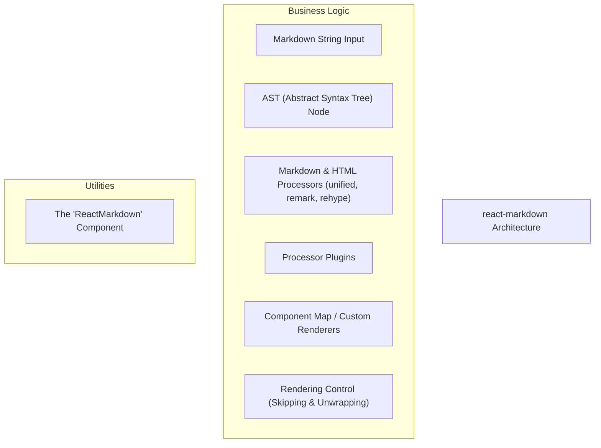
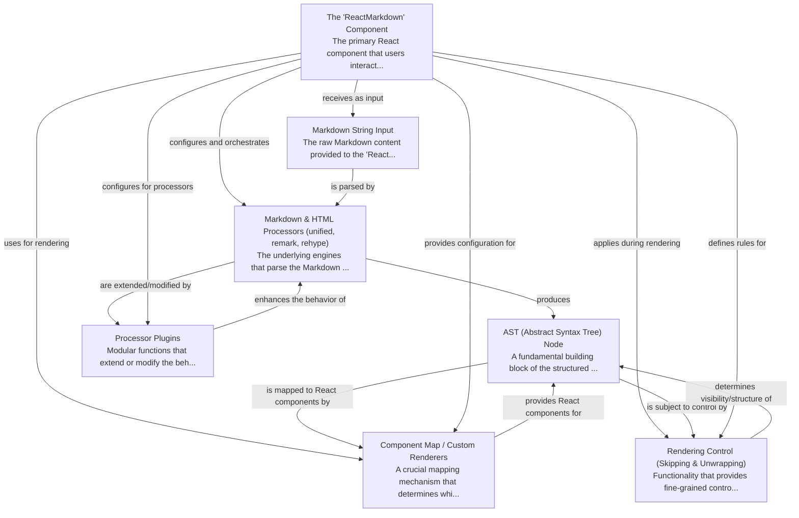

# react-markdown Tutorial

Welcome to the comprehensive tutorial for react-markdown. This tutorial is automatically generated from the codebase to help you understand the core concepts and implementation patterns.

## Project Overview

'react-markdown' is a React component that takes Markdown text and transforms it into React elements for rendering. It achieves this by leveraging unified processors (like remark and rehype) to parse the Markdown into an Abstract Syntax Tree (AST), which is then mapped to custom or default React components. The library provides extensive configurability through processor plugins and fine-grained control over the rendering process.

## System Architecture

## Component Relationships

## Table of Contents

1. [Chapter 1: The 'ReactMarkdown' Component](chapter_01.md) - Comprehensive documentation for The 'ReactMarkdown' Component following structured methodology...
2. [Chapter 2: Markdown String Input](chapter_02.md) - Comprehensive documentation for Markdown String Input following structured methodology...
3. [Chapter 3: Markdown & HTML Processors (unified, remark, rehype)](chapter_03.md) - Comprehensive documentation for Markdown & HTML Processors (unified, remark, rehype) following struc...
4. [Chapter 4: AST (Abstract Syntax Tree) Node](chapter_04.md) - Comprehensive documentation for AST (Abstract Syntax Tree) Node following structured methodology...
5. [Chapter 5: Component Map / Custom Renderers](chapter_05.md) - Comprehensive documentation for Component Map / Custom Renderers following structured methodology...
6. [Chapter 6: Rendering Control (Skipping & Unwrapping)](chapter_06.md) - Comprehensive documentation for Rendering Control (Skipping & Unwrapping) following structured metho...
7. [Chapter 7: Processor Plugins](chapter_07.md) - Comprehensive documentation for Processor Plugins following structured methodology...

## How to Use This Tutorial

1. **Start with Chapter 1** to understand the foundational concepts
2. **Follow the sequence** - each chapter builds upon previous concepts
3. **Practice with code examples** - every chapter includes practical examples
4. **Refer to diagrams** - use architecture diagrams for visual understanding
5. **Cross-reference concepts** - chapters link to related topics

## Tutorial Features

- **Progressive Learning**: Concepts are introduced in logical order
- **Code Examples**: Every chapter includes practical, executable code
- **Visual Diagrams**: Mermaid diagrams illustrate complex relationships
- **Cross-References**: Easy navigation between related concepts
- **Beginner-Friendly**: Written for newcomers to the codebase

## Contributing

This tutorial is auto-generated from the codebase. To improve it:
1. Update the source code documentation
2. Add more detailed comments to key functions
3. Regenerate the tutorial using the documentation system

---

*Generated using AI-powered codebase analysis*
