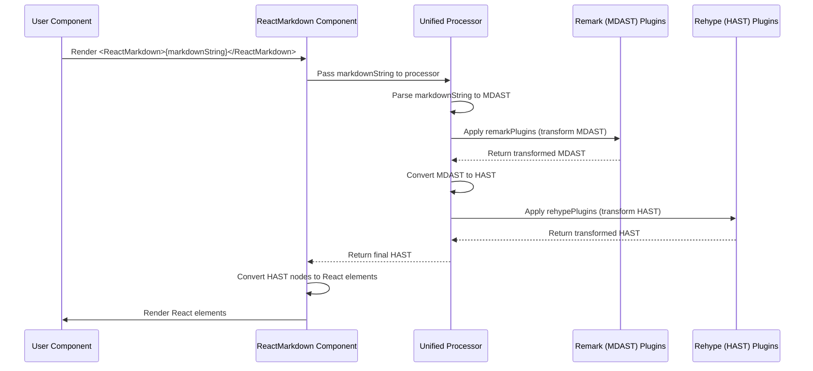

# Chapter 1: ReactMarkdown Component

Welcome to the `react-markdown` tutorial! This is the first chapter, laying the groundwork for understanding how to integrate and utilize markdown content within your React applications.

---

### Problem & Motivation

In modern web development, dynamic content is crucial. Often, this content comes from various sources, such as user-generated input, database entries, or content management systems. While plain text is simple, it lacks the rich formatting and structure that users expect, like headings, lists, links, and code blocks. Manually converting such content into HTML is tedious, error-prone, and can introduce security vulnerabilities. Directly embedding raw HTML from untrusted sources is also a major security risk.

This is where markdown shines. Markdown provides a lightweight, easy-to-read, and easy-to-write plain text format that can be converted into structurally valid HTML. The core problem `react-markdown` solves is enabling React developers to take a raw markdown string and safely render it as interactive React components, fully integrated into their application's ecosystem. It eliminates the need for manual parsing or unsafe `dangerouslySetInnerHTML` usage, providing a robust and secure way to display rich text content.

Consider a blogging platform where users write posts in markdown. Without `react-markdown`, displaying these posts beautifully and interactively would require complex logic, external libraries, or security compromises. `react-markdown` provides a straightforward solution: you feed it markdown, and it gives you React elements, solving this common dilemma elegantly.

---

### Core Concept Explanation

At its heart, `react-markdown` is a specialized React component that acts as a bridge between markdown text and the React rendering engine. When you provide it with a markdown string, it embarks on a sophisticated internal journey to transform that string into a tree of React elements. It's not just a simple text formatter; it's a powerful *parser* and *renderer*.

The component leverages the `unified` processing ecosystem, which is a modular pipeline for parsing, transforming, and compiling content. Think of `unified` as a factory assembly line. `react-markdown` takes your raw markdown string and hands it over to this `unified` pipeline. First, the string is *parsed* into a Markdown Abstract Syntax Tree (MDAST), which is a structured representation of your markdown content. Then, this MDAST can be *transformed* by various plugins (e.g., `remark-gfm` for GitHub Flavored Markdown) into a more refined MDAST or even into an HTML Abstract Syntax Tree (HAST).

Finally, this HAST—a structured representation of HTML elements—is *compiled* by `react-markdown` into actual React elements. This entire process is highly configurable, allowing developers to inject custom logic at nearly every stage. What you get back is not raw HTML, but a hierarchical structure of React components that you can interact with, style, and even replace with your own custom React components, providing unparalleled flexibility.

---

### Practical Usage Examples

Let's dive into how to use the `ReactMarkdown` component with a simple example.

First, you'll need to install it:
```bash
npm install react-markdown
# or
yarn add react-markdown
```

Now, let's see it in action.

```jsx
import React from 'react';
import ReactMarkdown from 'react-markdown';

function App() {
  const markdownContent = `
# Hello, ReactMarkdown!

This is a **simple** example.

- List item 1
- List item 2

Check out my [website](https://example.com)!
  `;

  return (
    <div className="App">
      <ReactMarkdown>{markdownContent}</ReactMarkdown>
    </div>
  );
}

export default App;
```
**Explanation:** In this example, we import the `ReactMarkdown` component and pass our markdown string as its `children` prop. `react-markdown` then automatically processes this string and renders it into a standard React component hierarchy, displaying a heading, paragraph, list, and a link.

You can also use it with inline markdown:

```jsx
import ReactMarkdown from 'react-markdown';

function InlineMarkdown() {
  return (
    <div>
      <p>Here's some *inline* markdown: <ReactMarkdown children="**bold text** and `code`." /></p>
    </div>
  );
}
// Expected output: <p>Here's some *inline* markdown: <strong>bold text</strong> and <code>code</code>.</p>
```
**Explanation:** `ReactMarkdown` can handle both multi-line and single-line markdown snippets. Here, it renders `**bold text**` as a `<strong>` element and `` `code` `` as a `<code>` element, maintaining the surrounding `<p>` tag.

---

### Internal Implementation Walkthrough

The `ReactMarkdown` component, while simple to use externally, orchestrates a complex internal workflow centered around the `unified` processing engine. When markdown is passed to the component, it initiates a series of transformations:

1.  **Input Reception**: The `children` prop, containing the markdown string, is received by the `ReactMarkdown` component (conceptually, in `ReactMarkdown.js`).
2.  **Markdown Parsing**: This string is fed into a `remark` parser (part of the `unified` ecosystem) which converts it into an MDAST (Markdown Abstract Syntax Tree). This tree represents the structure of your markdown.
3.  **AST Transformation**: The MDAST then flows through a series of `remark` plugins. These plugins can modify the MDAST—for instance, to add support for GFM tables or footnotes. After `remark` plugins, the MDAST is converted into a HAST (HTML Abstract Syntax Tree).
4.  **HAST Transformation**: The HAST can then be processed by `rehype` plugins, which specialize in transforming HTML structures. This is where, for example, a plugin might add `rel="nofollow"` to all external links.
5.  **HAST to React Elements**: Finally, the processed HAST is traversed, and `ReactMarkdown` converts each HAST node into its corresponding React element. This is where `<h1>` becomes `<h1>...</h1>`, `<p>` becomes `<p>...</p>`, and so on.

Here's a simplified sequence of interactions:


**Explanation:** The `ReactMarkdown` component essentially wraps the `unified` pipeline. It manages the lifecycle of this pipeline, ensuring that the markdown input is correctly processed through various stages of parsing and transformation before being rendered into the React DOM.

---

### System Integration

`ReactMarkdown` serves as the central integration point for all markdown-related functionalities within the project. It integrates seamlessly with several other key abstractions, providing a unified approach to content rendering:

*   **[Markdown Source](chapter_02.md)**: `ReactMarkdown` directly consumes markdown strings provided as its `children` prop. This is its primary input, which can originate from various sources like static files, API responses, or user input fields.

*   **[Unified Processor](chapter_05.md)**: This is the backbone of `react-markdown`. The component internally initializes and configures a `unified` processor, passing the markdown string through its `use` pipeline. This processor is responsible for orchestrating the parsing, transforming, and compiling steps.

*   **[Markdown AST (MDAST)](chapter_06.md)**: After parsing the raw markdown, `react-markdown` obtains an MDAST. This tree structure is the intermediate representation that `remark` plugins operate on. It's a foundational data structure that allows programmatic manipulation of markdown content.

*   **[HTML AST (HAST)](chapter_07.md)**: The MDAST is then converted into a HAST. This HTML-focused AST is what `rehype` plugins interact with and is the final tree structure from which `react-markdown` generates React elements.

*   **[Plugins](chapter_08.md)**: `ReactMarkdown` offers `remarkPlugins` and `rehypePlugins` props, allowing you to pass arrays of `unified` plugins. These plugins extend the component's capabilities, enabling support for additional markdown syntax (e.g., GFM) or advanced HTML transformations.

*   **[Node Renderer](chapter_09.md)**: While `ReactMarkdown` provides default renderers for common HTML elements, it integrates with the concept of node renderers through its `components` prop. This allows you to override any default HTML element (e.g., `<a>`, ``, `<blockquote>`) with your own custom React component, giving you ultimate control over the rendered output.

Data typically flows as follows: `Markdown String` -> `ReactMarkdown` component -> `Unified Processor` (parsing to MDAST -> `remark` plugins -> converting to HAST -> `rehype` plugins) -> `HAST to React Element Conversion` -> `Rendered React Elements`.

---

### Best Practices & Tips

To get the most out of `ReactMarkdown` and ensure a smooth experience, consider these best practices:

*   **Sanitize Inputs (where applicable)**: While `react-markdown` is designed to be secure and primarily renders HTML elements safely, if you are providing markdown from untrusted user input, it's always a good practice to use trusted `rehype` plugins like `rehype-sanitize` to filter out potentially malicious HTML or attributes. This adds an extra layer of security.
*   **Keep Markdown Simple Initially**: For beginners, start with basic markdown syntax. As you become comfortable, introduce plugins to support more advanced features like tables or task lists.
*   **Leverage Plugins for Functionality**: Don't try to implement complex markdown features manually. Instead, explore the rich ecosystem of `remark` and `rehype` plugins. They are highly optimized and cover most use cases. For example, use `remark-gfm` for GitHub Flavored Markdown features.
*   **Optimize for Performance (Large Documents)**: For extremely large markdown documents, consider memoizing the `ReactMarkdown` component or the `children` prop if it's dynamic. The parsing and rendering process can be computationally intensive, so minimizing re-renders is beneficial.
*   **Use the `components` Prop Wisely**: While powerful, overriding too many components can make your code harder to maintain. Focus on customizing components that truly benefit from custom React logic or specific styling, like custom `Link` components for client-side routing.

---

### Chapter Conclusion

In this chapter, we've introduced the `ReactMarkdown` component, understanding its crucial role in transforming raw markdown strings into interactive and customizable React elements. We explored the problem it solves—safely rendering rich text content in React—and learned its core mechanism of leveraging the `unified` processing ecosystem. We also walked through practical examples, peeked into its internal workings with a sequence diagram, and discussed how it integrates with other fundamental concepts within the `react-markdown` project.

You now have a solid grasp of `ReactMarkdown` as the entry point for your markdown rendering needs. Moving forward, a deeper understanding of the markdown source itself will be beneficial.

In the next chapter, we will delve into **[Markdown Source](chapter_02.md)**, exploring the various ways you can provide markdown to your `ReactMarkdown` component and the nuances of working with different markdown syntaxes.