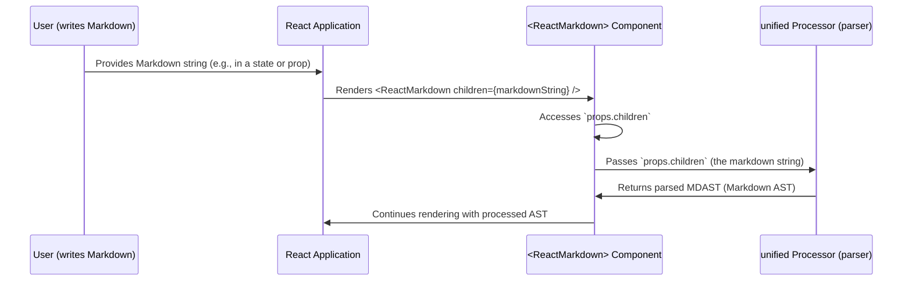

# Chapter 2: Markdown Source

Welcome back! In the [previous chapter](chapter_01.md), we introduced the core `ReactMarkdown` component, the primary interface for rendering markdown in your React applications. We learned that this component is what you import and use, essentially serving as the orchestrator for the entire markdown rendering process. But what exactly does it orchestrate? It orchestrates the transformation of a raw **Markdown Source**.

---

### Problem & Motivation

Imagine you're building a blog, a forum, or a documentation site. You need a way for users (or yourself) to write rich, formatted text—like headings, lists, bold text, and links—without having to deal with the complexities of HTML tags directly. Writing raw HTML for every piece of content can be cumbersome, error-prone, and visually noisy for authors.

This is where Markdown comes in. Markdown is a lightweight markup language that allows you to add formatting elements to plain text documents using a simple, human-readable syntax. It solves the problem of enabling content creators to write structured text easily and quickly, focusing on the content rather than intricate syntax.

For `react-markdown`, the "Markdown Source" is the critical input. Without it, there's nothing to render. It's the raw material that fuels the entire conversion process, transforming user-friendly text into the interactive React elements your users see. For example, if you want to display a simple blog post with a title and a paragraph, Markdown provides a clean way to represent that structure:

```markdown
# My First Post
Hello, **world**! This is my *new* blog post.
```

`react-markdown`'s mission is to take exactly this kind of plain text string and turn it into actual React components, making the web content dynamic and interactive.

---

### Core Concept Explanation

The **Markdown Source** in the context of `react-markdown` refers specifically to the plain text string that contains markdown-formatted content. This string is the raw input that the `ReactMarkdown` component receives. It's not an object, an array, or a special data type; it's simply a standard JavaScript string.

Think of it as the recipe. You provide the recipe (the markdown string), and `react-markdown` follows it to bake the cake (the rendered React elements). The elegance of Markdown lies in its simplicity: a few key characters like `#` for headings, `*` or `_` for emphasis, and `[]()` for links, allow authors to structure content without needing to learn complex programming languages or HTML tags.

When you pass a Markdown Source string to `ReactMarkdown`, the component acts as a translator. It doesn't inherently understand what `# My Title` means as a visual element, but it understands that this string needs to be processed according to Markdown rules. This processing involves several steps, starting with parsing the raw string into a structured representation, which we'll explore in later chapters. For now, understand that the Markdown Source is the foundational text upon which everything else is built.

---

### Practical Usage Examples

Let's see how you provide the Markdown Source to the `ReactMarkdown` component. The most common and recommended way is to pass it as the `children` prop.

#### Example 1: Basic Heading and Paragraph

Here's how you render a simple heading and paragraph:

```jsx
import React from 'react'
import ReactMarkdown from 'react-markdown'

function BlogPost() {
  const markdownSource = `# Welcome\nThis is a simple paragraph.`
  return <ReactMarkdown>{markdownSource}</ReactMarkdown>
}

export default BlogPost
```
**Explanation**: In this example, `markdownSource` holds our raw markdown string. We then pass this string directly as the `children` of the `<ReactMarkdown>` component. `react-markdown` will interpret `# Welcome` as an `<h1>` tag and `This is a simple paragraph.` as a `<p>` tag, rendering them accordingly.

---

#### Example 2: Lists and Emphasis

Markdown makes it easy to create lists and emphasize text:

```jsx
import React from 'react'
import ReactMarkdown from 'react-markdown'

function FeaturesList() {
  const markdownSource = `
- Item One
- Item Two: **Bold text** here.
- Item Three: *Italic text* too!
`
  return <ReactMarkdown>{markdownSource}</ReactMarkdown>
}

export default FeaturesList
```
**Explanation**: This snippet demonstrates an unordered list (`-`). Notice how `**Bold text**` and `*Italic text*` are used directly in the markdown string. `react-markdown` will convert these to `<li>` elements, with `<strong>` and `<em>` tags inside, respectively.

---

#### Example 3: Links and Code Blocks

Including links and simple code blocks is also straightforward:

```jsx
import React from 'react'
import ReactMarkdown from 'react-markdown'

function AboutPage() {
  const markdownSource = `
Visit my [website](https://example.com).
Here's some \`inline code\`.

\`\`\`javascript
const greet = "Hello";
console.log(greet);
\`\`\`
`
  return <ReactMarkdown>{markdownSource}</ReactMarkdown>
}

export default AboutPage
```
**Explanation**: Here, `[website](https://example.com)` becomes an `<a>` tag. `` `inline code` `` will be rendered as a `<code>` tag. The multi-line block with ````javascript`...``` will become a `<pre><code>` block, often with syntax highlighting if you configure it with appropriate plugins (which we'll cover later).

---

### Internal Implementation Walkthrough

When the `ReactMarkdown` component receives a `children` prop that is a string, it immediately recognizes this as the Markdown Source. Internally, `react-markdown` doesn't perform complex parsing on this string itself. Instead, it acts as a thin wrapper that hands this raw markdown string over to the underlying `unified` processing ecosystem.

Here's a simplified view of the internal flow for handling the Markdown Source:


**Explanation**:
1.  **User Input**: A user (or developer) provides the markdown content as a simple string.
2.  **React Component**: This string is then passed to the `ReactMarkdown` component via its `children` prop.
3.  **Prop Access**: Inside the `ReactMarkdown` component, it accesses `this.props.children` to retrieve the markdown string.
4.  **Unified Hand-off**: The string is then passed as input to the `unified` processor (specifically, the `remark-parse` plugin which is part of the `unified` pipeline). This is where the *actual* parsing of the markdown syntax into a structured data format begins.
5.  **Output**: The `unified` processor returns a **Markdown AST (MDAST)**, which is a tree-like representation of the markdown content, ready for further transformations.

The key takeaway is that the `ReactMarkdown` component itself doesn't contain a full markdown parser. Its strength comes from its integration with the highly modular `unified` ecosystem, which handles the complex task of interpreting the Markdown Source.

---

### System Integration

The Markdown Source is the initial payload for `react-markdown`'s entire processing pipeline. It integrates with other system components primarily at the very beginning of the data flow:

*   **[ReactMarkdown Component](chapter_01.md)**: The component directly consumes the Markdown Source via its `children` prop. It's the entry point.
*   **[Unified Processor](chapter_05.md)**: The Markdown Source is the direct input to the `unified` processor. The `remark-parse` plugin, part of the `unified` ecosystem, takes this raw string and converts it into a structured data format.
*   **[Markdown AST (MDAST)](chapter_06.md)**: After the `unified` processor receives the Markdown Source, its first step is to parse it into an MDAST. The MDAST is the first abstract representation of your markdown, containing nodes for headings, paragraphs, lists, etc.

The data flow is linear:
`Markdown Source (string)` -> `Unified Processor (remark-parse)` -> `Markdown AST (MDAST)`

Without the Markdown Source, none of the subsequent steps (parsing, transforming, rendering) can occur. It's the fundamental piece of data that gets transformed throughout `react-markdown`'s architecture.

---

### Best Practices & Tips

To get the most out of `react-markdown` and ensure smooth rendering, consider these best practices:

*   **Ensure Valid Markdown**: While `react-markdown` is forgiving, using valid Markdown syntax will lead to more predictable and consistent rendering. Refer to the CommonMark specification for detailed syntax rules.
*   **Sanitize User-Generated Content**: If your Markdown Source comes from user input (e.g., comments, forum posts), it's crucial to sanitize it. Malicious users could inject HTML or scripts if not properly handled. `react-markdown` itself *does not* sanitize HTML by default. You should use plugins like `remark-gfm` combined with `rehype-sanitize` to filter out potentially dangerous elements.
    ```jsx
    import React from 'react'
    import ReactMarkdown from 'react-markdown'
    import remarkGfm from 'remark-gfm'
    import rehypeSanitize from 'rehype-sanitize'

    function UserComment({ commentMarkdown }) {
      return (
        <ReactMarkdown remarkPlugins={[remarkGfm]} rehypePlugins={[rehypeSanitize]}>
          {commentMarkdown}
        </ReactMarkdown>
      )
    }
    ```
    **Explanation**: This example shows how to add `remarkGfm` and `rehypeSanitize` plugins. `rehypeSanitize` is essential for security when dealing with untrusted markdown.
*   **Source of Truth**: Treat your Markdown Source as the single source of truth for your content. Avoid trying to manipulate the raw markdown string with complex string operations if you need to alter the structure. Instead, leverage `react-markdown`'s plugin system to transform the AST.
*   **Encoding**: Ensure your Markdown Source strings are consistently encoded (e.g., UTF-8) to avoid character display issues, especially with international characters or special symbols.

---

### Chapter Conclusion

The Markdown Source is the bedrock of any `react-markdown` implementation. It's the plain text string that you feed into the component, representing your content in a human-readable and easy-to-write format. We've seen how `ReactMarkdown` accepts this source via its `children` prop and how this initiates the entire rendering pipeline by handing it off to the `unified` processor. Understanding that the Markdown Source is just a string and where it fits in the architectural flow is crucial for effective usage.

Now that we understand what the input is, let's explore how we can control `react-markdown`'s behavior and the output it generates. In the next chapter, we will dive into the various ways to configure the `ReactMarkdown` component.

Continue to: [Configuration Options](chapter_03.md)