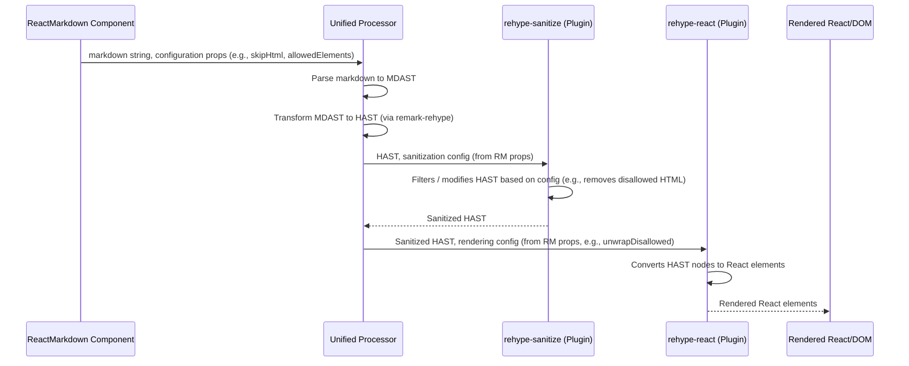

# Chapter 3: Configuration Options

In the previous chapter, we explored the fundamental concept of [Markdown Source](chapter_02.md)—the raw text that `react-markdown` consumes. While providing the markdown content is crucial, it's often not enough to meet the diverse requirements of modern web applications. Developers frequently need to exert fine-grained control over how that markdown is processed, sanitized, and ultimately rendered into React elements.

---

### Problem & Motivation

Imagine building a platform where users can submit content using markdown. This content might include basic formatting, but also potentially malicious HTML (like `<script>` tags) or structural elements that don't fit your design (e.g., `<iframe>` or complex `<div>` layouts). Simply rendering the markdown as-is poses significant security risks and can lead to inconsistent UI. The problem is that without explicit controls, `react-markdown` would faithfully translate all valid markdown and even embedded HTML into your application's DOM, opening doors to XSS attacks or unintended visual disruptions.

This is where `Configuration Options` become indispensable. They provide the necessary mechanisms to customize `react-markdown`'s behavior, allowing developers to define what elements are permitted, how potentially dangerous HTML is handled, and how certain markdown constructs are interpreted. The primary motivation is to empower developers with control over security, content integrity, and rendering consistency, ensuring that user-generated markdown enhances the application without compromising its safety or design. For instance, a blog application might want to allow `<strong>` and `<em>` but strictly forbid `` or `<a>` tags unless they come from a trusted source.

### Core Concept Explanation

`Configuration Options` in `react-markdown` are essentially a set of **props** that you pass directly to the `<ReactMarkdown>` component. These props act as switches and parameters, influencing the various stages of the markdown processing pipeline—from parsing to conversion and rendering. Think of them as the 'settings' panel for your markdown renderer, allowing you to tailor its behavior without altering its core logic.

These options primarily serve two main purposes: **security** and **rendering control**. Security-related options, like `skipHtml` and `allowedElements`, help protect your application from harmful content by sanitizing or filtering specific HTML tags. Rendering control options, such as `unwrapDisallowed` or `transformLinkUri`, allow you to modify how elements are structurally represented or how links are handled. By leveraging these options, you can transform `react-markdown` from a generic renderer into a highly specialized tool perfectly suited for your application's unique needs, ensuring that the output is not just correct, but also safe and aesthetically consistent.

---

### Practical Usage Examples

Let's illustrate how to use some common configuration options to address our motivating use case of rendering user-submitted markdown securely.

#### 1. Skipping Raw HTML for Security

The `skipHtml` option is a boolean flag that, when set to `true`, instructs `react-markdown` to completely ignore and discard any raw HTML found within the markdown string. This is a critical first line of defense against XSS attacks.

```jsx
import ReactMarkdown from 'react-markdown';

function SecureContent({ markdown }) {
  return (
    <ReactMarkdown skipHtml={true}>
      {markdown}
    </ReactMarkdown>
  );
}

// Example usage:
// <SecureContent markdown="<script>alert('xss!')</script># Hello" />
// Expected Output: <h1>Hello</h1> (script tag is removed)
```
When `skipHtml` is `true`, any content that looks like raw HTML (e.g., `<script>`, `<div>`) will be stripped out before rendering, leaving only the markdown-parsed elements.

#### 2. Allowing Specific Elements

While `skipHtml` is good for a blanket ban, you might want to allow *some* HTML elements (e.g., `<a>`, `<span>`) but disallow others. The `allowedElements` prop takes an array of strings, specifying exactly which HTML tag names are permitted.

```jsx
import ReactMarkdown from 'react-markdown';

function ControlledContent({ markdown }) {
  return (
    <ReactMarkdown allowedElements={['p', 'strong', 'em', 'a', 'br']}>
      {markdown}
    </ReactMarkdown>
  );
}

// Example usage:
// <ControlledContent markdown="<blink>Hello</blink> **World**" />
// Expected Output: <p><strong>World</strong></p> (blink tag is removed)
```
Here, only paragraphs, strong text, emphasized text, links, and line breaks are allowed. Any other HTML tags present in the markdown will be filtered out.

#### 3. Unwrapping Disallowed Elements

When an element is disallowed, `react-markdown` typically removes it along with its content. However, `unwrapDisallowed` allows you to keep the *text content* of a disallowed element, effectively "unwrapping" it. This is useful if you want to filter out specific styling tags but retain their inner text.

```jsx
import ReactMarkdown from 'react-markdown';

function UnwrapContent({ markdown }) {
  return (
    <ReactMarkdown allowedElements={['p', 'strong']} unwrapDisallowed={true}>
      {markdown}
    </ReactMarkdown>
  );
}

// Example usage:
// <UnwrapContent markdown="<h1>My Heading</h1><p>And **some** text.</p>" />
// Expected Output: <p>My Heading</p><p>And <strong>some</strong> text.</p>
```
In this example, `<h1>` is disallowed. Without `unwrapDisallowed`, "My Heading" would be gone. With it, the `<h1>` tag is removed, but its text content "My Heading" is preserved and rendered, often implicitly within a paragraph if no other wrapping element is provided by the markdown.

---

### Internal Implementation Walkthrough

Configuration options might seem like simple props, but they play a crucial role by influencing the behavior of `react-markdown`'s internal `unified` processing pipeline. Most of these options are not handled directly by the `ReactMarkdown` component itself, but rather passed down to specialized [Plugins](chapter_08.md) that operate on the [HTML AST (HAST)](chapter_07.md).

Here’s a simplified sequence of how configuration options like `skipHtml` or `allowedElements` are handled:



1.  **ReactMarkdown Component**: When you pass props like `skipHtml`, `allowedElements`, or `unwrapDisallowed` to `<ReactMarkdown>`, the component first initializes or reconfigures its internal `unified` processor.
2.  **Unified Processor & Plugins**: The `unified` processor takes the raw markdown, parses it into a [Markdown AST (MDAST)](chapter_06.md), and then transforms it into an HTML AST (HAST).
3.  **`rehype-sanitize`**: This is a critical plugin in `react-markdown`'s default pipeline. Props like `skipHtml` and `allowedElements` are directly translated into configuration options for `rehype-sanitize`.
    *   If `skipHtml` is `true`, `rehype-sanitize` is configured to remove all raw HTML nodes.
    *   If `allowedElements` is provided, `rehype-sanitize` uses this list to strictly filter out any HTML tags not explicitly allowed.
4.  **`rehype-react`**: After sanitization, the HAST is passed to `rehype-react`, which is responsible for converting the HAST nodes into actual React elements. The `unwrapDisallowed` option specifically affects `rehype-react`'s behavior. If a node was disallowed by `rehype-sanitize` but `unwrapDisallowed` is `true`, `rehype-react` will attempt to render its children directly rather than omitting the entire branch.
5.  **Rendering**: Finally, the React elements generated by `rehype-react` are rendered into your application's DOM.

This indirect interaction through plugins allows `react-markdown` to remain modular and flexible, offloading specific processing concerns to well-tested `unified` ecosystem plugins.

---

### System Integration

Configuration options are fundamental to how the entire `react-markdown` system functions, bridging the user-facing [ReactMarkdown Component](chapter_01.md) with the underlying [Unified Processor](chapter_05.md) and its [Plugins](chapter_08.md).

*   **ReactMarkdown Component**: This is the entry point where all configuration options are provided as props. It acts as the orchestrator, taking these props and passing them down to the relevant parts of the processing pipeline.
*   **Unified Processor**: The `ReactMarkdown` component constructs and configures a `unified` processor instance. Many of the options (`skipHtml`, `allowedElements`, `transformLinkUri`, `linkTarget`, `rehypePlugins`, `remarkPlugins`) are directly consumed by the processor itself or passed as configuration to its plugins.
*   **Plugins**: As seen in the internal walkthrough, specific options directly configure `rehype-sanitize` (for `skipHtml`, `allowedElements`) and `rehype-react` (for `unwrapDisallowed`, `components`). Even advanced options like `rehypePlugins` and `remarkPlugins` allow you to inject your own custom plugins, which can then be configured using other props or through their own specific options.
*   **Data Flow**: Configuration options flow downwards from the `ReactMarkdown` component, through the `unified` processor, and into the specific plugins, influencing how the [Markdown AST (MDAST)](chapter_06.md) is transformed into a [HTML AST (HAST)](chapter_07.md) and finally into React elements.

---

### Best Practices & Tips

1.  **Prioritize Security**: For any user-generated or untrusted markdown content, *always* use `skipHtml={true}` or `allowedElements` to explicitly whitelist safe HTML tags. Never render untrusted raw HTML directly.
2.  **Specificity over Broadness**: When using `allowedElements`, be as specific as possible. Instead of allowing all `div` elements, consider if you only need `div`s with specific classes. However, `react-markdown`'s `allowedElements` doesn't directly support class-based filtering; you'd need a custom `rehype` plugin for that.
3.  **Understand `unwrapDisallowed`**: Be aware that `unwrapDisallowed` changes the DOM structure. While useful for retaining content, it can lead to unexpected formatting if not carefully considered. For example, a disallowed `<h2>` header's text might become a plain text node, potentially merging with adjacent paragraphs.
4.  **Combine Options**: Many scenarios will require a combination of options. For example, `skipHtml` for basic sanitization, then `allowedElements` to re-introduce a specific subset of safe HTML, and perhaps `transformLinkUri` for controlling external links.
5.  **Performance Considerations**: While most configuration options have a negligible impact on performance for typical use cases, extremely long `allowedElements` arrays or complex `transformLinkUri` functions executed on very large markdown inputs could theoretically add overhead. Profile if you encounter performance issues with very specific, complex configurations.
6.  **Debugging**: If your markdown isn't rendering as expected with certain options, start by simplifying your markdown and options. Remove `allowedElements` to see if it's the culprit, or temporarily set `skipHtml={false}` (for trusted content only!) to see if embedded HTML is being stripped. Inspect the rendered DOM using browser developer tools.

---

### Chapter Conclusion

Configuration options are the control panel of `react-markdown`, enabling developers to precisely dictate how markdown is processed, sanitized, and rendered. They are crucial for building secure, robust, and visually consistent applications that handle diverse markdown inputs. By understanding and effectively utilizing props like `skipHtml`, `allowedElements`, and `unwrapDisallowed`, you gain the power to tailor `react-markdown` to virtually any requirement.

While configuration options primarily control *what* gets rendered, the next chapter will delve into [Custom Component Mapping](chapter_04.md), which provides granular control over *how* each markdown element is rendered as a React component, opening up even more possibilities for design and interactivity.

---
Next Chapter: [Custom Component Mapping](chapter_04.md)