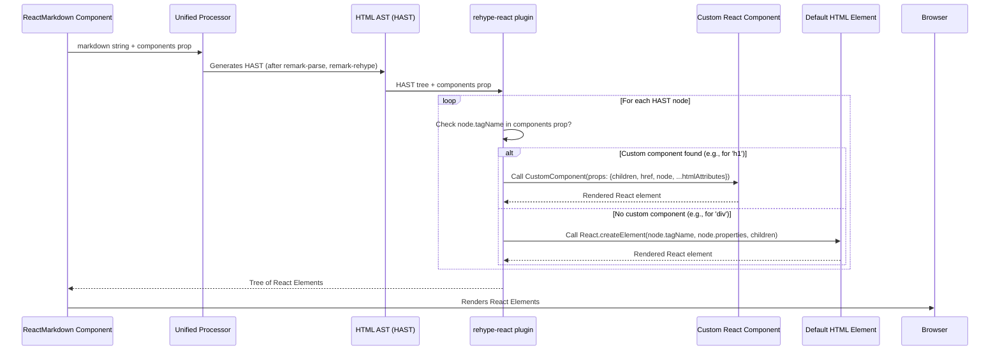

# Chapter 4: Custom Component Mapping

In the previous chapter, [Configuration Options](chapter_03.md), we explored how to control *what* content `react-markdown` renders by allowing or disallowing specific HTML elements and attributes. While configuration options provide granular control over the *structure* of the rendered output, they don't dictate its *appearance* or *interactivity*. This is where **Custom Component Mapping** comes into play.

---

### Problem & Motivation

Imagine you're building a blog or a documentation site using `react-markdown`. By default, `react-markdown` renders standard HTML elements for markdown constructs: `<h1>` for `# Heading`, `<p>` for paragraphs, `<a>` for links, and `` for images. While functional, this default rendering can often feel generic and disconnected from your application's unique design system or interactive components.

The core problem is the desire to seamlessly integrate markdown content with the visual identity and advanced functionality of a React application. You might want all `<h1>` tags to use a custom `StyledHeading` component that applies specific typography and branding, or `<a>` links to use your application's `Link` component from a UI library, which might handle internal routing differently than a standard `<a>` tag. Without custom component mapping, you'd be stuck with basic HTML elements, requiring complex CSS overrides or post-rendering DOM manipulation, which is cumbersome and error-prone. This abstraction is crucial for transforming raw markdown into a truly native and interactive React user experience.

---

### Core Concept Explanation

Custom Component Mapping is a powerful mechanism in `react-markdown` that allows you to swap out the default HTML elements rendered for specific markdown constructs with your own custom React components. Instead of `react-markdown` creating a `<p>` tag for a paragraph, you can tell it to use your `MyParagraph` component.

At its heart, `react-markdown` converts the input markdown string into an Abstract Syntax Tree (AST), eventually transforming it into an HTML AST (HAST). Before rendering this HAST into actual React elements, `react-markdown` consults a `components` prop that you can pass to it. This prop is an object where each key corresponds to an HTML tag name (e.g., `'h1'`, `'p'`, `'a'`, `'img'`) and its value is a React component you provide.

When `react-markdown` encounters an HTML element in the HAST (like an `<h1>` node), it first checks if a custom component has been mapped to that element's tag name in the `components` prop. If a mapping exists (e.g., `components.h1` is defined), it will use your specified React component (`components.h1`) to render that part of the content, passing relevant HTML attributes and children as props to your component. If no custom mapping is found for a particular tag, `react-markdown` falls back to rendering the default native HTML element using `React.createElement`. This flexible approach empowers developers to have full control over the final rendered output.

---

### Practical Usage Examples

Let's illustrate how to use custom component mapping to address our motivating use case: styling `h1` headings and `a` links with custom React components.

**Example 1: Customizing `h1` Headings**

We'll start by replacing the default `<h1>` element with a simple custom React component called `MyHeading`.

```jsx
import React from 'react';
import ReactMarkdown from 'react-markdown';

// Define a simple custom component for h1
const MyHeading = ({ children }) => (
  <h1 style={{ color: 'navy', borderBottom: '2px solid navy' }}>
    {children}
  </h1>
);

const markdown = '# Hello, Custom Heading!';

function App() {
  return (
    <ReactMarkdown components={{ h1: MyHeading }}>
      {markdown}
    </ReactMarkdown>
  );
}

export default App;
```
**Explanation:** Here, we define `MyHeading` as a functional component. When `react-markdown` encounters an `h1` in the parsed markdown, it uses `MyHeading` instead of a standard `<h1>`. The `children` prop passed to `MyHeading` will be the text content of the `h1` heading.

**Example 2: Customizing `a` Links with External Icon**

Next, let's create a custom link component that automatically adds an external link icon for external URLs.

```jsx
import React from 'react';
import ReactMarkdown from 'react-markdown';

// A simple external link icon (replace with an actual SVG/component in production)
const ExternalLinkIcon = () => (
  <span style={{ marginLeft: '5px', verticalAlign: 'middle' }}>🔗</span>
);

// Define a custom component for 'a' links
const MyLink = ({ href, children }) => {
  const isExternal = href && href.startsWith('http');
  return (
    <a href={href} target={isExternal ? '_blank' : undefined} rel={isExternal ? 'noopener noreferrer' : undefined} style={{ color: 'teal' }}>
      {children} {isExternal && <ExternalLinkIcon />}
    </a>
  );
};

const markdown = 'Check out [my blog](https://example.com) or [local page](/about).';

function App() {
  return (
    <ReactMarkdown components={{ a: MyLink }}>
      {markdown}
    </ReactMarkdown>
  );
}

export default App;
```
**Explanation:** The `MyLink` component receives standard HTML `a` tag attributes like `href` and `children` as props. We can use these props to conditionally render an external link icon and set `target="_blank"` for external URLs, providing enhanced functionality beyond a basic `<a>` tag.

**Example 3: Accessing the HAST Node Object**

Sometimes, you need more context than just the standard HTML attributes. `react-markdown` passes a `node` prop to your custom components, which is the actual HAST node object.

```jsx
import React from 'react';
import ReactMarkdown from 'react-markdown';

const MyImage = ({ node, ...props }) => {
  const { alt, src, title } = props;
  const imageSize = node.position ? `(${node.position.start.line}:${node.position.start.column})` : '';
  return (
    <figure>
      
      {alt && <figcaption>Image: {alt} {imageSize}</figcaption>}
    </figure>
  );
};

const markdown = 'An image: ';

function App() {
  return (
    <ReactMarkdown components={{ img: MyImage }}>
      {markdown}
    </ReactMarkdown>
  );
}

export default App;
```
**Explanation:** The `MyImage` component receives `node` as a prop, giving it access to the raw HAST node, including `position` information or other properties that might not be directly mapped to HTML attributes. We also use the spread operator (`...props`) to ensure all other HTML `img` attributes (like `src`, `alt`, `title`) are passed through.

---

### Internal Implementation Walkthrough

The magic behind custom component mapping in `react-markdown` largely resides in its reliance on the `rehype-react` plugin within the `unified` ecosystem. Here's a simplified step-by-step breakdown of what happens internally:

1.  **Markdown Parsing & Transformation:** `react-markdown` first takes the raw markdown string and passes it through the `unified` processor. This processor uses `remark-parse` to convert markdown into a Markdown AST (MDAST), then `remark-rehype` to transform the MDAST into an HTML AST (HAST).

2.  **HAST to React Element Conversion:** Once the HAST is generated, `react-markdown` internally applies the `rehype-react` plugin. This plugin is specifically designed to traverse a HAST and convert its nodes into React elements.

3.  **Component Mapping Lookup:** As `rehype-react` walks through each node in the HAST, for every HTML element node (e.g., a node with `tagName: 'h1'`, `tagName: 'a'`, etc.), it performs a lookup. It checks the `components` prop (which `react-markdown` passes down to `rehype-react`) to see if a custom component is provided for that specific `tagName`.

    *   **If a custom component is found:** `rehype-react` will invoke the provided React component (e.g., `props.components.h1`). It carefully passes all relevant HTML attributes (like `className`, `href`, `src`, `style`, `id`, etc.) from the HAST node's `properties` to your custom component as props. Crucially, any child nodes of the HAST element are also processed and passed to your component as the `children` prop.
    *   **If no custom component is found:** `rehype-react` falls back to its default behavior, which is to create a standard HTML element using `React.createElement(node.tagName, node.properties, ...children)`.

4.  **Rendering:** The `rehype-react` plugin ultimately returns a tree of React elements, which `react-markdown` then renders as part of your application's UI.

This process ensures that your custom components are seamlessly integrated into the rendering pipeline at the point where HTML elements would normally be created, giving you complete control over the final output.



---

### System Integration

Custom Component Mapping is a fundamental prop of the primary [ReactMarkdown Component](chapter_01.md), acting as a bridge between the processed content and your application's UI layer.

*   **[ReactMarkdown Component](chapter_01.md):** The `components` prop is directly passed to the `ReactMarkdown` component. It's the primary interface for users to define their custom mappings.
*   **[Unified Processor](chapter_05.md):** The Unified Processor, along with its `remark-rehype` plugin, is responsible for transforming the markdown into an [HTML AST (HAST)](chapter_07.md). Custom component mapping then takes over *after* this HAST has been fully generated.
*   **[HTML AST (HAST)](chapter_07.md):** Your custom components are mapped directly to the `tagName` properties of nodes within the HAST. For instance, if a HAST node has `tagName: 'h1'`, `react-markdown` will look for `components.h1`.
*   **[Plugins](chapter_08.md):** The internal `rehype-react` plugin is the specific plugin within the `unified` ecosystem that consumes the `components` prop and performs the actual React element rendering, applying your custom mappings. This effectively intercepts the default rendering behavior of `rehype-react` where your custom component's tag matches a HAST node's tag.
*   **[Node Renderer](chapter_09.md):** Each custom component you provide can be thought of as a specialized node renderer for a particular HTML element type. Instead of the default `rehype-react` node renderer, your component steps in to render that specific HAST node.

Data Flow and Interaction: The `components` prop configuration is passed to `ReactMarkdown`, which then configures the internal `unified` processor, specifically the `rehype-react` plugin. This plugin uses the `components` object during its HAST traversal to decide whether to render a custom component or a default HTML element for each node.

---

### Best Practices & Tips

*   **Always Render `children`**: For elements that typically contain other content (like `p`, `h1`, `a`, `ul`, `li`), make sure your custom component renders the `children` prop. Failing to do so will result in lost content.
*   **Pass Through Unknown Props**: Use the spread operator (`{...props}`) to pass any unrecognized props down to the underlying HTML element or component. This ensures that standard HTML attributes (like `id`, `className`, `style`, `data-*` attributes) and other `rehype-react` specific props are correctly applied.
    ```jsx
    const MyParagraph = ({ children, ...props }) => (
      <p style={{ margin: '1em 0' }} {...props}>
        {children}
      </p>
    );
    ```
*   **Performance Considerations**: Keep your custom components lightweight. Avoid heavy computations or complex state management if not strictly necessary, especially for components that will be rendered many times (e.g., `p`, `span`). Consider `React.memo` for components that receive the same props frequently.
*   **Accessibility**: Ensure your custom components are accessible. For example, custom links should have proper `href` and `target` attributes, images should have `alt` text, and form elements should have labels. `react-markdown` passes these attributes, so use them!
*   **Styling Integration**: Custom component mapping is excellent for integrating with CSS-in-JS libraries (styled-components, Emotion), utility-first CSS (Tailwind CSS), or CSS Modules. Just import your styled components and map them.
    ```jsx
    import styled from 'styled-components';
    const StyledH1 = styled.h1` color: var(--primary-color); `;
    // ...
    <ReactMarkdown components={{ h1: StyledH1 }} />
    ```
*   **Avoid Over-Customization**: Only create custom components for elements where you truly need custom styling, behavior, or integration. For simple style changes, plain CSS might be sufficient.
*   **Understand Prop Types**: Be aware of all the props `rehype-react` passes to your components: `children`, `node` (the HAST node), and all HTML attributes (e.g., `href`, `src`, `alt`, `title`, `className`, `style`, `id`).

---

### Chapter Conclusion

Custom Component Mapping is an indispensable feature of `react-markdown`, elevating it from a basic markdown renderer to a highly customizable and tightly integrated UI component. By providing control over how individual HTML elements are rendered, you can ensure that your markdown content adheres perfectly to your application's design system, incorporates interactive features, and maintains consistency across your entire user interface. This capability is key to building rich, dynamic applications where content and presentation are harmoniously blended.

Having understood how to control the final rendering of elements, our next step is to delve deeper into the engine that powers this transformation. In the next chapter, we will explore the [Unified Processor](chapter_05.md) itself, understanding its role as the central orchestrator in transforming markdown into the structured data that `react-markdown` then renders.