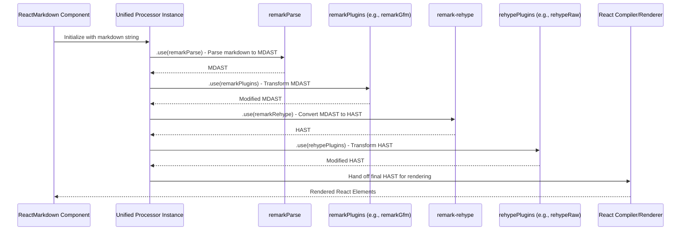

# Chapter 5: Unified Processor

As we've explored in the [Custom Component Mapping](chapter_04.md) chapter, `react-markdown` offers powerful ways to customize how specific HTML elements are rendered into React components. But how does `react-markdown` get from a raw markdown string to that intermediate HTML structure that can then be mapped? This is where the **Unified Processor** steps in, acting as the orchestrator behind the scenes, transforming simple text into structured, renderable data.

---

### Problem & Motivation

Imagine you have a raw markdown string from a user. This string might contain anything from headings and lists to embedded images, links, or even potentially malicious HTML. The core challenge for `react-markdown` is to reliably:
1.  Understand the structure and intent of this markdown.
2.  Transform it into a format that React can efficiently render.
3.  Allow for customization and security measures throughout this process.

Manually parsing markdown, building an Abstract Syntax Tree (AST), applying transformations, and then converting it to renderable HTML/React is an incredibly complex and error-prone task. Without a robust, standardized engine, `react-markdown` would be constantly reinventing the wheel, struggling with markdown specification nuances, extensibility, and performance. The **Unified Processor** solves this by providing a mature, modular ecosystem designed specifically for parsing, transforming, and serializing content. It’s the invisible assembly line that ensures your markdown becomes interactive React elements.

---

### Core Concept Explanation

The **Unified Processor** refers to the `unified` ecosystem, a powerful interface for processing text with abstract syntax trees (ASTs). Think of it as a highly adaptable pipeline or a sophisticated factory assembly line for text.

Here's how it generally works and how `react-markdown` leverages it:

1.  **Parsing**: The `unified` processor takes your raw markdown string (the input "raw material") and converts it into a structured data representation called an **Abstract Syntax Tree (AST)**. For markdown, this initial tree is known as a **Markdown AST (MDAST)**. This step interprets the syntax of markdown (e.g., `# Heading` becomes a "heading" node) without focusing on how it will look visually.
2.  **Transformation**: Once the content is in an AST format, `unified` allows a series of "plugins" to inspect and modify this tree. These plugins can add features (like GitHub Flavored Markdown support), correct issues, or transform the MDAST into another type of AST. A key transformation in `react-markdown` is converting the MDAST into an **HTML AST (HAST)**, which represents the structure of HTML.
3.  **Compilation/Serialization**: Finally, the transformed AST (typically HAST in `react-markdown`'s case) is "compiled" or "serialized" into the desired output format. Instead of outputting a plain HTML string, `react-markdown`'s internal compiler takes the HAST and translates it directly into React elements, which is then rendered on your screen.

In essence, `unified` provides the foundational architecture for `react-markdown` to perform its primary function: interpreting markdown and making it renderable by React. It separates concerns into distinct phases, making the process modular, extensible, and easier to manage.

---

### Practical Usage Examples

While you don't directly interact with the `unified` processor API when using `react-markdown`, every time you use the `ReactMarkdown` component, you are implicitly relying on it. The component encapsulates the `unified` processing pipeline.

Let's look at a simple example and understand its underlying implications for the `unified` processor:

```jsx
import ReactMarkdown from 'react-markdown';

const markdownSource = `
# Hello, Unified!

This is a paragraph with a **bold** word.
`;

function App() {
  return (
    <ReactMarkdown>{markdownSource}</ReactMarkdown>
  );
}
```
**Explanation**: In this basic `ReactMarkdown` usage, the `unified` processor is activated internally. It first parses the `markdownSource` into an MDAST. Then, it transforms that MDAST into an HAST, and finally, `react-markdown`'s custom compiler renders the HAST into React elements, displaying "Hello, Unified!" as an `<h1>` and the paragraph with a `<strong>` tag.

You can also see `unified`'s influence when adding plugins, which directly hook into its transformation phase:

```jsx
import ReactMarkdown from 'react-markdown';
import remarkGfm from 'remark-gfm'; // A remark plugin

const markdownSource = `
- [x] Task list item
`;

function AppWithPlugin() {
  return (
    <ReactMarkdown remarkPlugins={[remarkGfm]}>
      {markdownSource}
    </ReactMarkdown>
  );
}
```
**Explanation**: Here, `remarkGfm` is a `remark` plugin (a type of `unified` plugin for markdown) that extends markdown parsing. The `unified` processor integrates `remarkGfm` into its pipeline to correctly interpret the task list syntax (`- [x]`) which is not part of standard markdown. Without `unified`'s extensible plugin architecture, adding such features would be much harder.

---

### Internal Implementation Walkthrough

`react-markdown` meticulously sets up a `unified` processor instance internally. This setup involves chaining several key `unified` packages, primarily `remark` (for markdown-specific processing) and `rehype` (for HTML-specific processing).

Here's a simplified sequence of how the `unified` pipeline works within `react-markdown`:



**Step-by-step breakdown:**

1.  **Initialization**: When `ReactMarkdown` receives `children` (the markdown string), it creates or reuses a `unified` processor instance.
2.  **`remarkParse`**: The first `unified` plugin used is `remark-parse`. This package is responsible for taking the raw markdown string and parsing it into a **Markdown Abstract Syntax Tree (MDAST)**. This tree represents the logical structure of your markdown.
3.  **`remarkPlugins`**: Any `remarkPlugins` provided via `ReactMarkdown`'s props (e.g., `remarkGfm`, `remarkFrontmatter`) are then applied to this MDAST. These plugins can modify the markdown tree, add new features, or perform validation. This is still operating at the markdown level of abstraction.
4.  **`remarkRehype`**: A crucial step is the conversion from MDAST to HAST. This is handled by the `remark-rehype` plugin. It bridges the `remark` ecosystem with the `rehype` ecosystem by translating markdown nodes into their HTML equivalents. For instance, an `mdast.heading` node becomes a `hast.element` node with a tag name like `h1`.
5.  **`rehypePlugins`**: Once the content is in **HTML Abstract Syntax Tree (HAST)** format, any `rehypePlugins` (e.g., `rehypeRaw`, `rehypeSanitize`) passed through `ReactMarkdown`'s props are applied. These plugins operate on the HTML tree, allowing you to manipulate HTML structure, add IDs, sanitize potentially unsafe elements, or even transform custom elements.
6.  **React Compilation**: Finally, `react-markdown` takes the resulting HAST. Instead of using a standard `rehype-stringify` (which would convert HAST to an HTML string), `react-markdown` uses its own internal compiler/renderer. This renderer traverses the HAST and directly creates the corresponding React elements, taking into account any [Custom Component Mapping](chapter_04.md) you've provided.

This layered approach, facilitated by the `unified` ecosystem, allows `react-markdown` to be incredibly flexible, powerful, and secure.

---

### System Integration

The `Unified Processor` is the central nervous system of `react-markdown`, connecting almost all other major components:

*   **Input**: It consumes the [Markdown Source](chapter_02.md) as its initial input.
*   **Configuration**: Its behavior is heavily influenced by [Configuration Options](chapter_03.md), especially the `remarkPlugins` and `rehypePlugins` props which directly configure the `unified` pipeline.
*   **Intermediate Stages**: It produces the [Markdown AST (MDAST)](chapter_06.md) after parsing and transforms it into the [HTML AST (HAST)](chapter_07.md) before rendering.
*   **Extensibility**: It relies on [Plugins](chapter_08.md) (both `remark` and `rehype`) to extend its core functionality and apply specific transformations or features.
*   **Output**: The final HAST produced by the `unified` pipeline is passed to `react-markdown`'s internal [Node Renderer](chapter_09.md), which uses [Custom Component Mapping](chapter_04.md) to generate the React elements.

This intricate web of connections highlights the `unified` processor's role as the fundamental processing engine for `react-markdown`.

---

### Best Practices & Tips

*   **Understand the Pipeline**: Always remember the markdown -> MDAST -> HAST -> React element flow. This mental model is crucial for debugging issues or developing custom plugins. If something isn't rendering correctly, knowing which stage is responsible (parsing, transformation, or rendering) helps pinpoint the problem.
*   **Leverage Plugins**: The `unified` ecosystem thrives on plugins. For common requirements like GitHub Flavored Markdown or syntax highlighting, use existing `remark` or `rehype` plugins. They are the primary way to customize the processing beyond `react-markdown`'s basic props.
*   **Security for User Content**: If you are rendering user-generated markdown, sanitization is paramount. The `unified` processor, especially with `rehype-sanitize`, is excellent for this. While `react-markdown` offers `skipHtml` and `allowedElements` props, `rehype-sanitize` provides a much more robust and configurable approach to prevent XSS attacks by actively removing or modifying unsafe HTML.
*   **Performance Considerations**: While `unified` is efficient, using many complex plugins can impact performance, especially with very large markdown inputs. Profile your application if you notice slowdowns and optimize your plugin chain if necessary.

---

### Chapter Conclusion

The `Unified Processor` is the powerhouse beneath `react-markdown`'s hood. It provides the structured, extensible, and robust framework for transforming raw markdown text into the interactive React elements you see. By understanding its multi-stage pipeline—parsing to MDAST, transforming via plugins, converting to HAST, and finally compiling to React—you gain a deeper appreciation for how `react-markdown` works and how you can extend its capabilities using the rich `unified` plugin ecosystem.

Having explored the engine, our next logical step is to delve into the very first output of this engine: the Markdown Abstract Syntax Tree. In the next chapter, we will examine the structure and importance of the [Markdown AST (MDAST)](chapter_06.md).