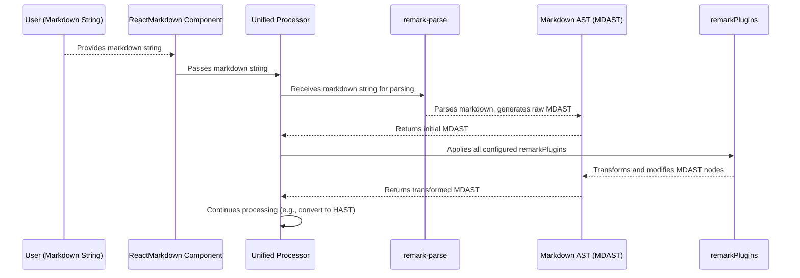

# Chapter 6: Markdown AST (MDAST)

In the previous chapter, we explored the [Unified Processor](chapter_05.md), the powerful engine that orchestrates markdown processing within `react-markdown`. We learned that the `unified` ecosystem works by passing structured data through a series of plugins. The first critical step in this pipeline is transforming raw markdown text into such a structured data format. This is where the Markdown Abstract Syntax Tree, or MDAST, comes into play.

---

## Problem & Motivation

Imagine you have a markdown document and you want to perform complex, programmatic operations on its content. For instance, you might want to automatically add a table of contents, validate that all image links are relative, or transform specific headings into unique IDs. Working with raw text for such tasks is incredibly challenging; it's prone to errors, difficult to maintain, and often requires fragile regular expressions. Text is linear, while markdown's structure (headings, lists, paragraphs, links) is inherently hierarchical.

This is the problem MDAST solves for `react-markdown`. By converting the raw markdown string into a structured, tree-like data representation, `react-markdown` (via the `unified` processor) can precisely identify and manipulate individual elements like headings, paragraphs, or links. This structured format is paramount because it allows `remark` plugins to traverse, analyze, and modify the markdown's content and structure in a reliable and efficient way. Without MDAST, the extensive customization and powerful transformations offered by `react-markdown` would be virtually impossible to implement or manage.

---

## Core Concept Explanation

An **Abstract Syntax Tree (AST)** is a tree representation of the syntactic structure of source code written in a programming language or, in our case, a structured text format like markdown. Think of it like parsing a sentence in natural language: you identify the subject, verb, object, and their relationships, rather than just seeing a string of words.

**MDAST** is the specific AST format used by the `unified` ecosystem to represent markdown. Each node in the MDAST tree corresponds to a distinct part of the markdown document, such as a paragraph, a list item, a link, or a blockquote. These nodes have a `type` property (e.g., `'paragraph'`, `'heading'`, `'link'`) and may have `children` (for container nodes like paragraphs containing text and links) or a `value` (for leaf nodes like text). For example, a markdown link `[text](url)` would be represented as a `link` node with a `url` property and a `text` node as its child. This hierarchical structure makes it easy to navigate and manipulate the markdown's meaning, not just its characters.

---

## Practical Usage Examples

While users typically don't directly manipulate MDAST themselves, understanding its structure is crucial for comprehending how `remark` plugins work and how `react-markdown` processes your content. Let's revisit our motivating use case: automatically adding `target="_blank"` to all external links.

Consider this simple markdown:
```markdown
Visit my [blog](https://example.com) and [local page](/local).
```

When this markdown is fed into `react-markdown`, the first step (after passing through the `unified` processor) is for a parser (specifically `remark-parse`) to convert it into an MDAST. A simplified conceptual representation of a fragment of this MDAST would look something like this:

```json
{
  "type": "root",
  "children": [
    {
      "type": "paragraph",
      "children": [
        { "type": "text", "value": "Visit my " },
        {
          "type": "link", // This is an MDAST 'link' node
          "url": "https://example.com",
          "children": [{ "type": "text", "value": "blog" }]
        },
        { "type": "text", "value": " and " },
        {
          "type": "link", // Another MDAST 'link' node
          "url": "/local",
          "children": [{ "type": "text", "value": "local page" }]
        },
        { "type": "text", "value": "." }
      ]
    }
  ]
}
```
*Explanation*: The raw markdown string is parsed into a `root` node, containing a `paragraph` node. Inside the paragraph, there are `text` nodes and `link` nodes. Each `link` node has a `url` property and `children` representing the link's text.

To implement our use case, `react-markdown` relies on `remark` plugins, which are functions designed to operate directly on this MDAST structure. The `remark-external-links` plugin is a perfect example:

```jsx
import ReactMarkdown from 'react-markdown';
import remarkExternalLinks from 'remark-external-links';

const markdownContent = `Visit my [blog](https://example.com).`;

function MyComponent() {
  return (
    <ReactMarkdown
      // remarkPlugins operate on the MDAST
      remarkPlugins={[[remarkExternalLinks, { target: '_blank', rel: ['noopener', 'noreferrer'] }]]}
    >
      {markdownContent}
    </ReactMarkdown>
  );
}
```
*Explanation*: Here, we pass `remarkExternalLinks` to the `remarkPlugins` prop. Internally, this plugin traverses the MDAST, identifies `link` nodes, checks if their `url` is external, and then *modifies* those `link` nodes (or adds properties to them) to include `target="_blank"` and `rel="noopener noreferrer"`. This modification happens directly on the MDAST before it's converted into HTML.

---

## Internal Implementation Walkthrough

The generation and initial processing of MDAST is a core part of the `unified` processor's lifecycle within `react-markdown`.

1.  **Parsing Markdown:** When you provide a markdown string to the `ReactMarkdown` component, it's first passed to the configured `unified` processor. The very first step in this processor's chain involves `remark-parse`. This *parser* is responsible for reading the raw markdown string and converting it into the MDAST. It systematically goes through the text, identifying markdown syntax (like `#` for headings, `*` for italics, `[]()` for links), and constructing a corresponding tree of nodes.

2.  **MDAST Representation:** The output of `remark-parse` is a `root` node of type `MdastRoot` (conceptually), which contains an array of `children`. Each child is another MDAST node, representing a block-level element (like a paragraph or heading) or a flow-level element. These nodes adhere to the [mdast spec](https://github.com/syntax-tree/mdast).

3.  **Applying `remark` Plugins:** Once the MDAST is generated, the `unified` processor then applies any `remarkPlugins` that have been configured. These plugins are functions that receive the MDAST as input, perform transformations (e.g., adding properties, changing node types, inserting/removing nodes), and then return a modified MDAST. This is the stage where the MDAST truly becomes a flexible and mutable representation of your markdown.

The overall flow for MDAST generation and processing looks like this:


*Explanation*: The raw markdown `string` is handed to the `Unified Processor`. The `remark-parse` module, configured within `unified`, takes this string and produces the `MDAST`. Subsequently, any `remarkPlugins` are executed, each operating on and potentially modifying this `MDAST` before it moves to the next stage of processing.

---

## System Integration

The MDAST is a pivotal intermediate representation in the `react-markdown` processing pipeline, acting as a crucial bridge between the raw markdown source and the eventual React elements.

*   **From [Markdown Source](chapter_02.md):** The raw markdown string is the direct input that `remark-parse` consumes to produce the MDAST.
*   **Within the [Unified Processor](chapter_05.md):** The MDAST is the primary data structure that the `unified` processor manages during the parsing and `remark` transformation phases. It's the "language" that `remark` plugins speak.
*   **With [Plugins](chapter_08.md):** Specifically, `remark` plugins are designed to work exclusively with MDAST. They traverse the tree, inspect node properties, and perform transformations. This is how features like syntax highlighting, custom admonitions, or specific link behaviors are added to your markdown output.
*   **Towards [HTML AST (HAST)](chapter_07.md):** After all `remark` plugins have had their say and the MDAST is fully transformed, it undergoes another crucial conversion. A `rehype` plugin (like `remark-rehype`) takes the MDAST and transforms it into its HTML counterpart, the HAST. This transition is essential because React components primarily render HTML-like structures, and HAST is better suited for direct mapping to DOM elements.

This flow underscores that MDAST is not an end in itself, but a powerful, manipulable representation that facilitates highly customized processing before conversion to a web-renderable format.

---

## Best Practices & Tips

*   **Leverage `remark` Plugins:** The most common way to interact with and benefit from MDAST is through existing `remark` plugins. Before writing your own, check the `unified` ecosystem for a plugin that already solves your problem, as these are typically well-tested and robust.
*   **Understand Node Structure:** If you plan to write custom `remark` plugins, familiarize yourself with the [mdast spec](https://github.com/syntax-tree/mdast). Knowing the `type` and properties of different nodes (e.g., `link` nodes have `url`, `heading` nodes have `depth`) is fundamental for effective traversal and modification.
*   **Debugging MDAST:** To see the actual MDAST for your markdown, you can use utilities like `unist-util-visit` within a custom plugin to log nodes, or even serialize the MDAST to JSON for inspection. This is invaluable for understanding how your markdown is interpreted.
*   **Performance Considerations:** Large markdown documents can result in very deep or wide MDASTs. When writing custom plugins, be mindful of performance. Avoid unnecessary traversals or computationally expensive operations within loops that iterate over many nodes.
*   **Immutability vs. Mutation:** While `remark` plugins often mutate the MDAST tree directly for efficiency, it's good practice to understand the impact. Be careful when changing node types or moving children, as this can affect subsequent plugins in the pipeline.

---

## Chapter Conclusion

The Markdown Abstract Syntax Tree (MDAST) serves as the invisible backbone of `react-markdown`'s powerful processing capabilities. By converting raw markdown into a structured, hierarchical data format, MDAST unlocks the ability for `unified` and its `remark` plugins to analyze, validate, and transform your markdown content with unparalleled precision and flexibility. While you might not directly manipulate MDAST daily, understanding its role is key to comprehending how `react-markdown` delivers its extensibility and how powerful transformations are applied.

With our markdown now parsed and potentially transformed within the MDAST, the next logical step is to prepare it for rendering as actual web elements. This leads us to the HTML Abstract Syntax Tree. In the next chapter, we will delve into the [HTML AST (HAST)](chapter_07.md) and explore how MDAST is seamlessly converted into this HTML-centric representation, paving the way for rendering to React components.