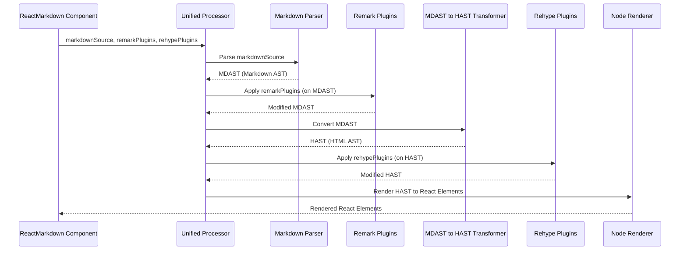

# Chapter 8: Plugins

The journey through `react-markdown` has so far explored its core components, the input markdown, various configuration options, and the fundamental Abstract Syntax Trees (ASTs) that power its transformation engine. We've seen how raw markdown becomes a structured [Markdown AST (MDAST)](chapter_06.md) and then a web-friendly [HTML AST (HAST)](chapter_07.md), ready for rendering. But what if the standard markdown-to-HTML conversion isn't enough? What if you need to add custom syntax, transform specific elements, or enrich your content in ways not natively supported by basic markdown? This is precisely where **Plugins** come into play.

---

### Problem & Motivation

The default capabilities of markdown are powerful, but also intentionally limited. For instance, standard markdown doesn't support task lists, strikethrough text, or tables – features commonly found in platforms like GitHub. Furthermore, after converting markdown to HTML, you might want to automatically add syntax highlighting to code blocks, inject unique identifiers to headings for easier linking, or even sanitize the HTML to prevent XSS attacks.

Without a mechanism for extension, `react-markdown` would be a rigid tool, unable to adapt to diverse project requirements. Developers would be forced to preprocess markdown strings manually or post-process rendered HTML, leading to brittle, inefficient, and hard-to-maintain solutions.

**Consider this real-world problem:** You have a blog built with `react-markdown`, and you want to display code snippets with beautiful syntax highlighting, and enable GitHub-style task lists in your articles. The core `react-markdown` component, out-of-the-box, doesn't provide these features. This is the precise challenge that plugins are designed to solve, offering a standardized and integrated way to extend the processing pipeline.

---

### Core Concept Explanation

**Plugins** are essentially functions that hook into the `unified` processing pipeline (as introduced in [Chapter 5: Unified Processor](chapter_05.md)) to extend or modify the markdown content. They are the primary mechanism for adding custom features, transforming ASTs, or performing advanced operations on your markdown before it's rendered into React elements.

Think of plugins as specialized modules that you can attach to an assembly line. As your product (the markdown content, in its AST form) moves down the line, each plugin performs a specific task:
1.  **Parsing Enhancement**: A plugin might add support for new markdown syntax (e.g., GFM tables).
2.  **Transformation**: A plugin might change existing nodes in the AST (e.g., adding `id` attributes to headings, converting relative image paths to absolute URLs).
3.  **Processing**: A plugin might analyze the AST and perform actions based on its content (e.g., generating a table of contents).

In the `unified` ecosystem, there are two primary types of plugins relevant to `react-markdown`, corresponding to the two main ASTs:

*   **Remark Plugins**: These operate on the [Markdown AST (MDAST)](chapter_06.md). They are used for tasks related to markdown syntax itself, such as parsing GitHub Flavored Markdown (GFM) features like task lists, tables, and strikethrough, or processing footnotes. `remarkPlugins` are executed *before* the MDAST is converted into a HAST.
*   **Rehype Plugins**: These operate on the [HTML AST (HAST)](chapter_07.md). They are ideal for tasks that involve HTML-specific transformations, like adding syntax highlighting to code blocks, sanitizing HTML, or manipulating attributes on HTML elements. `rehypePlugins` are executed *after* the MDAST has been converted to HAST.

`react-markdown` provides dedicated props, `remarkPlugins` and `rehypePlugins`, to easily integrate these extensions into your rendering pipeline.

---

### Practical Usage Examples

Let's revisit our motivating use case: adding GitHub-style features and syntax highlighting.

#### Example 1: Enabling GitHub Flavored Markdown (GFM) with `remark-gfm`

`remark-gfm` is a popular remark plugin that adds support for various GitHub Flavored Markdown syntax elements.

```jsx
import ReactMarkdown from 'react-markdown';
import remarkGfm from 'remark-gfm'; // Import the GFM plugin

const markdown = `
# My Task List

- [x] Complete project documentation
- [ ] Review PRs
- [x] Deploy to production

This is some ~strikethrough~ text.

| Header 1 | Header 2 |
|----------|----------|
| Row 1 Col 1 | Row 1 Col 2 |
`;

function App() {
  return (
    <ReactMarkdown remarkPlugins={[remarkGfm]}>
      {markdown}
    </ReactMarkdown>
  );
}

export default App;
```

**Explanation**: By importing `remarkGfm` and passing it as an element in the `remarkPlugins` array, we extend `react-markdown`'s parsing capabilities. Now, it correctly interprets `[x]` as checked tasks, `~text~` as strikethrough, and `|table|` syntax, which would otherwise be rendered as plain text or incorrectly without the plugin. This plugin operates on the MDAST, enriching it with new node types (like `taskListItems`) before it's converted to HAST.

#### Example 2: Adding Syntax Highlighting with `rehype-highlight`

`rehype-highlight` is a rehype plugin that automatically adds syntax highlighting to code blocks in your markdown by leveraging libraries like `lowlight`.

```jsx
import ReactMarkdown from 'react-markdown';
import rehypeHighlight from 'rehype-highlight'; // Import the highlighting plugin
import 'highlight.js/styles/github.css'; // Don't forget to include a stylesheet!

const codeMarkdown = `
\`\`\`js
function greet(name) {
  console.log(\`Hello, \${name}!\`);
}
greet('World');
\`\`\`
`;

function CodeHighlighter() {
  return (
    <ReactMarkdown rehypePlugins={[rehypeHighlight]}>
      {codeMarkdown}
    </ReactMarkdown>
  );
}

export default CodeHighlighter;
```

**Explanation**: Here, `rehypeHighlight` is passed to the `rehypePlugins` prop. After `react-markdown` converts the markdown code block (````js`) into an HTML `<pre><code>` element (HAST), `rehypeHighlight` then processes this HAST. It identifies the code language (from `js`) and injects the necessary class names and `<span>` elements around different code tokens, allowing a CSS stylesheet (like `github.css` from `highlight.js`) to apply visual styling for highlighting. This plugin works on the HAST because it's concerned with HTML-level styling.

#### Example 3: Passing Options to Plugins

Many plugins accept options to customize their behavior.

```jsx
import ReactMarkdown from 'react-markdown';
import rehypeSlug from 'rehype-slug'; // Plugin to add IDs to headings
import rehypeAutolinkHeadings from 'rehype-autolink-headings'; // Plugin to add anchor links to headings

const headingsMarkdown = `
# My Heading 1
## Another Heading
`;

function CustomHeadings() {
  return (
    <ReactMarkdown
      rehypePlugins={[
        rehypeSlug, // Adds 'id' attributes to headings
        [rehypeAutolinkHeadings, { behavior: 'wrap' }] // Wraps headings with anchor links
      ]}
    >
      {headingsMarkdown}
    </ReactMarkdown>
  );
}

export default CustomHeadings;
```

**Explanation**: Plugins can be provided as a simple function reference or as an array `[pluginFunction, { options }]`. In this example, `rehypeSlug` generates unique `id` attributes for headings (e.g., `<h1 id="my-heading-1">`). `rehypeAutolinkHeadings` then uses these IDs to create clickable anchor links. We pass `{ behavior: 'wrap' }` as an option to `rehypeAutolinkHeadings` to specify how the link should be structured around the heading text. These plugins operate on the HAST, modifying the structure and attributes of HTML heading elements.

---

### Internal Implementation Walkthrough

Plugins are deeply integrated into the `unified` processor, which is the heart of `react-markdown`. The processing pipeline, explained in [Chapter 5: Unified Processor](chapter_05.md), is where plugins exert their influence.

Here's a simplified sequence of how `react-markdown` processes plugins:

1.  **Receive Markdown Source**: The `ReactMarkdown` component receives the markdown string.
2.  **Initialize Unified Processor**: An instance of a `unified` processor is created.
3.  **Parse Markdown**: The processor uses a parser (e.g., `micromark`, `mdast-util-from-markdown`) to convert the raw markdown string into a [Markdown AST (MDAST)](chapter_06.md).
4.  **Apply Remark Plugins**: The `remarkPlugins` array provided via props is iterated. Each plugin is `use()`d by the `unified` processor. These plugins receive the MDAST and can modify its structure, add/remove nodes, or attach data. This happens *before* the markdown is even considered HTML.
5.  **Transform to HAST**: Once all `remarkPlugins` have run, the MDAST is transformed into an [HTML AST (HAST)](chapter_07.md) by a specialized `rehype-stringify` processor or similar utility.
6.  **Apply Rehype Plugins**: The `rehypePlugins` array is then iterated, and each plugin is `use()`d. These plugins receive the HAST and can modify HTML elements, add attributes, or even completely restructure parts of the HTML. This step is crucial for HTML-specific enhancements.
7.  **Serialize HAST**: The final HAST, after all `rehypePlugins` have run, is ready. `react-markdown` then takes this HAST and uses its internal rendering logic (which will be discussed in [Chapter 9: Node Renderer](chapter_09.md)) to convert it into actual React elements.

This flow can be visualized:



**Key Internal Detail**: The `unified` processor maintains an internal state (the AST) that is passed from one plugin to the next. Each plugin is a function that receives the current AST and performs its operation, potentially returning a new or modified AST for the next plugin in the chain. This functional and sequential approach ensures a predictable transformation process.

---

### System Integration

Plugins are a cornerstone of `react-markdown`'s extensibility and interact closely with several other core concepts:

*   **[Unified Processor](chapter_05.md)**: Plugins are directly integrated into the `unified` processing engine. They are `use()`d by the processor to form the complete transformation pipeline.
*   **[Markdown AST (MDAST)](chapter_06.md)**: `remarkPlugins` specifically target and modify the MDAST. Any plugin that deals with markdown syntax extension or markdown-level content manipulation will operate at this stage.
*   **[HTML AST (HAST)](chapter_07.md)**: `rehypePlugins` specifically target and modify the HAST. These plugins are essential for HTML-level enhancements, styling, or sanitization.
*   **[Configuration Options](chapter_03.md)**: The `remarkPlugins` and `rehypePlugins` props are a key part of the `ReactMarkdown` component's configuration, allowing users to declare which plugins to use and with what options.
*   **[Node Renderer](chapter_09.md)**: After all plugins have processed the HAST, the resulting tree is passed to the Node Renderer, which is responsible for turning each HAST node into its corresponding React component. Plugins directly influence the final HAST structure that the Node Renderer receives, determining what ultimately gets rendered.

---

### Best Practices & Tips

1.  **Understand Plugin Type**: Always distinguish between `remarkPlugins` (MDAST) and `rehypePlugins` (HAST). Using the wrong type can lead to errors or unexpected behavior. If you're dealing with markdown syntax, use `remark`. If you're dealing with HTML structure or attributes, use `rehype`.
2.  **Order Matters**: Plugins are executed in the order they appear in the `remarkPlugins` or `rehypePlugins` arrays. If two plugins modify the same part of the AST, the later plugin's changes will override or be applied after the earlier one's. Plan your plugin order carefully, especially with custom plugins.
3.  **Start Simple**: For common tasks, check if well-maintained community plugins already exist (e.g., `remark-gfm`, `rehype-highlight`, `rehype-slug`). Don't reinvent the wheel.
4.  **Performance Considerations**: Each plugin adds overhead. While most are highly optimized, using many complex plugins on very large markdown documents can impact performance. Profile if you notice slowdowns.
5.  **Custom Plugins**: When writing your own custom plugins, focus them on specific, singular tasks. This makes them easier to test, debug, and reuse.
6.  **Security (especially `rehype-sanitize`)**: When rendering user-generated content, `rehype-sanitize` is highly recommended. It cleans up potentially dangerous HTML, preventing Cross-Site Scripting (XSS) attacks.
7.  **Plugin Options**: Utilize plugin options (`[plugin, { options }]`) to fine-tune their behavior without writing custom code. Refer to the specific plugin's documentation for available options.
8.  **Development Workflow**: When debugging plugin issues, it can be helpful to visualize the AST before and after a plugin runs. Tools like `mdast-util-to-string` or `hast-util-to-html` can help inspect the AST state.

---

### Chapter Conclusion

Plugins are the unsung heroes of `react-markdown`, transforming it from a standard markdown renderer into a highly adaptable and feature-rich content processing engine. By leveraging `remarkPlugins` and `rehypePlugins`, you gain unparalleled control over both the parsing of markdown syntax and the final structure of the HTML output. This modularity allows `react-markdown` to support a vast array of use cases, from simple blogs to complex documentation platforms.

With a powerful, transformed [HTML AST (HAST)](chapter_07.md) now in hand, the next logical step is to turn this abstract tree into concrete, interactive elements within your React application. The next chapter will dive into the final stage of this process: the [Node Renderer](chapter_09.md), explaining how `react-markdown` efficiently converts each node of the HAST into actual React components that appear on your screen.

---

[Next Chapter: Node Renderer](chapter_09.md)