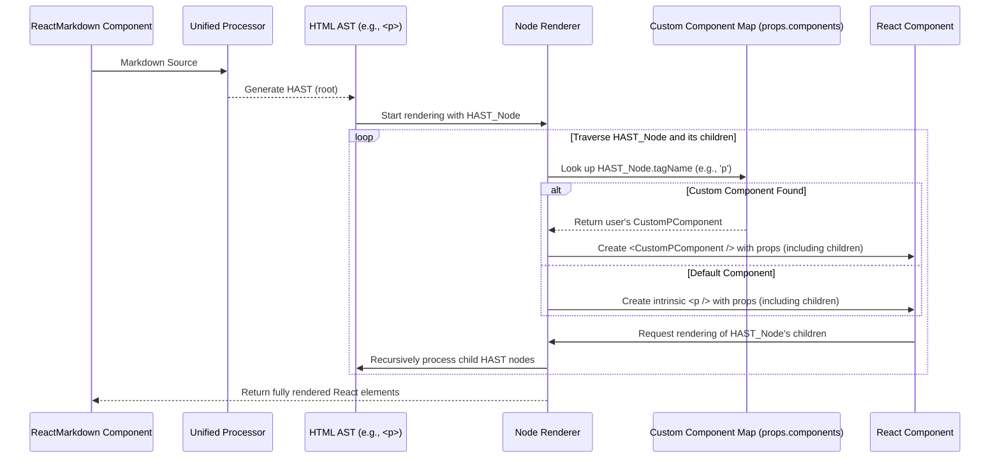

# Chapter 9: Node Renderer

The journey of transforming raw markdown into interactive React elements reaches its ultimate destination with the Node Renderer. Having explored how [Plugins](chapter_08.md) manipulate the Abstract Syntax Tree (AST) to refine its structure and content, we now turn our attention to the final, critical step: converting that processed AST into actual UI components that users can see and interact with.

---

### Problem & Motivation

Markdown, at its core, is a human-readable text format. When `react-markdown` parses this text, it creates an [HTML AST (HAST)](chapter_07.md), a data structure representing the HTML equivalent. While this HAST is excellent for programmatic manipulation and transformation by [Plugins](chapter_08.md), it's not something a web browser or a React application can directly render. A browser expects DOM elements, and a React application expects React elements (components, intrinsic elements like `<div>`, `<span>`, etc.).

The problem `react-markdown` faces is how to bridge this gap: how do you take an abstract data structure like a HAST node representing, say, a `<strong>` tag, and turn it into a concrete `<strong />` React element? This conversion is vital because without it, all the sophisticated parsing and transformation work would remain theoretical; the markdown would never actually appear on the screen.

This is precisely the problem the Node Renderer solves. It's the engine responsible for traversing the meticulously crafted [HTML AST (HAST)](chapter_07.md) and, for each node it encounters, creating the appropriate React component. For instance, if your markdown includes `**Hello**`, the [Unified Processor](chapter_05.md) will eventually produce a HAST node for `<strong>`. The Node Renderer's job is to see that `<strong>` node and produce a `<strong />` React element, complete with "Hello" as its child. This capability is fundamental to `react-markdown`'s existence, as it's the mechanism that brings the markdown content to life within your React application.

---

### Core Concept Explanation

The **Node Renderer** is the internal machinery within `react-markdown` that performs the final conversion from an [HTML AST (HAST)](chapter_07.md) into a tree of React elements. Think of it as the project's sculptor, taking the blueprint (the HAST) and turning it into a physical structure (React components). This process happens after all [Markdown AST (MDAST)](chapter_06.md) transformations, conversions to HAST, and [Plugin](chapter_08.md) applications are complete.

Its primary function is to recursively traverse the HAST. Starting from the `root` node of the HAST, it visits each child node. For every `element` node (e.g., `{ type: 'element', tagName: 'p' }`), it determines the corresponding React component to render. For `text` nodes, it renders plain text. This process is recursive: when an element is rendered, the Node Renderer then processes its children nodes and passes the resulting React elements as `props.children` to the parent component.

A key aspect of the Node Renderer, and where much of `react-markdown`'s power lies, is its interaction with [Custom Component Mapping](chapter_04.md). By default, the Node Renderer will map common HTML `tagName`s (like `p`, `h1`, `a`, `strong`) to their intrinsic React element equivalents (`<p>`, `<h1>`, `<a>`, `<strong>`). However, the `components` prop allows you to override this default behavior. When the Node Renderer encounters an HTML element for which a custom component is provided in the `components` prop, it will use your specified React component instead of the default intrinsic element. This gives developers granular control over how each piece of markdown content is ultimately displayed.

In essence, the Node Renderer is the "render loop" that takes the static description of your content (the HAST) and dynamically generates the interactive, component-based user interface, adhering to both `react-markdown`'s defaults and your custom rendering preferences.

---

### Practical Usage Examples

While you don't directly "use" the Node Renderer as an exported function, you interact with it constantly through the `ReactMarkdown` component. Its default behavior is to render standard HTML elements, and its customizable behavior is exposed through the `components` prop, which influences how it chooses which React component to render for a given HAST node.

Let's illustrate how the Node Renderer implicitly works and how you can guide its decisions.

#### Example 1: Default Node Rendering

In this basic example, the Node Renderer automatically converts the `<strong>` and `<a>` HAST nodes into `<strong />` and `<a />` React elements.

```jsx
import ReactMarkdown from 'react-markdown';

const markdownSource = "**Hello** from [ReactMarkdown](https://react-markdown.github.io)!";

function BasicRenderer() {
  return <ReactMarkdown>{markdownSource}</ReactMarkdown>;
}

export default BasicRenderer;
// Expected Output: A rendered text "Hello from ReactMarkdown!" where "Hello" is bold
// and "ReactMarkdown" is a clickable link.
```
*Explanation*: Here, you don't specify any custom components. The Node Renderer's default mapping takes over, rendering `**Hello**` as `<strong>Hello</strong>` and `[ReactMarkdown](...)` as `<a href="...">ReactMarkdown</a>`. It implicitly traverses the HAST and creates these standard React elements.

#### Example 2: Customizing an `h1` Element

Now, let's provide a custom component for `h1` tags. This tells the Node Renderer: "When you see an `h1` node in the HAST, use my `CustomHeading1` component instead of the default `<h1>`."

```jsx
import ReactMarkdown from 'react-markdown';

const markdownSource = "# My Custom Title\n\nThis is a paragraph.";

function CustomHeading1(props) {
  // It's good practice to spread props to ensure all original attributes are passed
  return <h1 style={{ color: 'blue', borderBottom: '2px solid blue' }} {...props} />;
}

function CustomRenderer() {
  return (
    <ReactMarkdown components={{ h1: CustomHeading1 }}>
      {markdownSource}
    </ReactMarkdown>
  );
}

export default CustomRenderer;
// Expected Output: "My Custom Title" rendered as an h1 with blue text and a blue underline,
// followed by a regular paragraph.
```
*Explanation*: By passing `components={{ h1: CustomHeading1 }}`, you're intercepting the Node Renderer's default behavior for `h1` tags. When it encounters the HAST node for `# My Custom Title`, instead of creating a plain `<h1>`, it calls your `CustomHeading1` component, applying your custom styles. The `props` object passed to `CustomHeading1` includes `children` (which is "My Custom Title") and other attributes like `key`.

#### Example 3: Overriding a `p` tag to add a class

This example demonstrates how to apply a specific CSS class to all paragraphs, giving you styling control over standard block elements.

```jsx
import ReactMarkdown from 'react-markdown';
import './styles.css'; // Assume this file contains .my-paragraph-class { color: green; }

const markdownSource = "This is paragraph one.\n\nThis is paragraph two.";

function MyParagraph(props) {
  return <p className="my-paragraph-class" {...props} />;
}

function CustomParagraphRenderer() {
  return (
    <ReactMarkdown components={{ p: MyParagraph }}>
      {markdownSource}
    </ReactMarkdown>
  );
}

export default CustomParagraphRenderer;
// Expected Output: Both "This is paragraph one." and "This is paragraph two."
// rendered as paragraphs with green text due to the applied class.
```
*Explanation*: Similar to the `h1` example, you're telling the Node Renderer to use `MyParagraph` for all `<p>` HAST nodes. `MyParagraph` then adds a custom CSS class, which your stylesheet can target. The `props` object includes the text content of the paragraph as `children`.

---

### Internal Implementation Walkthrough

The Node Renderer isn't a single exposed function; rather, it's a conceptual stage within `react-markdown` that facilitates the conversion from [HAST](chapter_07.md) to React elements. Let's trace what happens internally when `ReactMarkdown` processes your markdown:

1.  **Input Reception**: The [ReactMarkdown Component](chapter_01.md) receives the `children` prop, which is your raw markdown string.

2.  **Processing Pipeline**: The raw markdown is fed into the [Unified Processor](chapter_05.md). This processor orchestrates several steps:
    *   It parses the markdown into a [Markdown AST (MDAST)](chapter_06.md).
    *   [Plugins](chapter_08.md) (both built-in and user-defined) transform this MDAST.
    *   The MDAST is then converted into an [HTML AST (HAST)](chapter_07.md). This HAST is the canonical representation ready for rendering as HTML.

3.  **Initiating Node Rendering**: Once the HAST is ready, `react-markdown` initiates the Node Rendering process. It essentially starts a recursive traversal of the HAST tree, beginning from its `root` node.

4.  **Node Traversal and Component Selection**: For each HAST node encountered during the traversal (e.g., `{ type: 'element', tagName: 'p', properties: {}, children: [...] }`):
    *   The Node Renderer first checks if a custom component for that `tagName` (e.g., `'p'`) has been provided via the `components` prop (part of [Custom Component Mapping](chapter_04.md)).
    *   If a custom component exists, that component is selected.
    *   If no custom component is found, the Node Renderer defaults to using the intrinsic React element corresponding to the `tagName` (e.g., `<p />`). For text nodes, it simply renders the string content.

5.  **React Element Creation**: The selected React component (either custom or intrinsic) is then instantiated using `React.createElement`. The properties from the HAST node (like `href` for links, `src` for images, `className`, etc.) are passed as props to this new React element.

6.  **Recursive Children Rendering**: Critically, the `children` of the current HAST node are themselves recursively passed back through the Node Renderer. The resulting React elements are then passed as the `children` prop to the current React component being created. This ensures the entire tree structure of the markdown is preserved in the rendered React output.

7.  **Output**: This recursive process continues until all nodes in the HAST have been processed. The final result is a complete tree of nested React elements, which React then efficiently renders to the DOM.

Here's a simplified sequence diagram illustrating this flow:



This internal loop is highly optimized and efficient, providing a seamless translation from abstract markdown representation to concrete UI.

---

### System Integration

The Node Renderer is the final piece that integrates all previous abstractions into a cohesive, visible output. It stands at the very end of the `react-markdown` processing pipeline, acting as the direct bridge to the React rendering mechanism.

*   **Input from [HTML AST (HAST)](chapter_07.md)**: The Node Renderer's direct input is the HAST, which is the output of the [Unified Processor](chapter_05.md) after all parsing and [Plugin](chapter_08.md) transformations. This means any modifications made earlier in the pipeline (e.g., by syntax highlighting plugins, or link rewrites) are reflected in the HAST and thus passed to the Node Renderer.
*   **Influenced by [Custom Component Mapping](chapter_04.md)**: The `components` prop directly informs the Node Renderer which React component to use for specific HTML tags. This is the primary way developers customize the rendering output.
*   **Adheres to [Configuration Options](chapter_03.md)**: Options like `skipHtml` or `unwrapDisallowed` implicitly affect the Node Renderer. If `skipHtml` is true, HTML nodes are simply ignored by the renderer. If `unwrapDisallowed` is true, disallowed elements are "unwrapped," meaning only their children are rendered. While not directly interacting with these options, the HAST passed to the Node Renderer is already filtered or modified based on these configurations.
*   **Final Output to [ReactMarkdown Component](chapter_01.md)**: The collection of React elements generated by the Node Renderer is what the `ReactMarkdown Component` ultimately renders in your application, completing the entire markdown-to-React transformation.

Essentially, the Node Renderer consumes the refined, "render-ready" HAST and produces the actual React tree that forms your application's UI, tying together all preceding steps into a functional display.

---

### Best Practices & Tips

Leveraging the Node Renderer effectively, especially through [Custom Component Mapping](chapter_04.md), requires adherence to certain best practices:

1.  **Always Render `props.children`**: When creating a custom component (e.g., for `p`, `h1`, `li`), ensure you always render `props.children`. If you don't, the content inside that markdown element will disappear.
    ```jsx
    function MyParagraph({ children, ...props }) {
      // Correct: renders the content of the paragraph
      return <p className="custom-paragraph" {...props}>{children}</p>;
    }

    function BrokenParagraph({ ...props }) {
      // Incorrect: will render an empty paragraph tag
      return <p className="custom-paragraph" {...props} />;
    }
    ```

2.  **Spread Remaining `props`**: The `react-markdown` internal renderer passes several important props to your custom components, including a unique `key` for list items and other standard HTML attributes. It's crucial to spread these onto your underlying HTML element to ensure correct React behavior and maintain expected functionality (e.g., `href` for `a` tags, `src` for `img` tags).
    ```jsx
    function MyLink({ href, children, ...props }) {
      // Correct: spreads all other props (like key, title, etc.)
      return <a href={href} target="_blank" rel="noopener noreferrer" {...props}>{children}</a>;
    }
    ```

3.  **Mind Performance with Complex Components**: If your custom components perform heavy computations or render complex sub-trees, consider optimizing them. Using `React.memo` can prevent unnecessary re-renders if your component's props don't change.

4.  **Maintain Accessibility**: When overriding intrinsic HTML elements with custom components, ensure you don't compromise accessibility. For example, if you replace `<a>` with a `<span>` that has an `onClick`, make sure to add `role="link"`, `tabIndex="0"`, and handle keyboard events properly. `react-markdown` typically passes `aria-label` or `title` attributes that should be preserved.

5.  **Avoid Infinite Loops**: Be cautious if your custom component for a tag (`h1`) tries to render another `ReactMarkdown` component that might also process an `h1` tag recursively without proper handling. This is an advanced scenario but can lead to stack overflows. Generally, just render native elements or other simple React components.

6.  **Understand `inline` vs. `block`**: When mapping, remember that some HAST nodes are `inline` (e.g., `strong`, `em`, `a`) and others are `block` (e.g., `p`, `h1`, `ul`). Your custom component should typically render an element that aligns with this expectation to avoid unexpected layout issues (e.g., don't render a `div` for a `strong` tag within a paragraph).

---

### Chapter Conclusion

This chapter concludes our deep dive into the core mechanics of `react-markdown`. We've seen how the Node Renderer is the final, essential stage that transforms the abstract, processed [HTML AST (HAST)](chapter_07.md) into concrete, interactive React elements. It serves as the project's critical bridge, bringing parsed markdown content to life within your application.

We explored how the Node Renderer implicitly works to map HAST nodes to default HTML elements, and more importantly, how you can exert precise control over this process using [Custom Component Mapping](chapter_04.md) via the `components` prop. Understanding its internal, recursive traversal and component selection logic empowers you to customize virtually every aspect of your markdown's rendering, from styling simple paragraphs to completely redefining how links or images are displayed.

By adhering to best practices like rendering `props.children` and spreading other `props` to your custom components, you can ensure your `react-markdown` implementations are robust, performant, and accessible. The Node Renderer, while an internal abstraction, is the ultimate manifestation of `react-markdown`'s power and flexibility, allowing developers to fully integrate markdown content seamlessly and beautifully into their React projects. This chapter brings us to the culmination of how `react-markdown` processes and displays content, providing a complete picture of its internal workings from raw source to rendered UI.