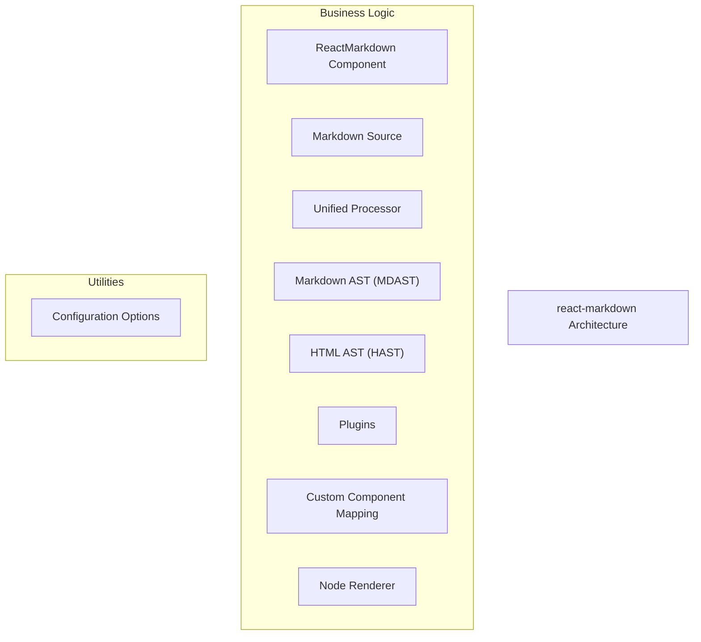
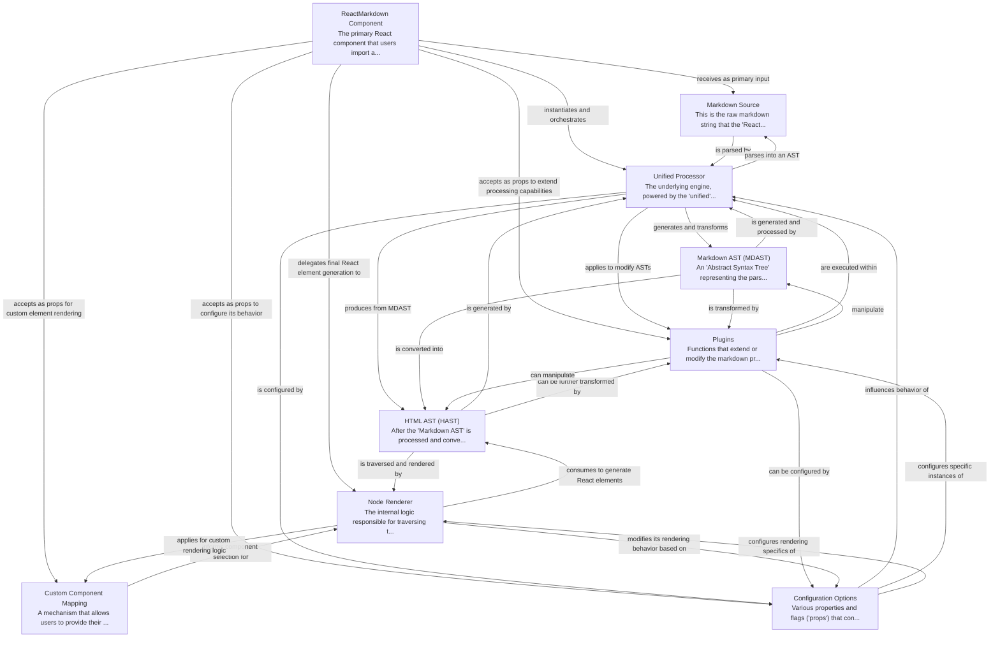

# react-markdown Tutorial

Welcome to the comprehensive tutorial for react-markdown. This tutorial is automatically generated from the codebase to help you understand the core concepts and implementation patterns.

## Project Overview

'react-markdown' is a React component designed to render markdown strings into interactive React elements. It leverages the 'unified' processing ecosystem to parse the raw markdown, transform its Abstract Syntax Trees (ASTs) using configurable plugins, and ultimately convert them into an HTML AST. The component then renders this HTML AST into React elements, offering extensive customization through props, including custom component mappings and various configuration options.

## System Architecture

## Component Relationships

## Table of Contents

1. [Chapter 1: ReactMarkdown Component](chapter_01.md) - Comprehensive documentation for ReactMarkdown Component following structured methodology...
2. [Chapter 2: Markdown Source](chapter_02.md) - Comprehensive documentation for Markdown Source following structured methodology...
3. [Chapter 3: Configuration Options](chapter_03.md) - Comprehensive documentation for Configuration Options following structured methodology...
4. [Chapter 4: Custom Component Mapping](chapter_04.md) - Comprehensive documentation for Custom Component Mapping following structured methodology...
5. [Chapter 5: Unified Processor](chapter_05.md) - Comprehensive documentation for Unified Processor following structured methodology...
6. [Chapter 6: Markdown AST (MDAST)](chapter_06.md) - Comprehensive documentation for Markdown AST (MDAST) following structured methodology...
7. [Chapter 7: HTML AST (HAST)](chapter_07.md) - Comprehensive documentation for HTML AST (HAST) following structured methodology...
8. [Chapter 8: Plugins](chapter_08.md) - Comprehensive documentation for Plugins following structured methodology...
9. [Chapter 9: Node Renderer](chapter_09.md) - Comprehensive documentation for Node Renderer following structured methodology...

## How to Use This Tutorial

1. **Start with Chapter 1** to understand the foundational concepts
2. **Follow the sequence** - each chapter builds upon previous concepts
3. **Practice with code examples** - every chapter includes practical examples
4. **Refer to diagrams** - use architecture diagrams for visual understanding
5. **Cross-reference concepts** - chapters link to related topics

## Tutorial Features

- **Progressive Learning**: Concepts are introduced in logical order
- **Code Examples**: Every chapter includes practical, executable code
- **Visual Diagrams**: Mermaid diagrams illustrate complex relationships
- **Cross-References**: Easy navigation between related concepts
- **Beginner-Friendly**: Written for newcomers to the codebase

## Contributing

This tutorial is auto-generated from the codebase. To improve it:
1. Update the source code documentation
2. Add more detailed comments to key functions
3. Regenerate the tutorial using the documentation system

---

*Generated using AI-powered codebase analysis*
