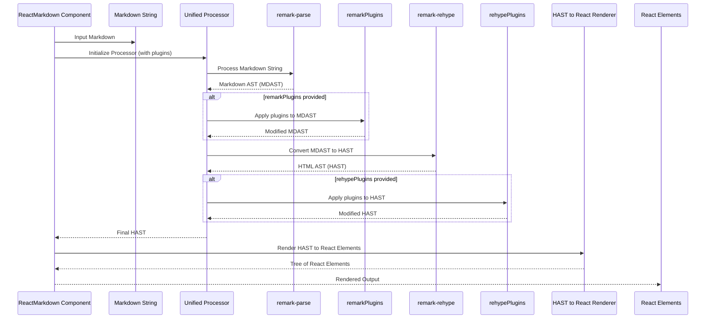

# Chapter 2: Markdown Processing Pipeline (Remark & Rehype)

In the [previous chapter](chapter_01.md), we were introduced to the `ReactMarkdown` component and saw how effortlessly it renders Markdown into interactive React elements. While it might seem like magic on the surface, beneath its elegant API lies a powerful and extensible pipeline that transforms raw Markdown text into a structured, renderable format. This chapter will pull back the curtain on that process, revealing the core technologies—Remark and Rehype—that make `react-markdown` so flexible and robust.

---

### Problem & Motivation

Imagine you have a plain Markdown string like `**Hello, world!**`. For React to display this, it needs to understand that `**` denotes bold text and render it as a `<strong>` HTML element. Raw text doesn't inherently carry this structural meaning. A simple string replacement isn't enough, as Markdown can be nested, contain links, code blocks, and many other complex structures. We need a way to *parse* the Markdown, understand its syntax, and then *translate* that understanding into a format that React can efficiently render.

This is the fundamental problem the Markdown processing pipeline solves. In `react-markdown`, this pipeline is crucial because it's the engine that converts your Markdown input into the tree of React elements you see on screen. It’s not just about basic parsing; it's about enabling extensibility. What if you want to support non-standard Markdown features like task lists (e.g., `- [x] Task`) or embed custom components based on specific Markdown syntax? The Remark and Rehype pipeline provides the hooks (plugins) necessary to achieve such advanced functionality, making `react-markdown` far more than a simple Markdown renderer.

For instance, consider the common need to add IDs to headings for deep linking, like turning `## My Section` into `<h2 id="my-section">My Section</h2>`. This isn't part of standard Markdown rendering but is a highly useful feature. The processing pipeline is where such transformations occur, long before React even begins rendering.

---

### Core Concept Explanation

The internal workflow of `react-markdown` is orchestrated by a powerful ecosystem called `unified`. `unified` is an interface for processing text with syntax trees. It acts as a conductor for a series of steps, each handled by specialized tools: **Remark** for Markdown, and **Rehype** for HTML.

1.  **Remark (Markdown Abstract Syntax Tree - MDAST)**:
    When `react-markdown` receives your Markdown text, the first major step is taken by Remark. Remark's primary job is to parse the raw Markdown string and convert it into a structured data representation called an **Abstract Syntax Tree (AST)**, specifically a *Markdown Abstract Syntax Tree (MDAST)*. Think of an MDAST as a detailed blueprint of your Markdown content, showing its hierarchical structure: paragraphs, headings, lists, links, emphasis, and code blocks are all represented as nodes in this tree. Each node contains information about its type, content, and position. This is similar to how a compiler parses source code into an AST before generating machine code.

2.  **Rehype (Hypertext Abstract Syntax Tree - HAST)**:
    Once Remark has created the MDAST, the next significant transformation happens with Rehype. Rehype takes the MDAST and converts it into a *Hypertext Abstract Syntax Tree (HAST)*. A HAST is an HTML-like AST. It represents the structure of HTML, with nodes for elements (like `<h1>`, `<p>`, `<a>`) and text nodes. This conversion step is where Markdown concepts (like "strong emphasis" or "list item") are mapped to their corresponding HTML equivalents (`<strong>`, `<li>`). This HAST is very close to what a web browser understands as the DOM (Document Object Model), making it ideal for rendering into React components.

In essence, the pipeline looks like this:

`Markdown Text` → (Remark) → `MDAST` → (Remark-Rehype bridge) → `HAST` → (React-Markdown's renderer) → `React Elements`

This two-stage approach provides immense flexibility. Remark focuses purely on Markdown semantics, allowing plugins to extend Markdown features. Rehype then focuses on HTML semantics, allowing plugins to modify the HTML-like structure before it hits the DOM. The `unified` ecosystem binds them together, making it easy to create complex processing flows.

---

### Practical Usage Examples

While `react-markdown` handles the Remark and Rehype processing internally, it exposes their power through the `remarkPlugins` and `rehypePlugins` props. These props accept an array of plugins, allowing you to modify the processing pipeline.

Let's look at how you might use these plugins for common scenarios.

#### Example 1: Enabling GitHub Flavored Markdown (GFM)

GFM includes features like task lists, strikethrough, and tables, which are not part of standard Markdown. `remark-gfm` is a Remark plugin that adds support for these features.

```jsx
import React from 'react';
import ReactMarkdown from 'react-markdown';
import remarkGfm from 'remark-gfm'; // Import the GFM plugin

function GfmDemo() {
  const markdown = `
- [x] Task 1
- [ ] Task 2
~~Strikethrough text~~
`;

  return (
    <ReactMarkdown remarkPlugins={[remarkGfm]}>
      {markdown}
    </ReactMarkdown>
  );
}

export default GfmDemo;
```
*Explanation:* By passing `[remarkGfm]` to the `remarkPlugins` prop, `react-markdown`'s Remark processor will understand and correctly parse GitHub Flavored Markdown syntax, such as task lists and strikethrough, converting them into appropriate MDAST nodes.

---

#### Example 2: Adding Code Highlighting with Rehype

Syntax highlighting for code blocks is a common requirement. `rehype-highlight` is a Rehype plugin that takes code blocks in your HAST and adds appropriate classes for highlighting.

```jsx
import React from 'react';
import ReactMarkdown from 'react-markdown';
import rehypeHighlight from 'rehype-highlight'; // Import highlight plugin
import 'highlight.js/styles/github.css'; // Don't forget to import a theme!

function CodeHighlightDemo() {
  const markdown = `
\`\`\`javascript
function greet(name) {
  console.log("Hello, " + name + "!");
}
greet("World");
\`\`\`
`;

  return (
    <ReactMarkdown rehypePlugins={[rehypeHighlight]}>
      {markdown}
    </ReactMarkdown>
  );
}

export default CodeHighlightDemo;
```
*Explanation:* The `rehypeHighlight` plugin runs after the MDAST has been converted to HAST. It inspects `<code>` elements in the HAST and wraps their content with `<span>` tags, adding CSS classes that a stylesheet (like `highlight.js/styles/github.css`) can use to colorize the syntax.

---

#### Example 3: Adding Anchor IDs to Headings

This is a Rehype-level transformation, as it modifies HTML attributes. `rehype-slug` is a popular plugin for this.

```jsx
import React from 'react';
import ReactMarkdown from 'react-markdown';
import rehypeSlug from 'rehype-slug'; // Automatically adds IDs to headings

function HeadingSlugDemo() {
  const markdown = `
# My First Heading
## Another Section
`;

  return (
    <ReactMarkdown rehypePlugins={[rehypeSlug]}>
      {markdown}
    </ReactMarkdown>
  );
}

export default HeadingSlugDemo;
```
*Expected Behavior:* The rendered output will have `id` attributes automatically generated from the heading text, e.g., `<h1 id="my-first-heading">My First Heading</h1>`.
*Explanation:* `rehype-slug` operates on the HAST. When it encounters `<h1>`, `<h2>`, etc., nodes, it processes their text content and adds a slugified `id` attribute to the element node in the HAST.

These examples demonstrate how `remarkPlugins` and `rehypePlugins` provide powerful control over the Markdown processing pipeline without needing to dive deep into `unified` or AST manipulation yourself.

---

### Internal Implementation Walkthrough

Inside `react-markdown`, the Markdown processing pipeline is carefully constructed using the `unified` library. Here's a step-by-step look at what happens:

1.  **Initialization**: When `ReactMarkdown` receives its `children` (the Markdown string) and any `remarkPlugins` or `rehypePlugins`, it initializes a `unified` processor.

2.  **Parsing Markdown**: The processor starts by using `remark-parse`. This `unified` plugin takes the raw Markdown string and transforms it into an MDAST (Markdown Abstract Syntax Tree).

    ```markdown
    **Hello** *World*
    ```
    becomes roughly:
    ```json
    {
      "type": "root",
      "children": [
        {
          "type": "paragraph",
          "children": [
            { "type": "strong", "children": [{ "type": "text", "value": "Hello" }] },
            { "type": "text", "value": " " },
            { "type": "emphasis", "children": [{ "type": "text", "value": "World" }] }
          ]
        }
      ]
    }
    ```

3.  **Applying `remarkPlugins`**: Any plugins provided in the `remarkPlugins` prop are then applied. These plugins operate directly on the MDAST, allowing them to add, modify, or remove Markdown-specific nodes. For example, `remark-gfm` would identify and transform `~~text~~` into a strikethrough node in the MDAST.

4.  **Converting MDAST to HAST**: The `remark-rehype` plugin acts as the bridge. It takes the (potentially modified) MDAST and converts it into a HAST (Hypertext Abstract Syntax Tree). This is where Markdown semantics are translated into HTML semantics.

    The MDAST from above:
    ```json
    {
      "type": "root",
      "children": [
        {
          "type": "paragraph",
          "children": [
            { "type": "strong", "children": [{ "type": "text", "value": "Hello" }] },
            { "type": "text", "value": " " },
            { "type": "emphasis", "children": [{ "type": "text", "value": "World" }] }
          ]
        }
      ]
    }
    ```
    becomes roughly this HAST:
    ```json
    {
      "type": "root",
      "children": [
        {
          "type": "element",
          "tagName": "p",
          "properties": {},
          "children": [
            { "type": "element", "tagName": "strong", "properties": {}, "children": [{ "type": "text", "value": "Hello" }] },
            { "type": "text", "value": " " },
            { "type": "element", "tagName": "em", "properties": {}, "children": [{ "type": "text", "value": "World" }] }
          ]
        }
      ]
    }
    ```
    Notice how `strong` and `emphasis` from Markdown became `<strong>` and `<em>` HTML elements.

5.  **Applying `rehypePlugins`**: Next, any plugins specified in the `rehypePlugins` prop are applied. These plugins work on the HAST, allowing for transformations that relate specifically to HTML structure or attributes. `rehype-highlight` adds classes to `<code>` elements, `rehype-slug` adds `id` attributes to headings, etc.

6.  **Rendering React Elements**: Finally, `react-markdown` takes this fully processed HAST. Instead of stringifying it to HTML (like `rehype-stringify` would), `react-markdown` walks the HAST and directly generates React elements (e.g., `<p>`, `<strong>`, `<em>`) based on the nodes in the tree. This is where the output of the pipeline becomes renderable React UI.

Here's a sequence diagram illustrating this flow:



The beauty of this modular pipeline is that each stage is independent and extensible. You can hook into any part of the process using plugins to tailor the Markdown output precisely to your needs.

---

### System Integration

The Markdown Processing Pipeline is the core engine within the `react-markdown` ecosystem, seamlessly integrating with other key abstractions:

*   **The `ReactMarkdown` Component ([chapter_01.md](chapter_01.md))**: This component serves as the user-facing entry point. It receives the Markdown string, orchestrates the entire Remark and Rehype pipeline, and then takes the resulting HAST to render it as React elements. The `remarkPlugins` and `rehypePlugins` props are the direct interface `ReactMarkdown` provides to interact with this pipeline.

*   **Custom Component Rendering ([chapter_03.md](chapter_03.md))**: The output of the Remark and Rehype pipeline is a HAST. This HAST represents the intended HTML structure (e.g., `<p>`, `<h1>`, `<a>`). `react-markdown` then iterates through this HAST and converts each node into a corresponding React element. This is where the `components` prop comes into play. You can tell `react-markdown`, "Whenever you encounter a `p` element in the HAST, don't render a default `<p>` tag; instead, use my custom `MyParagraphComponent`." This allows fine-grained control over the final visual output based on the processed HTML structure.

*   **Extending Functionality with Plugins ([chapter_04.md](chapter_04.md))**: While this chapter introduces the *concept* of using `remarkPlugins` and `rehypePlugins`, the next dedicated chapter will dive much deeper into discovering existing plugins, understanding their types, and even how to write your own custom plugins to achieve highly specialized Markdown transformations. This pipeline is what makes `react-markdown` so incredibly extensible, allowing developers to adapt it to virtually any Markdown-related requirement.

---

### Best Practices & Tips

*   **Understand Plugin Order**: For both `remarkPlugins` and `rehypePlugins`, the order in which you supply them matters. Plugins are applied sequentially. If plugin A modifies a node that plugin B then expects to exist (or not exist), ensure they are in the correct order.
    ```jsx
    // Example: If 'rehype-a' adds a class and 'rehype-b' needs that class, 'rehype-a' must come first.
    <ReactMarkdown rehypePlugins={[rehypeA, rehypeB]}>
        {markdown}
    </ReactMarkdown>
    ```

*   **Choose the Right Plugin Type**:
    *   Use `remarkPlugins` for modifications related to Markdown syntax itself (e.g., adding support for new Markdown features, transforming Markdown links based on their content).
    *   Use `rehypePlugins` for modifications related to the HTML structure or attributes (e.g., adding IDs to headings, sanitizing HTML, wrapping images in figures).

*   **Performance Considerations**: While the pipeline is efficient, a large number of complex plugins or very large Markdown inputs can impact performance.
    *   Minimize unnecessary plugins.
    *   If your Markdown content and plugin configuration don't change frequently, consider wrapping `ReactMarkdown` in `React.memo` or memoizing the plugin array itself to prevent re-renders and re-processing.

*   **Security (Untrusted Markdown)**: If you're rendering Markdown from untrusted sources and using plugins like `rehype-raw` (to allow raw HTML in Markdown), it's *critical* to use `rehype-sanitize` as a `rehypePlugin`. Place `rehype-sanitize` *after* `rehype-raw` to ensure malicious HTML is stripped out.
    ```jsx
    import ReactMarkdown from 'react-markdown';
    import rehypeRaw from 'rehype-raw';
    import rehypeSanitize from 'rehype-sanitize';

    <ReactMarkdown
      remarkPlugins={[]}
      rehypePlugins={[rehypeRaw, rehypeSanitize]} // Sanitize after allowing raw HTML
    >
      {/* Markdown content potentially with raw HTML */}
    </ReactMarkdown>
    ```

*   **Debugging ASTs**: When developing custom plugins or debugging complex transformations, it can be helpful to visualize the MDAST or HAST at different stages. Tools like `mdast-util-from-markdown` and `hast-util-to-html` (from the `unified` ecosystem) can be used in separate scripts or debugging environments to inspect the tree structures.

---

### Chapter Conclusion

We've now explored the internal powerhouse of `react-markdown`: the Markdown Processing Pipeline driven by Remark and Rehype. We've seen how raw Markdown is systematically transformed into a structured HTML-like tree, ready for rendering. This pipeline is not just an implementation detail; it's the core reason `react-markdown` is so powerful and extensible, allowing developers to customize almost every aspect of Markdown rendering through plugins.

Understanding this pipeline lays the groundwork for truly mastering `react-markdown`. In the next chapter, we'll take the HAST that this pipeline produces and learn how to gain ultimate control over its final rendering, replacing default HTML elements with your own custom React components.

Continue to: [Custom Component Rendering](chapter_03.md)