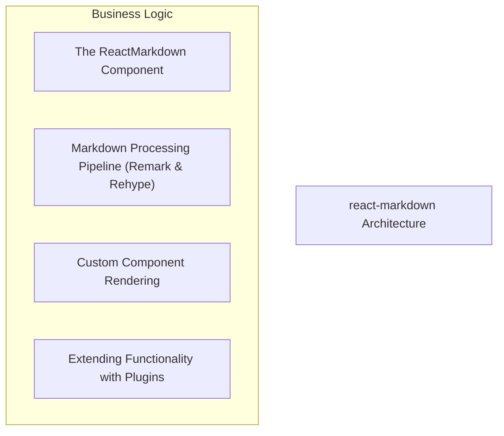
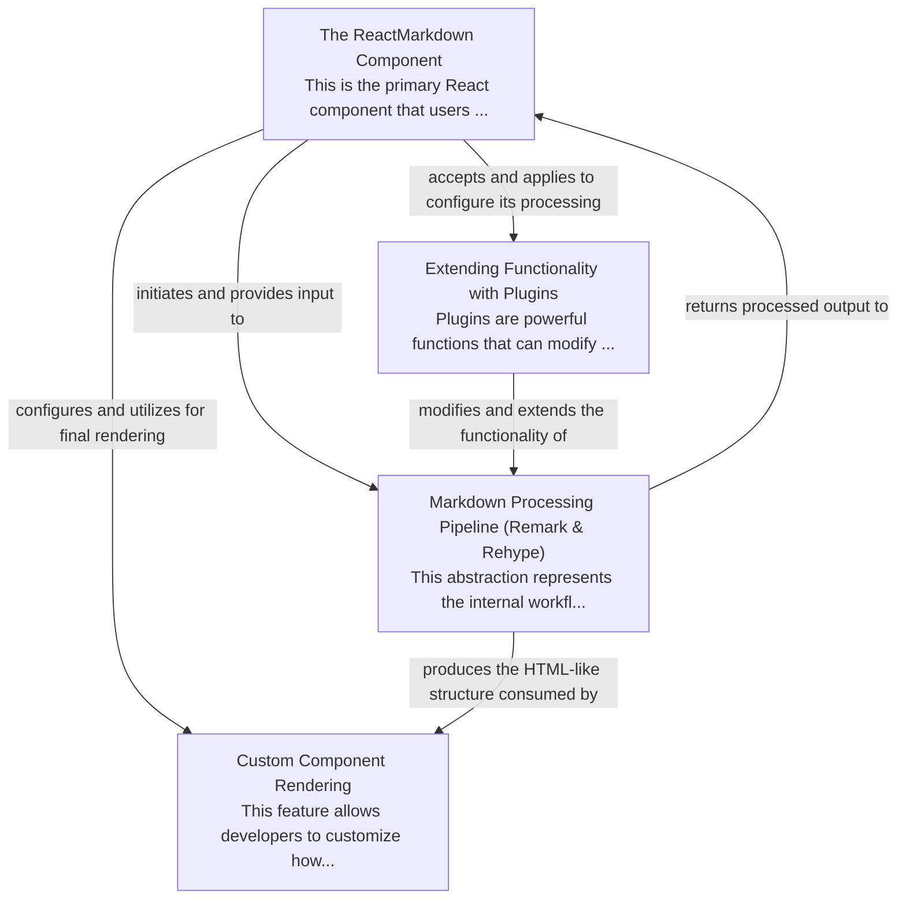

# react-markdown Tutorial

Welcome to the comprehensive tutorial for react-markdown. This tutorial is automatically generated from the codebase to help you understand the core concepts and implementation patterns.

## Project Overview

'react-markdown' is a React component designed to parse and render Markdown content as a tree of React elements. It internally utilizes the 'remark' and 'rehype' ecosystem to process the Markdown through a configurable pipeline, allowing developers to extend its functionality with plugins and customize the rendering of specific Markdown elements using their own React components.

## System Architecture

## Component Relationships

## Table of Contents

1. [Chapter 1: The ReactMarkdown Component](chapter_01.md) - Comprehensive documentation for The ReactMarkdown Component following structured methodology...
2. [Chapter 2: Markdown Processing Pipeline (Remark & Rehype)](chapter_02.md) - Comprehensive documentation for Markdown Processing Pipeline (Remark & Rehype) following structured ...
3. [Chapter 3: Custom Component Rendering](chapter_03.md) - Comprehensive documentation for Custom Component Rendering following structured methodology...
4. [Chapter 4: Extending Functionality with Plugins](chapter_04.md) - Comprehensive documentation for Extending Functionality with Plugins following structured methodolog...

## How to Use This Tutorial

1. **Start with Chapter 1** to understand the foundational concepts
2. **Follow the sequence** - each chapter builds upon previous concepts
3. **Practice with code examples** - every chapter includes practical examples
4. **Refer to diagrams** - use architecture diagrams for visual understanding
5. **Cross-reference concepts** - chapters link to related topics

## Tutorial Features

- **Progressive Learning**: Concepts are introduced in logical order
- **Code Examples**: Every chapter includes practical, executable code
- **Visual Diagrams**: Mermaid diagrams illustrate complex relationships
- **Cross-References**: Easy navigation between related concepts
- **Beginner-Friendly**: Written for newcomers to the codebase

## Contributing

This tutorial is auto-generated from the codebase. To improve it:
1. Update the source code documentation
2. Add more detailed comments to key functions
3. Regenerate the tutorial using the documentation system

---

*Generated using AI-powered codebase analysis*
