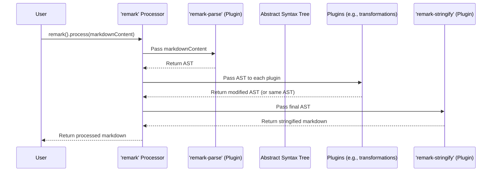

# Chapter 1: The 'remark' Processor

Welcome to the comprehensive documentation for the 'remark' project! This is our starting point, and throughout this tutorial, we will progressively uncover the powerful capabilities of the 'remark' ecosystem. As this is the first chapter, there's no previous content to connect to, but we'll set the stage for everything that follows.

---

### Problem & Motivation

Markdown has become a ubiquitous standard for writing web content, documentation, and even books due to its simplicity and readability. However, raw markdown content is just plain text. When you need to programmatically analyze, modify, or enforce specific styles and rules on markdown, you quickly run into significant challenges. For instance, imagine a scenario where your company mandates:

1.  All document titles (H1 headings) must immediately be followed by a summary (H2 heading).
2.  No empty paragraphs are allowed.
3.  All internal links must be checked and updated if the target changes.

Attempting to implement these rules with regular expression patterns would be incredibly fragile and complex. Markdown has a structured grammar, and treating it as unstructured text ignores this inherent structure, leading to brittle solutions. This is the core problem 'remark' aims to solve: how do we interact with markdown content in a structured, reliable, and programmatic way?

---

### Core Concept Explanation: The 'remark' Processor

At the heart of the 'remark' ecosystem lies the **'remark' processor**. Think of the 'remark' processor as the central control unit for managing your markdown content. It's an orchestrator, handling the entire lifecycle of markdown processing from raw text to a structured representation, transformation, and back to text.

The 'remark' processor operates on a fundamental principle: treating markdown not just as text, but as data. It achieves this by first parsing your markdown into an **Abstract Syntax Tree (AST)**. An AST is a tree-like representation where each node corresponds to a construct in the markdown (e.g., a heading, a paragraph, a list item, a link). This structured representation makes it incredibly easy to inspect, traverse, and manipulate your content.

Once the markdown is converted into an AST, the 'remark' processor allows you to apply a series of transformations through what are called **plugins**. These plugins can modify the AST, enforce rules, extract information, or even generate new content. Finally, after all transformations are complete, the processor takes the (potentially modified) AST and **stringifies** it back into markdown text. This parse -> transform -> stringify pipeline is the essence of how 'remark' provides a robust and flexible way to manage markdown.

---

### Practical Usage Examples

Let's dive into how you can use the 'remark' processor to handle markdown content. First, you'll need to install 'remark' in your project:

```bash
npm install remark
```

Now, let's see how to instantiate the processor and use it for basic markdown transformation.

#### Basic Markdown Processing

Here’s an example demonstrating how to take a simple markdown string, process it, and get the output. We'll use `processSync` for synchronous operations, which is convenient for simple scripts.

```javascript
// example.js
import { remark } from 'remark';

const markdownInput = `# Hello World

This is a paragraph.

Another line.`;

// Instantiate the remark processor
const processor = remark();

// Process the markdown synchronously
const result = processor.processSync(markdownInput);

// The result object contains the processed markdown
console.log(String(result));
```

**Explanation:**
This code snippet imports the `remark` function, which creates a processor instance. We then feed our `markdownInput` to `processor.processSync()`. The `processSync` method returns a `VFile` object, which has a `toString()` method to get the processed markdown output. For this basic example without any transformations, the output will be identical to the input.

```markdown
# Hello World

This is a paragraph.

Another line.
```

#### Processing with Options

You can configure the processor with various options. While the core parsing and stringifying options are usually handled by dedicated plugins (which we'll cover later), the processor itself can take general options.

```javascript
// example-options.js
import { remark } from 'remark';

const markdownInput = `## My Subheading

* List item 1
* List item 2`;

// Create a processor instance.
// For now, there aren't many direct options for the base remark() processor
// that dramatically alter parse/stringify behavior; those are mostly
// delegated to remark-parse and remark-stringify.
// However, conceptually, this is where you'd pass them.
const processor = remark();

// Process the markdown
const result = processor.processSync(markdownInput);

console.log(String(result));
```

**Explanation:**
While the `remark()` constructor itself doesn't take many configuration options that directly change how markdown is parsed or stringified (those are passed to `remark-parse` and `remark-stringify` plugins), this example illustrates where you would conceptually pass options if the core processor supported them. The output remains the same, demonstrating the pass-through nature.

```markdown
## My Subheading

* List item 1
* List item 2
```

---

### Internal Implementation Walkthrough

The 'remark' processor itself is a relatively thin wrapper that orchestrates the actions of several underlying components. When you call `remark().processSync(content)`, a series of steps unfold:

1.  **Processor Initialization**: `remark()` creates a `Processor` instance. This instance holds a chain of plugins that will be applied sequentially.
2.  **Parsing**: The processor implicitly uses `remark-parse` (a plugin designed specifically for parsing markdown) to convert the input markdown string into an **Abstract Syntax Tree (AST)**. This AST is typically represented using the `unist` (Universal Syntax Tree) format, which is a common standard for various syntax trees.
3.  **Transformation (Plugins)**: The processor then iterates through any plugins that have been `use()`d. Each plugin receives the AST and can inspect, modify, add, or remove nodes from it. This is where the core logic for enforcing rules or transforming content resides. For our basic `remark().processSync()` call, there are no custom plugins, so this step effectively does nothing unless default internal plugins are present.
4.  **Stringification**: Finally, the processor implicitly uses `remark-stringify` (another specialized plugin) to convert the (potentially modified) AST back into a markdown string.

Here's a simplified sequence diagram illustrating this flow:



**Explanation:** The 'remark' processor acts as the coordinator. It delegates the parsing of markdown into an AST to `remark-parse`, orchestrates the application of custom plugins to transform that AST, and then delegates the conversion of the AST back into markdown to `remark-stringify`. This modular design is what makes 'remark' so flexible and powerful.

---

### System Integration

The `remark` processor is truly the nexus of the entire 'remark' ecosystem. It doesn't perform parsing or stringifying itself directly; instead, it delegates these tasks to specialized plugins.

*   **Parsing**: The `remark` processor relies on `remark-parse` to turn markdown into an AST. You implicitly get `remark-parse` when you instantiate `remark()`.
*   **Transformations**: It executes a chain of `remark` plugins that you explicitly add using the `.use()` method. These plugins work directly on the AST to perform various transformations, checks, or enhancements.
*   **Stringification**: Similarly, it relies on `remark-stringify` to convert the final AST back into a markdown string. This is also implicitly included with `remark()`.
*   **CLI Tooling**: Tools like [The 'remark-cli' Tool](chapter_05.md) leverage this core processor. `remark-cli` provides a convenient command-line interface to apply 'remark' processing to files, essentially wrapping `remark().process()` logic for file-based operations.

Understanding that the `remark` processor acts as an API layer over these specialized plugins is key to grasping the system's architecture. Each component has a single, well-defined responsibility, and the processor binds them together.

---

### Best Practices & Tips

*   **Immutability**: When you call `remark()`, you get a new processor instance. This instance is configured with its own set of plugins. If you need different processing pipelines (e.g., one for documentation, one for blog posts), create separate `remark()` instances. Do not modify a processor instance that might be used concurrently.
*   **Asynchronous Processing**: For larger files or when dealing with I/O (like reading from disk), use `processor.process(markdown, callback)` or `processor.process(markdown).then(...)` for asynchronous processing. This prevents blocking the event loop in Node.js applications. `processSync` is great for quick scripts or when performance isn't critical.
*   **Error Handling**: The `VFile` object returned by `process` and `processSync` can carry messages and errors. Always inspect `result.messages` to catch warnings or errors generated by plugins during processing.
*   **Performance**: For very large documents or batch processing, consider streaming APIs if available (though `remark` primarily works on strings or `VFile`s). The primary performance bottleneck is usually complex plugin logic, not the core processor itself.

---

### Chapter Conclusion

In this chapter, we've introduced the fundamental building block of the 'remark' ecosystem: the **'remark' processor**. We've learned that it acts as the central orchestrator, managing the entire markdown processing pipeline from parsing raw text into a structured AST, applying transformations via plugins, and finally stringifying the AST back into markdown. We explored its core concept, saw practical examples of its usage, and understood its internal workings and how it integrates with other parts of the system.

With the 'remark' processor now understood as the command center, our next step is to delve into how it actually converts plain markdown into that manipulable AST. This crucial first step in the pipeline is handled by `remark-parse`.

Next, we'll explore: [Markdown Parser ('remark-parse')](chapter_02.md)