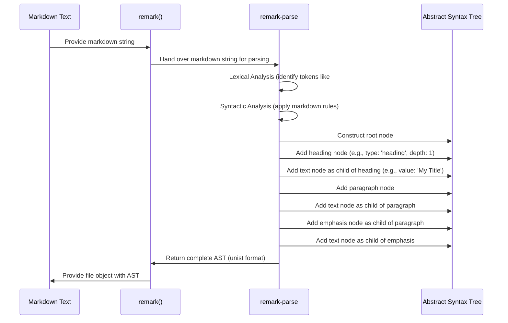

# Chapter 2: Markdown Parser ('remark-parse')

Welcome back! In the [previous chapter](chapter_01.md), we introduced the 'remark' processor as the central orchestrator of your markdown processing pipeline. We learned that `remark` is the engine, but it needs specific tools to perform its tasks. One of the most fundamental tools, and the very first step in processing markdown, is understanding the text itself. This is where `remark-parse` comes into play.

---

### Problem & Motivation

Imagine you have a markdown document, perhaps a user's blog post or a project's `README.md`. It's just plain text, but it *represents* structure: headings, paragraphs, lists, code blocks, and links. If you want to programmatically understand this structure – to find all headings, rewrite links, or check for specific content patterns – simply reading the raw text isn't enough. You can't easily tell where a paragraph ends and a list begins, or which text belongs to a heading.

This is the core problem `remark-parse` solves. It bridges the gap between unstructured markdown text and a structured, programmatically accessible data format. Without this ability, the entire ecosystem of `remark` plugins that modify or analyze markdown content wouldn't be possible, as they rely on a clear, consistent representation of the document's structure. For instance, if you want to automatically generate a table of contents, you first need to reliably identify all the heading elements in the markdown.

---

### Core Concept Explanation

`remark-parse` is a specialized *parser*. Its job is to read a string of markdown text and convert it into something called an **Abstract Syntax Tree (AST)**. Think of the AST as a highly structured, hierarchical blueprint of your markdown document. Instead of a flat piece of text, you get a tree where each node represents a specific markdown element: a heading node, a paragraph node, a list node, a text node, and so on.

This AST follows a standard called **[unist](https://github.com/syntax-tree/unist)**, which defines how syntax trees should be structured. Each node in the AST has a `type` (e.g., `'heading'`, `'paragraph'`, `'text'`), and potentially `children` (if it's a parent node like a heading containing text), `position` information (where it appeared in the original source), and other properties. `remark-parse` ensures that no matter how complex your markdown, it is consistently represented in this tree format, making it easy for subsequent tools to process.

The conversion from raw text to an AST is the crucial first step because it transforms human-readable markdown into machine-readable data. This structured data can then be traversed, analyzed, and modified with ease, forming the foundation for all subsequent transformations in the `remark` pipeline.

---

### Practical Usage Examples

Let's see `remark-parse` in action. It's typically used by chaining it with the `remark` processor's `.use()` method. This tells the processor to use `remark-parse` as its parsing mechanism.

First, make sure you have `remark` and `remark-parse` installed:
```bash
npm install remark remark-parse
```

Now, let's parse a simple markdown string and inspect the generated AST.

```javascript
import { remark } from 'remark';
import remarkParse from 'remark-parse';

const markdownContent = '# My Title\n\nThis is a *paragraph*.';

async function parseMarkdown() {
  const file = await remark()
    .use(remarkParse) // Instruct remark to use remark-parse
    .process(markdownContent);

  // The AST is available in file.data.rawAst or can be inspected from the file object
  // For clearer inspection, we'll log the 'tree' property of the file
  console.log(JSON.stringify(file.data.tree, null, 2));
}

parseMarkdown();
```
*Explanation*: We import `remark` and `remarkParse`. We then create a `remark` processor instance and `.use()` `remarkParse`. The `.process()` call takes our markdown string, and `remark-parse` turns it into an AST, which we then stringify for easy viewing.

The output will be the JSON representation of the AST:
```json
{
  "type": "root",
  "children": [
    {
      "type": "heading",
      "depth": 1,
      "children": [
        {
          "type": "text",
          "value": "My Title",
          "position": { /* ... */ }
        }
      ],
      "position": { /* ... */ }
    },
    {
      "type": "paragraph",
      "children": [
        {
          "type": "text",
          "value": "This is a ",
          "position": { /* ... */ }
        },
        {
          "type": "emphasis",
          "children": [
            {
              "type": "text",
              "value": "paragraph",
              "position": { /* ... */ }
            }
          ],
          "position": { /* ... */ }
        },
        {
          "type": "text",
          "value": ".",
          "position": { /* ... */ }
        }
      ],
      "position": { /* ... */ }
    }
  ],
  "position": { /* ... */ }
}
```
*Explanation*: Notice the `type: "root"` at the top, which is the main document. It contains `children`, including a `heading` node with `depth: 1` (an H1) and a `paragraph` node. The paragraph node itself has `children` that represent plain text and an `emphasis` (italic) node, which further contains its own text child. This structured representation is the AST.

`remark-parse` also supports different markdown flavors, such as GitHub Flavored Markdown (GFM). You can enable these options when using the plugin:

```javascript
import { remark } from 'remark';
import remarkParse from 'remark-parse';
import remarkGfm from 'remark-gfm'; // For GitHub Flavored Markdown extensions

const gfmContent = '- [x] Task list item\n\nwww.example.com';

async function parseGfmMarkdown() {
  const file = await remark()
    .use(remarkParse)
    .use(remarkGfm) // Enable GFM features like task lists and autolinks
    .process(gfmContent);

  console.log(JSON.stringify(file.data.tree, null, 2));
}

parseGfmMarkdown();
```
*Explanation*: By adding `remarkGfm` (which itself is a `remark` plugin that extends `remark-parse`'s capabilities or adds transformations), `remark-parse` can now correctly interpret GFM-specific syntax like task lists (`- [x]`) and automatically recognize URLs as links.

---

### Internal Implementation Walkthrough

At its heart, `remark-parse` operates in several conceptual stages, though these are often interwoven in practice.

1.  **Lexical Analysis (Tokenization):** The markdown string is read character by character. `remark-parse` identifies sequences of characters that form meaningful "tokens" – for example, `##` signifies a heading, `*` signifies emphasis, a newline character signifies a potential block end. It's like breaking a sentence into words and punctuation marks.

2.  **Syntactic Analysis (Parsing):** These tokens are then assembled according to markdown's grammatical rules. `remark-parse` understands that a `#` followed by text and a newline forms a heading, or that lines starting with `* ` form a list item. It builds the tree structure, creating parent nodes (like `paragraph` or `list`) and filling them with child nodes (like `text` or `listItem`).

3.  **AST Construction:** As it parses, it creates the actual `unist` nodes. Each node is given a `type`, its raw `value` (if it's a simple text node), and `children` (if it's a container node). Crucially, `remark-parse` also attaches `position` data to each node, indicating its exact start and end line/column in the original markdown, which is incredibly useful for error reporting or tools that highlight markdown.

Here's a simplified conceptual flow:


*Explanation*: The sequence diagram illustrates how the `remark` processor delegates the raw markdown text to `remark-parse`. The parser then internally performs lexical and syntactic analysis to build the `unist` compatible AST step-by-step, before handing the completed tree back to the `remark` processor.

---

### System Integration

`remark-parse` is the foundational plugin that kicks off the entire `remark` processing pipeline. It always runs *first* when you `use` it with the `remark` processor. Without `remark-parse`, the `remark` processor wouldn't know how to convert your plain markdown text into the structured AST that all subsequent plugins expect.

Consider the typical `remark` processing flow:
1.  **Parsing:** `remark-parse` takes markdown text and generates an AST.
2.  **Transforming:** Other plugins (covered in the [next chapter](chapter_03.md)) then operate on this AST, modifying it or extracting information.
3.  **Stringifying:** Finally, `remark-stringify` (covered in [Chapter 4](chapter_04.md)) converts the (potentially modified) AST back into a markdown string.

`remark-parse` ensures that the input to the transformation stage is consistently structured, adhering to the `unist` specification. This standardization is critical for the modularity and extensibility of the `remark` ecosystem. Data flows from raw markdown into `remark-parse`, out as an AST, into subsequent plugins for processing, and then potentially into `remark-stringify`.

---

### Best Practices & Tips

*   **Understand the AST Structure:** Spend time exploring the AST generated by `remark-parse` for different markdown inputs. Knowing the `unist` node types (`root`, `heading`, `paragraph`, `text`, `list`, `listItem`, `strong`, `emphasis`, `link`, `image`, `code`, etc.) is crucial for writing effective plugins or traversing the tree.
*   **Keep it Compliant:** `remark-parse` by default aims for CommonMark compliance. If you need GitHub Flavored Markdown (GFM) features (like task lists, strikethrough, tables, or autolinks), remember to explicitly add `remark-gfm` as a plugin, *after* `remark-parse`.
*   **Error Handling:** `remark-parse` will generally try to parse even malformed markdown. While this can be forgiving, be aware that inconsistent markdown input might lead to an AST structure different from what you expect. Validate your input markdown where possible if strictness is required.
*   **Performance:** For extremely large markdown files, parsing can be a bottleneck. `remark-parse` is highly optimized, but complex markdown with many nested elements will naturally take longer to process. For most use cases, this isn't a concern.

---

### Chapter Conclusion

In this chapter, we've dissected `remark-parse`, the unsung hero that kickstarts the entire `remark` pipeline. We learned that it's responsible for transforming raw markdown text into a structured, machine-readable Abstract Syntax Tree (AST), adhering to the `unist` standard. This initial parsing step is fundamental, as it provides the structured data that all subsequent plugins use for analysis and transformation. We explored practical examples, understood its internal workings, and discussed how it integrates seamlessly as the first stage of the `remark` processor.

Now that we have a firm grasp on how markdown is parsed into an AST, we're ready to explore how we can manipulate and transform that tree. The next logical step is to delve into the world of `remark` plugins, which are designed to work with this AST.

Continue to [Chapter 3: Plugins and Transformations](chapter_03.md) to learn how to modify and enhance your markdown content!