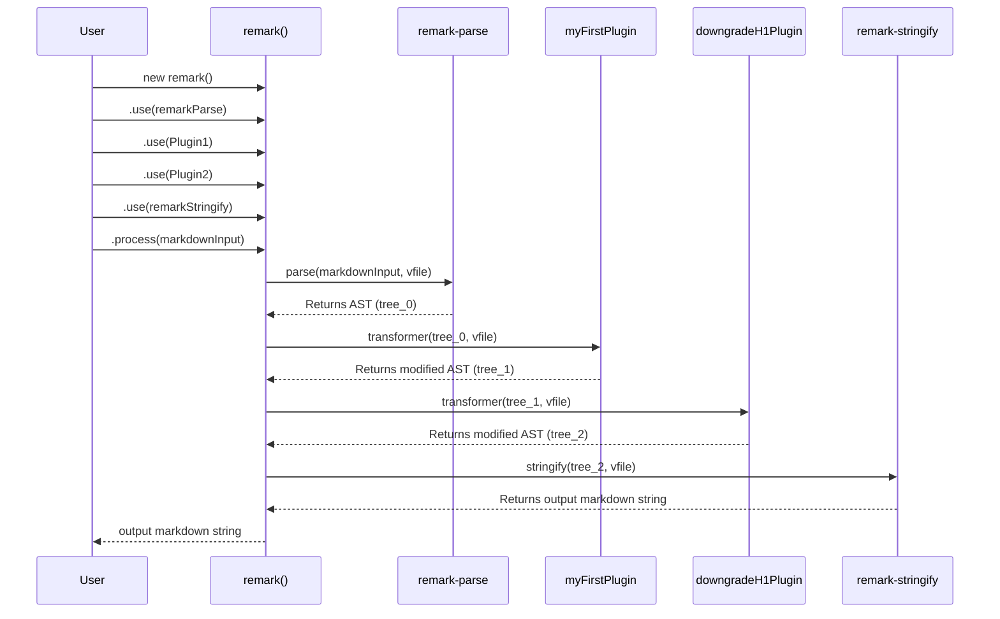

# Chapter 3: Plugins and Transformations

Welcome back to our journey through the 'remark' ecosystem! In the [previous chapter](chapter_02.md), we explored `remark-parse`, the foundational component that takes raw markdown text and meticulously converts it into a structured, machine-readable Abstract Syntax Tree (AST). You now understand how your markdown content becomes a programmable data structure. But what if you want to *do* something with that structure? What if you need to modify it, extract information, or add new elements before it's turned back into markdown? This is precisely where plugins and transformations come into play.

---

### Problem & Motivation

Imagine you're building a documentation site using markdown. You might have several requirements that go beyond simply parsing and displaying the content:

*   **Content Enforcement**: You want to ensure all main headings (`# Heading 1`) are automatically converted to secondary headings (`## Heading 2`) to maintain consistent document structure.
*   **Feature Enhancement**: You need to automatically generate a Table of Contents (TOC) based on the headings in your markdown.
*   **Custom Syntax**: You've introduced a special shortcode like `{{ alert "Important message" }}` and need it to be transformed into a proper HTML `div` or a specific markdown block.

Without a mechanism to modify the AST, `remark` would be limited to a simple pass-through parser-stringifier. It wouldn't be able to adapt to these common, real-world content processing needs. The core problem is the *lack of extensibility* and *customization* at the AST level.

Plugins address this by providing a powerful, modular way to inject custom logic into the markdown processing pipeline. They allow developers to extend `remark`'s functionality, making it incredibly versatile and adaptable to almost any content transformation requirement. For this chapter, let's use the concrete problem of **ensuring all Level 1 headings (`# Heading`) are downgraded to Level 2 headings (`## Heading`)** as our guiding use case.

---

### Core Concept Explanation

At its heart, a **plugin** in the `remark` ecosystem is a function that you "use" with the `remark` processor. These functions are designed to operate on the Abstract Syntax Tree (AST) that `remark-parse` generates, and they get executed *before* the AST is converted back into markdown by `remark-stringify`. Think of plugins as specialized workers in an assembly line: `remark-parse` builds the initial product (the AST), then a series of plugins modify or enhance that product, and finally, `remark-stringify` packages it up.

Plugins typically receive two main arguments: the AST itself and a `VFile` object. The **AST** (Abstract Syntax Tree), as discussed, is a hierarchical representation of your markdown content. The **VFile** (Virtual File) is an object used throughout the `unified` ecosystem (which `remark` is built upon) to pass along data like the original input string, file path, and crucially, messages (warnings, errors) that plugins might generate.

The magic happens because `remark` (the processor) is built on `unified`. The `unified` architecture allows you to chain multiple plugins together using the `.use()` method. Each plugin in the chain receives the AST from the previous stage, performs its transformation, and then passes the modified AST to the next plugin or to the stringifier. This sequential execution makes `remark` highly modular and predictable, enabling complex transformations through simple, focused plugins.

---

### Practical Usage Examples

Let's dive into practical examples, starting with a basic "Hello, World!" style plugin and then tackling our motivating problem of transforming heading levels.

#### Example 1: A Simple "Hello, World!" Plugin

This plugin will simply add a new paragraph containing "Hello from a remark plugin!" to the very beginning of your markdown content.

First, let's create a file `my-first-plugin.js`:

```javascript
// my-first-plugin.js
import { h } from 'hastscript'; // For creating HTML nodes if needed, not strictly for this example
import { visit } from 'unist-util-visit'; // Useful for AST traversal, we'll use it later

// This is our plugin function
function myFirstPlugin() {
  // It returns a 'transformer' function that receives the AST (tree) and VFile
  return (tree) => {
    // We'll add a new paragraph node at the beginning of the tree's children.
    // A paragraph node has type 'paragraph' and children (text node).
    const helloNode = {
      type: 'paragraph',
      children: [{ type: 'text', value: 'Hello from a remark plugin!' }]
    };

    // Add it to the front of the content
    tree.children.unshift(helloNode);
  };
}

export default myFirstPlugin;
```
*Explanation*: Our plugin `myFirstPlugin` is a function that returns another function (often called a 'transformer'). This transformer function takes the `tree` (the AST) as its argument. Inside, we create a new paragraph node and use `tree.children.unshift()` to add it to the beginning of the document's content.

Now, let's use this plugin with the `remark` processor:

```javascript
// process-with-plugin.js
import { remark } from 'remark';
import remarkParse from 'remark-parse';
import remarkStringify from 'remark-stringify';
import myFirstPlugin from './my-first-plugin.js'; // Import our plugin

async function processMarkdown() {
  const markdownInput = `# My Document\n\nSome initial content.`;

  const processor = remark()
    .use(remarkParse)           // Step 1: Parse markdown into AST
    .use(myFirstPlugin)         // Step 2: Apply our custom plugin
    .use(remarkStringify);      // Step 3: Convert AST back to markdown

  const result = await processor.process(markdownInput);
  console.log(String(result));
}

processMarkdown();
```
*Expected Output (`console.log`)*:
```markdown
Hello from a remark plugin!

# My Document

Some initial content.
```
*Explanation*: We instantiate `remark`, chain `remarkParse` to create the AST, then crucially use `.use(myFirstPlugin)` to apply our transformation, and finally `remarkStringify` to turn the modified AST back into markdown. The output clearly shows our new paragraph added at the top.

---

#### Example 2: Downgrading Headings (Solving our Motivation Problem)

Now, let's tackle our motivating problem: ensuring all Level 1 headings (`# Heading`) become Level 2 headings (`## Heading`). For this, we'll need to traverse the AST and identify heading nodes. The `unist-util-visit` utility is extremely helpful for this.

Create `downgrade-h1-plugin.js`:

```javascript
// downgrade-h1-plugin.js
import { visit } from 'unist-util-visit'; // Helper for visiting nodes in the AST

function downgradeH1Plugin() {
  return (tree) => {
    // visit(tree, 'type', visitor)
    // - tree: The AST to traverse
    // - 'heading': The type of node we are interested in
    // - visitor: A function called for each matching node
    visit(tree, 'heading', (node) => {
      // Check if the heading node's 'depth' property is 1 (which means it's an H1)
      if (node.depth === 1) {
        // If it's an H1, change its depth to 2 (making it an H2)
        node.depth = 2;
      }
    });
  };
}

export default downgradeH1Plugin;
```
*Explanation*: Our `downgradeH1Plugin` uses `unist-util-visit`. This powerful utility allows us to easily find specific types of nodes in the AST (`'heading'` in this case). For every heading node it finds, our visitor function checks if `node.depth` is `1` (representing an H1). If it is, we simply change `node.depth` to `2`, effectively transforming it into an H2.

Now, use it with the `remark` processor:

```javascript
// process-headings.js
import { remark } from 'remark';
import remarkParse from 'remark-parse';
import remarkStringify from 'remark-stringify';
import downgradeH1Plugin from './downgrade-h1-plugin.js'; // Import our new plugin

async function processHeadings() {
  const markdownInput = `# Top Level Heading\n\n## Sub Heading\n\n# Another Top Heading`;

  const processor = remark()
    .use(remarkParse)
    .use(downgradeH1Plugin) // Apply our heading transformation plugin
    .use(remarkStringify);

  const result = await processor.process(markdownInput);
  console.log(String(result));
}

processHeadings();
```
*Expected Output (`console.log`)*:
```markdown
## Top Level Heading

## Sub Heading

## Another Top Heading
```
*Explanation*: Notice how both `# Top Level Heading` and `# Another Top Heading` were successfully converted to `## Top Level Heading` and `## Another Top Heading` respectively, while `## Sub Heading` remained unchanged. This demonstrates the power of AST transformations with plugins.

#### Plugin Configuration Options

Plugins can also accept options, allowing for more flexible and reusable functionality. You pass options as a second argument to `.use()`:

```javascript
// configurable-plugin.js
function configurableHeadingPlugin(options = {}) {
  const { targetDepth = 2, sourceDepth = 1 } = options;

  return (tree) => {
    visit(tree, 'heading', (node) => {
      if (node.depth === sourceDepth) {
        node.depth = targetDepth;
      }
    });
  };
}

export default configurableHeadingPlugin;
```
*Explanation*: This enhanced plugin now accepts an `options` object. We can specify `sourceDepth` (the heading level to target) and `targetDepth` (the level to change it to). Default values are provided for convenience.

Using the configurable plugin:

```javascript
// process-configurable.js
import { remark } from 'remark';
import remarkParse from 'remark-parse';
import remarkStringify from 'remark-stringify';
import configurableHeadingPlugin from './configurable-plugin.js';

async function processConfigurable() {
  const markdownInput = `### Section Title\n\nContent.`;

  const processor = remark()
    .use(remarkParse)
    .use(configurableHeadingPlugin, { sourceDepth: 3, targetDepth: 1 }) // Convert H3 to H1
    .use(remarkStringify);

  const result = await processor.process(markdownInput);
  console.log(String(result));
}

processConfigurable();
```
*Expected Output (`console.log`)*:
```markdown
# Section Title

Content.
```
*Explanation*: By passing `{ sourceDepth: 3, targetDepth: 1 }` to the plugin, we instructed it to specifically target H3 headings and convert them into H1s.

---

### Internal Implementation Walkthrough

So, what exactly happens when you call `processor.use(plugin)` and then `processor.process(markdown)`? Let's break down the internal flow.

The `remark` processor is an instance of a `unified` processor. The `unified` library provides a robust pipeline for processing content, and `remark` specializes it for markdown.

1.  **`processor.use(plugin, options)`**: When you call `.use()`, the `remark` processor (which is a `unified` processor) adds your `plugin` function (and its `options`) to an internal list of transformations. It doesn't execute the plugin immediately.

2.  **`processor.process(markdownInput)`**: This is where the magic begins.
    *   **Parsing Phase (`.use(remarkParse)`)**: The `unified` processor first identifies its parser (which we set with `remarkParse`). It calls `remarkParse` with the `markdownInput` and a new `VFile`. `remarkParse` then does its job, converting the markdown string into an AST. This AST is now the central data structure.
    *   **Transformation Phase (`.use(myFirstPlugin)`, `.use(downgradeH1Plugin)`, etc.)**: Once the AST is generated, the `unified` processor enters its *run* phase. It iterates through all the plugins that were registered via `.use()`:
        *   For each plugin, the `processor` calls the plugin's main function. If the plugin returns a transformer function (as is common), that transformer function is then executed.
        *   The transformer function receives the *current* state of the AST and the `VFile`.
        *   The plugin performs its modifications directly on the AST object. `remark` (and `unified`) encourage direct mutation of the AST for performance, rather than creating entirely new ASTs.
        *   After the plugin finishes, the modified AST is passed to the next plugin in the chain. This continues until all registered plugins have had a chance to operate.
    *   **Stringifying Phase (`.use(remarkStringify)`)**: Finally, after all plugins have run, the `unified` processor identifies its stringifier (which we set with `remarkStringify`). It calls `remarkStringify` with the now fully transformed AST and the `VFile`. `remarkStringify` then converts the AST back into a markdown string.

Here's a simplified sequence diagram illustrating this flow:


*Explanation*: The diagram shows how the `remark` processor acts as an orchestrator. It first uses `remark-parse` to get an initial AST. Then, it sequentially feeds this AST through each registered plugin (`Plugin1`, `Plugin2`), allowing them to modify the tree. Finally, the fully transformed AST is passed to `remark-stringify` to produce the final markdown output.

---

### System Integration

Plugins are the central mechanism for extending the `remark` processor's core functionality. They bridge the gap between parsing and stringifying, allowing for arbitrary transformations.

*   **Between Parser and Stringifier**: Plugins operate squarely in the middle of the `remark` pipeline. They receive the output of `[Markdown Parser ('remark-parse')](chapter_02.md)` (the AST) and produce an AST that is then consumed by `[Markdown Stringifier ('remark-stringify')](chapter_04.md)`. This clear separation of concerns ensures that parsing is only about reading, stringifying is only about writing, and plugins are solely responsible for transformations.

*   **Orchestrated by `[The 'remark' Processor](chapter_01.md)`**: The `remark` processor object itself is the conductor of this orchestra. It holds references to the parser, the array of plugins, and the stringifier. Its `.process()` method drives the entire sequence, calling each component at the appropriate time and passing the `VFile` and AST through the pipeline.

**Data Flow with Plugins**:

```mermaid
graph LR
    A[Raw Markdown Text] --> B(remark-parse);
    B --> C{Abstract Syntax Tree (AST)};
    C --> D[Plugin 1 (Modifies AST)];
    D --> E[Plugin 2 (Modifies AST)];
    E --> F[...]
    F --> G[remark-stringify];
    G --> H[Transformed Markdown Text];
```
*Explanation*: This flow visually reinforces that plugins are integral steps *within* the transformation stage of the `remark` pipeline, acting on the AST generated by `remark-parse` before `remark-stringify` converts it back.

---

### Best Practices & Tips

When developing or using `remark` plugins, keep the following in mind for maintainability, performance, and robustness:

*   **Single Responsibility Principle**: Design plugins to do one thing well. A plugin that generates a Table of Contents should ideally not also be responsible for sanitizing HTML. This makes plugins easier to test, debug, and reuse.
*   **Use `unist-util-visit`**: For traversing the AST and finding specific nodes, `unist-util-visit` is the idiomatic and most efficient utility. Avoid manual recursive traversal unless you have very specific, complex needs.
*   **Handle `VFile` for Messages**: If your plugin encounters issues (e.g., malformed custom syntax), use `vfile.message()` to report warnings or errors. This integrates well with `remark-cli` and other tooling.
    ```javascript
    // Example: reporting a warning
    import { visit } from 'unist-util-visit';
    function myWarningPlugin() {
      return (tree, file) => {
        visit(tree, 'link', (node) => {
          if (!node.url) {
            file.message('Link found without a URL!', node); // Attach message to node
          }
        });
      };
    }
    ```
*   **Avoid Deep Clones (if possible)**: Directly mutating the AST nodes passed to your plugin is generally more performant than creating deep copies of the AST, modifying the copy, and returning it. The `unified` ecosystem is optimized for mutation. Only deep clone if you explicitly need to preserve the original AST for some reason.
*   **Test Your Plugins**: Just like any other code, plugins should be thoroughly tested. Focus on testing inputs that should trigger your plugin's logic and those that shouldn't, verifying the output AST or markdown.
*   **Configuration**: Provide sensible defaults for plugin options. This makes your plugins easier to use out-of-the-box while still offering customization.

---

### Chapter Conclusion

Plugins and transformations are arguably what make `remark` truly powerful and flexible. By understanding how to write and apply plugins, you gain the ability to deeply customize and extend markdown processing to suit almost any requirement, from simple heading adjustments to complex content generation and validation. They represent the "active" part of the `remark` pipeline, turning static markdown into dynamic, programmable content.

Having successfully parsed markdown into an AST and learned how to transform that AST using plugins, our next logical step is to complete the cycle. In the upcoming chapter, we'll explore `remark-stringify`, the component responsible for taking the (potentially transformed) AST and rendering it back into human-readable markdown content.

Proceed to the final stage of the processing pipeline: [Markdown Stringifier ('remark-stringify')](chapter_04.md).