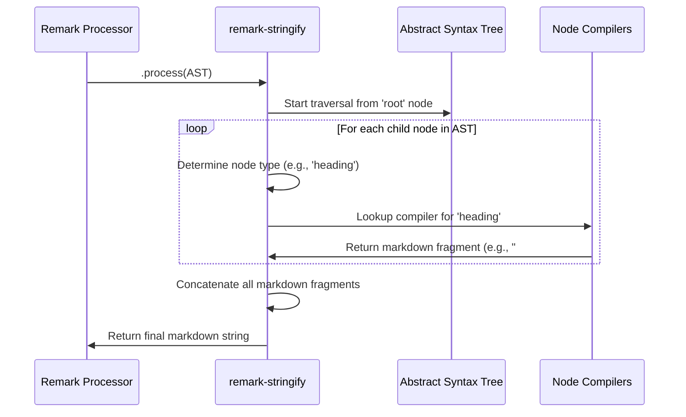

# Chapter 4: Markdown Stringifier ('remark-stringify')

Having explored how the 'remark' processor orchestrates the parsing and transformation of markdown through [Plugins and Transformations](chapter_03.md), we now turn our attention to the final, crucial step in the markdown processing pipeline: converting the Abstract Syntax Tree (AST) back into human-readable markdown content. This is where `remark-stringify` plays its indispensable role.

---

### Problem & Motivation

Imagine you've meticulously parsed a markdown document, applied a series of powerful transformations using `remark` plugins—perhaps reformatting headings, standardizing list bullets, or even injecting dynamic content. At the end of this process, you have a modified Abstract Syntax Tree (AST), which is a programmatic representation of your markdown. The core problem at this stage is that an AST, while perfect for programmatic manipulation, isn't something you can easily share, publish, or read as a standard markdown file.

This is precisely the problem `remark-stringify` solves. It acts as the bridge that takes your manipulated AST and renders it back into a conventional markdown string. Without this component, the entire transformation pipeline would be incomplete; you'd be able to process markdown internally but never output the results in a usable format. For the 'remark' project, `remark-stringify` is vital for closing the loop, enabling users to programmatically modify markdown files and save those changes back to disk or display them.

Consider a practical use case: A developer wants to ensure all bullet lists in their project's documentation consistently use hyphens (`-`) instead of asterisks (`*`) or plus signs (`+`). After parsing the markdown into an AST and using a plugin to enforce this style, `remark-stringify` is the component that takes this style-normalized AST and generates the corrected markdown file, ready for commit. This ensures consistency and maintainability across large documentation bases.

---

### Core Concept Explanation

`remark-stringify` is a dedicated 'remark' plugin designed specifically for the serialization of a markdown AST back into a markdown string. It's often thought of as the inverse operation to `remark-parse`. While `remark-parse` converts text *to* a tree, `remark-stringify` converts a tree *to* text.

The fundamental principle behind `remark-stringify` is to traverse the AST, node by node, and for each node type (e.g., `heading`, `paragraph`, `list`, `code`), it applies a specific "compiler" function that knows how to represent that node as a piece of markdown syntax. These pieces are then concatenated, respecting the structure and hierarchy defined by the AST, to form the final markdown string. It's a highly configurable process, allowing users to dictate various aspects of the output format, such as indentation, bullet styles, and heading depths.

When you use the `remark` processor, `remark-stringify` is typically `use`d implicitly or explicitly as the last step in the chain. It takes the final state of the AST (after all parsing and transformation plugins have run) and executes its stringification logic. This ensures that any changes made to the AST by preceding plugins are correctly reflected in the resulting markdown output, providing a consistent and predictable way to manage markdown content programmatically.

---

### Practical Usage Examples

Let's illustrate the usage of `remark-stringify` with a simple example, building upon our understanding of the 'remark' processor. We'll start with a basic markdown string, parse it, and then stringify it back.

First, ensure you have the necessary packages installed:
```bash
npm install remark remark-stringify
```

Now, let's see `remark-stringify` in action.

```javascript
import { remark } from 'remark';
import remarkStringify from 'remark-stringify';

async function stringifyBasicMarkdown() {
  const markdown = '# Hello World\n\nThis is a *test*.';
  
  // Use remark with remark-stringify
  const file = await remark()
    .use(remarkStringify) // Explicitly use the stringifier
    .process(markdown);
  
  console.log(String(file));
}

stringifyBasicMarkdown();
```
**Explanation:** In this example, we import `remark` and `remarkStringify`. We then configure the `remark` processor to `use(remarkStringify)`. When `.process(markdown)` is called, the input `markdown` is first parsed into an AST (implicitly by `remark-parse`, which is a default plugin if no other parser is specified). Then, `remark-stringify` takes this AST and converts it back into a string, which we print to the console. The output will be identical to the input markdown, demonstrating the basic round-trip.

Let's consider a scenario where we've processed an AST, perhaps modified it using a plugin, and now want to stringify the *modified* AST. For simplicity, we'll manually create a small AST and then stringify it.

```javascript
import { remark } from 'remark';
import remarkStringify from 'remark-stringify';

async function stringifyModifiedAST() {
  // A simple AST for a heading and a paragraph
  const ast = {
    type: 'root',
    children: [
      {
        type: 'heading',
        depth: 1,
        children: [{ type: 'text', value: 'Modified Title' }]
      },
      {
        type: 'paragraph',
        children: [{ type: 'text', value: 'New content here.' }]
      }
    ]
  };

  const file = await remark()
    .use(remarkStringify)
    // When an AST is passed to .process(), it skips parsing and starts from stringification
    .process(ast); 
  
  console.log(String(file));
}

stringifyModifiedAST();
```
**Output:**
```markdown
# Modified Title

New content here.
```
**Explanation:** Here, instead of passing a markdown string, we directly pass an AST object to `process()`. `remark-stringify` then takes this AST and converts it into the corresponding markdown string. This is crucial for scenarios where plugins have actively manipulated the AST, and you need to persist those changes as markdown.

`remark-stringify` also offers configuration options to control the output format. For instance, you can specify the character to use for unordered list bullets.

```javascript
import { remark } from 'remark';
import remarkStringify from 'remark-stringify';

async function stringifyWithOptions() {
  const markdown = `- Item 1\n* Item 2\n  - Sub-item`;
  
  const file = await remark()
    .use(remarkStringify, { bullet: '+' }) // Use '+' for all bullets
    .process(markdown);
  
  console.log(String(file));
}

stringifyWithOptions();
```
**Output:**
```markdown
+ Item 1
+ Item 2
  + Sub-item
```
**Explanation:** By passing an options object `{ bullet: '+' }` to `remarkStringify`, we instruct it to use `+` as the bullet character for all unordered list items during stringification. This demonstrates how you can customize the output generated by `remark-stringify` to match specific style guides or preferences.

---

### Internal Implementation Walkthrough

At its core, `remark-stringify` works by traversing the provided Abstract Syntax Tree (AST) in a depth-first manner. For each node it encounters, it looks up a corresponding "compiler" or "renderer" function based on the node's `type` property. These functions are responsible for taking the node's data and converting it into the appropriate markdown syntax.

Let's simplify the process with a conceptual flow:

1.  **Initialization**: `remark-stringify` is initialized, potentially with configuration options (e.g., `bullet`, `rule`, `listItemIndent`).
2.  **Root Traversal**: It starts by processing the `root` node of the AST.
3.  **Node Mapping**: For each child node of the current node, it identifies the node's `type` (e.g., `paragraph`, `heading`, `list`, `link`).
4.  **Compiler Lookup**: It then finds a specialized compiler function (sometimes referred to as a "generator" or "serializer") for that specific node type. For instance, a `heading` node would call a `compileHeading` function.
5.  **Markdown Generation**: This compiler function takes the node's properties (e.g., `depth` for a heading, `url` for a link, `value` for text) and constructs the corresponding markdown string fragment. For a heading with `depth: 1` and `value: "Title"`, it would generate `# Title`.
6.  **Recursive Processing**: If a node has children (like a `paragraph` with `text` children, or a `list` with `listItem` children), the process recurses: the children are compiled first, and their results are embedded within the parent's markdown structure.
7.  **Concatenation**: The markdown fragments from each node are assembled, respecting line breaks, indentation, and other formatting rules, to form the complete markdown output.

Here's a simplified illustration of the stringification process:



*(Conceputal File Reference: In a typical implementation, you'd find node-specific compilation logic within files like `lib/to-markdown/heading.js`, `lib/to-markdown/paragraph.js`, etc., within the `remark-stringify` package itself.)*

The power of this modular design is that each compiler function only needs to know how to render its specific node type. The overall `remark-stringify` logic handles the traversal and assembly, making it robust and extensible.

---

### System Integration

`remark-stringify` is an integral part of the 'remark' ecosystem and works seamlessly with other components to provide a complete markdown processing solution.

1.  **With the 'remark' Processor**: `remark-stringify` is typically `use`d directly with the main [The 'remark' Processor](chapter_01.md). When you call `processor.process(markdown)` or `processor.process(vfile)`, the processor internally manages the flow: parsing, then applying plugins, and finally stringifying if `remark-stringify` is configured.
    ```mermaid
    graph LR
        A[Markdown String] --> B(remark-parse);
        B --> C[AST];
        C -- (Plugins modify) --> D[Modified AST];
        D --> E(remark-stringify);
        E --> F[Output Markdown String];
    ```

2.  **Complementary to 'remark-parse'**: `remark-stringify` is the direct counterpart to [Markdown Parser ('remark-parse')](chapter_02.md). While `remark-parse` converts markdown text into an AST, `remark-stringify` converts that AST (or a modified version of it) back into markdown text, completing the round-trip. They define the input and output formats for the `remark` processor's internal operations.

3.  **Post-Plugin Transformation**: It always runs *after* any [Plugins and Transformations](chapter_03.md) have had a chance to modify the AST. This is its primary purpose: to serialize the *final* state of the AST after all desired programmatic changes have been applied. Without `remark-stringify`, the results of your plugins would remain trapped within the AST structure.

The data flow is clear: raw markdown enters, is parsed into an AST, the AST is potentially transformed by plugins, and then `remark-stringify` serializes this potentially transformed AST back into markdown. This sequential and modular integration allows for powerful and flexible markdown manipulation.

---

### Best Practices & Tips

*   **Always Pair with `remark-parse` (Implicitly or Explicitly)**: While `remark` automatically includes `remark-parse` when processing a string, it's good to remember that `stringify` assumes a valid AST as input. If you're manually creating or heavily manipulating an AST, ensure it adheres to the [mdast spec](https://github.com/syntax-tree/mdast) for predictable stringification.
*   **Configure for Consistency**: Leverage the configuration options of `remark-stringify` (e.g., `bullet`, `rule`, `listItemIndent`, `strong`, `emphasis`) to enforce a consistent markdown style across your project. This is invaluable for large teams or open-source projects.
    ```javascript
    // Example: Enforce specific formatting
    const processor = remark().use(remarkStringify, {
      bullet: '-',          // Always use hyphens for unordered lists
      rule: '*',            // Always use asterisks for horizontal rules
      listItemIndent: 'one' // Indent list items by one space
    });
    ```
*   **Understand Option Precedence**: Be aware that some plugin options might affect how `remark-stringify` behaves. For instance, a plugin might explicitly set the `data.hName` on a node, which `remark-rehype` would use, but `remark-stringify` primarily uses the `type` property for markdown output.
*   **Troubleshooting Invalid Output**: If `remark-stringify` produces unexpected or malformed markdown, the most common culprit is an improperly structured AST.
    *   **Invalid Node Types**: Ensure all node types (e.g., `heading`, `paragraph`, `text`) are valid according to the mdast specification.
    *   **Missing `children` or `value`**: Many nodes require `children` (e.g., `paragraph`, `heading`, `list`) or a `value` (e.g., `text`, `code`) to be correctly stringified.
    *   **Incorrect Nesting**: Verify that parent-child relationships in your AST are semantically correct (e.g., a `paragraph` cannot directly contain another `paragraph`).
    *   To debug, inspect the AST *before* stringification using a tool like `unist-util-inspect` or simply `JSON.stringify(ast, null, 2)` to pinpoint structural issues.
*   **Performance**: For typical markdown files, `remark-stringify` is highly optimized and fast. Only in extreme cases with exceptionally large ASTs (millions of nodes) might performance become a concern, at which point profiling would be necessary. For most use cases, it will not be a bottleneck.

---

### Chapter Conclusion

In this chapter, we've taken a deep dive into `remark-stringify`, the essential component that completes the `remark` markdown processing cycle. We've seen how it addresses the crucial problem of converting an Abstract Syntax Tree back into human-readable and shareable markdown. From its core concept as the inverse of parsing to practical examples demonstrating its use and configurability, `remark-stringify` proves its value in ensuring consistent and programmatically generated markdown output.

We walked through its internal mechanism, understanding how it traverses the AST and leverages node-specific compilers to build the final markdown string, and examined its seamless integration within the broader 'remark' ecosystem. By adhering to best practices and understanding common pitfalls, you can effectively leverage `remark-stringify` to output high-quality, standardized markdown content.

With `remark-parse` handling the input, plugins handling the transformations, and `remark-stringify` handling the output, the `remark` processor provides a robust foundation for programmatic markdown manipulation. Next, we'll explore how these powerful capabilities are brought to the command line through [The 'remark-cli' Tool](chapter_05.md), allowing you to apply these transformations directly to files and directories.