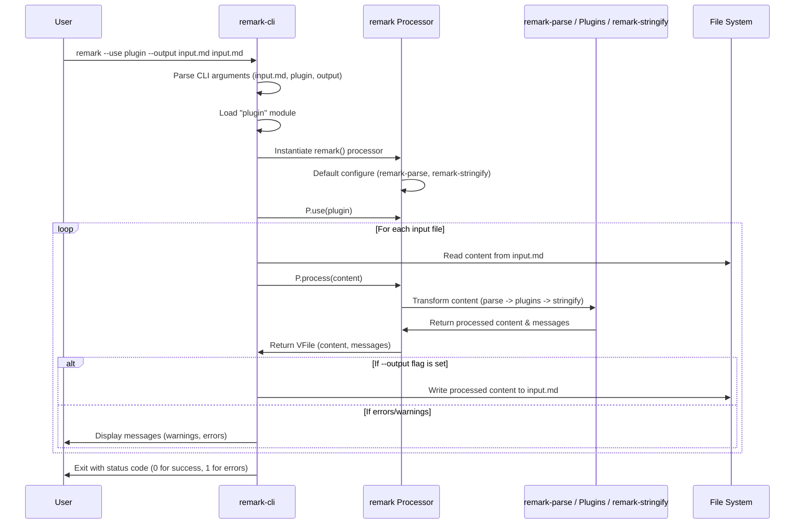

# Chapter 5: The 'remark-cli' Tool

Having explored the core components of the `remark` ecosystem – from the central [The 'remark' Processor](chapter_01.md) that orchestrates everything, through the [Markdown Parser ('remark-parse')](chapter_02.md) which converts text to AST, the powerful [Plugins and Transformations](chapter_03.md) that modify the AST, and finally the [Markdown Stringifier ('remark-stringify')](chapter_04.md) which converts the AST back to markdown – we now arrive at the user-facing gateway: **`remark-cli`**. While `remark-stringify` concludes the programmatic journey of processing markdown, `remark-cli` provides an accessible bridge, allowing you to leverage this entire pipeline directly from your terminal, without needing to write a single line of JavaScript.

---

### Problem & Motivation

Imagine you're maintaining a large project with numerous markdown files – documentation, blog posts, changelogs, or even book chapters. You want to ensure these files adhere to certain style guidelines, are consistently formatted, and perhaps even transformed in specific ways (e.g., adding anchors to headings, converting emojis). Without `remark-cli`, your options would typically involve writing custom Node.js scripts for each task: instantiating the `remark` processor, chaining plugins, reading files, and writing outputs. This approach is powerful but requires programming knowledge and can be cumbersome for repetitive, file-based operations.

The real-world problem `remark-cli` solves is the **overhead of programmatic scripting for common markdown processing tasks**. It eliminates the need to write boilerplate code, making the full power of the `remark` ecosystem readily available to developers and non-developers alike, directly from the command line. This is crucial for automation, continuous integration workflows, and ensuring consistency across a codebase without diving into JavaScript.

Consider this concrete use case: You have a directory of markdown files (`docs/article1.md`, `docs/article2.md`) and you want to automatically lint them for common markdown issues (like too many spaces after a list item) and then reformat them to a consistent style.

---

### Core Concept Explanation

**`remark-cli`** is essentially a command-line wrapper around the core `remark` processor. It acts as an abstraction layer, allowing you to interact with the entire markdown processing pipeline using simple terminal commands and flags, rather than explicit JavaScript code. It's designed for convenience, automation, and direct file manipulation.

At its heart, `remark-cli` does exactly what we've learned about the [remark processor](chapter_01.md) – it takes input markdown, passes it through a series of plugins to transform its Abstract Syntax Tree (AST), and then stringifies it back into markdown. The key difference is that `remark-cli` handles the file I/O (reading from files, writing to files or standard output) and the configuration of the `remark` processor for you, based on the arguments you provide in the command line or through configuration files.

Think of `remark-cli` as the **"remote control"** for your `remark` processing system. Instead of manually assembling the processing chain with code, you just tell the remote control (the CLI) what files to process and which "channels" (plugins) to use, and it handles all the underlying mechanics. This makes tasks like linting a directory, reformatting a single file, or applying complex transformations across many documents incredibly straightforward and efficient. It allows you to leverage the full power of [Plugins and Transformations](chapter_03.md) without the scripting overhead.

---

### Practical Usage Examples

Let's tackle our motivating use case: linting and formatting markdown files.

First, you'll need to install `remark-cli` and any plugins you intend to use globally or locally within your project.

```bash
# Install globally for easy access
npm install -g remark-cli remark-preset-lint-recommended remark-gfm

# Or locally in your project
# npm install --save-dev remark-cli remark-preset-lint-recommended remark-gfm
```
*This command installs `remark-cli` and two common plugins: `remark-preset-lint-recommended` for linting and `remark-gfm` for GitHub Flavored Markdown features. Installing globally makes the `remark` command available everywhere.*

Now, let's create a sample markdown file (`docs/example.md`) with some linting issues and inconsistent formatting:

```markdown
# My Article

This is a paragraph.  
  
- Item 1  
-   Item 2

_emphasized_ text.
```
*This `example.md` file contains a double space after the first paragraph, and inconsistent spacing for the list items, which `remark-preset-lint-recommended` will flag.*

#### 1. Basic Linting with `remark-cli`

To lint the file, we can tell `remark-cli` to use the `remark-preset-lint-recommended` plugin.

```bash
remark --use remark-preset-lint-recommended docs/example.md
```
*This command tells `remark-cli` to process `docs/example.md` and apply the linting rules defined in `remark-preset-lint-recommended`. It will print any detected issues to your console.*

You should see output similar to this, indicating the linting problems:

```
docs/example.md
  3:19-3:21  warning  Extra space after sentence                             lint-maximum-line-length
  5:3-5:6    warning  Unexpected padding between list items                  lint-list-item-indent
  6:3-6:7    warning  Unexpected padding between list items                  lint-list-item-indent

‼ 3 warnings
```
*The output clearly shows where the issues are located (line:column) and what type of warning they are, helping you quickly identify and fix them.*

#### 2. Formatting (Fixing) Issues with `remark-cli`

Many linting plugins (like those in `remark-preset-lint-recommended`) can also *fix* issues. To apply these fixes and save the changes back to the file, use the `--output` (or `-o`) flag.

```bash
remark --use remark-preset-lint-recommended --output docs/example.md docs/example.md
```
*Here, we're telling `remark-cli` to process `docs/example.md` with the linting plugin and then *overwrite* the original `docs/example.md` with the corrected output. After this, `example.md` will be formatted.*

Now, if you check `docs/example.md`, its content will be:

```markdown
# My Article

This is a paragraph.

- Item 1
- Item 2

_emphasized_ text.
```
*Notice how the extra spaces and inconsistent list item indents have been automatically corrected by the `remark-cli` tool leveraging the `remark-preset-lint-recommended` plugin.*

#### 3. Processing Multiple Files and Directories

You can use glob patterns to process multiple files or entire directories.

```bash
# Lint all markdown files in the 'docs' directory
remark --use remark-preset-lint-recommended "docs/**/*.md"

# Format all markdown files in the current directory and subdirectories
remark --use remark-preset-lint-recommended --output --inplace "**/*.md"
```
*The first command lints all `.md` files within `docs/` and its subfolders. The second command uses `--inplace` (shorthand for `--output`) to overwrite the original files with the formatted content across your entire project. The glob pattern needs to be quoted to ensure the shell passes it correctly.*

---

### Internal Implementation Walkthrough

When you run a command like `remark --use remark-gfm --output file.md file.md`, here's a simplified step-by-step look at what happens internally:

1.  **Command Parsing**: `remark-cli` first parses the command-line arguments. It identifies the input files (`file.md`), the plugins to use (`remark-gfm`), and options like `--output`.
2.  **Plugin Loading**: For each plugin specified (e.g., `remark-gfm`), `remark-cli` dynamically loads the corresponding Node.js module. It handles resolving plugin paths and ensures they are valid functions.
3.  **Processor Instantiation**: `remark-cli` creates an instance of the core `remark` processor. Behind the scenes, this processor is already configured with `remark-parse` and `remark-stringify` by default, as it needs these to function.
4.  **Plugin Application**: The loaded plugins are then `use()`d with the `remark` processor instance, in the order they were specified. This configures the processor's pipeline.
5.  **File Processing Loop**:
    *   For each input file (or content piped via `stdin`):
        *   The content of the file is read from the file system.
        *   This content is passed to the configured `remark` processor.
        *   The processor internally uses `remark-parse` to convert the markdown text into an AST.
        *   The AST then traverses through all the configured plugins, which perform their transformations.
        *   Finally, the transformed AST is passed to `remark-stringify` to convert it back into markdown text.
        *   If warnings/errors are generated by plugins (e.g., linting issues), they are collected.
    *   If the `--output` flag is present, the resulting markdown content is written back to the original file (or to a specified output file). Otherwise, if linting errors or warnings occurred, they are printed to `stderr`, and the processed content (if no errors) is printed to `stdout`.
6.  **Reporting**: After processing all files, `remark-cli` aggregates all warnings and errors from the plugins and prints a summary to the console, informing the user about the success or failure of the operation.

Here's a sequence diagram illustrating this flow:


*This diagram shows how the user's command orchestrates `remark-cli`, which in turn configures and uses the central `remark` processor, involving the parser, plugins, and stringifier, to interact with the file system.*

---

### System Integration

`remark-cli` is the **direct interface** between the file system and the entire `remark` ecosystem.

*   **Integrates with [The 'remark' Processor](chapter_01.md)**: It acts as the primary client for the `remark` processor. It instantiates it, configures it with plugins, and feeds it file content. Without the core processor, `remark-cli` would have no engine to drive its operations.
*   **Integrates with [Markdown Parser ('remark-parse')](chapter_02.md) and [Markdown Stringifier ('remark-stringify')](chapter_04.md)**: These components are implicitly used by the `remark` processor that `remark-cli` configures. `remark-cli` doesn't directly call `remark-parse` or `remark-stringify`; it lets the `remark` processor handle that part of the pipeline.
*   **Integrates with [Plugins and Transformations](chapter_03.md)**: The `--use` flag is specifically designed to load and apply `remark` plugins. This is where `remark-cli` truly shines, enabling complex transformations and linting rules to be applied declaratively.
*   **Data Flow**: Input markdown files are read from the file system, processed by the `remark` processor (using parser, plugins, stringifier), and then output either back to the file system (overwriting or to a new file) or to the standard output/error streams.

Essentially, `remark-cli` completes the `remark` ecosystem by providing a practical, accessible entry point for end-users and build systems to leverage all the powerful tools we've discussed throughout this tutorial.

---

### Best Practices & Tips

1.  **Use Configuration Files for Complex Setups**: For projects with many plugins or specific options, create a configuration file like `.remarkrc.json` or `.remarkrc.js` in your project root.
    ```json
    {
      "plugins": [
        "remark-gfm",
        ["remark-preset-lint-recommended", { "ignore": ["list-item-indent"] }],
        ["remark-toc", { "heading": "Table of Contents" }]
      ]
    }
    ```
    *This `.remarkrc.json` file configures `remark-cli` to use `remark-gfm`, `remark-preset-lint-recommended` (with a specific rule ignored), and `remark-toc`. When this file exists, you only need to run `remark "docs/**/*.md"` and it will automatically apply these settings.*

2.  **Combine with NPM Scripts**: Integrate `remark-cli` into your `package.json` scripts for easy execution and consistency.
    ```json
    {
      "name": "my-project",
      "scripts": {
        "lint:md": "remark --use remark-preset-lint-recommended \"**/*.md\"",
        "format:md": "remark --use remark-preset-lint-recommended --output --inplace \"**/*.md\"",
        "build:docs": "remark --use remark-gfm --use remark-toc --output --inplace \"docs/**/*.md\""
      },
      "devDependencies": {
        "remark-cli": "^10.0.0",
        "remark-gfm": "^4.0.0",
        "remark-preset-lint-recommended": "^6.1.1",
        "remark-toc": "^9.0.0"
      }
    }
    ```
    *Now you can run `npm run lint:md` or `npm run format:md` from your project directory.*

3.  **Leverage Glob Patterns**: Always quote your glob patterns (e.g., `"**/*.md"`) to ensure your shell passes the pattern literally to `remark-cli`, preventing premature shell expansion.

4.  **Source Control and Automation**: Integrate `remark-cli` with Git hooks (e.g., `pre-commit`) or CI/CD pipelines to automatically lint and format markdown files before they are committed or deployed. This maintains consistent quality across your project.

5.  **Output vs. In-place**: Be mindful of using `--output` (or `-o`). When used with an input file as the output target (e.g., `remark --output file.md file.md`), it overwrites the original file. If you omit `--output`, the processed content goes to `stdout`.

---

### Chapter Conclusion

Congratulations! You've reached the end of our journey through the `remark` ecosystem. We began with the foundational [The 'remark' Processor](chapter_01.md), understanding its role as the central orchestrator. We then delved into the specifics of [Markdown Parser ('remark-parse')](chapter_02.md), learning how raw markdown is transformed into a manageable Abstract Syntax Tree. We unlocked the immense power of [Plugins and Transformations](chapter_03.md) to modify this AST, customizing `remark` to fit any need. Finally, we saw how [Markdown Stringifier ('remark-stringify')](chapter_04.md) converts the processed AST back into human-readable markdown.

In this concluding chapter, we've brought it all together with **`remark-cli`**, the command-line interface that serves as the practical gateway to this entire sophisticated pipeline. `remark-cli` empowers you to leverage `remark`'s full capabilities for file-based operations, automation, and consistent markdown quality across your projects, all without writing complex programmatic scripts. It exemplifies the project's goal of providing a powerful yet accessible markdown processing solution.

The `remark` ecosystem is a testament to modular design and extensibility. By understanding each component and how they interact, you are now equipped to parse, transform, and stringify markdown content with unparalleled flexibility and precision, whether through custom code or convenient command-line tools.