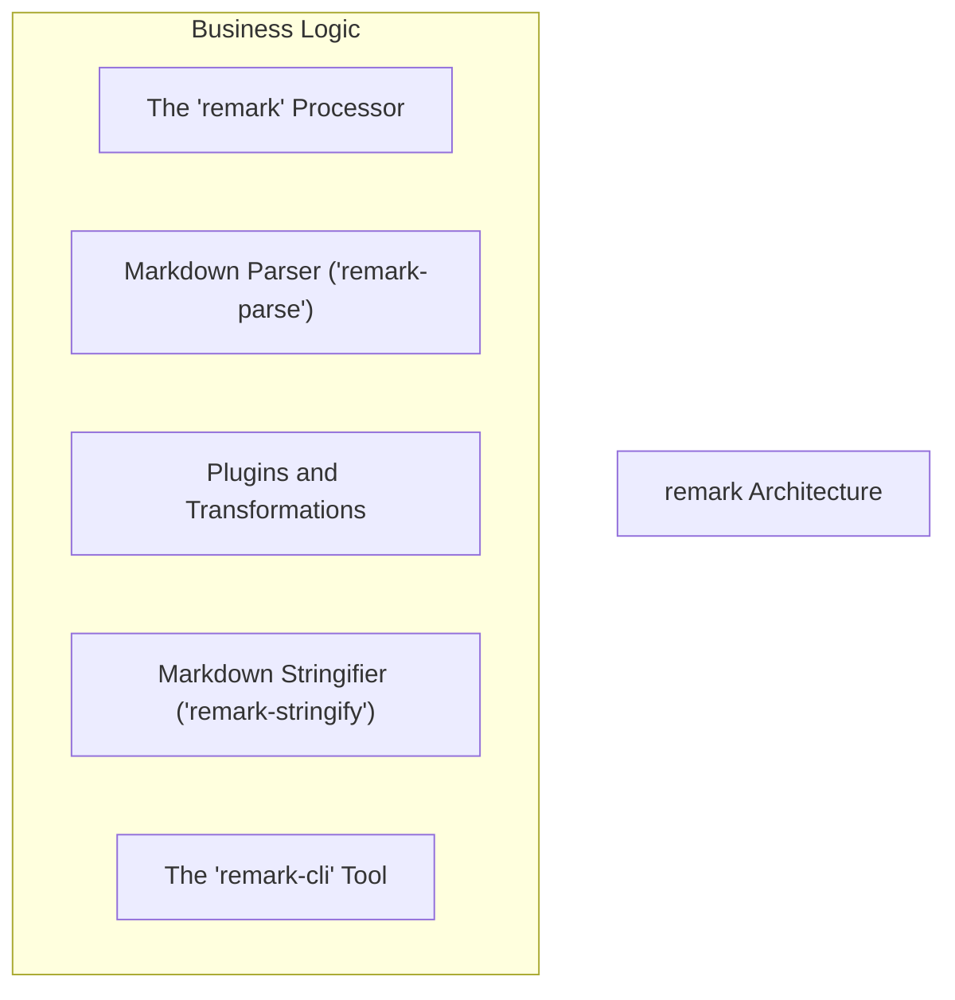
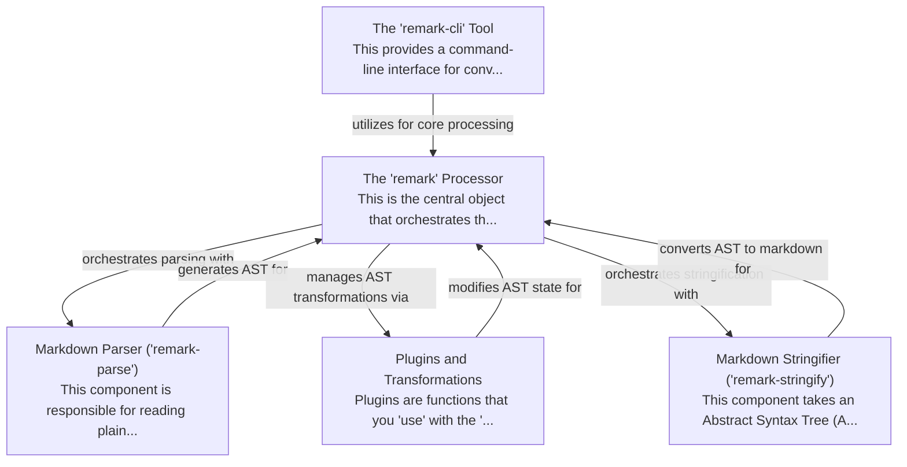

# remark Tutorial

Welcome to the comprehensive tutorial for remark. This tutorial is automatically generated from the codebase to help you understand the core concepts and implementation patterns.

## Project Overview

Remark is a powerful ecosystem centered around a 'remark' processor that orchestrates the entire markdown processing pipeline. It parses markdown into an Abstract Syntax Tree (AST), applies transformations via a chain of plugins, and then stringifies the AST back into markdown content. The 'remark-cli' tool provides a convenient command-line interface, leveraging the core processor for file-based operations.

## System Architecture

## Component Relationships

## Table of Contents

1. [Chapter 1: The 'remark' Processor](chapter_01.md) - Comprehensive documentation for The 'remark' Processor following structured methodology...
2. [Chapter 2: Markdown Parser ('remark-parse')](chapter_02.md) - Comprehensive documentation for Markdown Parser ('remark-parse') following structured methodology...
3. [Chapter 3: Plugins and Transformations](chapter_03.md) - Comprehensive documentation for Plugins and Transformations following structured methodology...
4. [Chapter 4: Markdown Stringifier ('remark-stringify')](chapter_04.md) - Comprehensive documentation for Markdown Stringifier ('remark-stringify') following structured metho...
5. [Chapter 5: The 'remark-cli' Tool](chapter_05.md) - Comprehensive documentation for The 'remark-cli' Tool following structured methodology...

## How to Use This Tutorial

1. **Start with Chapter 1** to understand the foundational concepts
2. **Follow the sequence** - each chapter builds upon previous concepts
3. **Practice with code examples** - every chapter includes practical examples
4. **Refer to diagrams** - use architecture diagrams for visual understanding
5. **Cross-reference concepts** - chapters link to related topics

## Tutorial Features

- **Progressive Learning**: Concepts are introduced in logical order
- **Code Examples**: Every chapter includes practical, executable code
- **Visual Diagrams**: Mermaid diagrams illustrate complex relationships
- **Cross-References**: Easy navigation between related concepts
- **Beginner-Friendly**: Written for newcomers to the codebase

## Contributing

This tutorial is auto-generated from the codebase. To improve it:
1. Update the source code documentation
2. Add more detailed comments to key functions
3. Regenerate the tutorial using the documentation system

---

*Generated using AI-powered codebase analysis*
