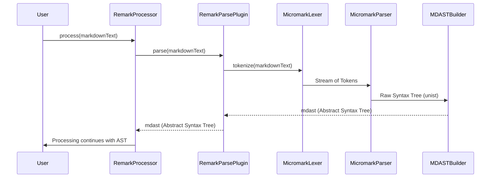

# Chapter 2: Markdown Parser

Welcome back! In the [previous chapter on the Abstract Syntax Tree (AST)](chapter_01.md), we explored how a Markdown document can be represented as a structured, hierarchical data model. You learned that an AST is essentially the backbone upon which all transformations and manipulations in remark occur. But how do we get from raw Markdown text—just a string of characters—to this sophisticated AST? This is precisely the job of the **Markdown Parser**.

---

### 1. Problem & Motivation

Imagine you have a Markdown document, perhaps a blog post or a README file. If you want to automatically find all headings and list them, or change all links to open in a new tab, or even validate that all code blocks have a language specified, how would you approach it? Trying to do this with regular expressions or simple string manipulation on the raw text is incredibly complex, error-prone, and often impossible to make robust. Markdown, despite its simplicity for writing, has nuanced grammar rules that make plain text processing a nightmare.

This is the problem the Markdown Parser solves. Raw Markdown text lacks inherent structure for programmatic access. To truly *understand* the Markdown and enable powerful operations like those mentioned, we need to convert it into a data structure that explicitly represents its components (paragraphs, headings, lists, links, code blocks, etc.) and their relationships.

In the `remark` project, the Markdown Parser is a foundational component because it provides the initial transformation that unlocks all subsequent functionality. It takes the unstructured chaos of raw text and brings order to it, making the document machine-readable and manipulable. For instance, if you want to enforce a style guide on your Markdown documents, or migrate them to a new format, the parser is the essential first step that makes such tasks feasible.

---

### 2. Core Concept Explanation

At its heart, **parsing** is the process of taking an input in one form (our raw Markdown text) and transforming it into another, more structured form (our AST). Think of it like a translator: it reads a sentence in one language and reconstructs its meaning in another, maintaining the original intent and structure.

The Markdown Parser in `remark` specifically performs two main stages:

1.  **Lexical Analysis (Tokenization)**: First, the raw Markdown text is scanned and broken down into a stream of fundamental building blocks called **tokens**. Each token represents a distinct, meaningful unit of the Markdown syntax. For example, a `#` character at the beginning of a line might become a `heading_marker` token, a word like "Hello" becomes a `text` token, and `[link]` becomes a `link_text` token. This is similar to how a human reads, recognizing individual words and punctuation marks before understanding the full sentence.

2.  **Syntactic Analysis (Parsing)**: Once we have a stream of tokens, the parser uses a set of grammatical rules (the Markdown specification, e.g., CommonMark) to determine how these tokens relate to each other and to build the hierarchical AST. It checks if the sequence of tokens forms valid Markdown constructs. For instance, if it sees a `heading_marker` followed by `text` and then a newline, it understands that this forms a `heading` node in the AST. This stage essentially constructs the "sentence diagram" (our AST) from the "words" (tokens).

The output of this entire parsing process is a **tree-like data structure** where each **node** corresponds to a specific Markdown element, and the relationships between nodes reflect the nesting and order of elements in the original document. This AST is then ready for manipulation by `remark` plugins.

---

### 3. Practical Usage Examples

Let's see how `remark` uses its parser to transform a simple Markdown string into an AST. While `remark` itself is a processor orchestrating parsing, plugins, and stringification, the `remark-parse` package is the underlying engine for parsing.

Here's a basic example using the `remark` package to get the AST:

```javascript
import { remark } from 'remark';

const markdownText = `# Hello, World!\n\nThis is a *paragraph*.`;

async function parseMarkdown(text) {
  const file = await remark().parse(text); // The .parse() method uses the internal parser
  return file;
}

parseMarkdown(markdownText).then(ast => {
  console.log(JSON.stringify(ast, null, 2));
});
```
This script initializes `remark`, passes our `markdownText` to its `.parse()` method, and then prints the resulting AST to the console. The `remark().parse()` method internally leverages the Markdown Parser component to perform the transformation.

The expected (simplified) output will look something like this, representing the Markdown structure:

```json
{
  "type": "root",
  "children": [
    {
      "type": "heading",
      "depth": 1,
      "children": [
        { "type": "text", "value": "Hello, World!" }
      ]
    },
    {
      "type": "paragraph",
      "children": [
        { "type": "text", "value": "This is a " },
        {
          "type": "emphasis",
          "children": [
            { "type": "text", "value": "paragraph" }
          ]
        },
        { "type": "text", "value": "." }
      ]
    }
  ],
  // ... other properties like data, position
}
```
As you can see, the raw text has been converted into a nested JavaScript object (the AST). We now have distinct `heading` and `paragraph` nodes, and even an `emphasis` node for the italic text. This structured representation makes it trivial to traverse the document, find specific elements, and modify them programmatically.

---

### 4. Internal Implementation Walkthrough

The `remark` project uses `micromark` as its underlying, spec-compliant Markdown parser. `remark-parse` is the plugin that integrates `micromark`'s output with `remark`'s AST format (mdast).

Here's a high-level sequence of how the Markdown Parser works:



1.  **Markdown Text Input**: The process begins when raw Markdown text is fed into `remark` (e.g., via `remark().parse(text)` or `remark().process(text)`).
2.  **Delegation to `remark-parse`**: The `remark` processor delegates the parsing task to the `remark-parse` plugin.
3.  **Lexical Analysis by `micromark`**: `remark-parse` hands the Markdown text to `micromark`. `micromark` first performs lexical analysis, breaking the input string into a stream of tokens. For example, `*bold*` might yield tokens like `star`, `text_content`, `star`.
4.  **Syntactic Analysis by `micromark`**: These tokens are then fed into `micromark`'s parser, which applies Markdown grammar rules (e.g., CommonMark spec) to build a low-level, concrete syntax tree (CST), often referred to as a "unist" tree, which is a generic tree format for ASTs.
5.  **Conversion to `mdast`**: The `remark-parse` plugin then takes this `unist` tree from `micromark` and transforms it into an `mdast` (Markdown Abstract Syntax Tree) compliant structure. `mdast` defines the specific types of nodes (e.g., `heading`, `paragraph`, `link`, `list`) and their properties that `remark` and its plugins use. This conversion ensures consistency across the `remark` ecosystem.
6.  **AST Output**: The final `mdast` is returned, representing the parsed Markdown document as a structured tree of nodes, ready for further processing.

This internal workflow ensures that Markdown parsing is robust, spec-compliant, and produces a standardized AST that can be universally understood and manipulated by `remark`'s plugin ecosystem.

---

### 5. System Integration

The Markdown Parser is the crucial entry point for any Markdown document into the `remark` processing pipeline. It's the first step in the `remark` processor's journey to transform, analyze, or generate Markdown.

Here's how it fits into the broader `remark` ecosystem:

```mermaid
graph LR
    A[Raw Markdown Text] --> B(Markdown Parser)
    B --> C[Abstract Syntax Tree (AST)]
    C --> D(Remark Plugins)
    D --> E[Transformed AST]
    E --> F(Markdown Stringifier)
    F --> G[Processed Markdown Text]

    subgraph Remark Processor
        B --- D
        D --- F
    end
```

1.  **Input**: The `Remark Processor` receives raw Markdown text.
2.  **Parsing**: It passes this text to the **Markdown Parser** (specifically, the `remark-parse` plugin).
3.  **AST Generation**: The parser converts the text into an `mdast` [Abstract Syntax Tree (AST)](chapter_01.md). This AST becomes the canonical representation of the document for the rest of the processing.
4.  **Plugin Application**: The `Remark Processor` then feeds this AST to a series of `Remark Plugins` (which we'll cover in [Chapter 5: Remark Plugins](chapter_05.md)). These plugins read, modify, or analyze the AST.
5.  **Stringification**: After all plugins have run, the modified AST is passed to the [Markdown Stringifier](chapter_03.md), which converts the AST back into a Markdown text string.

This tightly integrated flow ensures that all operations on the Markdown document happen on a predictable, structured AST, making transformations safe and efficient.

---

### 6. Best Practices & Tips

*   **Specify Standards**: While `remark-parse` defaults to CommonMark, you can configure it for other dialects, such as GitHub Flavored Markdown (GFM), by using specific plugins like `remark-gfm`. Always be explicit about which Markdown standard you expect your parser to adhere to, especially in team environments.

    ```javascript
    import { remark } from 'remark';
    import remarkGfm from 'remark-gfm';

    const gfmMarkdown = `
    - [x] Task list item
    - [ ] Another item
    `;

    async function parseGfm() {
      const file = await remark().use(remarkGfm).parse(gfmMarkdown);
      console.log(JSON.stringify(file, null, 2));
    }

    parseGfm();
    ```
    This example shows how to enable GFM extensions during parsing, allowing `remark` to correctly interpret features like task lists.

*   **Error Handling**: Malformed Markdown can lead to unexpected AST structures. While `remark` is generally resilient, if you are parsing user-generated content, consider adding validation steps *after* parsing to ensure the AST meets your expectations. The parser itself generally won't throw errors for syntax issues but will produce an AST reflecting the best interpretation.
*   **Performance**: For very large Markdown documents, parsing can be computationally intensive. If performance is critical, consider parsing once and storing the AST, rather than reparsing repeatedly.
*   **AST Exploration**: Familiarize yourself with the `mdast` specification. Knowing the types of nodes and their properties will greatly help you in understanding the parser's output and in writing effective plugins.

---

### 7. Chapter Conclusion

In this chapter, we've taken a deep dive into the **Markdown Parser**, understanding its critical role in `remark`. We learned that it's the fundamental component responsible for transforming raw, unstructured Markdown text into a structured, programmatic **Abstract Syntax Tree (AST)**. This transformation, achieved through lexical and syntactic analysis, unlocks the ability to manipulate, analyze, and transform Markdown documents programmatically.

You saw practical examples of how `remark` leverages its parser to generate an AST and gained insight into the internal workings involving `micromark` and `mdast` conversion. We also discussed how the parser seamlessly integrates into the broader `remark` processing pipeline, serving as the essential first step before plugins can work their magic.

With a solid AST in hand, the next logical step is to turn that structured data back into human-readable Markdown. This is where the **Markdown Stringifier** comes into play. Join us in the next chapter as we explore how `remark` converts an AST back into a Markdown string, completing the round trip!

Continue to the next chapter: [Markdown Stringifier](chapter_03.md)