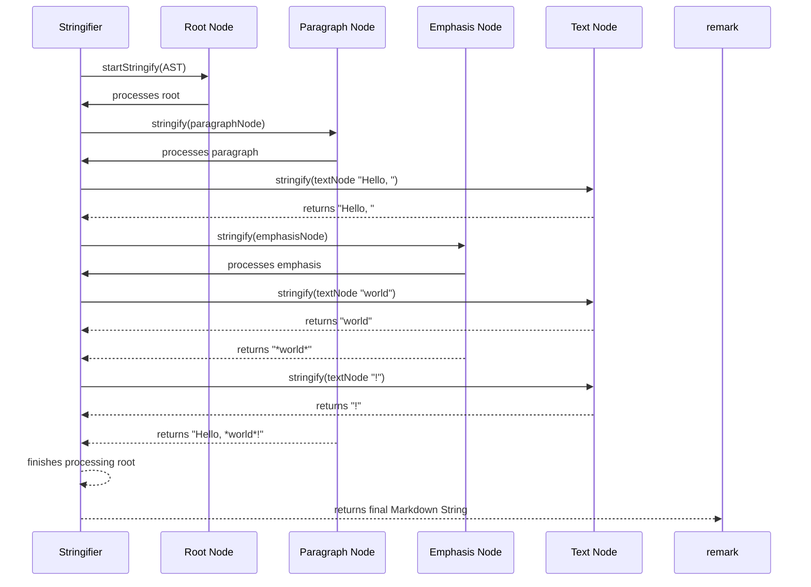

# Chapter 3: Markdown Stringifier

Welcome back to our journey through `remark`'s internals! In the previous chapter, we explored the [Markdown Parser](chapter_02.md), understanding how it transforms raw Markdown text into a structured Abstract Syntax Tree (AST). This AST is the programmable heart of `remark`, allowing us to manipulate documents in powerful ways. Now, we turn our attention to the *other side of the coin*: converting that modified AST back into human-readable Markdown.

---

### Problem & Motivation

Imagine you've used `remark` to process a Markdown document. Perhaps you've automatically generated a table of contents, linked cross-references, or applied linting rules that suggest corrections. All these operations happen on the AST. Once the AST has been transformed, the original problem arises: how do you save these changes back to a Markdown file? You can't just save the AST directly; that's an internal data structure, not a Markdown document.

This is precisely the problem the Markdown Stringifier solves. Without it, `remark` would be a powerful analysis and transformation tool, but incapable of producing updated Markdown output. It would be like a word processor that can edit a document but never save the changes in a readable format. The Stringifier is crucial for completing the round-trip, allowing `remark` to act as a full-fledged Markdown *processor* rather than just a parser or an AST manipulator. A concrete use case involves a user running `remark` on their documentation to enforce a specific style guide: the linter might suggest changes, or a plugin might automatically reformat headings. The Stringifier is then responsible for outputting the *corrected* or *reformatted* Markdown text.

---

### Core Concept Explanation

The Markdown Stringifier is the component responsible for *serializing* an Abstract Syntax Tree (AST) back into a Markdown text string. It performs the inverse operation of parsing. Where the parser takes text and builds a tree, the stringifier takes a tree and builds text. This process is also often referred to as "unparsing" or "compiling" the AST.

At its core, stringification involves traversing the AST, node by node, and converting each `Node` and its children into their corresponding Markdown syntax. For instance, a `heading` node with a `depth` of 1 would be converted into Markdown starting with `#`, a `paragraph` node into a block of text, and a `link` node into `[text](url)`. The Stringifier must also consider various Markdown conventions and options, such as line endings, indentation for lists, and how to represent special characters.

In the context of `remark`, the Stringifier (`remark-stringify` specifically) adheres to the `unist` (Universal Syntax Tree) specification for ASTs, ensuring it can handle any `unist` compatible Markdown AST. This means it systematically walks through the tree, applying rules for each node type to construct the final Markdown string. This consistent approach is what makes `remark` so robust and extensible, as plugins can modify the AST and the stringifier will (usually) correctly re-render the modified structure.

---

### Practical Usage Examples

Let's illustrate how you would use the Markdown Stringifier, typically through the `remark` processor itself.

First, imagine we have a simple AST, perhaps generated from "Hello, *world*!".

```javascript
const simpleAst = {
  type: 'root',
  children: [
    {
      type: 'paragraph',
      children: [
        {type: 'text', value: 'Hello, '},
        {
          type: 'emphasis',
          children: [{type: 'text', value: 'world'}]
        },
        {type: 'text', value: '!'}
      ]
    }
  ]
};
```
This AST represents a paragraph containing plain text, emphasized text, and more plain text.

Now, let's use the `remark` processor to stringify this AST back into Markdown.

```javascript
import { remark } from 'remark';

// Create a remark processor instance
const processor = remark();

// Stringify the AST
const markdownOutput = processor.stringify(simpleAst);

console.log(markdownOutput);
```
**Expected Output:**
```markdown
Hello, *world*!
```
This example shows `processor.stringify` taking the AST and returning the Markdown string.

The real power comes when you combine parsing, transformation (via plugins), and stringifying:

```javascript
import { remark } from 'remark';
import remarkFrontmatter from 'remark-frontmatter';

const markdownInput = '# My Doc\n\nHello.\n';

async function processAndStringify() {
  const file = await remark()
    .use(remarkFrontmatter, ['yaml']) // Add YAML frontmatter support
    .process(markdownInput);

  // The 'file' object now contains the processed markdown string
  console.log(String(file));
}

processAndStringify();
```
**Expected Output (remark-frontmatter doesn't add frontmatter by default, but parses it if present):**
```markdown
# My Doc

Hello.
```
This shows that when you call `.process()` on the `remark` processor, the final step automatically uses the Stringifier to convert the (potentially modified) AST back into a string, which is then available on the `file` object.

---

### Internal Implementation Walkthrough

The internal workings of the Markdown Stringifier revolve around systematically traversing the AST and mapping each node type to its corresponding Markdown representation. This process is typically recursive.

1.  **Initialization**: The stringifier starts at the `root` node of the AST. It might set up an internal state to keep track of indentation levels, list types, and other formatting preferences.
2.  **Node Dispatch**: For each node encountered during traversal, the stringifier checks its `type` property (e.g., `paragraph`, `heading`, `list`, `text`, `strong`).
3.  **Type-Specific Handlers**: Based on the node type, a specific "handler" function is invoked.
    *   For a `heading` node, the handler determines the heading level (`depth`) and prefixes the children's stringified content with `## ` accordingly.
    *   For a `paragraph` node, it recursively stringifies its children and then adds line breaks or spaces as needed.
    *   For `emphasis` or `strong` nodes, it wraps the children's stringified content with `*` or `**`.
    *   `text` nodes are the base case; their `value` is simply returned.
4.  **Children Recursion**: If a node has `children` (like a `paragraph` or `list`), the stringifier recursively calls itself on each child node. The results from the children are then concatenated, potentially with separators (e.g., newlines between list items).
5.  **Output Assembly**: As each handler returns its Markdown snippet, these snippets are assembled in order to form the final Markdown string.

Here's a simplified conceptual flow using a mermaid diagram:



Internally, `remark-stringify` builds on top of `unist-util-stringify` principles. It defines a set of rules and orderings for how different `unist` nodes should be rendered. This modularity allows for customization and ensures that the stringification process is robust and follows Markdown specifications.

---

### System Integration

The Markdown Stringifier (`remark-stringify`) is a core component seamlessly integrated into the `remark` processor's pipeline. It acts as the final stage of the transformation process, taking the AST (which might have been modified by various plugins) and converting it into the output Markdown string.

The typical data flow within the `remark` ecosystem is:

1.  **Raw Markdown**: A user provides a Markdown string.
2.  **[Markdown Parser](chapter_02.md)**: The parser consumes the raw Markdown and generates an Abstract Syntax Tree (AST).
3.  **[Remark Plugins](chapter_05.md)**: A series of plugins operate on this AST, modifying its structure, content, or metadata based on their specific functionalities (e.g., adding nodes, removing nodes, changing node properties).
4.  **Markdown Stringifier**: After all plugins have finished their work, the Stringifier takes the *final, modified AST* and traverses it to produce the output Markdown string.
5.  **Output Markdown**: The resulting Markdown string is then provided back to the user or saved to a file.

This integration is orchestrated by the [Remark Processor](chapter_04.md), which sets up the parser, applies the plugins, and then invokes the stringifier. The stringifier is essentially a "plugin" in its own right in the processor chain, but a mandatory final one that determines the output format.

---

### Best Practices & Tips

1.  **Maintain Valid ASTs**: The Stringifier relies on a well-formed AST. If your plugins manipulate the AST in a way that creates invalid `unist` nodes or structures (e.g., a `paragraph` node directly under a `list-item` without a `list` parent), the stringifier might produce unexpected or malformed Markdown. Always validate your AST manipulations if you're writing custom plugins.
2.  **Configuration Options**: `remark-stringify` often comes with configuration options to control the output. These might include preferences for:
    *   `bullet`: The character used for unordered list items (`*`, `-`, `+`).
    *   `fences`: Whether to use ```` ``` ```` or `~~~` for code blocks.
    *   `commonmark`: Adherence to the CommonMark spec for certain stringification behaviors.
    *   `setext`: Whether to use Setext (underline) headings or ATX (hash) headings.
    Explore these options to ensure your output Markdown matches your desired style guide.
3.  **Consistent Styling**: When writing plugins that add new nodes, ensure they produce ASTs that the stringifier can render consistently. If you add a custom `type` of node, you might need to extend the stringifier's capabilities or ensure it's transformed into standard Markdown nodes before stringification.
4.  **Performance for Large Documents**: Stringifying very large ASTs can be computationally intensive due to the recursive traversal. For extremely large documents, consider if all parts need to be re-stringified or if smaller, targeted stringification could be performed.
5.  **Preview and Test**: Always preview the output of the stringifier, especially after significant AST transformations. Automated tests that compare expected Markdown output against actual stringified output are invaluable for ensuring correctness.

---

### Chapter Conclusion

The Markdown Stringifier is the essential counterpart to the Markdown Parser, completing `remark`'s capability to programmatically process Markdown documents. It transforms the highly structured Abstract Syntax Tree back into a human-readable and standard-compliant Markdown string, enabling `remark` to apply transformations, linting, and formatting, then output the results. Understanding its role, from basic serialization to its integration within the larger `remark` processor, is key to fully leveraging `remark` for any Markdown-related workflow.

In our next chapter, we will bring together the Parser and Stringifier with the powerful Plugin ecosystem, to explore the orchestrator of all these components: the [Remark Processor](chapter_04.md).