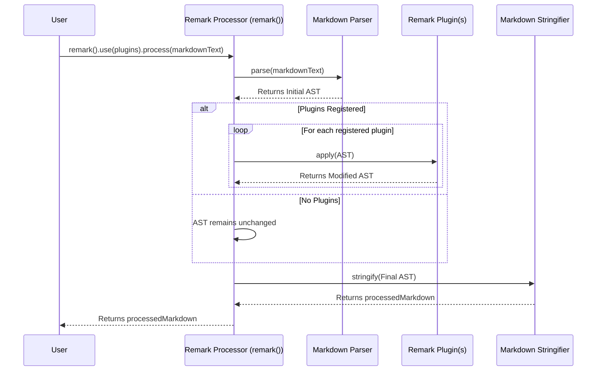
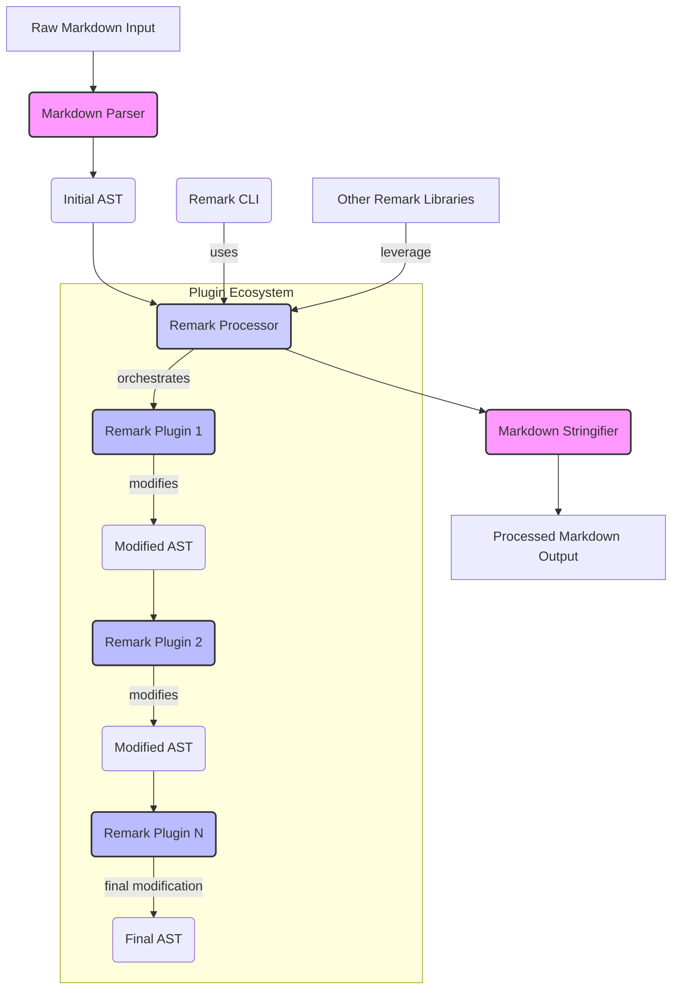

# Chapter 4: Remark Processor

In the previous chapters, we delved into the fundamental building blocks of the `remark` project: the [Abstract Syntax Tree (AST)](chapter_01.md) as the document's structured representation, the [Markdown Parser](chapter_02.md) for transforming raw Markdown into an AST, and the [Markdown Stringifier](chapter_03.md) for converting an AST back into a Markdown string. While these components are powerful individually, manually orchestrating them for complex transformations can be cumbersome and inefficient. This is precisely where the **Remark Processor** comes into play.

---

### Problem & Motivation

Imagine you're building a tool that needs to perform multiple operations on a Markdown document: first, ensure all headings are consistent; second, automatically generate a table of contents; and finally, format specific code blocks. Without a central orchestrator, you'd have to manually parse the Markdown, pass the AST through a series of custom functions, and then stringify the result back. This approach is prone to errors, difficult to maintain, and lacks a standardized way to chain transformations.

The core problem is the need for a unified, extensible, and robust pipeline to handle the entire Markdown processing lifecycle. We need a component that can take raw Markdown, apply a sequence of transformations, and then produce the modified Markdown, all while abstracting away the underlying parsing and stringification details. This is crucial for enabling a rich plugin ecosystem and for providing a streamlined developer experience within the `remark` project.

Our motivating use case for this chapter will be to process a simple Markdown document, detect its main heading, and then (conceptually) add a small footer to it using the Remark Processor. This demonstrates its role as the central coordinator.

### Core Concept Explanation

The **Remark Processor** is the central *engine* or *conductor* of the `remark` ecosystem. It's not a parser, nor a stringifier, nor a plugin itself, but rather the mechanism that *orchestrates* their interaction. Think of it as an assembly line manager: it receives raw materials (Markdown text), directs them to different workstations (plugins) for modification, and finally ensures the finished product (processed Markdown) is correctly assembled and shipped.

At its heart, the Remark Processor provides a high-level API for a complete Markdown transformation workflow. It encapsulates the process of:
1.  **Parsing** the input Markdown text into an AST using the configured [Markdown Parser](chapter_02.md).
2.  **Processing** the AST by applying a series of user-defined or third-party [Remark Plugins](chapter_05.md). Each plugin can read, modify, or even add nodes to the AST.
3.  **Stringifying** the (potentially modified) AST back into a Markdown text string using the configured [Markdown Stringifier](chapter_03.md).

This abstraction makes `remark` incredibly powerful and flexible, allowing users to define complex processing pipelines with ease, without needing to deeply understand the AST manipulation at every step.

---

### Practical Usage Examples

Let's see the Remark Processor in action, starting with a basic scenario and then incorporating a simple transformation.

**1. Basic Processing (Parse and Stringify)**

The simplest use of the Remark Processor is to merely parse a Markdown string and then stringify it back, effectively doing nothing to the content but ensuring it's well-formed.

```javascript
import { remark } from 'remark';

const markdownInput = '# Hello World\n\nThis is a paragraph.';

// Create a processor instance and process the markdown
const processedMarkdown = remark().processSync(markdownInput).toString();

console.log(processedMarkdown);
```

**Expected Output:**
```
# Hello World

This is a paragraph.
```
*Explanation:* We import the `remark` function, which creates a new processor instance. `.processSync()` takes the Markdown string, internally converts it to an AST, does nothing to it (since no plugins are configured), and then converts it back to Markdown. `.toString()` finally extracts the resulting string.

**2. Adding a Simple Transformation (Motivating Use Case)**

Now, let's address our motivating use case: adding a small footer to the document. For this, we'll write a simple "plugin" (a function that modifies the AST) and then tell the Remark Processor to `use` it.

First, let's define a minimal "footer" plugin:

```javascript
// footerPlugin.js
import { paragraph, text } from 'remark-builder'; // Simplified AST node creation

// This plugin adds a simple footer paragraph at the end of the document
function myFooterPlugin() {
  return (tree) => {
    // We can add a new paragraph node to the root of the tree
    // In a real plugin, you might check if a footer already exists, etc.
    tree.children.push(paragraph([text('---')]));
    tree.children.push(paragraph([text('Processed by Remark.')]));
  };
}

export default myFooterPlugin;
```

Now, let's use this plugin with the Remark Processor:

```javascript
// process_with_footer.js
import { remark } from 'remark';
import myFooterPlugin from './footerPlugin.js'; // Assuming footerPlugin.js is in the same directory

const markdownInput = '# My Document\n\nSome content here.';

// Create a processor instance, use our custom plugin, and then process
const processedMarkdown = remark()
  .use(myFooterPlugin) // Tell the processor to apply our plugin
  .processSync(markdownInput)
  .toString();

console.log(processedMarkdown);
```

**Expected Output:**
```
# My Document

Some content here.

---

Processed by Remark.
```
*Explanation:* We import our `myFooterPlugin` and use the `.use()` method on the `remark` instance to register it. When `processSync()` is called, the processor first parses the Markdown, then applies `myFooterPlugin` to the AST (which adds the footer paragraphs), and finally stringifies the modified AST back into Markdown.

---

### Internal Implementation Walkthrough

The Remark Processor, under the hood, provides a highly modular and extensible pipeline. While `remark` itself is built on top of the `unified` ecosystem, the conceptual flow is as follows:



1.  **Instantiation (`remark()`):** When you call `remark()`, an instance of the processor is created. This instance holds its own configuration, including which plugins are registered and any options for the parser or stringifier.
2.  **Plugin Registration (`.use()`):** The `.use(plugin, options)` method registers a plugin with the processor instance. Plugins are essentially functions that receive the AST (or other input) and can modify it. The processor maintains an ordered list of these plugins.
3.  **Processing (`.process()` / `.processSync()`):**
    *   **Parsing Phase:** The processor takes the input Markdown string and internally invokes the [Markdown Parser](chapter_02.md) (which `remark` provides by default, or you can configure a custom one). This converts the Markdown into an initial [Abstract Syntax Tree (AST)](chapter_01.md).
    *   **Transformation Phase:** The processor then iterates through the registered plugins *in the order they were `.use()`d*. For each plugin, it passes the current state of the AST. Each plugin performs its specific transformation, potentially modifying the AST in place or returning a new AST. This chain of transformations is where the bulk of `remark`'s power lies.
    *   **Stringification Phase:** Once all plugins have been applied, the processor takes the final, potentially modified AST and passes it to the [Markdown Stringifier](chapter_03.md) (again, `remark` provides a default). This converts the AST back into a Markdown string.
4.  **Result:** The processor then returns a `VFile` object containing the processed Markdown string and any messages/warnings generated during the process.

This modular design ensures that each component has a single responsibility, making the system easy to understand, test, and extend.

---

### System Integration

The Remark Processor is the glue that binds together many components of the `remark` project.



*   **[Abstract Syntax Tree (AST)](chapter_01.md):** The AST is the central data structure that the Processor operates on. The Parser generates it, plugins transform it, and the Stringifier consumes it.
*   **[Markdown Parser](chapter_02.md):** The Processor explicitly utilizes the Markdown Parser to convert the initial Markdown string into an AST.
*   **[Markdown Stringifier](chapter_03.md):** After all transformations, the Processor calls upon the Markdown Stringifier to convert the final AST back into a Markdown text string.
*   **[Remark Plugins](chapter_05.md):** This is where the Processor truly shines. It provides the execution context for plugins, allowing them to hook into the transformation pipeline and extend `remark`'s functionality. Without the Processor, plugins would have no standardized way to interact with the AST.
*   **[Remark CLI](chapter_06.md):** The command-line interface for `remark` is essentially a wrapper around the Remark Processor. It parses command-line arguments, configures a processor instance with specified plugins and options, and then invokes `process()` on the input files.

The Remark Processor, therefore, acts as the central hub, providing a consistent and powerful interface for manipulating Markdown documents programmatically.

---

### Best Practices & Tips

1.  **Chain Plugins Effectively:** The order in which you `.use()` plugins matters, as each plugin receives the AST as modified by the previous ones. Design your plugins to work cooperatively in a pipeline.
2.  **Focus Plugins on Single Concerns:** A well-designed plugin typically does one thing well. Avoid creating monolithic plugins that try to do too much; instead, compose multiple smaller, focused plugins.
3.  **Use `process` for Asynchronous Operations:** While `processSync` is convenient for quick examples, many real-world plugins (especially those interacting with filesystems or external APIs) are asynchronous. Use `remark().process(markdownInput).then(...)` for robust handling of async plugins.
4.  **Handle Errors Gracefully:** Plugins can throw errors, and the processor itself can encounter parsing/stringifying issues. Wrap your processing logic in `try...catch` blocks or use the `.catch()` method with asynchronous processing.
5.  **Performance Considerations:** For very large Markdown documents, repeated AST traversals by many plugins can impact performance. Consider optimizing plugin logic and, if possible, combining traversals.
6.  **Version Control Plugin Sets:** For projects, explicitly list the plugins and their versions you're using. This ensures consistent processing behavior across environments.

---

### Chapter Conclusion

The Remark Processor stands as the central nervous system of the `remark` project, seamlessly integrating parsing, AST manipulation via plugins, and stringification into a cohesive and powerful workflow. It abstracts away the complexities of manual AST handling, providing a clean and extensible API for transforming Markdown documents. By understanding its role, you can effectively leverage `remark` to build sophisticated document processing tools.

Having explored the engine that orchestrates transformations, we are now perfectly positioned to dive deeper into the true power of `remark`: its highly extensible plugin system. In the next chapter, we will explore the nuances of creating and utilizing [Remark Plugins](chapter_05.md) to customize and extend `remark`'s capabilities to an almost limitless degree.