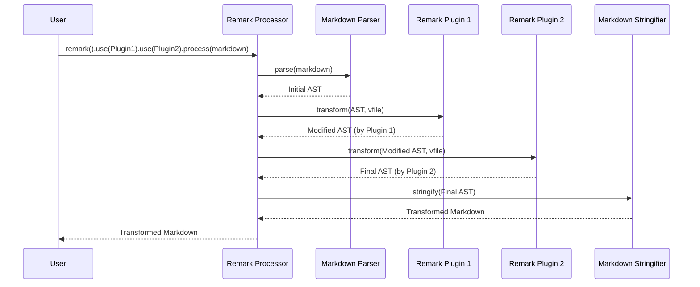

# Chapter 5: Remark Plugins

Having explored the core functionalities of the [Remark Processor](chapter_04.md), we understand its role in orchestrating the parsing, transformation, and stringification of Markdown documents. However, the true power and flexibility of remark lie not just in its foundational components, but in its extensible nature through a rich ecosystem of *plugins*. These plugins empower users to customize remark's behavior, allowing for transformations far beyond standard Markdown processing.

---

### Problem & Motivation

Imagine a scenario where the standard Markdown syntax isn't quite enough for your needs. Perhaps you want to support custom syntax for embedding interactive components, lint your Markdown for stylistic consistency, or automatically generate a table of contents. The core [Remark Processor](chapter_04.md) provides a solid foundation, but directly modifying its internal logic for every unique requirement would be impractical, leading to a rigid and hard-to-maintain system.

This is the problem Remark Plugins solve. They provide a standardized and modular way to extend remark's capabilities without altering its core. Instead of baking every possible feature into the main processor, remark offers hooks for external functions—plugins—to interact with the document's structure. For instance, you might want to automatically replace specific text patterns in your Markdown with dynamic content, or ensure all code blocks adhere to a certain style. Without plugins, each such requirement would necessitate custom parsing or post-processing scripts, making your workflow cumbersome.

A concrete use case that highlights the importance of plugins is *automatically adding a "Generated by Remark" footer to every Markdown document*. While simple, this task requires modifying the document's structure, which is precisely what plugins are designed to do.

---

### Core Concept Explanation

At its heart, a **Remark Plugin** is a function that extends the functionality of the [Remark Processor](chapter_04.md) by operating directly on the [Abstract Syntax Tree (AST)](chapter_01.md). When the processor converts Markdown into an AST, plugins get a chance to inspect, modify, or analyze this tree before it's converted back into Markdown.

Think of plugins as specialized tools that you can attach to an assembly line. The [Remark Processor](chapter_04.md) is the assembly line itself, handling the raw materials (Markdown text) and the final product (modified Markdown text). After the raw materials are shaped into a basic component (the AST by the [Markdown Parser](chapter_02.md)), plugins step in to add, remove, or modify parts of that component. Each plugin performs a specific task, and you can chain multiple plugins together, with the output of one becoming the input for the next.

Plugins typically return a *transformer* function. This transformer function is called by the processor with the current [AST](chapter_01.md) and a `vfile` (a virtual file object that carries information like path, data, and messages). The transformer function then performs its logic, which might involve traversing the AST, looking for specific node types, and making changes. This allows for powerful manipulations, from enforcing content quality rules to injecting new content or transforming existing elements based on custom logic.

---

### Practical Usage Examples

Let's explore how to use and write Remark Plugins, focusing on our motivating use case: adding a "Generated by Remark" paragraph to the end of a document.

#### 1. Using an Existing Plugin

First, let's see how easy it is to integrate a widely used plugin, `remark-gfm`, which enables GitHub Flavored Markdown (like task lists, strikethrough, and tables).

```javascript
import { remark } from 'remark';
import remarkGfm from 'remark-gfm'; // Import the GFM plugin

async function processWithGfm() {
  const markdownInput = `- [ ] Task item\n~Strikethrough text~`;
  const result = await remark()
    .use(remarkGfm) // Use the GFM plugin
    .process(markdownInput);

  console.log(String(result));
}

processWithGfm();
```
This example shows how `remark().use(remarkGfm)` integrates the `remark-gfm` plugin into the processing pipeline. The output Markdown will correctly render the task list and strikethrough syntax because the plugin transformed the AST to understand these extensions.

#### 2. Writing a Simple Custom Plugin

Now, let's create a plugin to add a copyright notice to the end of every document.

First, define our custom plugin function. A plugin is a function that optionally takes options and returns a *transformer function*.

```javascript
// my-remark-footer-plugin.js
import { h } from 'hastscript'; // Helper for creating HTML nodes
import { visit } from 'unist-util-visit'; // Helper for visiting AST nodes

function remarkFooter(options) {
  const text = options.text || "Generated by Remark!";

  return function transformer(tree) {
    // Append a new paragraph node at the end of the AST
    // Nodes are added to the 'children' array of the root node
    tree.children.push({
      type: 'paragraph',
      children: [
        { type: 'text', value: text }
      ]
    });
  };
}

export default remarkFooter;
```
Here, `remarkFooter` is our plugin. It takes `options` (allowing customization of the footer text) and returns a `transformer` function. The `transformer` function receives the `tree` (the AST) and directly modifies it by pushing a new paragraph node to its children.

Next, we use this custom plugin with the `remark` processor:

```javascript
// process-with-footer.js
import { remark } from 'remark';
import remarkFooter from './my-remark-footer-plugin.js'; // Import our plugin

async function processDocumentWithFooter() {
  const markdownInput = `# My Document\n\nThis is some content.`;
  const result = await remark()
    .use(remarkFooter, { text: '© 2023 My Project. Generated by Remark!' }) // Use our custom plugin
    .process(markdownInput);

  console.log(String(result));
}

processDocumentWithFooter();
```
**Expected Output:**
```markdown
# My Document

This is some content.

© 2023 My Project. Generated by Remark!
```
This example clearly shows how our `remarkFooter` plugin injects a new paragraph into the document's AST, which is then stringified back into Markdown.

---

### Internal Implementation Walkthrough

The application of plugins is a central part of the [Remark Processor](chapter_04.md)'s workflow. When you invoke `remark().use(plugin, options)`, you are essentially registering that plugin with the processor. The actual transformation happens *after* the [Markdown Parser](chapter_02.md) has generated the initial [Abstract Syntax Tree (AST)](chapter_01.md) and *before* the [Markdown Stringifier](chapter_03.md) converts it back to text.

Here's a step-by-step breakdown of how the [Remark Processor](chapter_04.md) applies plugins:

1.  **Processor Initialization**: `remark()` creates a new `processor` instance, which is essentially an instance of the `unified` engine.
2.  **Plugin Registration**: When you call `.use(plugin, options)` on the processor, the `plugin` function is invoked with the provided `options`. This function typically returns a `transformer` function. This `transformer` function is then added to a list of transformers within the `processor`.
3.  **Parsing**: When `processor.process(markdownInput)` is called, the input Markdown string is first passed to the [Markdown Parser](chapter_02.md). The parser converts the raw text into an initial [Abstract Syntax Tree (AST)](chapter_01.md).
4.  **Transformation Pipeline**: The `processor` then iterates through its registered `transformer` functions. For each `transformer`:
    *   It's called with the current state of the [AST](chapter_01.md) and a `vfile` object.
    *   The `transformer` performs its logic (e.g., traversing the tree using `unist-util-visit`, adding nodes, removing nodes, modifying node properties).
    *   The modified [AST](chapter_01.md) is then passed to the next `transformer` in the pipeline.
5.  **Stringification**: Once all registered plugins have had a chance to transform the [AST](chapter_01.md), the final modified tree is passed to the [Markdown Stringifier](chapter_03.md). The stringifier converts this AST back into a Markdown string.

This sequential application of transformers allows for complex, multi-stage modifications to the document.


This diagram illustrates the pipeline: parsing creates the AST, then plugins modify it sequentially, and finally, the stringifier converts the modified AST back to Markdown. The `vfile` object (from the `vfile` library) is implicitly passed through, accumulating messages, data, and tracking the file's state.

---

### System Integration

Remark Plugins are tightly integrated with the [Remark Processor](chapter_04.md) and rely heavily on the [Abstract Syntax Tree (AST)](chapter_01.md) as their primary interface.

*   **Remark Processor**: The processor acts as the orchestrator. It's responsible for managing the plugin pipeline, ensuring each plugin is invoked with the correct AST, and passing the modified AST along. Plugins are registered *with* the processor using the `.use()` method, making them an integral part of its configuration.
*   **Abstract Syntax Tree (AST)**: The AST is the common language for all plugins. Every plugin receives an AST (or a sub-tree of it) and is expected to return a modified AST. This consistent data structure ensures interoperability between different plugins, allowing them to be chained together effectively. Plugins interact with AST nodes, their types, and properties. For example, a plugin might look for `heading` nodes to build a table of contents or `code` nodes to apply syntax highlighting.
*   **Markdown Parser** and **Markdown Stringifier**: These components operate at the beginning and end of the plugin pipeline, respectively. The parser creates the initial AST for plugins to transform, and the stringifier takes the final, plugin-modified AST to produce the output Markdown.

The data flow is clear: raw Markdown enters the [Remark Processor](chapter_04.md), is parsed into an [AST](chapter_01.md), then this AST flows through a series of Remark Plugins which transform it, and finally, the modified AST is passed to the [Markdown Stringifier](chapter_03.md) to generate the final output Markdown.

---

### Best Practices & Tips

When developing or using Remark Plugins, consider these best practices to ensure maintainability, performance, and robustness:

*   **Single Responsibility Principle**: Design plugins to do one thing well. A plugin that lint markdown *and* injects custom components *and* transforms images is harder to maintain and debug.
*   **Idempotency**: Aim for plugins that, when run multiple times with the same input, produce the same output. This makes debugging and testing easier.
*   **Options for Customization**: Expose options for your plugins so users can configure their behavior without modifying the plugin's source code.
*   **Use Utilities**: Leverage `unist` utilities like `unist-util-visit`, `unist-util-map`, `unist-util-remove`, etc., for robust and efficient AST traversal and manipulation. Avoid manual recursive traversals if a utility exists.
*   **Handle `vfile`**: Use the `vfile` object to add warnings, errors, or custom data. This is crucial for linting plugins and providing feedback to users.
    ```javascript
    // Example: Adding a warning to vfile
    function myLinterPlugin() {
      return function transformer(tree, file) {
        visit(tree, 'paragraph', (node) => {
          if (node.children.length === 0) {
            file.message('Empty paragraph found.', node);
          }
        });
      };
    }
    ```
*   **Performance Considerations**:
    *   Avoid unnecessary deep traversals. Target specific node types if possible.
    *   If a plugin only needs to run once, ensure it doesn't repeatedly process the same parts of the AST.
*   **Test Thoroughly**: Write unit tests for your plugins to ensure they handle various AST structures and edge cases correctly.

---

### Chapter Conclusion

Remark Plugins are the lifeblood of the remark ecosystem, providing unparalleled flexibility and power to transform Markdown documents programmatically. They offer a clean, modular way to extend remark's core functionality by interacting directly with the [Abstract Syntax Tree (AST)](chapter_01.md). By understanding how to leverage existing plugins and how to develop your own, you can tailor remark to virtually any Markdown processing need, from simple content injection to complex syntax transformations and linting.

Our journey through remark's architecture has covered the foundational elements and the extensible plugin system. Next, we will explore how remark is made accessible to end-users through its command-line interface. The [Remark CLI](chapter_06.md) acts as the bridge, allowing developers and users alike to harness the power of the [Remark Processor](chapter_04.md) and its plugins without writing custom JavaScript code for every task.

---
Next Chapter: [Remark CLI](chapter_06.md)