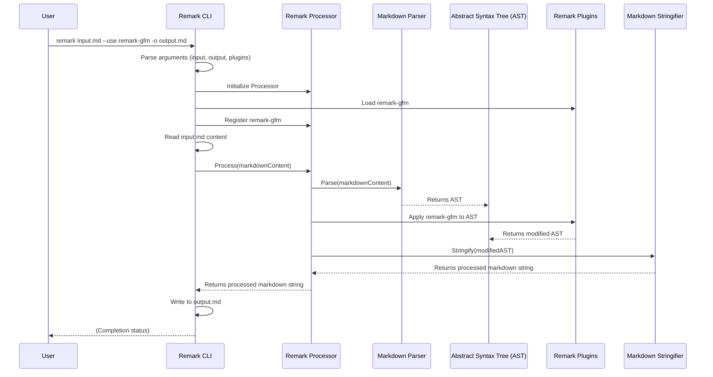

# Chapter 6: Remark CLI

Having explored the powerful capabilities of [Remark Plugins](chapter_05.md) to programmatically transform Markdown's Abstract Syntax Tree (AST), the natural question arises: how can a user leverage this immense power without diving into JavaScript code and setting up a development environment? This is where the **Remark CLI** steps in. It acts as the user's direct gateway to remark's core functionality, enabling efficient Markdown processing right from the terminal.

---

### Problem & Motivation

Imagine you're a content creator, a technical writer, or a developer working with a large codebase that contains numerous Markdown files. You need to perform consistent operations across these files—perhaps enforcing a specific Markdown style, automatically generating a table of contents, or converting specific syntax to another. While the [Remark Processor](chapter_04.md) and its [Remark Plugins](chapter_05.md) offer the underlying mechanisms for such transformations, writing a custom Node.js script for every task can be cumbersome and unnecessary for many users.

The problem the Remark CLI solves is providing an **accessible, script-free interface** to remark's powerful processing engine. It removes the barrier of entry for non-programmers or for developers who simply need a quick, command-line utility. Its importance lies in bridging the gap between remark's programmatic core and the practical, day-to-day needs of users who work directly with Markdown files.

For instance, a common use case might be to take an existing Markdown file, `article.md`, ensure all code blocks are properly highlighted, and save the result to `processed-article.md`—all with a single command, without writing any JavaScript.

---

### Core Concept Explanation

At its heart, the **Remark CLI** (Command Line Interface) is a wrapper around the [Remark Processor](chapter_04.md). It translates human-friendly terminal commands into programmatic instructions that the processor understands. Think of it as the control panel for a sophisticated machine. You don't need to understand the internal gears and circuits; you just push buttons and turn knobs to get the desired output.

When you type `remark` followed by arguments in your terminal, the CLI parses these arguments. It identifies input files, determines which [Remark Plugins](chapter_05.md) to load and apply, and decides where to send the processed output. It handles file I/O (reading from disk, writing to disk or standard output) and orchestrates the entire transformation pipeline using the core Remark components. This makes it an invaluable tool for automation scripts, build processes, and quick one-off tasks.

Key concepts for using the Remark CLI include:
*   **`remark` command**: The entry point for all operations.
*   **Input files**: The Markdown documents you want to process.
*   **Output redirection**: Sending the processed Markdown to a new file or standard output.
*   **Flags/Options**: Arguments (like `--use` for plugins) that modify the CLI's behavior.

---

### Practical Usage Examples

Let's illustrate how to use the Remark CLI to address our motivating use case: processing a Markdown file, potentially with a plugin, and saving the output.

First, let's create a simple Markdown file named `input.md`:

```markdown
# Hello Remark CLI

This is *some* text.

```
### Code example
```javascript
console.log('Hello');
```
```

#### Basic Processing to Standard Output

The simplest use case is to process a Markdown file and print the result to your terminal's standard output (stdout).

```bash
remark input.md
```

**Explanation**: This command tells `remark` to read `input.md`, process it (which by default involves parsing and then stringifying without any AST transformations), and display the resulting Markdown on your screen. If there were any minor formatting adjustments by remark's stringifier, you would see them here.

#### Saving Processed Output to a File

Often, you'll want to save the transformed Markdown to a new file. The `-o` or `--output` flag is used for this.

```bash
remark input.md -o output.md
```

**Explanation**: Here, `remark` reads `input.md`, processes it, and instead of printing to the terminal, it writes the entire result into a new file named `output.md`. If `output.md` doesn't exist, it will be created; if it does, it will be overwritten.

#### Applying a Remark Plugin

The true power of the CLI comes from its ability to load and apply [Remark Plugins](chapter_05.md). Let's say we want to use `remark-gfm` (GitHub Flavored Markdown) to ensure our Markdown adheres to GFM specifics. We'd use the `--use` flag. Make sure `remark-gfm` is installed (`npm install remark-gfm`).

```bash
remark --use remark-gfm input.md -o gfm-output.md
```

**Explanation**: This command instructs `remark` to first load the `remark-gfm` plugin. Then, it processes `input.md`, applies the transformations defined by `remark-gfm` to the AST, and finally saves the stringified result to `gfm-output.md`. This allows you to enforce GFM syntax across your documents effortlessly.

#### Chaining Multiple Plugins

You can apply multiple plugins by repeating the `--use` flag. Let's imagine we also have a hypothetical `remark-lint-heading-max-length` plugin installed.

```bash
remark --use remark-gfm --use remark-lint-heading-max-length input.md -o gfm-lint-output.md
```

**Explanation**: In this scenario, both `remark-gfm` and `remark-lint-heading-max-length` plugins are applied sequentially to the AST generated from `input.md`. The final transformed Markdown is then saved to `gfm-lint-output.md`. The order of `--use` flags typically determines the order of plugin application.

---

### Internal Implementation Walkthrough

The Remark CLI, while appearing simple from the outside, orchestrates a sophisticated process internally to deliver its functionality. When you execute a `remark` command, here's a conceptual step-by-step breakdown of what happens:

1.  **Command Parsing**: The CLI program starts and parses all the command-line arguments (e.g., input files, `-o` for output, `--use` for plugins, etc.). It identifies which files to read and what operations need to be performed.

2.  **Processor Initialization**: Based on the parsed arguments, the CLI initializes an instance of the [Remark Processor](chapter_04.md). This processor is the core engine responsible for the Markdown transformation pipeline.

3.  **Plugin Loading & Configuration**: For each `--use <plugin-name>` argument, the CLI dynamically loads the specified [Remark Plugin](chapter_05.md). If configuration options are provided (e.g., `--use plugin-name='{"option": "value"}'`), these are passed to the plugin during registration with the processor.

4.  **Input Reading**: The CLI reads the content of the specified input Markdown files. If no input file is given, it typically reads from standard input (stdin).

5.  **Processing Orchestration**: The read Markdown content is then passed to the initialized [Remark Processor](chapter_04.md).
    *   The processor first uses the [Markdown Parser](chapter_02.md) to convert the raw Markdown string into an [Abstract Syntax Tree (AST)](chapter_01.md).
    *   Then, it iteratively applies all registered [Remark Plugins](chapter_05.md) to the AST, allowing them to transform or analyze the document.
    *   Finally, the modified AST is passed to the [Markdown Stringifier](chapter_03.md) to convert it back into a Markdown string.

6.  **Output Writing**: The resulting Markdown string from the processor is then handled by the CLI. If an output file was specified with `-o`, the CLI writes the string to that file. Otherwise, it prints the string to standard output (stdout).

This sequence highlights how the CLI acts as a bridge, translating user intent into the programmatic workflow of the core Remark library.



---

### System Integration

The **Remark CLI** is the public face of the remark ecosystem, providing a direct interaction layer for end-users. Its integration with other core remark abstractions is fundamental to its operation:

*   **[Remark Processor](chapter_04.md)**: This is the primary dependency. The CLI instantiates and configures a `Remark Processor` instance, delegating all actual Markdown processing tasks (parsing, transforming, stringifying) to it. The CLI handles the "before" (input reading) and "after" (output writing) parts of the processor's work.
*   **[Remark Plugins](chapter_05.md)**: The CLI dynamically loads and registers plugins with the `Remark Processor` based on the `--use` flags provided by the user. This allows users to extend remark's functionality without writing any code.
*   **[Abstract Syntax Tree (AST)](chapter_01.md)**: While the CLI doesn't directly manipulate the AST, it initiates the process that generates and modifies it. The AST is the central data structure that the processor and plugins operate on, making the CLI an indirect orchestrator of AST transformations.
*   **[Markdown Parser](chapter_02.md) & [Markdown Stringifier](chapter_03.md)**: These components are utilized by the `Remark Processor` under the hood. The CLI implicitly uses them by invoking the processor's methods, completing the full round-trip of Markdown parsing, AST manipulation, and stringification.

The data flow starts with Markdown text from a file (or stdin), which the CLI feeds to the processor. The processor converts it to an AST, which plugins then transform. Finally, the processor converts the modified AST back to Markdown text, which the CLI outputs to a file (or stdout).

---

### Best Practices & Tips

To get the most out of the Remark CLI and avoid common pitfalls, consider these best practices:

*   **Explicit Output**: Always use the `-o` flag when you want to save your processed Markdown to a file. Relying on `stdout` can be useful for piping, but for direct file output, being explicit prevents accidental data loss or redirection issues.
*   **Plugin Order Matters**: When using multiple `--use` flags, remember that plugins are typically applied in the order they are specified on the command line. This can be crucial if one plugin's output affects another's input.
*   **Configuration with `--use`**: For plugins that accept options, provide them as a JSON string after the plugin name: `remark --use 'remark-plugin={"option": "value"}'`. Be mindful of quoting and escaping for your shell.
*   **Use Pipes for Chaining**: The CLI works exceptionally well with Unix pipes (`|`). This allows you to chain `remark` commands with other command-line tools for complex workflows.
    ```bash
    cat input.md | remark --use remark-gfm | grep "Hello" > filtered.md
    ```
    **Explanation**: This example pipes `input.md` into `remark`, applies `remark-gfm`, then pipes the output to `grep` to filter lines containing "Hello", and finally redirects the result to `filtered.md`.
*   **Check Plugin Compatibility**: Ensure that the versions of remark and the plugins you are using are compatible. Incompatible versions can lead to unexpected behavior or errors.
*   **Error Handling**: The CLI provides informative error messages for issues like non-existent input files, malformed options, or failed plugin loading. Always check the exit code of `remark` in scripts to ensure successful execution.
*   **Performance for Large Files**: While `remark` is generally fast, processing extremely large Markdown files with many complex plugins can be resource-intensive. Consider breaking down huge documents or optimizing plugin configurations if performance becomes an issue.

---

### Chapter Conclusion

The **Remark CLI** stands as a testament to the "powerful and easy to use" philosophy of the `remark` project. It democratizes the sophisticated capabilities of the [Remark Processor](chapter_04.md) and its vast [Remark Plugins](chapter_05.md) ecosystem, making programmatic Markdown transformation accessible to anyone, regardless of their coding background. By providing a direct, intuitive command-line interface, `remark` empowers users to automate tasks, enforce standards, and transform Markdown documents efficiently, bridging the gap between powerful libraries and practical, everyday usage. It completes the `remark` ecosystem, offering a full spectrum of interaction from low-level AST manipulation to high-level command-line execution, ensuring `remark` remains a versatile tool for all Markdown processing needs.