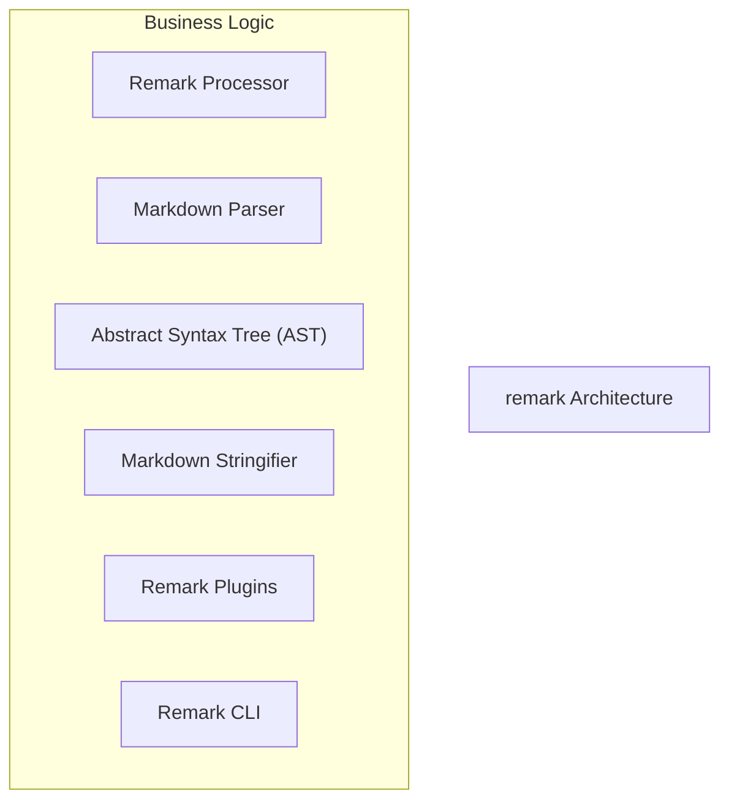
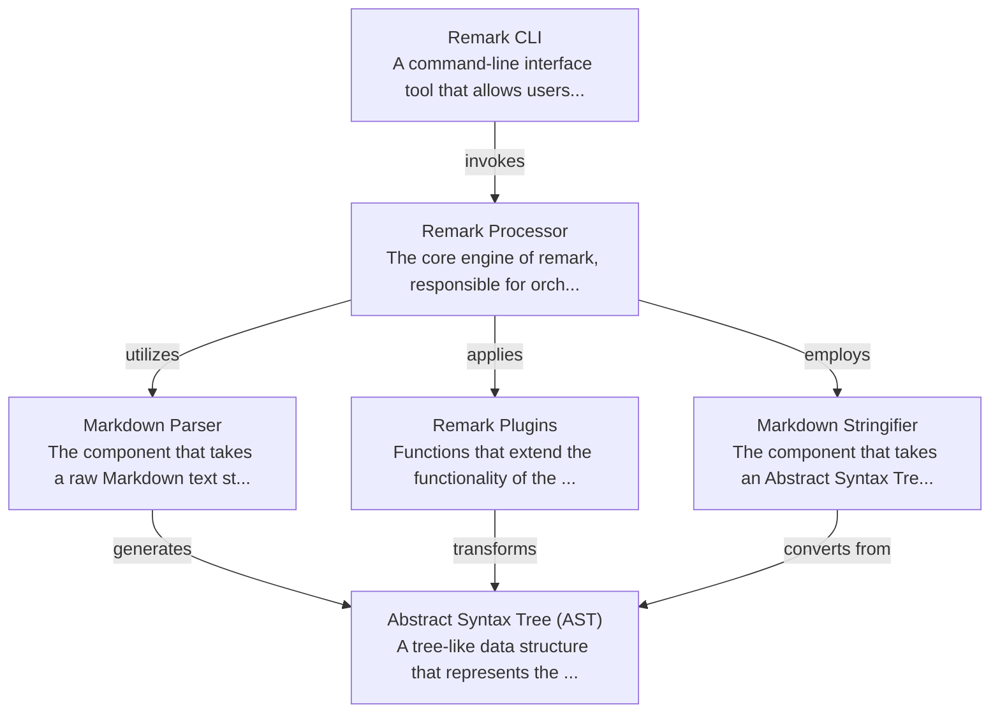

# remark Tutorial

Welcome to the comprehensive tutorial for remark. This tutorial is automatically generated from the codebase to help you understand the core concepts and implementation patterns.

## Project Overview

Remark is a powerful Markdown processor that enables programmatic transformation of Markdown documents.
It operates by converting Markdown text into an Abstract Syntax Tree (AST), facilitating manipulations through a robust plugin ecosystem, and then serializing the modified AST back into Markdown.
The core 'Remark Processor' orchestrates parsing, plugin application, and stringification, with the 'Remark CLI' providing a convenient command-line interface for users.

## System Architecture

## Component Relationships

## Table of Contents

1. [Chapter 1: Abstract Syntax Tree (AST)](chapter_01.md) - Comprehensive documentation for Abstract Syntax Tree (AST) following structured methodology...
2. [Chapter 2: Markdown Parser](chapter_02.md) - Comprehensive documentation for Markdown Parser following structured methodology...
3. [Chapter 3: Markdown Stringifier](chapter_03.md) - Comprehensive documentation for Markdown Stringifier following structured methodology...
4. [Chapter 4: Remark Processor](chapter_04.md) - Comprehensive documentation for Remark Processor following structured methodology...
5. [Chapter 5: Remark Plugins](chapter_05.md) - Comprehensive documentation for Remark Plugins following structured methodology...
6. [Chapter 6: Remark CLI](chapter_06.md) - Comprehensive documentation for Remark CLI following structured methodology...

## How to Use This Tutorial

1. **Start with Chapter 1** to understand the foundational concepts
2. **Follow the sequence** - each chapter builds upon previous concepts
3. **Practice with code examples** - every chapter includes practical examples
4. **Refer to diagrams** - use architecture diagrams for visual understanding
5. **Cross-reference concepts** - chapters link to related topics

## Tutorial Features

- **Progressive Learning**: Concepts are introduced in logical order
- **Code Examples**: Every chapter includes practical, executable code
- **Visual Diagrams**: Mermaid diagrams illustrate complex relationships
- **Cross-References**: Easy navigation between related concepts
- **Beginner-Friendly**: Written for newcomers to the codebase

## Contributing

This tutorial is auto-generated from the codebase. To improve it:
1. Update the source code documentation
2. Add more detailed comments to key functions
3. Regenerate the tutorial using the documentation system

---

*Generated using AI-powered codebase analysis*
