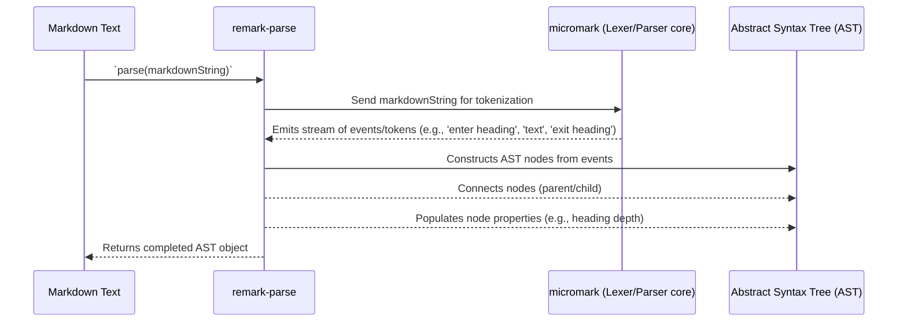

# Chapter 2: Parser (remark-parse)

Welcome back! In our [previous chapter on Markdown Text](chapter_01.md), we established that the journey with `remark` begins with raw, unstructured Markdown. But how do we move from a simple string of text to something `remark` can actually *understand* and *manipulate*? This is precisely where the **Parser**, specifically `remark-parse`, comes into play.

---

### The Problem: Understanding Unstructured Text

Imagine you have a beautifully written Markdown document. It contains headings, paragraphs, lists, links, and code blocks. For a human, it's easy to read and interpret. But for a computer program, this document is just a long string of characters. How can a program reliably identify a heading from a paragraph, or find all the links?

Without a structured representation, performing operations like:
*   Counting all headings
*   Rewriting all relative links to absolute ones
*   Extracting code blocks
*   Converting a list to a task list

...becomes incredibly complex, often requiring brittle and error-prone regular expressions. This is the fundamental problem `remark-parse` solves. It acts as the bridge, transforming chaotic text into an organized, navigable data structure.

Our guiding use case for this chapter will be: **"Given a Markdown document, how can we programmatically count the total number of headings present?"**

---

### Core Concept: From Text to Tree

At its heart, a **Parser** is like a highly skilled linguist for programming languages. It takes a stream of characters (our Markdown text) and, based on a set of grammar rules (the Markdown specification), converts it into a structured, hierarchical representation. This structured output is known as an **Abstract Syntax Tree (AST)**.

`remark-parse` is `remark`'s dedicated parser. It takes your raw Markdown string and meticulously breaks it down, identifying each component – a heading, a paragraph, a list item – and arranges them into a tree. Each part of the Markdown document becomes a "node" in this tree, with parent-child relationships defining its structure. For instance, a list item might be a child of a list, and text within that list item would be a child of the list item.

Think of it like building an actual tree: the trunk is the document itself, branches are major sections (like paragraphs or lists), smaller branches are elements within those sections (like list items or emphasized text), and the leaves are the raw textual content. This transformation from flat text to a hierarchical tree is what empowers `remark` to perform sophisticated manipulations later on.

---

### Practical Usage Examples

Let's see `remark-parse` in action using our motivating use case: counting headings.

First, we need to import `remark` itself. `remark-parse` is typically used implicitly when you use the `remark` processor.

```javascript
import { remark } from 'remark';
import { visit } from 'unist-util-visit'; // A utility to traverse the AST

// Our example Markdown content
const markdownContent = `
# Getting Started

This is an introduction to remark.

## What is remark?
Remark is a powerful tool.

### Core Concepts
We will cover parsers, ASTs, and plugins.
`;

// 1. Parse the Markdown into an AST
const tree = remark().parse(markdownContent);

console.log('Successfully parsed the Markdown into an AST.');
// Expected output: Successfully parsed the Markdown into an AST.
// (The 'tree' object itself is too large to log fully here, but it's a JS object)
```
*Explanation:* Here, `remark().parse(markdownContent)` is the magic step. It takes our string and converts it into the AST structure. The `tree` variable now holds this structured representation, ready for inspection.

Now, let's use the `tree` to count the headings:

```javascript
import { remark } from 'remark';
import { visit } from 'unist-util-visit'; // Helper for tree traversal

const markdownContent = `
# Getting Started

This is an introduction to remark.

## What is remark?
Remark is a powerful tool.

### Core Concepts
We will cover parsers, ASTs, and plugins.
`;

const tree = remark().parse(markdownContent);
let headingCount = 0;

// 2. Traverse the AST to find 'heading' nodes
visit(tree, 'heading', () => {
  headingCount++;
});

console.log(`Total headings found: ${headingCount}`);
// Expected output: Total headings found: 3
```
*Explanation:* After parsing, we use `unist-util-visit` (a common utility in the `unist` ecosystem which `remark` uses) to walk through the `tree`. We tell it to look for nodes of `type: 'heading'`. Every time it finds one, our counter increments. This demonstrates how having an AST enables straightforward structural queries that would be very difficult with raw text.

---

### Internal Implementation Walkthrough

At a high level, `remark-parse` works by following a two-stage process: **tokenization (or lexing)** and **parsing**.

1.  **Tokenization (Lexing)**: The initial string of Markdown text is read character by character. The lexer identifies meaningful "chunks" of text called *tokens*. For example, `##` might be identified as a "heading indicator" token, `*` as an "emphasis token," and the text between them as "word tokens."
2.  **Parsing**: These tokens are then fed into the parser, which understands the grammar rules of Markdown. The parser takes these tokens and arranges them into a hierarchical structure – the Abstract Syntax Tree (AST). It understands that a `##` token followed by text and a newline forms a `heading` node, and that `*text*` forms an `emphasis` node with `text` as its child.

`remark-parse` leverages `micromark` under the hood for robust CommonMark parsing. `micromark` handles the low-level tokenization and event emission, and `remark-parse` then consumes these events to construct an `mdast` (Markdown Abstract Syntax Tree) compliant tree, which is a specific type of [Universal Syntax Tree (unist)](https://github.com/syntax-tree/unist) (detailed more in the next chapter).

Let's visualize this process:



This diagram illustrates how `remark-parse` orchestrates `micromark` to do the heavy lifting of breaking down the Markdown and then systematically builds the rich, structured AST that `remark` operates on. Each Markdown element, like a paragraph, a list, or a code block, becomes a specific type of node in this tree with its own properties (e.g., a heading node has a `depth` property for `#`, `##`, etc.).

---

### System Integration

`remark-parse` forms the foundational input stage of the entire `remark` ecosystem. It's the critical first step in turning human-readable Markdown into machine-understandable data.

*   **Input**: It exclusively takes [Markdown Text](chapter_01.md) as its input.
*   **Output**: Its direct output is an [Abstract Syntax Tree (AST)](chapter_03.md). This AST is a JavaScript object that represents the structure of your Markdown.
*   **Pipeline Role**: The AST generated by `remark-parse` then flows into the rest of the `remark` pipeline. It's often wrapped in a [Virtual File (vfile)](chapter_04.md), which provides additional metadata and error handling capabilities.
*   **Plugins**: Subsequent [Plugin](chapter_05.md)s operate directly on this AST, modifying its structure or content.
*   **Stringifier**: Finally, if you want to convert the modified AST back into Markdown, the [Stringifier (remark-stringify)](chapter_06.md) takes the AST as input.
*   **Processor**: The `remark` [Processor (remark)](chapter_07.md) orchestrates `remark-parse`, plugins, and `remark-stringify` to provide a unified API.

```mermaid
graph LR
    A[Markdown Text] --Input--> B(Parser<br>(remark-parse))
    B --Output AST--> C[Abstract Syntax Tree (AST)]
    C --Wraps AST--> D(Virtual File<br>(vfile))
    D --Processed by--> E(Plugins)
    E --Modified AST/vFile--> F(Stringifier<br>(remark-stringify))
    F --Output--> G[Markdown Text]
```
This data flow highlights that `remark-parse` is indispensable. Without it, `remark` wouldn't be able to "read" or "understand" Markdown.

---

### Best Practices & Tips

*   **Parse Once**: If you need to perform multiple operations on the same Markdown content, parse it once into an AST, then perform all manipulations on that AST. Avoid re-parsing the same text multiple times, as parsing can be computationally intensive for large documents.
*   **Understand the AST Structure**: While the next chapter dives deeper, familiarizing yourself with the basic `mdast` node types (e.g., `heading`, `paragraph`, `list`, `text`) will greatly aid in writing effective plugins and understanding parsed output.
*   **Error Handling**: `remark-parse` is quite robust, but malformed Markdown can sometimes lead to unexpected AST structures or parsing errors. Be prepared to handle potential errors or unexpected node types when processing user-generated Markdown.
*   **Extending the Parser**: `remark-parse` supports extensions to handle Markdown variants like GitHub Flavored Markdown (GFM) (e.g., using `remark-gfm`). If your Markdown uses features beyond standard CommonMark, ensure you integrate the necessary parser extensions.
    ```javascript
    import { remark } from 'remark';
    import remarkGfm from 'remark-gfm'; // For GitHub Flavored Markdown

    const gfmMarkdown = `
    - [x] Task list item
    `;

    // Use .use() to add remark-gfm parser extensions
    const treeWithGfm = remark().use(remarkGfm).parse(gfmMarkdown);

    // Now the parser understands task lists, strikethrough, tables, etc.
    console.log('Parsed GFM Markdown.');
    // Expected: Parsed GFM Markdown.
    ```
    *Explanation:* This shows how `remark().use(remarkGfm)` extends the parsing capabilities of `remark-parse` to understand GFM syntax.

---

### Chapter Conclusion

The **Parser (`remark-parse`)** is the vital entry point into the `remark` processing pipeline. It meticulously translates the unstructured chaos of Markdown text into a highly organized and navigable **Abstract Syntax Tree (AST)**. This transformation is not merely a technical detail; it's the fundamental enabler for all subsequent programmatic manipulation, analysis, and transformation of Markdown content within the `remark` ecosystem. By providing this structured representation, `remark-parse` empowers developers to interact with Markdown in powerful, reliable, and expressive ways.

Now that we understand *how* Markdown text is converted, our next logical step is to delve into *what* that converted structure looks like. Join us in the next chapter as we explore the [Abstract Syntax Tree (AST)](chapter_03.md) in detail.