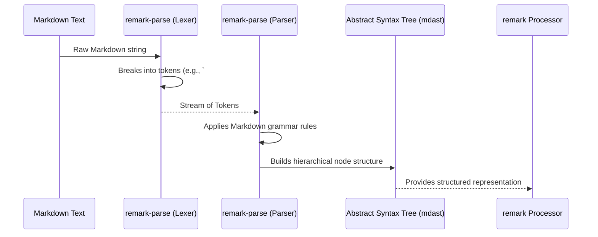

# Chapter 3: Abstract Syntax Tree (AST)

Welcome back! In the [previous chapter](chapter_02.md), we explored how `remark-parse`, the Parser, takes raw Markdown text and begins its transformation journey. Its primary output is not just another string, but a highly structured, machine-readable representation of your Markdown: the Abstract Syntax Tree (AST). This chapter dives deep into understanding what an AST is, why `remark` relies on it, and how it becomes the central nervous system for all subsequent Markdown manipulations.

---

### Problem & Motivation

Imagine you have a Markdown document, and you want to perform a specific, programmatic task. For example:
1.  **Find all level 2 headings** and list their contents.
2.  **Add a unique `id` attribute** to every heading for easy linking.
3.  **Refactor all unordered lists** that use `*` to instead use `-`.
4.  **Extract all images** and their `alt` text.

If you only have the raw Markdown text, performing these tasks becomes incredibly difficult and error-prone. You'd likely resort to regular expressions, which are notoriously fragile when dealing with the nested, hierarchical nature of Markdown (e.g., a list inside a blockquote, or a link inside a heading). Markdown syntax has rules about nesting and structure that simple text-based searches cannot reliably capture.

This is the problem the Abstract Syntax Tree (AST) solves. An AST provides a **structured, hierarchical representation** of your Markdown content. Instead of a flat string of characters, you get a tree where each node represents a distinct Markdown element – a paragraph, a heading, a list item, a link, an emphasis, etc. This structured approach allows `remark` and its plugins to precisely navigate, analyze, and modify Markdown content without worrying about the complexities of raw text manipulation. It's the blueprint that makes complex transformations reliable and straightforward.

---

### Core Concept Explanation

An **Abstract Syntax Tree (AST)** is a tree-like data structure that represents the syntactic structure of source code (in our case, Markdown text). Each node in the tree denotes a construct occurring in the source code. The word "Abstract" signifies that it does not represent every detail that appears in the real syntax, but rather focuses on the structural meaning and the hierarchy of elements.

In the context of `remark`, the AST is the universal language through which all operations communicate. `remark` uses a specific flavor of AST known as **mdast (Markdown Abstract Syntax Tree)**. The `mdast` specification defines a consistent set of node types (e.g., `root`, `paragraph`, `heading`, `list`, `listItem`, `text`, `link`, `image`, `code`) and their properties, ensuring that all `remark` components and plugins understand the same structure.

Think of it like this: if Markdown text is a building's written description (floor plans, materials list), then the AST is the actual 3D model of the building. You can easily see how different parts connect, where a wall meets a floor, or what's inside a room. Modifying the 3D model is much easier and more precise than trying to rewrite the building's description by hand without visual aids. This structured representation allows programs to analyze the Markdown's logic, identify specific elements, and make targeted modifications efficiently and robustly.

---

### Practical Usage Examples

Let's see the AST in action. The `remark().parse()` method, powered by `remark-parse`, is what generates our AST from Markdown text.

First, ensure you have `remark` installed:
```bash
npm install remark
```

Now, let's parse a simple Markdown string and inspect its AST:

```javascript
// ast-example.js
import { remark } from 'remark';

const markdown = `# Welcome to AST!

This is a **paragraph** with *emphasis*.

- Item one
- Item two
`;

// Parse the Markdown into an AST
const ast = remark().parse(markdown);

// Log the AST structure.
// JSON.stringify with null, 2 makes it pretty-printed and readable.
console.log(JSON.stringify(ast, null, 2));
```
Running `node ast-example.js` will output the JSON representation of the AST. Notice the `type` property of each node, which corresponds to the `mdast` specification.

```json
{
  "type": "root",
  "children": [
    {
      "type": "heading",
      "depth": 1,
      "children": [
        {
          "type": "text",
          "value": "Welcome to AST!"
        }
      ],
      "position": { /* ... details ... */ }
    },
    {
      "type": "paragraph",
      "children": [
        {
          "type": "text",
          "value": "This is a "
        },
        {
          "type": "strong",
          "children": [
            {
              "type": "text",
              "value": "paragraph"
            }
          ]
        },
        {
          "type": "text",
          "value": " with "
        },
        {
          "type": "emphasis",
          "children": [
            {
              "type": "text",
              "value": "emphasis"
            }
          ]
        },
        {
          "type": "text",
          "value": "."
        }
      ],
      "position": { /* ... details ... */ }
    },
    {
      "type": "list",
      "ordered": false,
      "start": null,
      "spread": false,
      "children": [
        {
          "type": "listItem",
          "spread": false,
          "checked": null,
          "children": [
            {
              "type": "paragraph",
              "children": [
                {
                  "type": "text",
                  "value": "Item one"
                }
              ],
              "position": { /* ... details ... */ }
            }
          ],
          "position": { /* ... details ... */ }
        },
        {
          "type": "listItem",
          "spread": false,
          "checked": null,
          "children": [
            {
              "type": "paragraph",
              "children": [
                {
                  "type": "text",
                  "value": "Item two"
                }
              ],
              "position": { /* ... details ... */ }
            }
          ],
          "position": { /* ... details ... */ }
        }
      ],
      "position": { /* ... details ... */ }
    }
  ],
  "position": { /* ... details ... */ }
}
```
This output clearly shows the hierarchical structure. The `root` node contains `children` which are `heading`, `paragraph`, and `list` nodes. The `paragraph` node, in turn, has `text`, `strong`, `text`, `emphasis`, and `text` children, reflecting the inline formatting. Each node has a `type` and often `children` (for parent nodes) or `value` (for leaf nodes like plain text).

---

### Internal Implementation Walkthrough

The creation of the AST is primarily handled by the `remark-parse` module, as discussed in the [Parser chapter](chapter_02.md). When `remark().parse(markdown)` is called, a series of steps occur:

1.  **Lexical Analysis (Tokenization)**: The raw Markdown string is first scanned character by character. It's broken down into a stream of "tokens," which are the smallest meaningful units. For example, `#`, `Welcome`, ` `, `to`, ` `, `AST`, `!`, `\n\n`, `This`, ` `, `is`, ` `, `a`, ` `, `**`, `paragraph`, `**`, etc. Each token has a type (e.g., `atxHeading`, `word`, `whitespace`, `strongMarker`).

2.  **Syntactic Analysis (Parsing)**: The stream of tokens is then fed into the parser. The parser applies a set of grammar rules (derived from the CommonMark specification, which `mdast` largely follows) to recognize patterns in the tokens and build the tree structure.
    *   It sees `#` followed by text and recognizes it as a `heading` node with `depth: 1`.
    *   It identifies `This is a ` as plain `text`.
    *   It sees `**` then `paragraph` then `**` and knows this forms a `strong` node with `paragraph` as its child.
    *   It understands that a line starting with `-` or `*` denotes a `listItem` within a `list`.

The parser continuously looks for these patterns, creating nodes, setting their `type`, adding `children` where appropriate, and attaching relevant properties (like `depth` for headings, `ordered` for lists, `value` for text). This process continues until the entire Markdown document has been consumed, resulting in the complete `mdast` AST.

This sequence can be visualized as follows:



Each node in the AST also contains `position` information (line, column, offset), which is invaluable for error reporting and mapping back to the original Markdown text.

---

### System Integration

The AST is truly the backbone of the `remark` ecosystem, acting as the central data interchange format. Here's how it integrates with other key components:

*   **[Parser (remark-parse)](chapter_02.md)**: As we've seen, the Parser is the producer of the AST. It's the first step in the `remark` pipeline that translates raw Markdown into this structured format.

*   **[Virtual File (vfile)](chapter_04.md)**: The AST is typically associated with a `vfile` object. The `vfile` acts as a container for the AST itself, along with important metadata about the file (like its path, character encoding, messages, and error diagnostics). While the AST represents the content, the `vfile` represents the *context* of that content.

*   **[Plugin](chapter_05.md)**: This is where the AST truly shines. Plugins are functions designed to traverse and modify the AST. They take an AST as input, perform transformations (e.g., adding classes, reordering nodes, changing heading levels), and return a modified AST. All `remark`'s customizability comes from plugins operating on this structured tree.

*   **[Stringifier (remark-stringify)](chapter_06.md)**: After the AST has been potentially modified by plugins, the Stringifier takes this AST as input and converts it *back* into a Markdown text string. It understands the `mdast` structure and knows how to render each node type back into its corresponding Markdown syntax.

*   **[Processor (remark)](chapter_07.md)**: The Processor is the orchestrator. It ties all these components together: it uses the Parser to get an AST, passes that AST through a chain of Plugins, and then uses the Stringifier to convert the final AST back to Markdown. The AST is the crucial intermediate state that links parsing and stringifying, enabling all transformations in between.

---

### Best Practices & Tips

When working with Abstract Syntax Trees in `remark`, consider these best practices:

*   **Familiarize with `mdast`**: The `mdast` specification is your guide. Understand the different node `type`s (e.g., `paragraph`, `heading`, `link`, `text`) and their properties (`depth`, `url`, `value`, `children`). This knowledge is fundamental for writing effective plugins that correctly target and manipulate parts of the AST.
*   **Inspect the AST regularly**: When developing, frequently `console.log(JSON.stringify(ast, null, 2))` to understand the exact structure you are working with. This helps in debugging and ensuring your transformations are affecting the correct nodes.
*   **Use AST traversal utilities**: For complex manipulations, manually iterating through `children` arrays can become cumbersome. `remark` and its ecosystem provide utilities like `unist-util-visit` (from the `unist` ecosystem, which `mdast` builds upon) to easily traverse the tree and find specific node types. While we'll cover plugins in more detail later, knowing such utilities exist is helpful.
*   **Think about immutability**: When modifying the AST within plugins, especially in a chain of plugins, it's often safer and more predictable to create new nodes or subtrees rather than directly mutating existing ones in place. While `remark`'s AST is mutable by design, being mindful of side effects can prevent unexpected behavior.
*   **Performance considerations**: For very large Markdown documents, the AST can become quite substantial in memory. While `remark` is optimized, be aware that deeply nested structures or very frequent AST traversals can impact performance. Optimize your plugin logic to avoid unnecessary operations.

---

### Chapter Conclusion

The Abstract Syntax Tree (AST) is not just a technical detail; it's the core enabler for `remark`'s power and flexibility. By converting raw Markdown text into a structured, hierarchical `mdast` tree, `remark` transforms an unstructured problem into a programmable one. This tree representation allows for precise analysis, robust manipulation by plugins, and reliable conversion back to Markdown, making complex content transformations straightforward and maintainable. Understanding the AST is crucial for anyone looking to harness `remark` for advanced Markdown processing.

Now that we understand the internal representation of Markdown, our next step is to explore the concept of the **Virtual File**, which provides the context and metadata for our AST throughout its journey.

Onward to: [Virtual File (vfile)](chapter_04.md)