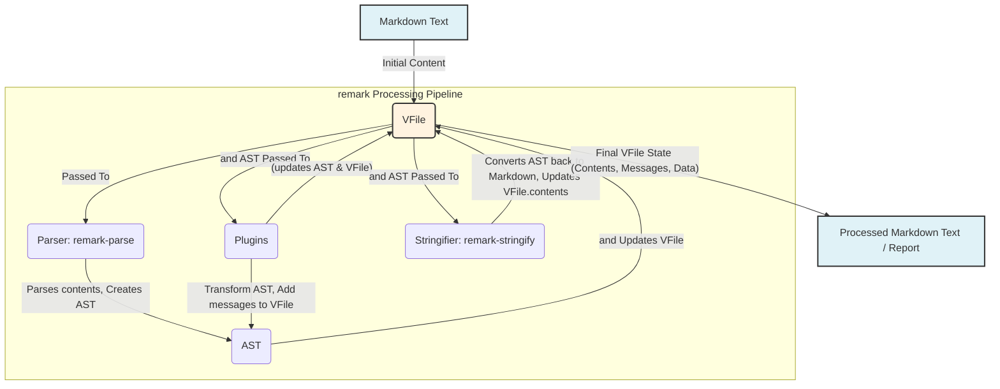

# Chapter 4: Virtual File (vfile)

In the previous chapter, we delved into the [Abstract Syntax Tree (AST)](chapter_03.md), understanding how `remark` transforms raw Markdown text into a structured, programmatic representation. The AST is crucial for understanding the *structure* of our content. However, processing a file involves more than just its structured content; we also need to manage its metadata, such as its origin path, file name, and any contextual information or feedback generated during processing. This is where the **Virtual File (vfile)** comes into play.

---

### Problem & Motivation

Imagine you're building a linter for Markdown. After parsing the text into an AST, you want to identify issues like broken links or incorrect heading levels. When an issue is found, you need to report it, specifying not just *what* the issue is, but also *where* it occurred (line/column), in *which file*, and *what type* of message it is (warning, error). Without a standardized container for this information, each part of `remark`'s processing pipeline (parser, plugins, stringifier) would have to invent its own way to pass around file content, path details, and especially diagnostic messages. This would lead to inconsistencies, complex integrations, and difficult debugging.

The core problem `vfile` solves is the lack of a **unified, standardized object to represent a file during processing**. It provides a single point of truth for file-related information, ensuring that content, metadata, and diagnostic messages can seamlessly flow through the entire `remark` ecosystem. For `remark`, `vfile` is indispensable because it acts as the primary conduit for all data. A parser consumes its `contents`, plugins add `messages` to it, and a stringifier might write its `contents` back out, all while tracking the `path` and other contextual data.

Consider a simple `remark` use case: linting a `README.md` file for common Markdown errors. We need to:
1. Load `README.md`'s content.
2. Parse it.
3. Apply linting rules (plugins).
4. Collect all linting warnings/errors.
5. Report them, ideally showing line numbers and the original file name.
The `vfile` object elegantly encapsulates all these needs into a single, manageable entity.

---

### Core Concept Explanation

The **Virtual File (vfile)** is a lightweight, conceptual object designed to represent a file in memory during its lifecycle through a processing system like `remark`. It's "virtual" because it doesn't necessarily correspond to a physical file on disk at all times; it's a data container that holds what *would be* a file's characteristics.

At its heart, a `vfile` object is a simple JavaScript object with several key properties:
*   `vfile.contents`: Holds the actual textual or binary content of the file. For `remark`, this will typically be Markdown text.
*   `vfile.path`: Stores the file's original path on the filesystem (e.g., `'path/to/README.md'`). This helps identify the source of the data.
*   `vfile.messages`: An array where all diagnostic messages (warnings, errors, info) generated during processing are stored. Each message includes details like its position in the file and severity.
*   `vfile.data`: A generic object where plugins and processors can store arbitrary, extra data that needs to be passed along, but doesn't fit into the other standard properties.

The beauty of `vfile` lies in its simplicity and universality. By providing a common interface for file handling, it allows different `remark` components (parser, plugins, stringifier) to communicate effectively, sharing information about the file and its processing status. This centralization makes `remark` highly modular and extensible, as every component expects and produces a `vfile` or operates on its contents. It truly acts as the `remark` processor's central hub for contextual file data.

---

### Practical Usage Examples

Let's use our `README.md` linting scenario to see `vfile` in action.

First, we need to create a `vfile` instance.

```javascript
import { VFile } from 'vfile';

// 1. Create a vfile instance
const myFile = new VFile({
  path: 'README.md',
  value: '# Hello World\nThis is a test file.'
});

console.log(myFile.path);
console.log(myFile.contents.toString()); // contents might be Buffer or string
```
This example initializes a `vfile` named `myFile` with a path and some content. Note that `value` is used during creation, but the content is stored in `contents`.

Now, let's simulate a linting process by adding some messages to our `vfile`. `vfile` provides methods like `info()`, `warn()`, and `fail()` to add messages of different severities.

```javascript
import { VFile } from 'vfile';

const myFile = new VFile({
  path: 'README.md',
  value: '# Hello World\nThis is a test file.'
});

// 2. Add an informational message
myFile.info('Markdown file loaded successfully', { line: 1, column: 1 });

// 3. Add a warning message (e.g., a linting issue)
myFile.warn('Consider adding more detail to the introduction.', { line: 2, column: 1 });

// 4. Add an error message (e.g., a critical syntax error that stops processing)
// This will throw an error by default, but we can catch it.
try {
  myFile.fail('Broken link detected: [Invalid Link](missing-page.md)', { line: 3, column: 1 });
} catch (error) {
  console.error('Processing failed due to:', error.message);
}

// 5. Access the collected messages
console.log('Messages:', myFile.messages);
```
Here, we've demonstrated how to add different types of diagnostic messages to the `vfile`. The `fail()` method is special as it *throws an error* by default, halting processing, which is useful for critical issues. Each message automatically includes contextual information like the source `file` and `severity`.

Finally, after processing, we can inspect the `vfile` for its updated content (if a plugin modified it) and all collected messages.

```javascript
import { VFile } from 'vfile';

const myFile = new VFile({
  path: 'README.md',
  value: '# Hello World\nThis is a test file.'
});

// Simulate content modification by a plugin
myFile.contents = '# Updated Title\nThis is a modified test file.';
myFile.warn('Title was updated by a hypothetical plugin.', { line: 1, column: 1 });

console.log('Updated Contents:', myFile.contents.toString());

// Iterate through messages to report them
myFile.messages.forEach(message => {
  console.log(`[${message.fatal ? 'ERROR' : message.severity === 1 ? 'WARN' : 'INFO'}] ${message.file}:${message.line}:${message.column} - ${message.message}`);
});
```
This example shows how `vfile.contents` can be updated during processing and how to iterate through `vfile.messages` to display the diagnostic feedback, fulfilling our linting use case. The `vfile` object itself becomes the report card of the entire processing journey.

---

### Internal Implementation Walkthrough

The `vfile` concept is implemented by the standalone `vfile` npm package, which `remark` (and other related projects in the unified ecosystem) depends on. A `vfile` object is essentially a structured JavaScript object that stores specific properties.

When you create `new VFile(...)`, an object is instantiated with default values and the provided options.

Here's a simplified look at the internal structure of a `VFile` object and its `VFileMessage` components:

```mermaid
graph TD
    A[VFile Object] --> B(contents: Buffer | string)
    A --> C(path: string | undefined)
    A --> D(dirname: string | undefined)
    A --> E(basename: string | undefined)
    A --> F(extname: string | undefined)
    A --> G(stem: string | undefined)
    A --> H(data: object)
    A --> I(messages: VFileMessage[])

    I --> J[VFileMessage Object]
    J --> K(message: string)
    J --> L(line: number | undefined)
    J --> M(column: number | undefined)
    J --> N(fatal: boolean | undefined)
    J --> O(severity: number | undefined)
    J --> P(ruleId: string | undefined)
    J --> Q(source: string | undefined)
    J --> R(url: string | undefined)
    J --> S(name: string)
    J --> T(file: string | undefined)
```

1.  **Properties for Path Information**: `vfile` provides convenient properties like `dirname`, `basename`, `extname`, and `stem` (filename without extension). These are derived from `vfile.path` but are available for easy access.
2.  **`vfile.contents`**: This property holds the raw input content. Internally, `vfile` handles conversion between `string` and `Buffer` based on how the content is set or accessed. `remark` typically deals with `string` contents.
3.  **`vfile.messages`**: This is an array that stores instances of `VFileMessage`.
    *   **`VFileMessage`**: Each message object (created by `vfile.info()`, `vfile.warn()`, `vfile.fail()`) includes:
        *   `message`: The human-readable description of the issue.
        *   `line`, `column`, `offset`: Precise location in the file.
        *   `fatal`: A boolean indicating if the message represents an error that should halt processing (`true`) or a warning (`false`/`undefined`).
        *   `severity`: A numeric representation (e.g., 0 for info, 1 for warning, 2 for error).
        *   `ruleId`, `source`, `url`: Optional fields for more context (e.g., which linting rule triggered it, a link to documentation).
        *   `file`: The path of the file the message belongs to.
        *   `name`: A string identifier for the message, often derived from its position.
4.  **`vfile.data`**: A plain JavaScript object that serves as an extensible metadata store. Any part of the `remark` pipeline can add custom properties here that are not part of `vfile`'s standard interface but are relevant to the processing. For example, a plugin might store a boolean `vfile.data.hasModifiedContent = true;` to signal a change.

The internal methods like `info`, `warn`, `fail` are essentially helpers that create a `VFileMessage` object with appropriate `fatal` and `severity` levels and push it onto the `vfile.messages` array. `fail` is unique in that it also throws the `VFileMessage` object as an error, which can be caught if desired, or allowed to stop the program flow.

---

### System Integration

The `vfile` object is the central data carrier that binds all parts of the `remark` processing system together. It's passed from one stage to the next, accumulating changes to its content, path, data, and most importantly, diagnostic messages.



1.  **Initialization**: When you start a `remark` processor, you typically provide it with Markdown text (either directly as a string or by loading a file). The `remark` processor internally wraps this text in a new `vfile` object. If a path is known, it's also added to `vfile.path`.
    *   Reference: [Processor (remark)](chapter_07.md)
2.  **Parsing (`remark-parse`)**: The [Parser (remark-parse)](chapter_02.md) takes the `vfile` as input. It reads `vfile.contents`, transforms the Markdown text into an [Abstract Syntax Tree (AST)](chapter_03.md), and then passes *both the AST and the `vfile`* to the next stage. The parser might add messages if it encounters syntax errors.
3.  **Plugins (`remark-plugins`)**: This is where most of the work happens. [Plugins](chapter_05.md) receive both the `AST` and the `vfile`. A plugin can:
    *   Modify the `AST` (e.g., transform headings, add nodes).
    *   Read or write to `vfile.data` for passing custom state.
    *   Add messages to `vfile.messages` (e.g., linting warnings or errors).
    *   Even modify `vfile.contents` directly, though usually, modifications are done on the AST, and then `remark-stringify` writes them back.
4.  **Stringification (`remark-stringify`)**: Finally, the [Stringifier (remark-stringify)](chapter_06.md) takes the (potentially modified) `AST` and the `vfile`. It converts the AST back into Markdown text and updates `vfile.contents` with this new string.
5.  **Output**: After the entire pipeline, the `remark` processor returns the `vfile`. You can then access `vfile.contents` for the final Markdown output and `vfile.messages` to see all the diagnostic feedback.

This seamless flow of the `vfile` object ensures that context, content, and feedback are always available and consistent across all stages of the transformation process.

---

### Best Practices & Tips

*   **Treat `vfile` as the "Source of Truth" for File Metadata**: Always rely on `vfile.path`, `vfile.contents`, and `vfile.messages` for file-related information within the `remark` ecosystem. Avoid passing separate variables for these concerns.
*   **Use `vfile.messages` for Diagnostics**: Whether it's a warning from a linter or an error from a transformer, `vfile.info()`, `vfile.warn()`, and `vfile.fail()` are the standard ways to communicate issues. This ensures consistent reporting.
*   **Utilize `vfile.data` for Custom State**: If your plugin needs to pass along custom information that doesn't fit standard `vfile` properties, use `vfile.data`. This keeps the main `vfile` object clean and allows for extensible metadata.
    ```javascript
    // In a plugin:
    vfile.data.customOption = true;
    ```
    ```javascript
    // In another plugin or after processing:
    if (vfile.data.customOption) {
      console.log('Custom option was set!');
    }
    ```
*   **Understand `vfile.fail()`**: Remember that `vfile.fail()` *throws* an error by default. This is intended for critical issues that should stop further processing. If you want to record a severe error without stopping the program, set `fatal: true` when calling `vfile.message()` directly or catch the error.
    ```javascript
    import { VFile } from 'vfile';

    const myFile = new VFile({ value: '...' });

    // This will throw:
    // myFile.fail('Critical problem!');

    // To add a fatal error without throwing:
    myFile.message('Another critical problem', undefined, 'my-plugin:error').fatal = true;
    console.log(myFile.messages[0].fatal); // true
    ```
*   **Update `vfile.contents` for Final Output**: While plugins typically modify the AST, if you have a scenario where you directly manipulate the raw text (e.g., a pre-processing step), ensure you update `vfile.contents` so that subsequent stages or the final output reflect your changes.

#### Common Pitfalls:

*   **Ignoring Messages**: Always check `vfile.messages` after processing, especially if you're building a linter or a system that needs to report feedback.
*   **Modifying `vfile.path` Directly Without Deriving Properties**: If you change `vfile.path`, remember that `vfile.basename`, `vfile.extname`, etc., are derived. It's usually best to create a new `VFile` instance or use methods that correctly update these.
*   **Mistaking `vfile.contents` for `value`**: When creating a `vfile`, you pass the initial content as `value`. After creation, it's accessed and modified via `contents`.

---

### Advanced Usage

*   **Custom Message Properties**: `VFileMessage` objects are extensible. You can add custom properties to a message object if your tooling requires specific metadata for a warning or error.
    ```javascript
    import { VFile } from 'vfile';

    const myFile = new VFile({ value: 'Some text.' });
    const message = myFile.warn('This is a custom warning.', { line: 1, column: 1 });
    message.suggestion = 'Consider refactoring this sentence.';
    console.log(myFile.messages[0].suggestion); // 'Consider refactoring this sentence.'
    ```

*   **Using `vfile.history`**: For debugging or advanced scenarios, `vfile` tracks changes to its `path` property in `vfile.history`. This can show the full lifecycle of a file through different renames or moves.

---

### Troubleshooting

*   **Messages Not Showing Up**:
    *   **Check severity**: Are you looking for `info` messages when you only process `warn` or `fail`?
    *   **Correct method calls**: Ensure you're using `vfile.info()`, `vfile.warn()`, `vfile.fail()`, or `vfile.message()` correctly.
    *   **Plugin order**: If one plugin adds a message, but another one clears messages or overwrites `vfile`, order matters.
*   **Content Not Updated**:
    *   **Direct modification vs. AST modification**: If you expected a plugin to change the Markdown text, check if it correctly modified the AST, and if `remark-stringify` was run afterwards to convert the modified AST back to text and update `vfile.contents`.
    *   **Explicit `vfile.contents` update**: If you're manually changing the content, make sure you assign the new string or buffer to `vfile.contents`.
*   **`vfile.fail()` stops execution unexpectedly**: This is its intended behavior. If you want to record a critical error without halting, use `vfile.message('...', { fatal: true })` instead.

---

### Related Concepts

*   **`unified` Ecosystem**: `vfile` is a foundational part of the `unified` collective, which `remark` belongs to. Many other parsers, transformers, and stringifiers (e.g., `rehype` for HTML, `retext` for natural language) also use `vfile` for consistent data flow.
*   **`mdast` (AST)**: While the AST represents the structured content, the `vfile` provides the context around that content. Each node in the AST often has a `position` property that links directly back to specific line/column numbers within the `vfile.contents`, allowing messages to be precisely located.

---

### Chapter Conclusion

The Virtual File (vfile) serves as the indispensable container for all file-related information as it flows through the `remark` processing pipeline. It unifies content, path, and critical diagnostic messages (`vfile.messages`) into a single, standardized object, enabling seamless communication and state management between the parser, plugins, and stringifier. By understanding and effectively utilizing `vfile`, you gain granular control over your Markdown transformations and robust error reporting.

With our understanding of the `AST` as the structure and `vfile` as the contextual envelope, we are now ready to explore how custom logic and transformations are applied to our Markdown content through **Plugins**.

Continue to: [Plugin](chapter_05.md)