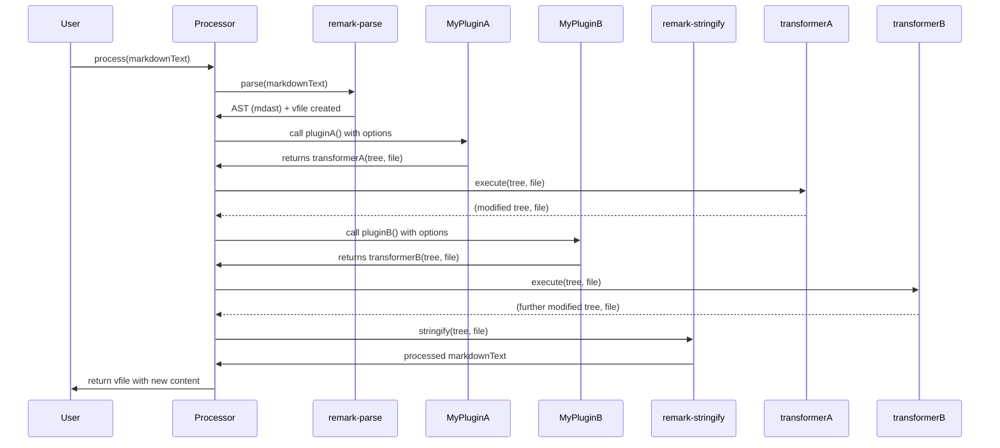

# Chapter 5: Plugin

In the previous chapter, we explored the concept of the [Virtual File (vfile)](chapter_04.md), a powerful container that holds our content, its metadata, and any messages generated during processing. The `vfile` provides a standardized way for different parts of the `remark` ecosystem to interact with and augment the file's state. But how do we *actually* modify the content or add new features? This is precisely where **Plugins** come into play.

---

### Problem & Motivation

Imagine you have a Markdown document and you want to perform a specific transformation, such as automatically adding an emoji to every heading, or checking for broken links, or perhaps converting all relative image paths to absolute ones. The core `remark` system, with its `Parser` and `Stringifier`, handles the fundamental conversion between Markdown text and an Abstract Syntax Tree (AST). However, it doesn't offer built-in functionality for every conceivable custom transformation or analysis.

Without a modular way to extend `remark`, you'd be forced to either modify `remark`'s source code directly (which is unsustainable and leads to unmaintainable projects) or write complex, one-off scripts that manually traverse the [Abstract Syntax Tree (AST)](chapter_03.md) and [Virtual File (vfile)](chapter_04.md) for each desired change. This approach is prone to errors, hard to reuse, and doesn't scale. We need a standardized, pluggable mechanism for custom logic.

This is the problem `remark` Plugins solve. They provide a robust and flexible architecture for extending `remark`'s capabilities without altering its core. For instance, a common need is to ensure all image URLs in a document are absolute. A plugin can traverse the AST, identify image nodes, and modify their `url` property on the `vfile`, ensuring consistency across projects.

---

### Core Concept Explanation

A **Plugin** in `remark` is essentially a JavaScript function that enables developers to customize and extend the behavior of a `remark` [Processor (remark)](chapter_07.md). These functions are designed to operate on the internal representation of your Markdown content – specifically, the [Abstract Syntax Tree (AST)](chapter_03.md) generated by the `Parser (remark-parse)](chapter_02.md) and the associated [Virtual File (vfile)](chapter_04.md) object. Think of a plugin as a specialized tool you can attach to `remark` to perform specific tasks during the processing pipeline.

Plugins can perform a wide range of operations. They can transform the AST by adding, removing, or modifying nodes, effectively changing the Markdown content itself. They can also analyze the AST and `vfile` to detect patterns, report warnings or errors, or inject additional data into the `vfile`'s `data` property. The true power of plugins lies in their modularity; each plugin is a self-contained unit addressing a particular concern, making them reusable and easy to combine.

The lifecycle of a plugin typically involves taking a `settings` object as an argument and returning a `transformer` function. This `transformer` function then receives the AST (as the root node) and the `vfile` as arguments. Inside this `transformer`, you write the logic to traverse the AST, inspect nodes, and make changes as needed. `remark` orchestrates the execution of these plugins in the order they are "used" by the `Processor`, allowing for a powerful, sequential modification pipeline.

---

### Practical Usage Examples

Let's illustrate the concept with a practical example: a simple plugin that adds a "Hello, remark!" heading at the beginning of a Markdown document.

First, we need to understand the basic structure of a `remark` plugin.

```javascript
// my-first-plugin.js
import { h } from 'hastscript'; // For creating AST nodes, often used by plugins

function myFirstPlugin() {
  // This is the transformer function that remark will call.
  // It receives the AST (root) and the vfile.
  return (tree, file) => {
    // We'll add our logic here.
    // For now, let's just log something.
    console.log('My first plugin is running!');
    console.log('Processing file:', file.path || 'untitled');
  };
}

export default myFirstPlugin;
```
*Explanation*: This code defines a basic plugin. It's a function `myFirstPlugin` that returns another function (the "transformer"). The transformer gets the `tree` (AST root) and the `file` (vfile) to work with.

Now, let's integrate this plugin into a `remark` processor.

```javascript
// use-my-plugin.js
import { remark } from 'remark';
import myFirstPlugin from './my-first-plugin.js'; // Our custom plugin

const markdownInput = '# Original Heading\n\nSome paragraph.';

async function processMarkdown() {
  const file = await remark()
    .use(myFirstPlugin) // Use our plugin
    .process(markdownInput);

  console.log('--- Original Input ---');
  console.log(markdownInput);
  console.log('--- Processed Output ---');
  console.log(String(file)); // Output the modified Markdown
}

processMarkdown();
```
*Explanation*: Here, we import `remark` and our custom plugin. We then create a `remark` processor and use the `.use()` method to tell `remark` to apply our plugin. Finally, `remark` processes the input. The current plugin doesn't modify the AST, so the output will be the same as the input, but you'll see the console logs from the plugin.

Let's make our plugin *actually* modify the AST. We'll use `unist-util-visit` (a common utility for AST traversal) and `hastscript` (for creating nodes, though `mdast-util-from-markdown` can also create mdast nodes directly). For simpler examples, we might manually create `mdast` nodes or use `mdast-util-to-markdown` for string conversion. For this simple case, let's just prepend a simple paragraph node.

```javascript
// my-heading-plugin.js
function myHeadingPlugin() {
  return (tree) => {
    // An mdast paragraph node with a text child
    const newParagraph = {
      type: 'paragraph',
      children: [{ type: 'text', value: 'Hello from a plugin!' }],
    };

    // Prepend the new paragraph node to the AST's children
    tree.children.unshift(newParagraph);
  };
}

export default myHeadingPlugin;
```
*Explanation*: This enhanced plugin now creates a new Markdown paragraph node (represented as an `mdast` object) and uses `unshift` to add it to the beginning of the `tree.children` array. This effectively prepends the paragraph to the Markdown content.

Now, let's use this updated plugin.

```javascript
// use-my-heading-plugin.js
import { remark } from 'remark';
import myHeadingPlugin from './my-heading-plugin.js';

const markdownInput = '# Original Heading\n\nSome paragraph.';

async function processMarkdown() {
  const file = await remark()
    .use(myHeadingPlugin) // Use our plugin
    .process(markdownInput);

  console.log('--- Original Input ---');
  console.log(markdownInput);
  console.log('--- Processed Output ---');
  console.log(String(file));
}

processMarkdown();
```
*Expected Output*:
```
--- Original Input ---
# Original Heading

Some paragraph.
--- Processed Output ---
Hello from a plugin!

# Original Heading

Some paragraph.
```
*Explanation*: The output now clearly shows the text "Hello from a plugin!" added before the original heading, demonstrating the plugin's ability to modify the AST.

---

### Internal Implementation Walkthrough

At its core, a `remark` plugin is a JavaScript function that adheres to a specific signature. When you register a plugin with `remark` using the `.use()` method, the `Processor` invokes this function.

1.  **Plugin Registration**: When `processor.use(pluginFunction, options)` is called, the `processor` stores `pluginFunction` and its `options`.
2.  **Plugin Execution**: During the `processor.process()` lifecycle, after the [Parser (remark-parse)](chapter_02.md) has converted the [Markdown Text](chapter_01.md) into an [Abstract Syntax Tree (AST)](chapter_03.md) and initialized a [Virtual File (vfile)](chapter_04.md), the `processor` iterates through its registered plugins.
3.  **Transformer Retrieval**: Each `pluginFunction` is called, potentially with the `options` provided. This `pluginFunction` is expected to return a "transformer" function. If it returns nothing or a non-function, it's skipped.
4.  **Transformer Application**: The returned "transformer" function is then called with two primary arguments:
    *   `tree`: The root node of the current [Abstract Syntax Tree (AST)](chapter_03.md).
    *   `file`: The [Virtual File (vfile)](chapter_04.md) object associated with the content.
5.  **AST/VFile Manipulation**: Inside the transformer, you can read from or write to the `tree` (AST) or the `file` (vfile). Common utilities like `unist-util-visit` are used to traverse the AST efficiently.
6.  **Pipeline Continuation**: Once a transformer finishes, the `processor` moves to the next plugin's transformer, passing the (potentially modified) `tree` and `file` along. This chain of transformations allows complex processing.


*Explanation*: This sequence diagram illustrates how a `remark` `Processor` orchestrates the flow. After parsing, the AST and vfile are passed sequentially through each plugin's transformer function. Each transformer can modify these objects before passing them to the next, culminating in the `Stringifier` to produce the final output.

---

### System Integration

Plugins are the primary means of extending `remark` and integrating it with other tools or custom logic. They sit right in the middle of the `remark` processing pipeline, acting as the bridge between parsing and stringifying.

-   **Input from `Parser (remark-parse)`**: Plugins receive the AST generated by `remark-parse` as their primary input. This means plugins operate on a structured, abstract representation of the Markdown, not the raw [Markdown Text](chapter_01.md).
-   **Output to `Stringifier (remark-stringify)`**: After all plugins have run, the final, modified AST is passed to the [Stringifier (remark-stringify)](chapter_06.md) which converts it back into Markdown text. Plugins directly influence the final output by modifying the AST.
-   **Interaction with [Virtual File (vfile)](chapter_04.md)**: Every plugin also receives the `vfile` object. Plugins can read properties from `vfile` (like `path`, `value`), add messages (warnings, errors) using `file.message()`, or attach custom data to `file.data` for other plugins or the application to use. This `vfile` acts as a shared context for the entire processing pipeline.
-   **Orchestrated by [Processor (remark)](chapter_07.md)**: The `remark` `Processor` is the central orchestrator. It manages the `use` method to register plugins, ensures they run in the correct order, and handles the overall flow from parsing to stringifying.

Consider a plugin that checks for outdated links. It would traverse the AST to find `link` nodes, use `vfile.data` to fetch some configuration about valid domains, make external network requests, and then report errors or warnings back into the `vfile` using `file.info()` or `file.warn()`. This tightly coupled yet modular design makes `remark` incredibly powerful.

---

### Best Practices & Tips

1.  **Immutability (when possible)**: While plugins inherently modify the AST, try to apply changes in a way that minimizes unintended side effects. When traversing, consider using utility functions that provide immutable copies or careful modification.
2.  **Use `unist-util-visit` for AST traversal**: This is the standard and most efficient way to traverse the AST. Avoid manual `for` loops through `node.children` if `unist-util-visit` can do the job.
    ```javascript
    import { visit } from 'unist-util-visit';

    function myVisitingPlugin() {
      return (tree) => {
        visit(tree, 'link', (node) => {
          // 'link' node found! Do something with 'node'.
          console.log('Found a link:', node.url);
        });
      };
    }
    ```
    *Explanation*: `unist-util-visit` is a powerful utility for finding specific node types in the AST. Here, it efficiently finds all `link` nodes.

3.  **Handle options gracefully**: Plugins often accept options. Provide sensible defaults and validate inputs.
    ```javascript
    // my-configurable-plugin.js
    function myConfigurablePlugin(options = {}) {
      const { prefix = 'Hello', suffix = '!' } = options;

      return (tree) => {
        const newParagraph = {
          type: 'paragraph',
          children: [{ type: 'text', value: `${prefix} from a plugin${suffix}` }],
        };
        tree.children.unshift(newParagraph);
      };
    }
    export default myConfigurablePlugin;
    ```
    ```javascript
    // use-configurable-plugin.js
    import { remark } from 'remark';
    import myConfigurablePlugin from './my-configurable-plugin.js';

    async function processMarkdown() {
      const file = await remark()
        .use(myConfigurablePlugin, { prefix: 'Greetings', suffix: '!!' })
        .process('# Input');
      console.log(String(file));
    }
    processMarkdown();
    // Output: Greetings from a plugin!!
    // # Input
    ```
    *Explanation*: The plugin accepts an `options` object with default values, making it flexible.

4.  **Add messages to `vfile`**: For warnings, errors, or informational messages, use `file.info()`, `file.warn()`, `file.fail()`. This keeps diagnostic information attached to the processed file.
    ```javascript
    // my-lint-plugin.js
    import { visit } from 'unist-util-visit';

    function myLintPlugin() {
      return (tree, file) => {
        visit(tree, 'heading', (node) => {
          if (node.depth === 1 && node.children.length === 0) {
            file.warn('H1 heading cannot be empty!', node);
          }
        });
      };
    }
    export default myLintPlugin;
    ```
    *Explanation*: This plugin checks for empty H1 headings and reports a warning using `file.warn()`, associating it with the specific `node`.

5.  **Asynchronous Operations**: If your plugin needs to perform async tasks (like fetching data), the transformer function can return a `Promise`. `remark` will await it.
    ```javascript
    // my-async-plugin.js
    function myAsyncPlugin() {
      return async (tree) => {
        // Simulate an async operation
        await new Promise(resolve => setTimeout(resolve, 100));
        const newParagraph = {
          type: 'paragraph',
          children: [{ type: 'text', value: 'This was added asynchronously!' }],
        };
        tree.children.push(newParagraph); // Append instead of unshift for variety
      };
    }
    export default myAsyncPlugin;
    ```
    *Explanation*: The transformer is marked `async` and uses `await` to simulate a delay, demonstrating how `remark` handles asynchronous plugins.

6.  **Avoid direct DOM manipulation**: Remember you are working with an AST, not a browser DOM. Tools like `hastscript` or direct `mdast` node creation are appropriate.

---

### Chapter Conclusion

Plugins are the lifeblood of the `remark` ecosystem, providing an extensible and modular way to customize Markdown processing. They empower you to transform, analyze, and enrich your content by operating directly on the [Abstract Syntax Tree (AST)](chapter_03.md) and the [Virtual File (vfile)](chapter_04.md). Understanding how to create and utilize plugins is key to unlocking the full potential of `remark` for tasks ranging from simple content transformations to complex linters and publishing pipelines.

We've seen how plugins fit into the processing chain, taking the parsed AST and `vfile` as input, modifying them, and passing the result along. This modularity allows `remark` to be a highly adaptable tool.

Next, we'll delve into the final stage of `remark`'s core pipeline: the [Stringifier (remark-stringify)](chapter_06.md). This component takes the AST, which has been potentially modified by numerous plugins, and converts it back into formatted Markdown text, completing the transformation cycle.