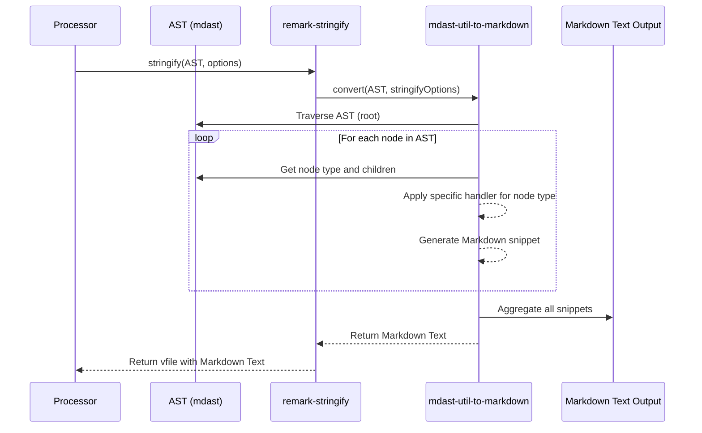

# Chapter 6: Stringifier (remark-stringify)

In the previous chapter, we delved into [Plugin](chapter_05.md)s, understanding how these powerful modules allow us to extend `remark`'s functionality, transforming the Abstract Syntax Tree (AST) to achieve various content modifications or analyses. We saw how a plugin can manipulate the structured representation of our Markdown. But after all that intricate work of parsing and transforming, how do we get back to a readable Markdown file? This is precisely where the Stringifier comes into play, completing the `remark`'s transformative journey.

---

### Problem & Motivation

Imagine you've used `remark-parse` to convert your Markdown into an AST, then applied several [Plugin](chapter_05.md)s to reformat headings, correct broken links, or even inject new content. At the end of this process, you have a wonderfully structured and modified AST. However, an AST isn't something you can easily share, publish on a website, or hand over to another text-based system. The core problem is: **how do we transform this programmatic, tree-like data structure back into human-readable and machine-interpretable Markdown text?**

This is crucial because the entire point of `remark` is often to take Markdown, process it, and *return* Markdown. Without a stringifier, the `remark` pipeline would be incomplete, akin to building a house but having no way to finish the walls or roof. It's the critical final step that delivers the processed content in its original, expected format.

A concrete use case demonstrating its importance is Markdown linting and auto-correction. You might parse a Markdown file, use plugins to identify and fix style violations (like inconsistent list markers or heading depths), and then use the Stringifier to output the *corrected* Markdown back to the user or save it to a file. Without `remark-stringify`, these corrections would remain trapped in the AST.

### Core Concept Explanation

The **Stringifier**, specifically provided by the `remark-stringify` package, is the module responsible for reversing the parsing process. Where `remark-parse` converts raw `Markdown Text` into an `Abstract Syntax Tree` (AST), `remark-stringify` takes an AST (which conforms to the `mdast` specification) and meticulously converts it back into a string of `Markdown Text`. It acts as the "unparser" or "serializer" for your Markdown content.

Think of it as a specialized translator. The AST is an internal, structured language that `remark` understands. The Stringifier's job is to translate that internal language back into standard Markdown syntax that humans and other Markdown tools can understand. It traverses the AST, node by node, and for each node type (e.g., heading, paragraph, list, code block), it knows the correct Markdown syntax to generate.

This process isn't just a simple one-to-one mapping; `remark-stringify` is smart about formatting. It considers various Markdown syntax preferences, such as whether to use `*` or `-` for unordered list items, how to indent code blocks, or the style for link definitions. This flexibility allows you to control the exact output style of your Markdown, ensuring consistency even after complex transformations.

### Practical Usage Examples

Let's see how `remark-stringify` is used, typically orchestrated by the main `remark` processor.

#### Example 1: Basic Stringification

Here, we'll create a simple AST programmatically and then use `remark` (with `remark-stringify` implicitly loaded) to convert it into Markdown text.

```javascript
import { remark } from 'remark';

// A simple mdast AST
const ast = {
  type: 'root',
  children: [
    {
      type: 'heading',
      depth: 1,
      children: [{ type: 'text', value: 'Hello Stringifier!' }],
    },
    {
      type: 'paragraph',
      children: [{ type: 'text', value: 'This is a test.' }],
    },
  ],
};

async function stringifyBasicAst() {
  const file = await remark().stringify(ast);
  console.log(String(file));
}

stringifyBasicAst();
```

**Expected Output:**

```markdown
# Hello Stringifier!

This is a test.
```

*Explanation*: We define a simple `mdast` object representing a heading and a paragraph. We then use `remark().stringify(ast)` to convert this AST directly into a Markdown string, demonstrating the core function of the Stringifier.

#### Example 2: Stringifying after a Plugin Transformation

This example demonstrates the complete cycle: parse Markdown, modify its AST using a plugin (similar to what we learned in Chapter 5), and then stringify the modified AST back into Markdown.

```javascript
import { remark } from 'remark';
import remarkPresetLintRecommended from 'remark-preset-lint-recommended';

// A simple plugin to add a paragraph
function mySimplePlugin() {
  return (tree) => {
    tree.children.push({
      type: 'paragraph',
      children: [{ type: 'text', value: 'Added by a plugin.' }],
    });
  };
}

async function processAndStringify() {
  const markdownInput = '# Original Heading\n\nSome initial content.';
  const file = await remark()
    .use(mySimplePlugin) // Our plugin modifies the AST
    .process(markdownInput); // Parser -> Plugin -> Stringifier (implicit)

  console.log(String(file));
}

processAndStringify();
```

**Expected Output:**

```markdown
# Original Heading

Some initial content.

Added by a plugin.
```

*Explanation*: We start with Markdown, then configure `remark` with `mySimplePlugin`. The `.process()` method orchestrates parsing, applying the plugin (which adds a new paragraph to the AST), and finally, `remark-stringify` converts the *modified* AST back into Markdown. This shows the Stringifier's role at the end of a typical `remark` workflow.

### Internal Implementation Walkthrough

The `remark-stringify` package, at its core, leverages `mdast-util-to-markdown`, a utility that converts an `mdast` (Markdown Abstract Syntax Tree) to Markdown text. When `remark`'s `.process()` method finishes with the AST and needs to produce output, it invokes `remark-stringify` (if configured), which then uses `mdast-util-to-markdown`.

Here's a simplified view of what happens internally:

1.  **Entry Point**: When `processor.process()` is called with an AST (or `processor.processSync()`), and a stringifier is loaded (implicitly by `remark()`, or explicitly by `remark().use(remarkStringify)`), the processor hands off the final AST to the stringifier.
2.  **Configuration**: `remark-stringify` takes an `AST` and an optional set of `options`. These options dictate the style of the output Markdown (e.g., `bullet: '*'`, `emphasis: '_'`, `strong: '*'`, `tightDefinitions: true`).
3.  **AST Traversal**: The stringifier performs a depth-first traversal of the AST. It starts from the `root` node and moves down through its `children`.
4.  **Node-to-Markdown Mapping**: For each node it encounters, it uses an internal mapping or a set of "handlers" to determine the correct Markdown syntax to generate:
    *   If it sees a `heading` node, it knows to output `#` for level 1, `##` for level 2, etc., followed by the content of its `children`.
    *   For a `paragraph` node, it concatenates the text of its children and wraps it with newline characters.
    *   For `list` nodes, it determines the bullet style (`*` or `-`) based on configuration and iterates through `listItem` children.
    *   For `text` nodes, it simply outputs the `value`.
5.  **Context and State**: During traversal, the stringifier maintains context, such as the current indentation level (important for lists and code blocks) or whether it's inside a link or image (which might require different handling for special characters).
6.  **Output Aggregation**: As it processes each node and generates its Markdown representation, it concatenates these pieces into a single output string.
7.  **Final Output**: Once the entire AST has been traversed and all nodes converted, the stringifier returns the complete Markdown string.



*Explanation*: The `Processor` hands the final `AST` to `remark-stringify`. `remark-stringify`, in turn, utilizes `mdast-util-to-markdown` which systematically traverses the AST. For each node, it applies specific rules to convert it into its Markdown equivalent, eventually assembling all these snippets into the final Markdown text output.

### System Integration

`remark-stringify` is a pivotal component in the `remark` unified system, acting as the final stage of transformation. It seamlessly integrates with other core `remark` concepts:

*   **Input from [Parser (remark-parse)](chapter_02.md) and [Plugin](chapter_05.md)s**: The Stringifier receives the AST, which was initially generated by the `Parser` and potentially modified by one or more `Plugin`s. It's designed to work with any valid `mdast` AST, regardless of its origin or previous transformations.
*   **Orchestration by [Processor (remark)](chapter_07.md)**: The `remark` `Processor` is the central orchestrator that ties everything together. When you call `processor.process()`, it manages the entire pipeline: `Markdown Text` -> `Parser` -> `AST` -> `Plugins` (modifying AST) -> `Stringifier` -> `Markdown Text`. The Stringifier is implicitly loaded and used by the `remark` processor unless explicitly configured otherwise.
*   **Output to [Virtual File (vfile)](chapter_04.md)**: The result of the stringification process is typically wrapped in a `vfile` object. This `vfile` will contain the new Markdown content in its `value` property, ready for further handling (e.g., writing to disk, displaying in a UI). Any messages (warnings, errors) generated during stringification (though less common than parsing or plugin steps) would also be attached to the `vfile`.

The data flow is a complete cycle:
`Markdown Text` -> (Parser creates AST) -> `AST` -> (Plugins modify AST) -> `Modified AST` -> (Stringifier converts AST to Text) -> `New Markdown Text`

This full loop is what makes `remark` so powerful for end-to-end Markdown processing.

### Best Practices & Tips

1.  **Configure Output Style**: `remark-stringify` offers various options to control the output Markdown's style. For consistency in your projects, especially in collaborative environments, standardize these options.
    ```javascript
    import { remark } from 'remark';
    import remarkStringify from 'remark-stringify';

    async function configureStringify() {
      const ast = {
        type: 'root',
        children: [{ type: 'list', ordered: false, children: [
          { type: 'listItem', children: [{ type: 'paragraph', children: [{ type: 'text', value: 'Item 1' }] }] },
          { type: 'listItem', children: [{ type: 'paragraph', children: [{ type: 'text', value: 'Item 2' }] }] }
        ]}]
      };

      // Configure bullet style to use '*'
      const file = await remark()
        .use(remarkStringify, { bullet: '*', emphasis: '_' })
        .stringify(ast);

      console.log(String(file));
    }

    configureStringify();
    ```
    **Output:**
    ```markdown
    * Item 1
    * Item 2
    ```
    *Explanation*: We explicitly pass options to `remarkStringify` to dictate the style of lists and emphasis, ensuring consistent output.

2.  **Handle Unknown Nodes Gracefully**: If your AST contains custom node types introduced by specialized plugins, ensure that either your custom plugins also provide stringification handlers or that `remark-stringify` is configured to handle them (if it supports extensions for custom nodes). Otherwise, unsupported nodes might be skipped or lead to errors.

3.  **Performance Considerations**: For very large ASTs, stringification can be computationally intensive. While `remark-stringify` is optimized, be mindful of processing extremely large files or performing stringification in tight loops.

4.  **Preserve Original Formatting (when desired)**: By default, `remark-stringify` generates "clean" Markdown. If you need to preserve original spacing, comments, or very specific formatting choices not captured in the AST, you might need more advanced techniques or custom stringifier extensions, as the AST itself doesn't typically retain *all* original textual nuances.

5.  **Debugging Stringifier Output**: If your output Markdown isn't what you expect, examine the AST *before* stringification. You can use tools like `mdast-util-to-hast` or `unist-util-inspect` to visualize the AST and confirm it contains the correct structure and data that you intend to stringify.

### Chapter Conclusion

We've explored **`remark-stringify`**, the essential component that brings the `remark` transformation full circle. We learned that it takes a structured `Abstract Syntax Tree` (AST) and converts it back into coherent `Markdown Text`, solving the critical problem of making programmatically modified content readable again. Its role is indispensable for any `remark` workflow that starts with and aims to return Markdown. Through practical examples and a glimpse into its internal workings, we've solidified our understanding of how it gracefully completes the `remark` pipeline.

With `remark-stringify` in our toolkit, we now understand how Markdown goes from raw text to an AST, gets modified, and finally returns to text. This sets the stage for our next chapter, where we'll bring all these pieces together and explore the **`Processor`**, the central orchestrator that binds `remark-parse`, `remark-stringify`, and `Plugin`s into a cohesive and powerful system.

Onward to the complete `remark` experience: [Processor (remark)](chapter_07.md).