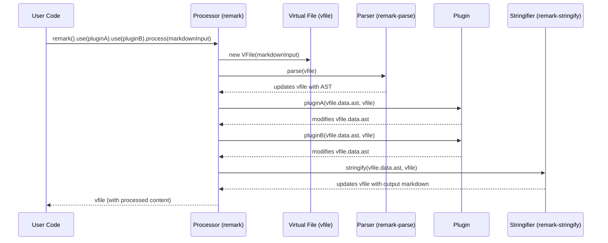

# Chapter 7: Processor (remark)

Our journey through the `remark` ecosystem has explored its individual components: from raw [Markdown Text](chapter_01.md) to the structured [Abstract Syntax Tree (AST)](chapter_03.md), the versatile [Virtual File (vfile)](chapter_04.md), the transformative [Plugins](chapter_05.md), and the specialized [Parser (remark-parse)](chapter_02.md) and [Stringifier (remark-stringify)](chapter_06.md). In the [previous chapter on Stringifiers](chapter_06.md), we learned how an AST can be converted back into Markdown text. While these individual modules are powerful on their own, a real-world Markdown transformation often requires a sequence of these operations: parsing, applying multiple modifications, and then stringifying. Managing this workflow manually would be complex and repetitive.

---

### Problem & Motivation

Imagine you have a Markdown document and you want to achieve several things: first, ensure all image URLs are relative; second, automatically generate unique IDs for all headings for easier linking; and finally, convert the modified content back into a Markdown string. If you had to do this with the individual `remark` components, you'd manually import the parser, call it, then loop through a list of plugin functions, passing the AST to each, and finally import the stringifier and call it. This chain of operations would quickly become cumbersome, prone to errors, and difficult to manage, especially with multiple plugins and files.

The core problem the `Processor` solves is the orchestration of this entire content transformation lifecycle. It provides a high-level, unified API to define a sequence of operations – parsing, transforming with plugins, and stringifying – as a single, cohesive workflow. This abstraction drastically simplifies how users interact with `remark`, allowing them to focus on *what* transformations they want to apply rather than *how* to coordinate the underlying modules. For our running example, the `Processor` will allow us to define our image URL adjustment and heading ID generation as a pipeline, effortlessly transforming our input Markdown.

---

### Core Concept Explanation

The **Processor (remark)** is the central engine of the `remark` ecosystem. Think of it as the conductor of an orchestra, where the `Parser`, `Stringifier`, and `Plugins` are the individual musicians. Its primary role is to manage and execute the entire pipeline for transforming Markdown content. When you interact with `remark`, you're almost always interacting with a `Processor` instance.

A `Processor` instance encapsulates the parsing mechanism, a list of active plugins, and the stringifying logic. It provides methods that allow you to define a sequence of transformations, abstracting away the intricate details of passing an [AST](chapter_03.md) and [Virtual File (vfile)](chapter_04.md) between different stages. The `Processor`'s `use()` method is particularly important; it allows you to register `Plugins` that will then be applied in the order they were added.

When you call a method like `process()` on a `Processor` instance, it orchestrates the entire workflow: it takes your input Markdown, sends it through its internal [Parser](chapter_02.md) to generate an [AST](chapter_03.md), then iteratively applies all registered [Plugins](chapter_05.md) to modify that AST, and finally uses its [Stringifier](chapter_06.md) to convert the potentially modified AST back into a Markdown string. All intermediate data and messages are managed through the [Virtual File (vfile)](chapter_04.md), ensuring a consistent and robust data flow throughout the transformation process.

---

### Practical Usage Examples

Let's revisit our use case: transforming Markdown to add unique IDs to headings. We'll start with a basic `Processor` setup.

First, ensure you have `remark` installed: `npm install remark`

```javascript
import { remark } from 'remark';

// Our input Markdown content
const markdownInput = `
# Hello World
This is some content.

## Another Heading
More text here.
`;

// A simple plugin to add a custom property to headings
function addHeadingIdPlugin() {
  return (tree) => {
    let idCounter = 0;
    // Walk through the AST
    // (Details of walking the AST are typically found in advanced plugin development)
    tree.children.forEach(node => {
      if (node.type === 'heading') {
        node.data = node.data || {};
        node.data.id = `heading-${++idCounter}`;
        console.log(`Assigned ID: ${node.data.id} to heading: "${node.children[0].value}"`);
      }
    });
  };
}

// 1. Create a processor instance and register our plugin
const processor = remark().use(addHeadingIdPlugin);

// 2. Process the Markdown synchronously
const file = processor.processSync(markdownInput);

console.log('\n--- Original Markdown ---');
console.log(markdownInput);
console.log('\n--- Processed Markdown ---');
console.log(String(file)); // Convert the vfile back to a string
```
The `remark()` function creates a new `Processor` instance. We then use the `.use()` method to register our `addHeadingIdPlugin`. Finally, `.processSync()` takes the input Markdown, runs it through the pipeline, and returns a `vfile` object containing the transformed content and any messages. The `console.log` inside the plugin shows it's working by assigning IDs.

---

### Internal Implementation Walkthrough

The `Processor` works by maintaining an internal state that includes its configured parser, stringifier, and a list of plugins. When you call a method like `process()`, it orchestrates these components in a specific sequence:

1.  **Initialization**: When `remark()` is called, it creates a `Processor` instance. By default, this instance is configured with `remark-parse` as its parser and `remark-stringify` as its stringifier.
2.  **Plugin Registration**: The `.use(plugin)` method is called to register plugins. Each call to `.use()` returns a *new* `Processor` instance with the added plugin, allowing for functional, immutable composition. Plugins are stored in an ordered list.
3.  **Input Handling**: When `processor.process(markdownText)` or `processor.processSync(markdownText)` is invoked, the input `markdownText` is first wrapped in a new [Virtual File (vfile)](chapter_04.md) object. This `vfile` becomes the central container for the content, its path, and any messages (warnings/errors) throughout the process.
4.  **Parsing**: The `Processor` uses its configured [Parser (remark-parse)](chapter_02.md) to convert the Markdown content from the `vfile` into an [Abstract Syntax Tree (AST)](chapter_03.md). This AST is then stored on the `vfile` (e.g., `vfile.data.ast`).
5.  **Plugin Execution**: The `Processor` then iterates through its list of registered [Plugins](chapter_05.md). For each plugin, it calls the plugin function, passing the current AST and the `vfile` as arguments. Plugins modify the AST in place or add messages to the `vfile`. This step can be synchronous or asynchronous depending on the plugins.
6.  **Stringifying**: After all plugins have run, the `Processor` takes the modified AST from the `vfile` and passes it to its configured [Stringifier (remark-stringify)](chapter_06.md). The stringifier converts the AST back into a Markdown string, which is then stored back on the `vfile` (e.g., `vfile.value`).
7.  **Output**: Finally, the `vfile` object, containing the processed Markdown, any messages, and the final AST, is returned to the user.

Here's a simplified sequence diagram illustrating this flow:



---

### System Integration

The `Processor` is the glue that holds the entire `remark` system together, integrating all the other core components into a coherent workflow:

*   **[Parser (remark-parse)](chapter_02.md)**: The `Processor` implicitly uses `remark-parse` (or a compatible parser) to convert the initial Markdown text into an [Abstract Syntax Tree (AST)](chapter_03.md). This is the very first step in its transformation pipeline.
*   **[Abstract Syntax Tree (AST)](chapter_03.md)**: The AST is the central data structure that the `Processor` manages. It's generated by the parser, passed to all plugins for modification, and then consumed by the stringifier. The `Processor` ensures the AST is correctly passed between these stages, typically stored on the `vfile.data.ast` property.
*   **[Virtual File (vfile)](chapter_04.md)**: The `vfile` is the primary communication channel for the `Processor`. It's initialized with the input content, carries the AST, accumulates messages (warnings, errors) from plugins, and finally holds the output Markdown. All parts of the `remark` pipeline interact through this unified file object.
*   **[Plugin](chapter_05.md)**: Plugins are the core extensibility mechanism. The `Processor` is responsible for registering and executing plugins in the correct order. It passes the current AST and `vfile` to each plugin, allowing them to inspect and modify the content or add specific metadata and messages.
*   **[Stringifier (remark-stringify)](chapter_06.md)**: After all transformations by plugins are complete, the `Processor` uses `remark-stringify` (or a compatible stringifier) to convert the modified AST back into a Markdown string. This is typically the final step of a complete `process()` operation.

The `Processor` effectively abstracts these individual modules, providing a user-friendly facade that allows developers to define complex Markdown transformations with minimal boilerplate.

---

### Best Practices & Tips

*   **Immutable Processors**: Each call to `remark()` creates a *new* processor instance. Similarly, `processor.use(plugin)` returns a *new* processor instance with the plugin added. This immutability is powerful for building complex pipelines declaratively and avoiding unintended side effects.
    ```javascript
    import { remark } from 'remark';

    const baseProcessor = remark(); // Processor A
    const processorWithPluginA = baseProcessor.use(() => console.log('Plugin A')); // Processor B
    const processorWithPluginAB = processorWithPluginA.use(() => console.log('Plugin B')); // Processor C

    // baseProcessor is unchanged and doesn't have any plugins.
    // Each .use() creates a new processor.
    ```
*   **Synchronous vs. Asynchronous Processing**:
    *   Use `processor.processSync(content)` for simpler, non-blocking transformations. This is suitable when all your plugins are synchronous.
    *   Use `await processor.process(content)` for asynchronous workflows, especially when plugins might involve I/O operations (e.g., fetching data, writing files). The asynchronous version returns a Promise.
*   **Order Matters**: The order in which you `.use()` plugins is crucial, as they operate sequentially on the AST. For example, a plugin that adds properties to images should run before a plugin that filters images based on those properties.
*   **Error Handling and Messages with `vfile`**: Plugins should add warnings or errors to the `vfile` object instead of throwing exceptions directly where possible. The `vfile` collects these messages, allowing the `Processor` to return a comprehensive report.
    ```javascript
    import { remark } from 'remark';

    function myWarningPlugin() {
      return (tree, file) => {
        // Add a warning message to the vfile
        file.message('Found something potentially problematic!', tree.children[0]);
      };
    }

    const file = remark().use(myWarningPlugin).processSync('## My Heading');
    console.log(file.messages); // Array of warnings/errors
    ```
*   **Composing Processors**: You can use an existing processor to create a new one, inheriting its plugins. This is useful for building specialized processors on top of a common base.
    ```javascript
    import { remark } from 'remark';

    const baseProcessor = remark().use(() => console.log('Base Plugin'));
    const specializedProcessor = baseProcessor.use(() => console.log('Special Plugin'));

    specializedProcessor.processSync('# Test'); // Will run both base and special plugins
    ```

---

### Chapter Conclusion

The `Processor` is the culmination of all the concepts we've explored in this tutorial. It is the central piece that unites parsing, AST manipulation via plugins, and stringification into a seamless, robust, and extensible workflow. By providing a high-level API, `remark` empowers developers to perform complex Markdown transformations with remarkable simplicity and flexibility.

You've now successfully navigated the entire `remark` ecosystem, understanding its core components and how they fit together to transform Markdown content from raw text to a structured AST and back again. From the basic building blocks of [Markdown Text](chapter_01.md) and the [Virtual File (vfile)](chapter_04.md), through the specialized operations of the [Parser (remark-parse)](chapter_02.md) and [Stringifier (remark-stringify)](chapter_06.md), the powerful extensibility of [Plugins](chapter_05.md), and the unifying force of the `Processor`, you now possess a comprehensive understanding of how `remark` works and how to leverage it for your own projects. This concludes our tutorial on the `remark` project!