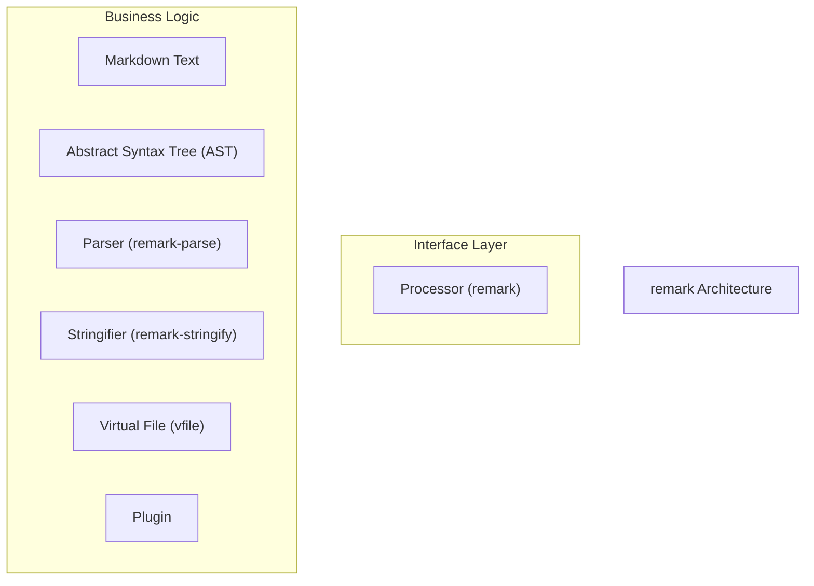
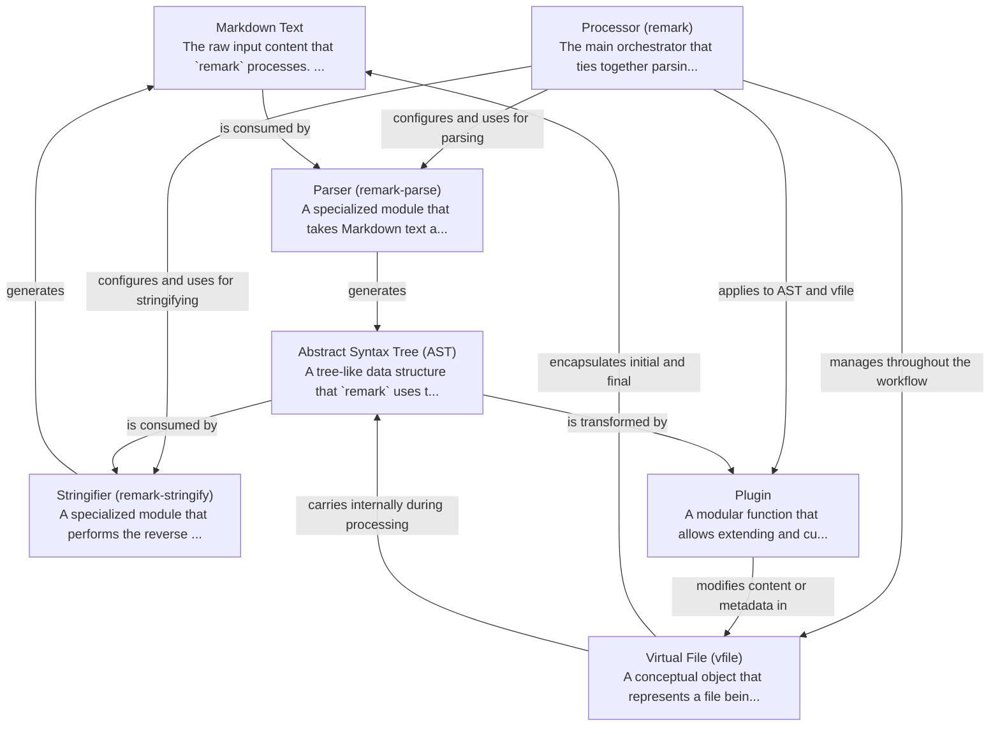

# remark Tutorial

Welcome to the comprehensive tutorial for remark. This tutorial is automatically generated from the codebase to help you understand the core concepts and implementation patterns.

## Project Overview

'remark' is a unified system for transforming Markdown content. It converts raw 'Markdown Text' into an 'Abstract Syntax Tree' ('AST') via a 'Parser', enables custom modifications using 'Plugins' that operate on the 'AST' and 'Virtual File', and finally converts the modified 'AST' back into 'Markdown Text' via a 'Stringifier', all orchestrated by a 'Processor'.

## System Architecture

## Component Relationships

## Table of Contents

1. [Chapter 1: Markdown Text](chapter_01.md) - Comprehensive documentation for Markdown Text following structured methodology...
2. [Chapter 2: Parser (remark-parse)](chapter_02.md) - Comprehensive documentation for Parser (remark-parse) following structured methodology...
3. [Chapter 3: Abstract Syntax Tree (AST)](chapter_03.md) - Comprehensive documentation for Abstract Syntax Tree (AST) following structured methodology...
4. [Chapter 4: Virtual File (vfile)](chapter_04.md) - Comprehensive documentation for Virtual File (vfile) following structured methodology...
5. [Chapter 5: Plugin](chapter_05.md) - Comprehensive documentation for Plugin following structured methodology...
6. [Chapter 6: Stringifier (remark-stringify)](chapter_06.md) - Comprehensive documentation for Stringifier (remark-stringify) following structured methodology...
7. [Chapter 7: Processor (remark)](chapter_07.md) - Comprehensive documentation for Processor (remark) following structured methodology...

## How to Use This Tutorial

1. **Start with Chapter 1** to understand the foundational concepts
2. **Follow the sequence** - each chapter builds upon previous concepts
3. **Practice with code examples** - every chapter includes practical examples
4. **Refer to diagrams** - use architecture diagrams for visual understanding
5. **Cross-reference concepts** - chapters link to related topics

## Tutorial Features

- **Progressive Learning**: Concepts are introduced in logical order
- **Code Examples**: Every chapter includes practical, executable code
- **Visual Diagrams**: Mermaid diagrams illustrate complex relationships
- **Cross-References**: Easy navigation between related concepts
- **Beginner-Friendly**: Written for newcomers to the codebase

## Contributing

This tutorial is auto-generated from the codebase. To improve it:
1. Update the source code documentation
2. Add more detailed comments to key functions
3. Regenerate the tutorial using the documentation system

---

*Generated using AI-powered codebase analysis*
