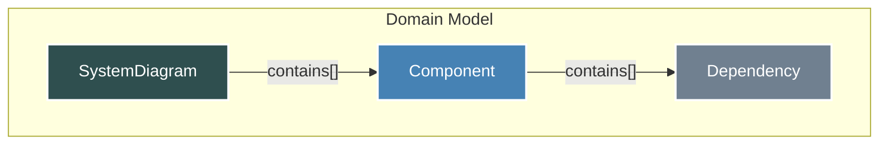

# Chapter 1: Domain Model & Types

- Initialization point.

## Architectural Intent & Motivation

The Domain Model serves as the canonical, language-agnostic data schema for representing the analyzed source code within the `swark` pipeline. Its primary responsibility is to translate the unstructured, natural-language output of the generative AI into a strictly-typed, machine-readable format. This structured representation acts as the central "source of truth" that decouples the AI response parsing logic from the downstream diagram generation and visualization logic.

This abstraction satisfies the core business requirement of `swark`: transforming raw code into a visual architecture diagram. By establishing a stable contract, we can independently evolve the AI interaction (e.g., swapping models, changing prompts) and the visualization layer (e.g., adding new diagram types) without breaking the system's internal data flow.

## Contextual Use Case

A developer triggers the `swark` analysis on a Python microservice project. The "AI Model Interaction" module sends the code to a generative AI and receives a JSON object describing the system's components. The "Response Formatting" module then takes this raw, untyped JSON. Its sole task is to validate and map this data into a `SystemDiagram` object, which is composed of multiple `Component` instances. This strongly-typed `SystemDiagram` object is then passed to the "Mermaid Diagram Generation" module. Without this domain model, the diagram generator would have to work with unreliable, untyped data, making the system brittle and prone to runtime errors.

## Concept Decomposition

The domain model is deconstructed into three primary data structures that form a hierarchical relationship.

*   **`SystemDiagram`**: The root entity of the model. It acts as a container for the entire collection of components that constitute the analyzed system. It includes top-level metadata, such as the title for the resulting diagram.

*   **`Component`**: The fundamental building block of the architecture. A `Component` represents a single logical unit identified in the source code, such as a service, a repository, a controller, or a utility module. It encapsulates its own properties, responsibilities, and relationships.

*   **`Dependency`**: A directional link that defines the relationship between two `Component`s. It represents a call, data flow, or an import statement from a source component to a target component.

## Reference Implementation

The domain model is defined using TypeScript interfaces to enforce structural consistency throughout the application pipeline.

### Interface Definitions

These interfaces define the shape of the data that flows between the parsing and generation stages.

```typescript
// Defines a directed link between two components.
interface Dependency {
  target: string; // The name of the component being depended on.
  description: string; // The nature of the interaction.
}

// Represents a single logical unit in the software architecture.
interface Component {
  name: string;
  type: 'service' | 'repository' | 'controller' | 'module' | 'external';
  responsibilities: string[];
  dependencies: Dependency[];
}

// The root container for the entire analyzed system.
interface SystemDiagram {
  title: string;
  components: Component[];
}
```

### Canonical Instantiation

The following snippet demonstrates how a `SystemDiagram` object is constructed after a successful AI response parse.

```typescript
const parsedSystem: SystemDiagram = {
  title: "User Authentication System",
  components: [
    {
      name: "AuthService",
      type: "service",
      responsibilities: ["Manages user login and token generation."],
      dependencies: [{ target: "UserRepository", description: "Fetches user data" }],
    },
    {
      name: "UserRepository",
      type: "repository",
      responsibilities: ["Interacts with the user database."],
      dependencies: [],
    },
  ],
};
```

## Architectural Mechanics (White-Box Analysis)

### Design Pattern Identification

The types defined in the domain model (`SystemDiagram`, `Component`, `Dependency`) are implementations of the **Data Transfer Object (DTO)** pattern.

*   **Justification**: These objects have no business logic or behavior of their own. Their sole purpose is to act as data carriers, transferring state between the distinct stages of the `swark` pipeline (AI Parsing -> Diagram Generation -> Persistence). This keeps the pipeline stages decoupled and the data flow explicit and easy to reason about.

### Control Flow/State

The domain model objects are designed to be **immutable**. Once an instance of `SystemDiagram` is created by the "Response Formatting" module, it should be treated as read-only by all subsequent modules. This one-way data flow prevents side effects where a downstream process might unexpectedly alter the data, leading to inconsistencies between the generated diagram and the persisted results. The state is self-contained and passed by value (or reference, treated as value) through the pipeline.

## Architectural Visualization (Mermaid)

A Component Topology diagram best illustrates the structural composition of the domain model itself. It shows how the top-level `SystemDiagram` is composed of smaller, well-defined data structures.



## System Topology & Integration

### Dependency Graph

*   **Upstream (Dependents)**: Modules that *consume* the domain model.
    *   **`Mermaid Diagram Generation`**: Depends on the `SystemDiagram` interface to access the component list and their relationships to build the Mermaid syntax.
    *   **`Result Persistence`**: Depends on the `SystemDiagram` object to serialize and save the structured analysis result to disk.
    *   **`Webview-based Visualization`**: Indirectly depends on the model, as the data it receives is a direct product of it.

*   **Downstream (Dependencies)**: The domain model itself has **no runtime dependencies**. It consists of pure TypeScript type definitions that are erased at compile time.

### Data Propagation

*   **Ingress**: A fully-formed `SystemDiagram` object is created and enters this boundary from the "Response Formatting" module. This module is the sole constructor of the canonical domain model.
*   **Egress**: The `SystemDiagram` object is passed as a function argument to the "Mermaid Diagram Generation" and "Result Persistence" modules for processing.

## Engineering Standards

### Performance Implications

The performance footprint of the domain model types themselves is negligible. They are simple in-memory object structures. Accessing properties has a time complexity of O(1). Performance considerations are relevant in the modules that *process* these objects; for instance, an algorithm that processes a `SystemDiagram` with thousands of components and dependencies may have a higher complexity (e.g., O(N^2) for analyzing all-to-all relationships).

### Anti-Patterns

*   **Model Mutation**: A downstream module (e.g., diagram generation) modifying the `SystemDiagram` object it receives. This violates the immutability principle and can lead to data inconsistency.
*   **Logic Contamination**: Adding methods or business logic to the `Component` or `SystemDiagram` interfaces. These should remain pure DTOs; all processing logic should reside within the pipeline modules.
*   **Schema Bypass**: Allowing untyped, "duck-typed" objects that resemble the domain model to pass through the pipeline. Strict type checking must be enforced at the boundary (i.e., in the "Response Formatting" module) to guarantee systemic integrity.

## Conclusion

The Domain Model & Types chapter establishes the foundational data contract for the entire `swark` application. By defining a clear, rigid, and decoupled schema, it provides the stability and predictability necessary for a multi-stage processing pipeline. This central model ensures that source code analysis, however complex, is translated into a consistent structure, enabling reliable and maintainable diagram generation.

- Forward Link: [Workspace Data Ingestion](chapter_02.md)