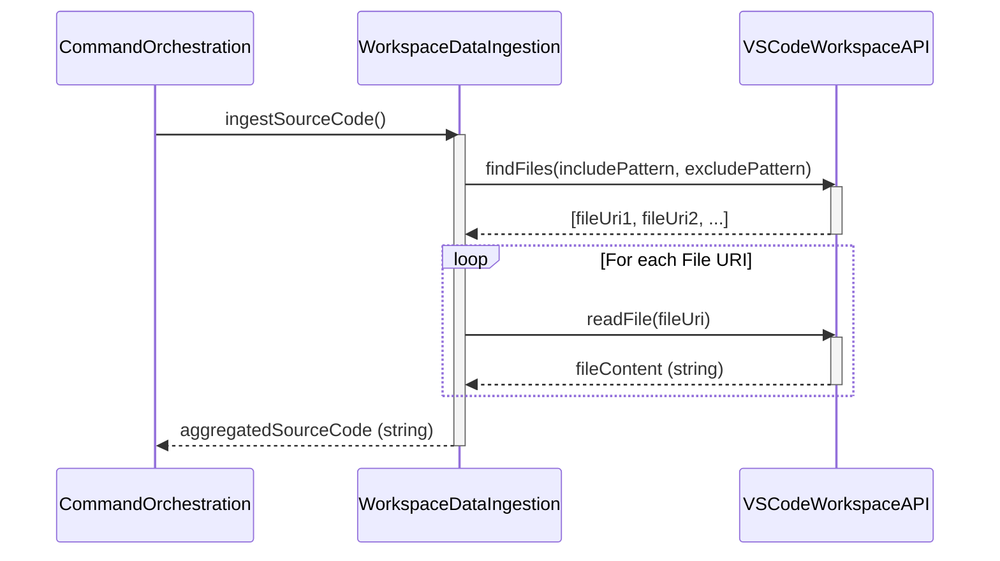

# Chapter 2: Workspace Data Ingestion

- Reference: [Domain Model & Types](chapter_01.md)

### Architectural Intent & Motivation

The Workspace Data Ingestion module serves as the foundational data provider for the entire `swark` analysis pipeline. Its precise responsibility is to bridge the gap between the user's file system, as represented by the VS Code workspace, and the system's internal analytical components.

This abstraction satisfies the primary business requirement of the application: to operate on user-provided source code. By isolating file system interactions, it decouples the core analysis logic from the complexities of file discovery, asynchronous I/O, and platform-specific path handling. It provides a clean, aggregated source code artifact to the rest of the pipeline.

### Contextual Use Case

A software architect opens a multi-file microservice project in VS Code. To understand the service's structure, they invoke the `swark: Generate Diagram` command. The first action performed by the system is to trigger the Workspace Data Ingestion module. This module identifies all relevant source files (e.g., `*.ts`, `*.go`) within the active workspace, reads their contents from disk, and consolidates them into a single block of text. This text block then becomes the primary input for the subsequent LLM analysis stage. Without this initial ingestion, the pipeline has no data to process.

### Concept Decomposition

*   **Workspace Boundary:** The logical scope of files and folders accessible to the extension, defined by the user's currently open project in VS Code.
*   **File Selection Strategy:** The mechanism for identifying which files within the Workspace Boundary are relevant for analysis. This process is critical for filtering out irrelevant assets (e.g., `node_modules`, build artifacts, binary files) and focusing only on source code. The strategy may be driven by user configuration, file pickers, or predefined glob patterns.
*   **Content Aggregation:** The process of reading the raw text content of each selected file and combining it into a unified data structure, typically a single string. This aggregated string is annotated to preserve file context, ensuring the LLM can differentiate between code from different files.

### Reference Implementation

The following conceptual snippet demonstrates the canonical flow. It abstracts the specific VS Code API calls to focus on the logical sequence of operations.

```typescript
// Conceptual flow for ingesting workspace data

// 1. Identify target file URIs based on the active workspace and a
//    pre-defined inclusion/exclusion strategy.
const targetFileUris = resolveRelevantWorkspaceFiles();

// 2. Asynchronously read and aggregate the content from each file.
let aggregatedSourceText = "";
for (const uri of targetFileUris) {
    const fileContent = await readTextFromUri(uri);
    // Annotate content with file path for contextual integrity
    aggregatedSourceText += `\n--- FILE: ${uri.path} ---\n${fileContent}`;
}

// 3. Return the complete string for the next pipeline stage.
return aggregatedSourceText;
```

### Architectural Mechanics (White-Box Analysis)

*   **Design Pattern Identification:** This module implements the **Facade** pattern. It provides a simple, high-level interface (e.g., `ingestWorkspaceCode()`) to the rest of the `swark` application, while encapsulating the more complex, low-level interactions required to communicate with the `vscode.workspace` and `vscode.fs` APIs for file discovery and reading.

*   **Control Flow/State:** The control flow is linear and event-driven, initiated by the Command Orchestration module. The component is **stateless**; it does not retain any information about the workspace or file content between invocations. Its execution is inherently asynchronous to prevent blocking the VS Code extension host while performing file I/O operations.

### Architectural Visualization (Mermaid)

The interaction is a clear sequence between the orchestrator, the ingestion module, and the underlying editor API. A Sequence Diagram is the most appropriate visualization.



### System Topology & Integration

*   **Dependency Graph:**
    *   **Upstream (Dependents):** The `Command Orchestration` (Chapter 9) component is the sole upstream consumer. It invokes this module to begin the analysis workflow.
    *   **Downstream (Dependencies):** This module's primary dependency is the core VS Code Extension API, specifically the `vscode.workspace` namespace for accessing file system information and content.

*   **Data Propagation:**
    *   **Input:** The module receives a trigger signal from the orchestrator. It implicitly operates on the context of the currently active VS Code workspace.
    *   **Output:** It produces a single, primitive `string` containing the aggregated and annotated source code. This string is passed directly as input to the `LLM Prompt Construction` (Chapter 3) module.

### Engineering Standards

*   **Performance Implications:** The operational complexity is directly tied to file system I/O. The time complexity can be modeled as O(N * M), where N is the number of files selected and M is their average size. In projects with thousands of files, this initial step can be a significant performance bottleneck. All I/O operations *must* be asynchronous to avoid freezing the extension's UI thread.

*   **Anti-Patterns:**
    *   **Synchronous I/O:** Using synchronous file read APIs would block the extension host, leading to an unresponsive UI and a poor user experience. This is the most critical anti-pattern to avoid.
    *   **Over-Ingestion:** A failure to correctly configure file exclusion patterns (e.g., `node_modules`, `.git`, `dist/`) will lead to the ingestion of irrelevant data. This wastes LLM tokens, pollutes the analytical context, and can lead to inaccurate or nonsensical outputs.
    *   **Ignoring Workspace Trust:** The module must respect VS Code's Workspace Trust security feature, failing gracefully or refusing to read files if the workspace is not trusted by the user.

### Conclusion

The Workspace Data Ingestion module is a foundational component that acts as the gateway for all source code entering the `swark` analysis pipeline. By implementing a Facade over the VS Code API, it provides a clean, reliable, and asynchronous source of data, enabling the downstream components to focus purely on analysis and generation tasks.

- Next: [LLM Prompt Construction](chapter_03.md)