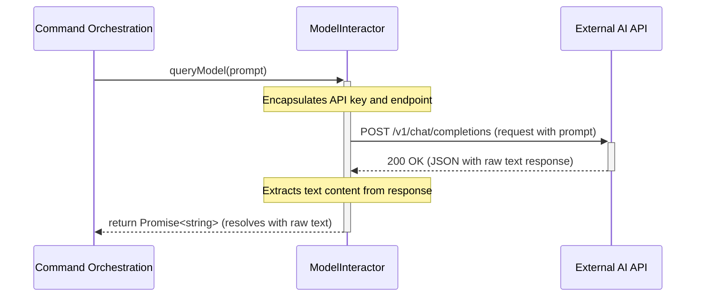

# Chapter 4: AI Model Interaction

- **Reference**: [LLM Prompt Construction](chapter_03.md)

### Architectural Intent & Motivation

The AI Model Interaction abstraction serves as the dedicated communication gateway between the `swark` extension and the external generative AI service. Its primary responsibility is to encapsulate the entire network communication lifecycle: sending a prepared prompt, handling authentication, managing the asynchronous nature of the request, and receiving the raw response.

This component satisfies the critical architectural requirement of **decoupling**. By isolating the logic for third-party API interaction, the rest of the `swark` pipeline remains agnostic to the specific AI provider, its authentication scheme, or its API endpoint structure. This design allows for easier maintenance, testing (via mocking), and future swapping of the underlying AI model without impacting core application logic.

### Contextual Use Case

Within the `swark` analysis pipeline, this component is invoked immediately after a prompt has been fully assembled by the `LLM Prompt Construction` module. The `Command Orchestration` component, acting as the pipeline driver, passes the finalized prompt string to the `ModelInteractor`.

**Scenario:** A user triggers the "Generate Architecture Diagram" command.
1.  **Workspace Data Ingestion** gathers the relevant source code.
2.  **LLM Prompt Construction** builds a detailed prompt string containing the code and analysis instructions.
3.  The orchestrator passes this prompt to the `ModelInteractor`.
4.  The `ModelInteractor` is now solely responsible for transmitting this prompt to the configured AI API and awaiting a response. Without this component, the pipeline would halt, as there is no other mechanism to bridge the gap between the internally prepared data and the external analysis engine.

### Concept Decomposition

*   **Model Interactor:** The primary class embodying this abstraction. It exposes a simplified public API for querying the AI model, hiding the underlying complexity of network requests, headers, and error handling.
*   **API Configuration:** A data structure, likely injected into the `ModelInteractor`, containing the necessary credentials (API Key), model identifier (e.g., `gpt-4o`), and API endpoint. This configuration is sourced from the user's VS Code settings.
*   **Request/Response Cycle:** The fundamental asynchronous operation managed by this component. It initiates a request, enters a pending state while awaiting the remote server, and eventually resolves with the AI-generated text or rejects with a network or API error.

### Reference Implementation

The following snippet demonstrates the canonical usage of the `ModelInteractor` within the command orchestration flow. It highlights the asynchronous nature of the call and the necessity of error handling.

```typescript
// Executed within the Command Orchestration logic
import { ModelInteractor } from './ModelInteractor';
import { vscode } from 'vscode';

// Assume apiConfig is retrieved from vscode.workspace.getConfiguration('swark')
const interactor = new ModelInteractor(apiConfig);
const promptText = "Analyze the following TypeScript code and identify its core components...";

async function executeAIQuery(prompt: string) {
    try {
        // The core responsibility: send prompt and await raw response
        const rawModelResponse: string = await interactor.queryModel(prompt);

        // The response is now ready for the next stage: Response Formatting
        return rawModelResponse;
    } catch (error) {
        // Gracefully handle API errors or network failures
        vscode.window.showErrorMessage(`AI model interaction failed: ${error.message}`);
        throw error; // Propagate failure to halt the pipeline
    }
}
```

### Architectural Mechanics (White-Box Analysis)

#### Design Pattern Identification

*   **Facade:** The `ModelInteractor` class is a textbook example of the Facade pattern. It provides a simple, high-level interface (`queryModel(prompt)`) that conceals a more complex underlying subsystem. This subsystem includes the intricacies of the `fetch` API or a vendor-specific SDK, request body serialization, authentication header management, and response parsing. This simplifies its use by the `Command Orchestration` component.

#### Control Flow/State

The control flow is inherently asynchronous.
1.  The `queryModel` method is invoked, immediately returning a `Promise`.
2.  The `ModelInteractor` enters an internal "pending" state as it constructs and dispatches the HTTP request to the external API.
3.  The application's execution proceeds, with the `await` keyword effectively pausing the current execution context (but not blocking the VS Code UI thread).
4.  Upon receiving a response, the `Promise` is either:
    *   **Resolved:** with the raw string payload from the AI model's successful response.
    *   **Rejected:** with an `Error` object if the network request fails, the API returns a non-2xx status code, or a timeout occurs.

The `ModelInteractor` instance itself is typically stateless; state is managed on a per-request basis via the returned `Promise`.

### Architectural Visualization (Mermaid)

A Sequence Diagram is the most appropriate visualization, as it clearly illustrates the asynchronous, multi-party communication between the `swark` extension and the external AI service.



### System Topology & Integration

#### Dependency Graph

*   **Upstream (Dependents):** The `Command Orchestration` module is the sole direct consumer of the `ModelInteractor`. It depends on this component to execute the AI analysis step of its pipeline.
*   **Downstream (Dependencies):**
    *   **External AI API:** Has a hard dependency on a specific third-party AI service provider's HTTP API.
    *   **VS Code API:** Relies on `vscode.workspace.getConfiguration` to securely fetch user-provided settings like API keys and model preferences.
    *   **LLM Prompt Construction:** Consumes the `string` output from this upstream module as its primary input.

#### Data Propagation

*   **Ingress:** The primary data input is a `string` variable, representing the fully constructed prompt ready for transmission.
*   **Egress:** The component's output is a `Promise<string>`. Upon successful resolution, this promise yields the raw, unstructured text response from the AI model. This string is then passed directly to the `Response Formatting` chapter for parsing and structuring.

### Engineering Standards

#### Performance Implications

The performance of this component is entirely I/O-bound and outside the control of the extension's local execution environment. Latency is determined by:
1.  Network conditions between the user and the AI service.
2.  The current load on the AI service provider's infrastructure.
3.  The complexity of the prompt and the resulting inference time required by the model.

Implementation must include robust timeout handling to prevent the extension from hanging indefinitely on a stalled network request. The computational complexity from the extension's perspective is O(1).

#### Anti-Patterns

*   **Missing Error Handling:** Failing to wrap the `queryModel` call in a `try/catch` block. An unhandled promise rejection from an API or network error would crash the entire pipeline.
*   **Hardcoded Credentials:** Embedding API keys directly in the source code is a severe security vulnerability. All credentials MUST be sourced from the VS Code configuration or secret storage APIs.
*   **Blocking the Main Thread:** Using synchronous HTTP request methods (a legacy practice) would freeze the entire VS Code window until the API responds. All interactions must be asynchronous using `async/await`.

### Conclusion

The **AI Model Interaction** component serves as a robust and isolated gateway to external AI services. By applying the Facade pattern, it simplifies a complex and failure-prone process (network communication) into a single, predictable asynchronous method call. This abstraction is fundamental to the system's modularity, ensuring that the core logic of code analysis is cleanly separated from the implementation details of the AI provider it communicates with.

- **Forward Link**: [Response Formatting](chapter_05.md)