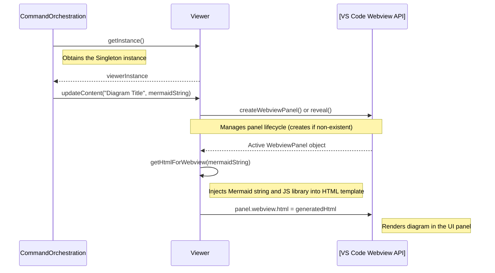

# Chapter 8: Webview-based Visualization

-   Reference: [Result Persistence](chapter_07.md)

### Architectural Intent & Motivation

The Webview-based Visualization abstraction is the primary user interface component for displaying analysis results. Its precise responsibility is to render a Mermaid diagram string within a dedicated, sandboxed VS Code Webview panel.

This component satisfies the core business requirement of providing immediate, integrated visual feedback to the user. By encapsulating all interactions with the VS Code `WebviewPanel` API, it decouples the application's core data processing pipeline from the platform-specific presentation layer. This separation of concerns ensures that changes to the UI framework or visualization libraries do not impact the data generation logic in preceding chapters.

### Contextual Use Case

A user executes the `swark.analyze` command on their active source code file. The command orchestrator drives the full analysis pipeline, culminating in the generation of a Mermaid diagram string (as detailed in Chapter 6). To display this result, the orchestrator invokes the `Viewer` component. The `Viewer` then either creates a new Webview panel titled "Swark Analysis Result" or updates an existing one with the newly generated diagram, making the analysis visible to the user without them ever leaving the editor.

### Concept Decomposition

*   **Viewer:** The primary class that encapsulates the logic for creating, showing, updating, and disposing of the VS Code Webview panel. It serves as a high-level API for all visualization operations.
*   **Webview Panel:** The native VS Code UI construct that hosts web-based content (HTML, CSS, JavaScript). The `Viewer` class manages the lifecycle and content of this panel.
*   **Panel State Management:** The internal logic within the `Viewer` responsible for tracking whether the Webview panel currently exists, is visible, or has been disposed of by the user. This prevents the creation of duplicate panels and ensures content is delivered to the correct UI element.

### Reference Implementation

The `Viewer` is designed to be managed as a Singleton to ensure only one analysis panel is active at any time. The `Command Orchestration` module interacts with it after generating the diagram syntax.

```typescript
// Located within the command orchestration logic...

// Assumes 'mermaidSyntax' is a string generated by the MermaidDiagramGenerator
const mermaidSyntax: string = "graph TD; A-->B;";

// Get the single, shared instance of the Viewer
const viewer = Viewer.getInstance();

// Update the webview with the new diagram.
// This method handles creating the panel if it doesn't exist,
// or revealing and updating it if it does.
viewer.updateContent(
    "Swark Analysis Result",
    mermaidSyntax
);
```

### Architectural Mechanics (White-Box Analysis)

#### Design Pattern Identification

*   **Singleton:** The `Viewer` class is implemented using the Singleton pattern. This is critical for managing a single, consistent UI panel for displaying results. It prevents multiple "Swark Analysis Result" windows from being created during a single session, which would confuse the user and complicate state management. A static `getInstance()` method provides global access to the single `Viewer` instance.
*   **Facade:** The `Viewer` class acts as a Facade over the more complex VS Code Webview API. It exposes a simple interface (e.g., `updateContent`) while hiding the underlying details of panel creation, HTML content construction, message passing, and lifecycle event handling (`onDidDispose`).

#### Control Flow/State

The control flow is initiated externally by the `Command Orchestration` module. The `Viewer`'s internal state is centered around a private member variable holding the `vscode.WebviewPanel` instance.

1.  When `updateContent` is called, the `Viewer` first checks if its internal panel instance exists and has not been disposed.
2.  **If the panel exists:** It updates the `.html` property of the panel's webview and calls `.reveal()` to bring the panel into focus.
3.  **If the panel does not exist:** It calls `vscode.window.createWebviewPanel()` to create a new panel, stores the instance, and sets up an `onDidDispose` event listener to nullify its internal reference when the user closes it.
4.  The state is mutable, directly tied to the lifecycle of the VS Code UI element it manages.

### Architectural Visualization (Mermaid)

The following sequence diagram illustrates the interaction between the command orchestrator, the `Viewer`, and the underlying VS Code API to render a diagram.



### System Topology & Integration

#### Dependency Graph

*   **Upstream (Dependents):**
    *   `Command Orchestration` (Chapter 9): This is the sole upstream consumer. It relies on the `Viewer` to fulfill the final "visualize" step of the primary application workflow.

*   **Downstream (Dependencies):**
    *   `vscode` (External API): The `Viewer` has a direct, hard dependency on the VS Code extension API, specifically the `vscode.window` and `vscode.WebviewPanel` interfaces. It cannot function outside of a VS Code extension host environment.
    *   `Mermaid.js` (External Library): The HTML generated by the `Viewer` includes the Mermaid.js rendering library, which is bundled with the extension and loaded inside the webview.

#### Data Propagation

*   **Ingress:** The primary entry point is the `updateContent(title: string, mermaidSyntax: string)` method. It accepts a title for the panel and the raw Mermaid diagram syntax string generated by the `Mermaid Diagram Generation` module.
*   **Egress:** This component is a terminal node in the data pipeline. It does not return any data to its callers. Its sole output is the visual rendering of the diagram within the VS Code user interface.

### Engineering Standards

#### Performance Implications

*   **Payload Size:** The primary performance consideration is the size of the HTML string set on the `webview.html` property. Extremely large diagrams with thousands of nodes can result in a large HTML payload, potentially causing a minor delay in rendering.
*   **Re-Renders:** The current implementation replaces the entire HTML content on each update. This is simple and effective for this use case but is less efficient than a message-passing approach that could update the diagram in-place using JavaScript. Given the non-interactive nature of the diagrams, this trade-off is acceptable.

#### Anti-Patterns

*   **Leaking API Details:** The `Viewer`'s public interface must not expose the raw `vscode.WebviewPanel` object. Doing so would violate the Facade pattern and couple the `Command Orchestration` module directly to the VS Code API, defeating the purpose of this abstraction.
*   **Neglecting Lifecycle Events:** Failing to properly handle the `onDidDispose` event will result in a memory leak. The `Viewer` would retain a reference to a disposed panel, and subsequent calls to `updateContent` would fail to create a new panel, effectively breaking the visualization feature until the extension is reloaded.

### Conclusion

The Webview-based Visualization component provides a clean and robust boundary between `swark`'s internal data processing and the host editor's user interface. By applying the Singleton and Facade patterns, it offers a simple, stateful API for rendering complex analysis results, ensuring a seamless and integrated user experience. It represents the final, critical step in the pipeline, translating abstract system models into tangible, human-readable diagrams.

-   Forward Link: [Command Orchestration](chapter_09.md)