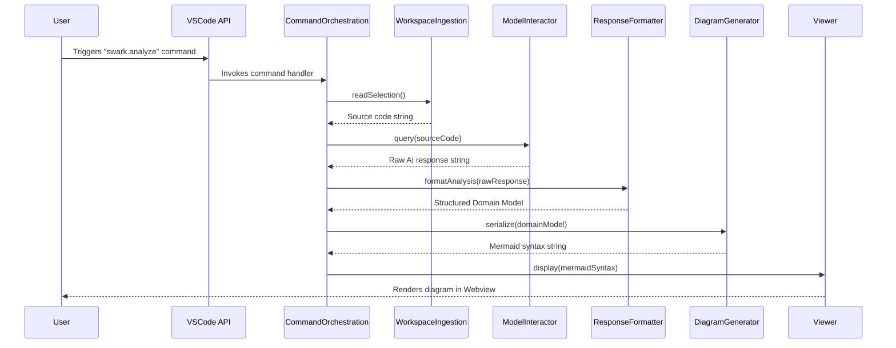

# Chapter 9: Command Orchestration

- Reference: [Chapter 8: Webview-based Visualization](chapter_08.md)

### Architectural Intent & Motivation

The Command Orchestration module serves as the central nervous system for the `swark` extension. Its primary responsibility is to act as the top-level controller that connects user-initiated actions within the VS Code UI to the underlying multi-stage analysis pipeline.

This abstraction satisfies a critical architectural requirement: decoupling the user interface trigger (a VS Code command) from the complex, sequential business logic of the analysis workflow. By centralizing the control flow, it ensures a predictable and maintainable execution order for the various subsystems, from data ingestion to final visualization. It is the definitive entry point for the core functionality of the extension.

### Contextual Use Case

A developer wishes to generate an architecture diagram for a specific file or selection of code within their active VS Code editor. They open the VS Code Command Palette (`Ctrl+Shift+P` or `Cmd+Shift+P`) and execute the "Swark: Analyze Selection" command. This action directly invokes the Command Orchestrator, which then takes responsibility for executing the entire end-to-end pipeline: reading the selected code, querying the AI, parsing the response, generating the Mermaid diagram, and rendering the result in a new webview panel. Without this orchestrator, the user command would have no connection to the analytical engine.

### Concept Decomposition

The orchestration logic is deconstructed into two primary concepts:

*   **Command Registration:** This is the process of binding a unique string identifier (e.g., `swark.analyze`) to a specific handler function within the VS Code extension lifecycle. This is handled by the `activate` function, which ensures the command is available to the user in the Command Palette.
*   **Pipeline Execution:** This is the core logic encapsulated within the command's handler function. It sequentially invokes each specialized module in the `swark` architecture, passing the output of one stage as the input to the next. This represents the concrete implementation of the workflow described in the architectural summary.

### Reference Implementation

The following snippet demonstrates the canonical execution flow triggered when a user invokes the primary analysis command. It showcases the sequential invocation of modules from ingestion to visualization.

```typescript
// Inside the extension's activation context
const analyzeCommand = vscode.commands.registerCommand('swark.analyze', async () => {
    // Stage 1: Ingest source code from the workspace
    const sourceCode = await WorkspaceDataIngestion.readSelection();

    // Stage 2 & 3: Query the model and parse the result
    const rawAiResponse = await ModelInteractor.query(sourceCode);
    const domainModel = ResponseFormatting.formatAnalysis(rawAiResponse);

    // Stage 4: Generate the diagram from the structured model
    const mermaidSyntax = MermaidDiagramGeneration.serialize(domainModel);

    // Stage 5: Display the result in a dedicated panel
    await Viewer.display(mermaidSyntax, domainModel);
});
```

### Architectural Mechanics (White-Box Analysis)

#### Design Pattern Identification

*   **Facade:** The Command Orchestrator implements the Facade pattern. It provides a single, simplified entry point (`swark.analyze` command) that conceals the complex interactions between the multiple subsystems (Ingestion, AI Interaction, Parsing, Generation, Visualization). A client (VS Code's command system) interacts with this simple interface without needing to know the internal details of the pipeline.
*   **Pipeline:** The execution logic itself is a classic Pipeline pattern. Data flows through a series of processing stages, where each stage is a distinct and specialized module. This promotes separation of concerns and makes the overall workflow easier to modify or extend.

#### Control Flow/State

The control flow is strictly linear and asynchronous. It begins when the command is invoked and proceeds sequentially through the `await` calls of each stage. State is not maintained within the orchestrator itself; instead, it is managed as transient data artifacts that are passed from one function to the next (e.g., `sourceCode` -> `rawAiResponse` -> `domainModel`). This stateless nature simplifies the logic and prevents side effects.

### Architectural Visualization (Mermaid)

The interaction between the user, VS Code, and the `swark` subsystems is best represented by a Sequence Diagram, illustrating the chronological flow of calls that constitute a single analysis run.



### System Topology & Integration

*   **Upstream Dependencies:** The Command Orchestrator's sole upstream dependency is the VS Code API, specifically the `vscode.commands` module, which provides the mechanism for command registration and invocation.
*   **Downstream Dependencies:** This module is a central integration point and depends on nearly every other core module in the system:
    *   `WorkspaceDataIngestion` (Chapter 2)
    *   `AIModelInteraction` (Chapter 4)
    *   `ResponseFormatting` (Chapter 5)
    *   `MermaidDiagramGeneration` (Chapter 6)
    *   `WebviewBasedVisualization` (Chapter 8)

#### Data Propagation

The orchestrator manages the transformation of data through the entire pipeline:
1.  **Ingress:** The process starts with no data input; it initiates the ingestion.
2.  **Internal Flow:** It receives a `string` (source code) from `WorkspaceDataIngestion`, which is transformed into a `string` (raw AI response), then into the `DomainModel` (structured data), and finally into another `string` (Mermaid syntax).
3.  **Egress:** The final `string` (Mermaid syntax) and `DomainModel` are passed to the `Viewer` for visualization and to `ResultPersistence` for storage. The orchestrator itself returns `void`.

### Engineering Standards

#### Performance Implications

The overall performance of a command execution is the sum of its constituent parts. The most significant latency will be introduced by the network call in the `AIModelInteraction` stage. As this is an I/O-bound operation, the command handler is `async` to prevent blocking the VS Code UI thread. It is critical to provide user feedback (e.g., a progress notification) to manage user perception during this long-running task.

#### Anti-Patterns

*   **Bloated Handler:** Placing the logic of any of the downstream modules (e.g., prompt construction, response parsing) directly inside the command handler function. This would violate the Single Responsibility Principle and make the orchestrator difficult to test and maintain.
*   **Lack of Error Handling:** Failing to wrap the pipeline execution in a `try...catch` block. An error in any stage (e.g., a network failure, a parsing error) must be caught gracefully and reported to the user via a VS Code notification, rather than allowing an unhandled promise rejection to crash the extension host.

### Conclusion

The Command Orchestration module is the cornerstone of the `swark` extension's functionality. By implementing the Facade and Pipeline patterns, it provides a clean, high-level entry point that translates a simple user action into a complex, multi-stage analytical process. Its role as a central controller is vital for maintaining a clear separation of concerns and ensuring the logical integrity of the entire code-to-diagram workflow.