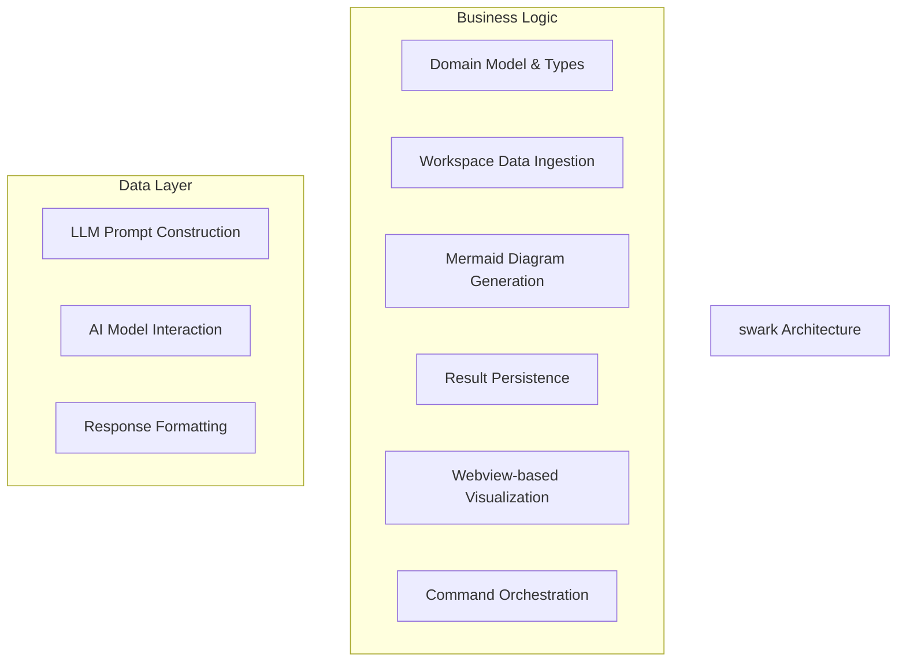
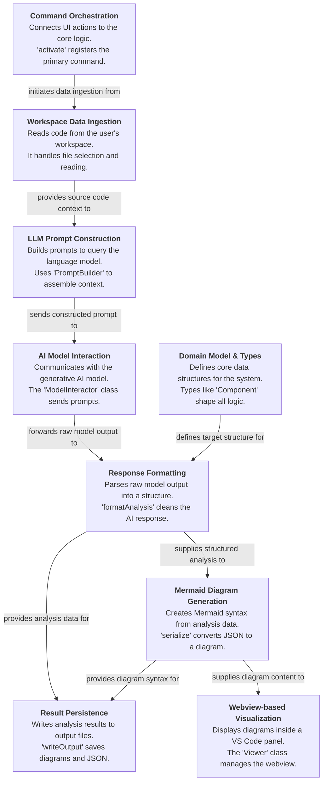

# swark Tutorial

Welcome to the comprehensive tutorial for swark. This tutorial is automatically generated from the codebase to help you understand the core concepts and implementation patterns.

## Project Overview

swark is a VS Code extension that implements a pipeline architecture to analyze source code. A central 'Command Orchestration' component drives a sequential workflow: ingesting code, querying a generative AI, parsing the response into a 'Domain Model', and finally generating and visualizing a Mermaid diagram from the structured data.

## System Architecture

## Component Relationships

## Table of Contents

1. [Chapter 1: Domain Model & Types](chapter_01.md) - Comprehensive documentation for Domain Model & Types following structured methodology...
2. [Chapter 2: Workspace Data Ingestion](chapter_02.md) - Comprehensive documentation for Workspace Data Ingestion following structured methodology...
3. [Chapter 3: LLM Prompt Construction](chapter_03.md) - Comprehensive documentation for LLM Prompt Construction following structured methodology...
4. [Chapter 4: AI Model Interaction](chapter_04.md) - Comprehensive documentation for AI Model Interaction following structured methodology...
5. [Chapter 5: Response Formatting](chapter_05.md) - Comprehensive documentation for Response Formatting following structured methodology...
6. [Chapter 6: Mermaid Diagram Generation](chapter_06.md) - Comprehensive documentation for Mermaid Diagram Generation following structured methodology...
7. [Chapter 7: Result Persistence](chapter_07.md) - Comprehensive documentation for Result Persistence following structured methodology...
8. [Chapter 8: Webview-based Visualization](chapter_08.md) - Comprehensive documentation for Webview-based Visualization following structured methodology...
9. [Chapter 9: Command Orchestration](chapter_09.md) - Comprehensive documentation for Command Orchestration following structured methodology...

## How to Use This Tutorial

1. **Start with Chapter 1** to understand the foundational concepts
2. **Follow the sequence** - each chapter builds upon previous concepts
3. **Practice with code examples** - every chapter includes practical examples
4. **Refer to diagrams** - use architecture diagrams for visual understanding
5. **Cross-reference concepts** - chapters link to related topics

## Tutorial Features

- **Progressive Learning**: Concepts are introduced in logical order
- **Code Examples**: Every chapter includes practical, executable code
- **Visual Diagrams**: Mermaid diagrams illustrate complex relationships
- **Cross-References**: Easy navigation between related concepts
- **Beginner-Friendly**: Written for newcomers to the codebase

## Contributing

This tutorial is auto-generated from the codebase. To improve it:
1. Update the source code documentation
2. Add more detailed comments to key functions
3. Regenerate the tutorial using the documentation system

---

*Generated using AI-powered codebase analysis*
