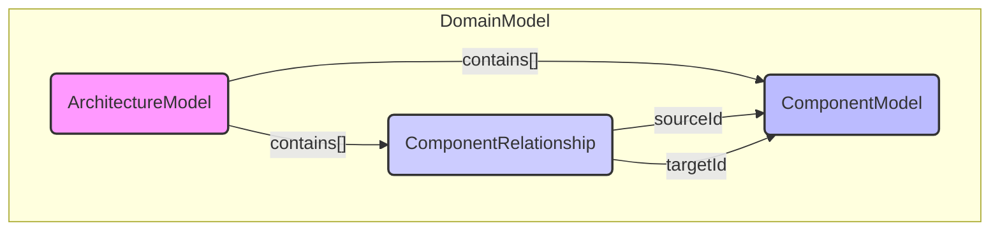

# Chapter 1: Domain Primitives & Types

- Initialization point.

## Architectural Intent & Motivation

The Domain Primitives & Types module serves as the foundational data layer for the entire `swark` system. Its primary responsibility is to establish a canonical, system-wide vocabulary for representing architectural components and their interconnections. These data structures act as the formal contract between the distinct stages of the analysis pipeline.

This abstraction satisfies the critical architectural requirement of **decoupling**. By defining a shared, immutable data model (e.g., `ComponentModel`), the `Workspace Reader` can generate a representation of the source code without any knowledge of how the `LLM Interactor` will use it. Similarly, the `Analysis Output Parser` can transform the LLM's response into this standard format without concern for how the `Result Visualizer` will render it. This prevents tight coupling between pipeline stages, allowing them to be developed, tested, and replaced independently.

## Contextual Use Case

Consider a user initiating an analysis of a workspace containing a Node.js service that communicates with a Redis cache.

1.  The `Workspace Reader & Context Builder` (Chapter 2) scans the source files.
2.  It identifies a class named `AuthService` and a client library import for `redis`.
3.  It instantiates two `ComponentModel` objects:
    *   One for `AuthService`, with `type: 'service'`.
    *   One for `Redis`, with `type: 'cache'`.
4.  It establishes a relationship, noting that `AuthService` depends on `Redis`.
5.  This collection of `ComponentModel` instances, forming the `ArchitectureModel`, is then passed to the `LLM Prompting & Interaction` component (Chapter 3) as its primary input.

The entire downstream pipeline operates on this structured data, not the raw source code, making the process predictable and testable.

## Concept Decomposition

The domain is broken down into a few core logical units:

*   **`ComponentModel`**: The atomic unit of the architecture. This is a plain data structure representing a single logical entity, such as a microservice, a database, a message queue, or a third-party API. It contains metadata like its name, type, and a description of its responsibilities.
*   **`ComponentRelationship`**: Defines a directed link between two `ComponentModel` instances. It specifies the source, target, and nature of the interaction (e.g., "uses", "reads from", "publishes to").
*   **`ArchitectureModel`**: The top-level container object that aggregates all `ComponentModel` instances and their `ComponentRelationship`s. This complete model represents the entire analyzed system architecture and is the data payload that flows through the `swark` pipeline.

## Reference Implementation

The following TypeScript-style interfaces illustrate the conceptual structure of the core domain primitives. These are not stateful classes but simple data contracts.

```typescript
// Represents a single architectural element
interface ComponentModel {
  id: string;          // Unique identifier, e.g., "UserService"
  name: string;        // Human-readable name
  type: 'service' | 'database' | 'cache' | 'api';
  description: string; // LLM-generated or user-provided summary
  sourceFile: string;  // Path to the originating source file
}

// Represents the connection between two components
interface ComponentRelationship {
  sourceId: string;    // ID of the originating ComponentModel
  targetId: string;    // ID of the target ComponentModel
  label: string;       // e.g., "HTTP Request"
}
```

## Architectural Mechanics (White-Box Analysis)

### Design Pattern Identification

*   **Data Transfer Object (DTO)**: The `ComponentModel` and `ArchitectureModel` are quintessential DTOs. Their sole purpose is to carry data between the different layers and processing stages of the application. They are intentionally devoid of any business logic, ensuring that concerns are separated. The logic for creating, validating, and transforming these objects resides within the pipeline components, not the models themselves.

### Control Flow/State

The domain primitives are designed to be **immutable**. Once a pipeline stage, such as the `Workspace Reader`, creates an `ArchitectureModel`, subsequent stages should treat it as read-only. This immutability is crucial for ensuring a predictable and debuggable pipeline. State is not managed within this layer; rather, these objects *represent* the state of the architectural analysis at a specific point in the workflow. Each pipeline component receives an `ArchitectureModel` and produces a new, potentially enriched, `ArchitectureModel` for the next stage.

## Architectural Visualization (Mermaid)

This diagram illustrates the compositional structure of the primary domain models, showing how an `ArchitectureModel` is composed of multiple components and their relationships.



## System Topology & Integration

### Dependency Graph

*   **Upstream (Dependents)**: This module is a foundational dependency for nearly every other component in `swark`.
    *   `Workspace Reader & Context Builder`: Creates instances of `ComponentModel` from source code.
    *   `LLM Prompting & Interaction`: Serializes the `ArchitectureModel` into a context for the LLM prompt.
    *   `Analysis Output Parser & Formatter`: Deserializes the LLM output back into a validated `ArchitectureModel`.
    *   `Result Visualization & Persistence`: Consumes the final `ArchitectureModel` to render diagrams and save results.
    *   `Core Command Orchestrator`: Passes the `ArchitectureModel` between pipeline stages.
*   **Downstream (Dependencies)**: This module has **zero dependencies** on other `swark` components. It is the root of the dependency tree.

### Data Propagation

Data enters this boundary when other components instantiate the defined types. For example, the `Workspace Reader` populates `ComponentModel` objects with data derived from filesystem analysis. These objects are then passed by reference through the orchestrator to subsequent services. The data exits the system when the `Result Visualization` component serializes the final `ArchitectureModel` into a displayable format (e.g., a Mermaid diagram or SVG).

## Engineering Standards

### Performance Implications

The performance complexity of the domain primitives themselves is negligible (O(1) for property access). The primary performance consideration is the *quantity* of `ComponentModel` instances generated. A very large monorepo could result in thousands of objects, increasing memory consumption and serialization/deserialization overhead between pipeline stages. However, for typical VS Code extension use cases, this is not considered a significant risk.

### Anti-Patterns

*   **Embedding Logic**: Adding methods or business logic to the `ComponentModel` or `ArchitectureModel`. This violates the DTO pattern and creates tight coupling between data and behavior.
*   **In-Place Mutation**: Modifying an `ArchitectureModel` instance after it has been created. Pipeline stages should always produce a new or cloned instance if transformations are necessary, preserving the integrity of the input for debugging and traceability.
*   **Type Pollution**: Adding stage-specific fields to the core `ComponentModel` (e.g., `llmAnalysisConfidenceScore`). Such metadata should be handled in a separate data structure or decorator to keep the core contract clean and universal.

## Conclusion

The Domain Primitives & Types module provides the stable, unambiguous data contracts essential for `swark`'s layered pipeline architecture. By establishing a shared language, it decouples the system's components, enabling modularity and maintainability. This foundational layer ensures that data flows through the analysis process in a predictable and structured manner.

- **Next**: [Workspace Reader & Context Builder](chapter_02.md)