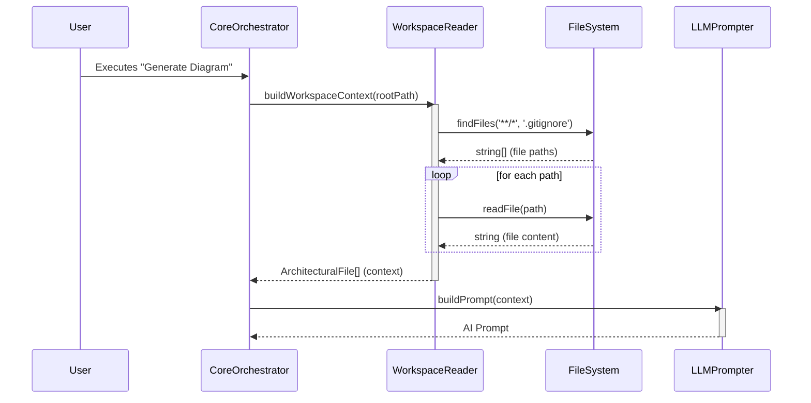

# Chapter 2: Workspace Reader & Context Builder

- **Reference**: [Domain Primitives & Types](chapter_01.md)

### Architectural Intent & Motivation

The Workspace Reader & Context Builder serves as the foundational data ingestion layer for the `swark` pipeline. Its primary responsibility is to bridge the gap between the unstructured user file system and the structured, domain-specific data models required for analysis.

This component satisfies the critical business requirement of grounding the AI's architectural analysis in the actual source code of the user's project. By systematically scanning, filtering, and packaging workspace files, it ensures that the subsequent LLM interaction is based on a comprehensive and relevant "source-truth" context. It acts as a gatekeeper, preventing irrelevant data (e.g., binaries, `node_modules`) from polluting the analysis context, which directly impacts the quality of the generated diagrams and controls operational costs (LLM token usage).

### Contextual Use Case

When a developer executes the `swark: Generate Architecture Diagram` command within VS Code, the `Core Command Orchestrator` immediately invokes this component. The Workspace Reader initiates a scan of the active project directory. It recursively traverses the file tree, respecting rules defined in `.gitignore` to skip dependency directories and build artifacts. It identifies all relevant source files (e.g., `.ts`, `.java`, `.py`), reads their contents, and constructs an array of `ArchitecturalFile` objects. This structured array, containing file paths and source code, is then passed to the `LLM Prompting & Interaction` module, forming the complete context for the analysis request.

### Concept Decomposition

This abstraction is composed of several logical units that execute in sequence:

*   **File System Traversal**: The core mechanism responsible for recursively walking the directory tree of the user's workspace. It uses the VS Code Workspace API to identify the root path and enumerate all files and subdirectories.
*   **Inclusion/Exclusion Filtering**: A rules engine that prunes the traversed file list. It applies a series of filters to exclude files and directories that are irrelevant for architectural analysis, most critically by parsing `.gitignore` and applying hardcoded rules against common anti-patterns like `node_modules` or `.git`.
*   **Content Buffering**: The process of reading the raw text content from the filtered list of files into memory. This stage includes safeguards against reading excessively large or non-text-based files.
*   **Context Aggregation**: The final step where the file path and its buffered content are encapsulated within the `ArchitecturalFile` data structure, as defined in Chapter 1. The collection of these objects forms the complete workspace context.

### Reference Implementation

The following conceptual snippet demonstrates the high-level orchestration of gathering and preparing workspace context. It showcases the transformation from a raw file system path to the structured `ArchitecturalFile[]` array.

```typescript
// Imports from Domain Primitives (Chapter 1)
import { ArchitecturalFile } from './domainPrimitives'; 
// Dependency on a file system utility
import { VscodeWorkspaceApi } from './vscodeUtils';

async function buildWorkspaceContext(
  rootPath: string
): Promise<ArchitecturalFile[]> {
  // 1. Find all files, respecting .gitignore
  const allFilePaths = await VscodeWorkspaceApi.findFiles(rootPath, '**/*');

  // 2. Map paths to structured objects with content
  const architecturalFiles = await Promise.all(
    allFilePaths.map(async (path) => ({
      path: path,
      content: await VscodeWorkspaceApi.readFile(path),
    }))
  );
  return architecturalFiles;
}
```

### Architectural Mechanics (White-Box Analysis)

#### Design Pattern Identification

*   **Facade**: The `Workspace Reader & Context Builder` acts as a Facade. It provides a simple, high-level interface (e.g., `buildWorkspaceContext(rootPath)`) that conceals the more complex underlying operations of file system globbing, asynchronous I/O, `.gitignore` parsing, and data mapping. Consumers, like the `Core Command Orchestrator`, do not need to be aware of these implementation details.

#### Control Flow/State

The control flow is strictly linear and asynchronous, driven by file system I/O.
1.  **Initiation**: The process is triggered with a single root path.
2.  **Traversal**: An asynchronous file search is performed.
3.  **Aggregation**: A new array of `ArchitecturalFile` objects is allocated. The content for each file is read asynchronously.
4.  **Completion**: The process resolves with the complete, in-memory array of `ArchitecturalFile` objects.

This component is designed to be **stateless**. Each invocation performs a fresh scan of the workspace, ensuring the context is always up-to-date. It does not retain any data between calls.

### Architectural Visualization (Mermaid)

A Sequence Diagram is most appropriate here to illustrate the component's role as the initial stage in a multi-step pipeline, highlighting its interaction with the file system and the handoff to the next component.



### System Topology & Integration

#### Dependency Graph

*   **Upstream (Dependents)**:
    *   `Core Command Orchestrator` (Chapter 6): This is the primary consumer. It invokes the Workspace Reader to acquire the context needed to drive the rest of the generation pipeline.
*   **Downstream (Dependencies)**:
    *   `Domain Primitives & Types` (Chapter 1): Consumes the `ArchitecturalFile` type definition to structure its output.
    *   **VS Code Workspace API / Node.js `fs`**: Has a direct, runtime dependency on the underlying environment's file system APIs to perform its core function.

#### Data Propagation

*   **Input**: The component's public interface accepts a `string` representing the absolute path to the workspace root.
*   **Output**: It returns a `Promise<ArchitecturalFile[]>`. This array is a self-contained, serializable representation of the relevant project source code. This data contract is fundamental, as this output is passed directly and without modification to the next stage in the pipeline (`LLM Prompting & Interaction`).

### Engineering Standards

#### Performance Implications

*   **Complexity**: The time complexity is directly proportional to the number of files and directories in the workspace, making it **O(N)** where N is the total count of file system entries. Performance can be a significant bottleneck in large monorepos.
*   **I/O Bound**: The operation is heavily I/O bound. Execution speed is limited by disk read performance. All file operations are performed asynchronously to prevent blocking the VS Code extension host.

#### Anti-Patterns

*   **Incomplete Filtering**: Failing to correctly parse `.gitignore` or exclude large asset directories (e.g., `dist`, `build`, `node_modules`) is a critical misuse. This leads to excessive memory consumption, high LLM token costs, and diluted, inaccurate analysis from the AI.
*   **Reading Binary Files**: The component must exclusively target text-based source files. Attempting to read and process binary files (images, executables, archives) will corrupt the context and likely cause runtime errors. Robust extension-based filtering is mandatory.

### Conclusion

The Workspace Reader & Context Builder is the sensory organ of the `swark` system. It translates the raw state of a user's project into a clean, structured, and intelligible format that the entire analysis pipeline relies upon. Its architectural value lies in its role as a robust data sanitization and preparation layer, ensuring the high-fidelity context required for meaningful AI-driven architectural analysis.

- **Forward Link**: [LLM Prompting & Interaction](chapter_03.md)