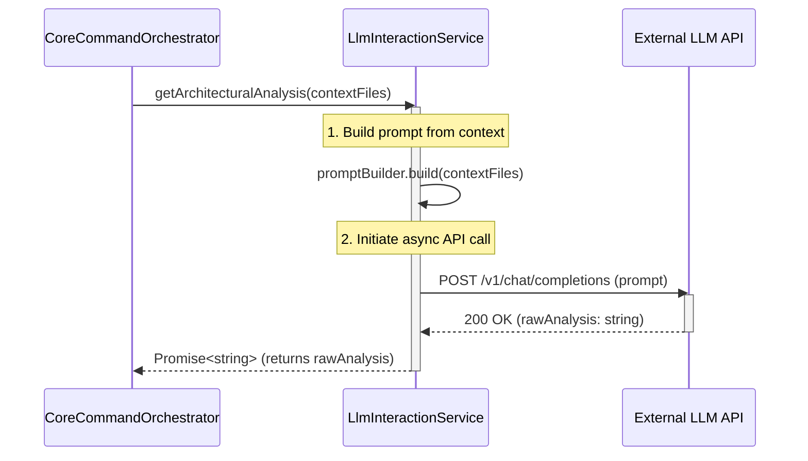

# Chapter 3: LLM Prompting & Interaction

- **Reference**: [Workspace Reader & Context Builder](chapter_02.md)

## Architectural Intent & Motivation

The LLM Prompting & Interaction module serves as the dedicated communication bridge between the `swark` extension and the external Large Language Model (LLM) service. Its primary responsibility is to translate the structured workspace context, provided by the `Workspace Reader`, into a precisely engineered prompt. It then manages the entire lifecycle of the API request: sending the prompt, handling authentication, awaiting the response, and surfacing the raw analytical output or any communication errors.

This abstraction is architecturally critical for **decoupling and interchangeability**. It isolates the core application logic from the specific protocols, authentication schemes, and prompt syntax of any given LLM provider (e.g., OpenAI, Anthropic, Google Gemini). This design ensures that the backend LLM can be upgraded or replaced with minimal impact on the rest of the system, satisfying the business requirement for provider flexibility and future-proofing.

## Contextual Use Case

Within the primary workflow of `swark`, this module's execution is mandatory and follows the context-gathering phase.

1.  A user executes the "Swark: Generate Architecture" command in VS Code.
2.  The `CoreCommandOrchestrator` invokes the `Workspace Reader & Context Builder` (Chapter 2), which scans the workspace and produces an array of `ArchitecturalFile` objects.
3.  The orchestrator passes this array to the `LlmInteractionService`.
4.  The service's `getArchitecturalAnalysis` method is called. It synthesizes the file content into a single, token-aware prompt.
5.  It then initiates an asynchronous API call to the configured LLM endpoint.
6.  Upon receiving a successful response, it returns the raw, unstructured string containing the AI-generated architectural analysis. This string is then passed to the `Analysis Output Parser & Formatter` for structuring.

Without this module, the orchestrator would be tightly coupled to a specific LLM's API, making the system brittle and difficult to maintain.

## Concept Decomposition

This module is composed of three primary logical units:

-   **Prompt Engineering Engine**: A stateless utility responsible for constructing the final prompt string. It strategically combines a static system prompt (defining the LLM's role and output format), dynamic context from the `ArchitecturalFile` objects, and potentially few-shot examples to guide the model's output towards a predictable structure.
-   **API Client**: The stateful component that manages the direct HTTP communication with the external LLM API. Its duties include adding authentication headers (e.g., API keys), handling request/response serialization, and implementing resilience patterns like retries for transient network failures.
-   **Service Facade**: A high-level interface that exposes the module's capability to the rest of the application. It hides the complexity of prompt construction and network communication behind a single, simple method.

## Reference Implementation

The following snippet demonstrates the canonical usage pattern, where a service class orchestrates the internal logic to fulfill a request from the application's core.

```typescript
// service/llm_interaction_service.ts

import { ArchitecturalFile } from '../domain/types';
import { PromptBuilder } from './prompt_builder';
import { LlmApiClient } from './llm_api_client';

export class LlmInteractionService {
  private promptBuilder: PromptBuilder;
  private apiClient: LlmApiClient;

  // Dependencies are injected for testability and configuration.
  constructor(promptBuilder: PromptBuilder, apiClient: LlmApiClient) {
    this.promptBuilder = promptBuilder;
    this.apiClient = apiClient;
  }

  // --- Canonical Usage ---
  public async getArchitecturalAnalysis(
    contextFiles: ArchitecturalFile[]
  ): Promise<string> {
    // 1. Construct the precise prompt from workspace context.
    const prompt = this.promptBuilder.build(contextFiles);

    // 2. Delegate the network request to the API client.
    const rawAnalysis = await this.apiClient.queryModel(prompt);

    return rawAnalysis;
  }
}
```

## Architectural Mechanics (White-Box Analysis)

### Design Pattern Identification

-   **Facade**: The `LlmInteractionService` acts as a Facade. It provides a simplified, high-level `getArchitecturalAnalysis` method to its clients (like the `CoreCommandOrchestrator`). This single method conceals the more complex underlying subsystems of prompt construction (`PromptBuilder`) and authenticated network requests (`LlmApiClient`). This reduces coupling and simplifies the integration point for the rest of the application.
-   **Dependency Injection**: As shown in the constructor, the service's dependencies (`PromptBuilder`, `LlmApiClient`) are injected rather than instantiated internally. This adheres to the Inversion of Control principle, making the service highly testable (by allowing mock dependencies) and configurable.

### Control Flow/State

The control flow is fundamentally asynchronous due to the nature of network requests.

1.  A call to `getArchitecturalAnalysis` begins synchronously with the invocation of `promptBuilder.build()`.
2.  Execution becomes asynchronous at the `await this.apiClient.queryModel(prompt)` line. At this point, the JavaScript event loop is free to handle other tasks while the service awaits the HTTP response.
3.  The module itself is designed to be **stateless**. Each call to `getArchitecturalAnalysis` is an independent transaction. All required state (the context files) is passed in as method arguments, and no state is preserved in the service instance between calls.

## Architectural Visualization (Mermaid)

The interaction between the core orchestrator, this module, and the external API is best represented by a sequence diagram, which clarifies the asynchronous boundary and the flow of messages over time.



## System Topology & Integration

### Dependency Graph

-   **Upstream (Dependents)**:
    -   `Core Command Orchestrator` (Chapter 6): This is the primary consumer. It invokes this module to perform the AI analysis step of the main pipeline.
-   **Downstream (Dependencies)**:
    -   `Workspace Reader & Context Builder` (Chapter 2): This module depends on the output (`ArchitecturalFile[]`) of the workspace reader to build its prompt.
    -   **External LLM Service**: A network dependency on a third-party API endpoint (e.g., `api.openai.com`).
    -   **VS Code Configuration**: Implicitly depends on the user's settings to retrieve the API key and potentially the selected model name.

### Data Propagation

-   **Ingress**: The module's entry point, `getArchitecturalAnalysis`, accepts an array of `ArchitecturalFile` objects. This is the data contract defined in `Domain Primitives & Types` (Chapter 1) and produced by the `Workspace Reader` (Chapter 2).
-   **Egress**: The module's single responsibility is to produce a raw `string`. This string contains the LLM's direct, unstructured output. This data is then passed downstream to the `Analysis Output Parser & Formatter` (Chapter 4), which is responsible for parsing this string into the structured `ComponentModel[]` format.

## Engineering Standards

### Performance Implications

-   The dominant performance factor is the **network latency and processing time** of the external LLM API, which is outside the control of the `swark` extension. The time complexity of this module's own logic (prompt building) is negligible, approximately O(N) where N is the total character count of the code being analyzed.
-   A critical constraint is the LLM's **context window limit**. The `PromptBuilder` must be implemented to intelligently truncate or summarize the input context to avoid exceeding token limits, which would result in an API error.

### Anti-Patterns

-   **Prompt Injection Vulnerability**: Directly concatenating user-provided file content without proper sanitization or structuring could expose the system to prompt injection, where malicious instructions in a source file could alter the LLM's intended behavior. Prompts must be structured to clearly delineate instructions from user data.
-   **Hardcoded Secrets**: Embedding the LLM API key directly in the source code is a severe security risk. The implementation must retrieve the key from a secure location, such as the VS Code SecretStorage API or user configuration settings.
-   **Ignoring API Rate Limits**: Failing to handle `429 Too Many Requests` errors from the LLM API. A robust implementation should include an exponential backoff-and-retry mechanism for such cases.

## Conclusion

The LLM Prompting & Interaction module is a vital architectural component that serves as a well-defined, insulated gateway to external AI capabilities. By abstracting the complexities of prompt engineering and API communication behind a simple Facade, it enhances system modularity, testability, and maintainability. It transforms structured workspace data into a raw text-based analysis, setting the stage for the subsequent parsing and visualization phases.

- **Forward Link**: [Analysis Output Parser & Formatter](chapter_04.md)