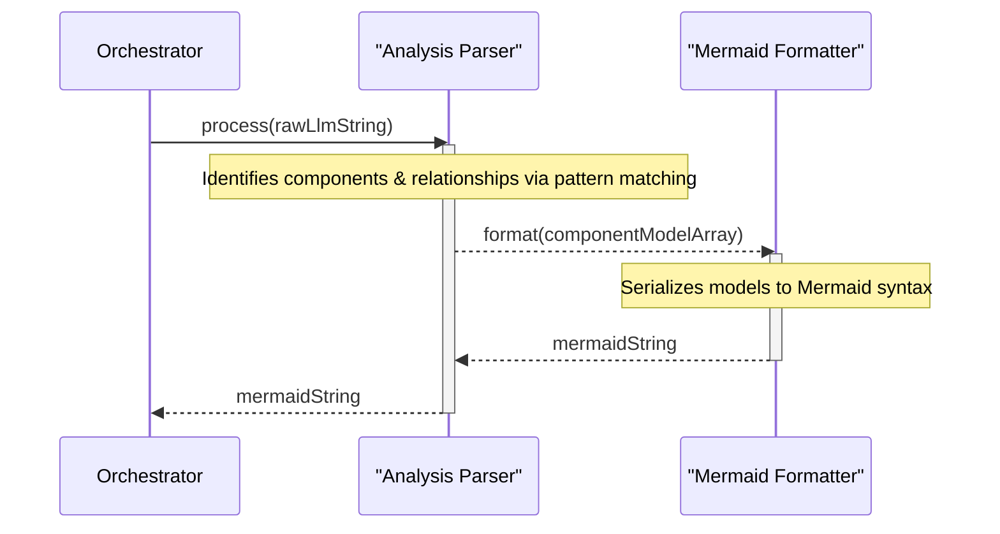

# Chapter 4: Analysis Output Parser & Formatter

-   **Reference**: [Chapter 3: LLM Prompting & Interaction](chapter_03.md)

### Architectural Intent & Motivation

The Analysis Output Parser & Formatter serves as the critical translation and serialization layer within the `swark` pipeline. Its primary responsibility is to bridge the gap between the unstructured, natural-language output of the Large Language Model (LLM) and the strictly-typed, structured data models required for visualization.

This component satisfies the architectural need for **decoupling** the AI analysis engine from the rendering engine. The LLM's output is inherently non-deterministic and optimized for human readability, whereas the diagramming library (Mermaid.js) requires a predictable, machine-readable syntax. This module acts as a robust intermediary, ensuring system stability by sanitizing and structuring the AI's raw analysis into a reliable format. Without this parser, the system would be unable to translate abstract architectural concepts into a concrete visual diagram.

### Contextual Use Case

Within a typical `swark` execution flow, once the `LLM Prompting & Interaction` component receives a text response describing the project's architecture, the `Core Command Orchestrator` invokes this parser. The parser is provided with the raw LLM response string, which might look like:

*"The system is composed of three main parts. The 'Web Client' communicates with the 'API Gateway'. The 'API Gateway' in turn routes requests to the 'Authentication Service' and the 'Order Service'."*

The parser's first responsibility is to interpret this text, identify the entities ('Web Client', 'API Gateway', etc.) and their relationships, and transform them into an array of `ComponentModel` objects. Subsequently, its formatting logic is invoked to convert this structured array into a Mermaid.js graph definition string. This final string is then passed downstream to the `Result Visualization & Persistence` component to be rendered in a VS Code WebView.

### Concept Decomposition

This abstraction is functionally divided into two distinct, sequential stages:

1.  **Parsing Stage**: This stage is responsible for input transformation.
    *   **Raw LLM Response**: The unstructured, multi-line `string` received from the LLM API. The format of this string is guided by the prompt but is not guaranteed to be perfectly consistent.
    *   **Structured Model (`ComponentModel[]`)**: The target internal data structure, defined in Chapter 1. The parser instantiates these models, populating their `name`, `type`, and `dependencies` fields based on its interpretation of the raw response.

2.  **Formatting Stage**: This stage is responsible for output serialization.
    *   **Mermaid Syntax**: The declarative, text-based diagramming language used for final rendering. The formatter iterates over the `ComponentModel` array and generates the corresponding `graph TD` definitions and link statements.

### Reference Implementation

The following conceptual snippets demonstrate the data transformation process central to this component.

**1. Parsing the LLM Response:**

This logic translates the raw string into the system's internal object model.

```typescript
// Conceptual Input (from LLM)
const llmResponse: string = `
The 'Authentication Service' is a core component.
The 'API Gateway' depends on the 'Authentication Service'.
`;

// Conceptual Parsing Logic
function parseAnalysis(responseText: string): ComponentModel[] {
    // 1. Identify component definitions via pattern matching.
    // 2. Identify dependency statements.
    // 3. Construct and return an array of ComponentModel instances.
    const components: ComponentModel[] = [
        { name: 'Authentication Service', dependencies: [] },
        { name: 'API Gateway', dependencies: ['Authentication Service'] }
    ];
    return components;
}
```

**2. Formatting to Mermaid Syntax:**

This logic serializes the structured `ComponentModel` array into the final renderable output.

```typescript
// Conceptual Formatting Logic
function formatToMermaid(components: ComponentModel[]): string {
    let mermaidSyntax = 'graph TD;\n';
    for (const component of components) {
        // Define the node
        mermaidSyntax += `    ${component.name};\n`;
        // Define its relationships
        for (const dep of component.dependencies) {
            mermaidSyntax += `    ${component.name} --> ${dep};\n`;
        }
    }
    return mermaidSyntax;
}
```

### Architectural Mechanics (White-Box Analysis)

**Design Pattern Identification:**

*   **Interpreter/Parser**: The core of the component implements the Interpreter pattern. It is designed with a specific (though flexible) "grammar" in mind—the expected structure of the LLM's textual output—and its primary function is to interpret this text into a structured representation (`ComponentModel[]`).
*   **Facade**: The component acts as a Facade, hiding the two-step complexity of parsing and formatting. The `Core Command Orchestrator` interacts with a single, unified interface, delegating the entire transformation process without needing to manage the intermediate `ComponentModel` state.

**Control Flow/State:**

The component's control flow is strictly linear and stateless. It receives input, performs a series of pure transformations, and produces an output. It retains no state between invocations, making its behavior highly predictable and easy to test. The execution path is: `string` -> `parse()` -> `ComponentModel[]` -> `format()` -> `string`. Error handling for malformed LLM responses is a critical aspect of this flow, ensuring the pipeline can fail gracefully.

### Architectural Visualization (Mermaid)

The data transformation pipeline is best represented as a sequence diagram, illustrating the flow of data through the component's internal stages.



### System Topology & Integration

**Dependency Graph:**

*   **Upstream (Dependents)**: The `Core Command Orchestrator` (Chapter 6) is the primary consumer of this module. It invokes the parser after receiving a response from the LLM.
*   **Downstream (Dependencies)**: This module has a compile-time dependency on `Domain Primitives & Types` (Chapter 1) to import the `ComponentModel` type definition. It has no other runtime dependencies on other `swark` components.

**Data Propagation:**

*   **Ingress**: The component's entry point accepts a single `string` argument containing the raw LLM analysis.
*   **Egress**: The component's exit point returns a single `string` argument containing the fully-formed Mermaid.js diagram syntax. The intermediate `ComponentModel[]` is a transient artifact that does not leave the component's boundary.

### Engineering Standards

**Performance Implications:**

The performance of the parsing stage is the primary consideration. If implemented with naive or overly complex regular expressions, parsing a large LLM response detailing a system with hundreds of components could become a performance bottleneck. The algorithmic complexity is directly related to the length of the input string and the number of parsing rules, potentially approaching `O(n*m)`. The formatting stage is a simple iteration and is considered `O(c + d)` where `c` is the number of components and `d` is the total number of dependencies.

**Anti-Patterns:**

*   **Brittle Parsing**: Implementing a parser that expects a rigid and exact output format from the LLM is a significant anti-pattern. The component must be designed defensively, with tolerance for minor variations in sentence structure, whitespace, and phrasing.
*   **Conflated Logic**: Combining the parsing and formatting logic into a single, monolithic function should be avoided. Separating these concerns makes the component easier to maintain, test, and extend. For instance, supporting a different diagramming format (e.g., PlantUML) in the future would only require a new formatter, leaving the parser untouched.

### Conclusion

The Analysis Output Parser & Formatter is the architectural lynchpin that enables `swark`'s core value proposition. By acting as a sophisticated translation layer, it insulates the rest of the application from the non-deterministic nature of AI-generated content. It diligently transforms abstract language into a structured model and then serializes it into a concrete, visualizable artifact, making automated diagram generation possible.

-   **Forward Link**: [Chapter 5: Result Visualization & Persistence](chapter_05.md)