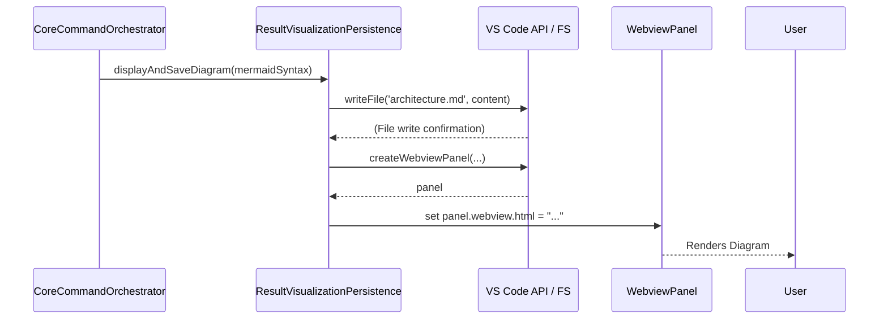

# Chapter 5: Result Visualization & Persistence

- Reference: [Analysis Output Parser & Formatter](chapter_04.md)

### Architectural Intent & Motivation

This abstraction serves as the terminal stage of the `swark` analysis pipeline. Its primary responsibility is to materialize the in-memory Mermaid.js diagram syntax into a user-facing artifact. It bridges the gap between the system's internal data processing and the user's tangible output, fulfilling the core value proposition of the extension: to see a generated architectural diagram.

This component satisfies two critical business requirements:
1.  **Visualization:** It provides immediate visual feedback to the user by rendering the diagram within the VS Code environment, eliminating the need for external tools.
2.  **Persistence:** It saves the generated diagram to a file (`architecture.md`), allowing the output to be version-controlled, shared, and reviewed asynchronously.

### Contextual Use Case

After a user invokes the `swark` generation command, the pipeline executes through context gathering, LLM interaction, and parsing. The `AnalysisOutputParser` (Chapter 4) successfully produces a final, valid Mermaid.js syntax string. The `CoreCommandOrchestrator` (Chapter 6) then passes this string to the `Result Visualization & Persistence` component. This component proceeds to write the string into an `architecture.md` file at the root of the user's workspace and simultaneously opens a new editor tab (a VS Code Webview) that renders the diagram visually. The user can then immediately see the result of their request and find the corresponding source file in their workspace explorer.

### Concept Decomposition

This component is logically divided into two distinct services that work in concert:

*   **Persistence Service:** A stateless utility responsible for all file system interactions. Its sole function is to take the diagram content string and a target file path, and write the content to disk. It abstracts the underlying Node.js `fs` API calls.
*   **Visualization Service:** This service interfaces directly with the VS Code API to manage a `WebviewPanel`. It is responsible for creating the panel, constructing the necessary HTML document to host and render the Mermaid diagram (including the Mermaid.js library), and setting the panel's content.

### Reference Implementation

The following snippet demonstrates the canonical invocation pattern, orchestrating both persistence and visualization.

```typescript
// --- Segment 1: File Persistence ---
// Constructs the full path for the output markdown file.
const outputPath = vscode.Uri.joinPath(workspaceRoot, 'architecture.md');
const diagramContent = `\`\`\`mermaid\n${mermaidSyntax}\n\`\`\``;

// Asynchronously writes the formatted content to disk.
await vscode.workspace.fs.writeFile(outputPath, Buffer.from(diagramContent));


// --- Segment 2: Webview Visualization ---
// Creates a new webview panel with a specific title.
const panel = vscode.window.createWebviewPanel(
  'swarkArchitecture',
  'Swark: Architecture Diagram',
  vscode.ViewColumn.One,
  { enableScripts: true } // Scripts must be enabled to run Mermaid.js
);

// Sets the HTML content, which includes the Mermaid.js library and the diagram data.
panel.webview.html = getWebviewContent(mermaidSyntax);
```

### Architectural Mechanics (White-Box Analysis)

#### Design Pattern Identification

The component implements the **Facade** pattern. It provides a single, high-level interface that simplifies the interaction with two more complex, independent subsystems:
1.  The Node.js File System API (abstracted by `vscode.workspace.fs`).
2.  The VS Code Webview API (`vscode.window.createWebviewPanel`).

By exposing a unified entry point, the `CoreCommandOrchestrator` is decoupled from the low-level details of file I/O and webview lifecycle management.

#### Control Flow/State

The control flow is linear and asynchronous.
1.  The function is invoked with the `mermaidSyntax` string.
2.  A file path is constructed.
3.  An asynchronous `writeFile` operation is initiated. The `await` keyword ensures this operation completes before proceeding, although in a more parallel design it could run concurrently with webview creation.
4.  A `WebviewPanel` is created and configured. This is a synchronous call to the VS Code API.
5.  An HTML string is dynamically generated, embedding the `mermaidSyntax` and a reference to the Mermaid.js rendering library.
6.  The `panel.webview.html` property is set, which triggers the webview to load and render the content.

This component is inherently **stateless**. It does not maintain any internal state between invocations. It receives all necessary data as input and its results are purely side effects (file creation and UI display). The state of the `WebviewPanel` itself is managed by the VS Code framework.

### Architectural Visualization (Mermaid)

A sequence diagram is most appropriate for visualizing the interactions between the orchestrator, this component, and the external VS Code APIs.



### System Topology & Integration

#### Dependency Graph

*   **Upstream (Dependents):**
    *   `CoreCommandOrchestrator` (Chapter 6): This is the primary consumer. It calls this component to finalize the user-facing output of the analysis pipeline.

*   **Downstream (Dependencies):**
    *   **VS Code API:** The component is tightly coupled to the `vscode` module, specifically for `vscode.workspace.fs` (file operations) and `vscode.window.createWebviewPanel` (UI presentation).
    *   **Node.js Buffer:** Used for converting the string content into a format suitable for the file system API.

#### Data Propagation

*   **Input Data Contract:**
    *   `mermaidSyntax: string`: The raw, validated Mermaid.js diagram syntax generated by the `AnalysisOutputParser`.
    *   `workspaceRoot: vscode.Uri`: The root URI of the active workspace, required to correctly resolve the output file path.

*   **Output Data Contract:**
    *   This component produces no return value (`void` or `Promise<void>`). Its output is realized as side effects on the system:
        1.  **File System:** A new or overwritten file named `architecture.md` in the user's workspace.
        2.  **VS Code UI:** A new `WebviewPanel` is created and displayed in the editor.

### Engineering Standards

#### Performance Implications

The primary performance consideration is the use of asynchronous file I/O. Using a synchronous write call (`fs.writeFileSync`) would block the extension host, leading to a frozen UI and a poor user experience. The implementation **must** use the asynchronous `vscode.workspace.fs.writeFile` or `fs.promises.writeFile`. The creation and rendering of the webview has a minor, one-time performance cost that is acceptable for a user-invoked command.

#### Anti-Patterns

*   **Blocking I/O:** The use of any synchronous file system calls is a critical anti-pattern that will degrade extension performance.
*   **Insecure Webview Configuration:** Failing to set a restrictive `Content-Security-Policy` within the webview's HTML can create a security vulnerability. While `swark` controls the input, best practice dictates hardening the webview against potential script injection.
*   **Stateful Implementation:** Introducing state (e.g., caching the last generated diagram) would unnecessarily complicate this component's logic and violate the Single Responsibility Principle. Its role is strictly to process a given input and produce an immediate output.

### Conclusion

The Result Visualization & Persistence component is the crucial "last mile" of the `swark` system. It translates the abstract, machine-readable diagram data into a human- consumable and persistent format. By acting as a clean facade over the VS Code and file system APIs, it ensures the core orchestration logic remains focused on workflow management, not on the low-level details of presentation and storage.

- Forward Link: [Core Command Orchestrator](chapter_06.md)