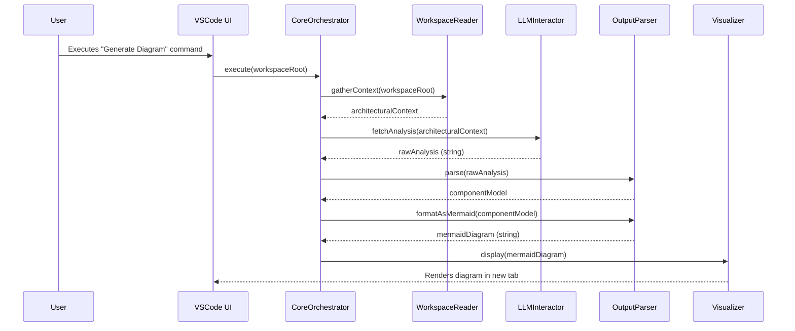

# Chapter 6: Core Command Orchestrator

- Reference: [Result Visualization & Persistence](chapter_05.md)

### Architectural Intent & Motivation

The Core Command Orchestrator serves as the central nervous system for the `swark` extension's primary user-facing feature: generating an architecture diagram. Its precise responsibility is to manage the sequential execution of the entire analysis and visualization pipeline, translating a single user command into a multi-stage workflow.

This abstraction satisfies a critical architectural requirement: **decoupling**. By acting as a `Facade`, the orchestrator insulates the VS Code activation logic (Chapter 7) from the complexities of the underlying subsystem. The individual components—Reader, LLM Interactor, Parser, and Visualizer—are unaware of each other's existence. The orchestrator alone manages their interaction, ensuring a predictable execution order, robust data handoffs, and a centralized point for error handling. This design makes the system more modular, testable, and easier to maintain.

### Contextual Use Case

A software developer has opened their project in VS Code and wants to generate an overview of its architecture. They open the Command Palette (`Ctrl+Shift+P`) and execute the command "Swark: Generate Architecture Diagram for Workspace".

This action directly invokes the Core Command Orchestrator. The orchestrator is mandatory in this scenario as it proceeds to:
1.  Trigger the `Workspace Reader` to scan the project files.
2.  Pass the collected context to the `LLM Interactor` to request an analysis.
3.  Receive the raw LLM response and hand it to the `Analysis Output Parser`.
4.  Take the structured `ComponentModel` from the parser and format it into Mermaid syntax.
5.  Finally, instruct the `Result Visualization & Persistence` component to write the diagram to a file and display it in a new editor tab.

The user experiences this as a single, atomic operation, while the orchestrator transparently manages the complex multi-step process in the background.

### Concept Decomposition

The orchestrator's logic is deconstructed into the following key responsibilities:

*   **Workflow Sequencing:** The primary function is to enforce the correct, linear sequence of operations: Read -> Analyze -> Parse -> Visualize. It uses asynchronous control flow (`async/await`) to manage I/O-bound tasks like file reading and network requests.
*   **Dependency Management:** The orchestrator is composed of its dependencies. It holds references to each component in the pipeline, typically injected during its construction. This allows for clear separation of concerns and facilitates testing with mock components.
*   **Data Pipeline Choreography:** It is responsible for managing the transformation of data as it flows through the system. It ensures the output of one component is compatible with the input of the next (e.g., `ArchitecturalFile[]` from the Reader becomes input for the LLM Interactor's prompt builder).
*   **Centralized Error Handling:** By wrapping the entire workflow in a single control structure (e.g., a `try...catch` block), the orchestrator provides a unified mechanism for catching exceptions from any stage of the pipeline and reporting a failure to the user.

### Reference Implementation

The following snippet demonstrates the canonical execution path within the orchestrator. It highlights the sequential, asynchronous nature of the workflow.

```typescript
// Assumes dependencies are injected via the constructor
export class GenerateArchitectureCommand {
  // ... constructor ...

  public async execute(workspaceRoot: Uri): Promise<void> {
    try {
      // 1. Gather context from the user's workspace
      const architecturalContext = await this.workspaceReader.gatherContext(workspaceRoot);

      // 2. Interact with the LLM for analysis
      const rawAnalysis = await this.llmInteractor.fetchAnalysis(architecturalContext);

      // 3. Parse the raw string into structured data
      const componentModel = this.outputParser.parse(rawAnalysis);

      // 4. Format the model and render the final diagram
      const mermaidDiagram = this.outputParser.formatAsMermaid(componentModel);
      await this.visualizer.display(mermaidDiagram, workspaceRoot);

    } catch (error) {
      // Centralized error reporting to the user
      vscode.window.showErrorMessage(`Swark failed: ${error.message}`);
    }
  }
}
```

### Architectural Mechanics (White-Box Analysis)

#### Design Pattern Identification

The Core Command Orchestrator primarily implements the **Facade** design pattern. It provides a simple, high-level `execute()` method that conceals the more complex interactions between the `Reader`, `LLMInteractor`, `Parser`, and `Visualizer` subsystems. Clients (specifically, the VS Code command registration logic) interact only with this simplified interface, promoting loose coupling and a cleaner separation of layers.

#### Control Flow/State

The orchestrator's control flow is strictly **linear and asynchronous**. Each step in the `execute` method `await`s the completion of the previous one. There are no complex branches or loops; the primary alternative path is the `catch` block for error handling, which terminates the workflow prematurely.

The orchestrator itself is **stateless**. It does not maintain any state between calls to `execute()`. All necessary data is passed through the pipeline as local variables within the method scope, starting with the `workspaceRoot` and transforming at each stage until the final side-effect (displaying the diagram) is achieved.

### Architectural Visualization (Mermaid)

A Sequence Diagram is the most effective way to visualize the orchestrator's role, as its entire purpose is to coordinate interactions between components over time.



### System Topology & Integration

#### Dependency Graph

*   **Upstream (Dependents):** The `Core Command Orchestrator` is a top-level controller. Its sole dependent is the `VS Code Extension Lifecycle & Activation` module (Chapter 7), which is responsible for registering the command and invoking the orchestrator's `execute` method upon user action.
*   **Downstream (Dependencies):** The orchestrator depends directly on every major processing component in the application:
    *   `Workspace Reader & Context Builder` (Chapter 2)
    *   `LLM Prompting & Interaction` (Chapter 3)
    *   `Analysis Output Parser & Formatter` (Chapter 4)
    *   `Result Visualization & Persistence` (Chapter 5)

#### Data Propagation

The orchestrator manages a critical data transformation pipeline:
*   **Input:** It receives a `vscode.Uri` object representing the root of the workspace to be analyzed.
*   **Internal Flow:**
    1.  The `Uri` is passed to the `WorkspaceReader`, which returns an `ArchitecturalFile[]` array.
    2.  This array is used by the `LLMInteractor` to build a prompt, which returns a raw `string` response.
    3.  The `string` is passed to the `OutputParser`, which returns a structured `ComponentModel` object.
    4.  The `ComponentModel` is then formatted into a final `string` of Mermaid.js syntax.
*   **Output:** The orchestrator's `execute` method returns a `Promise<void>`. Its purpose is to produce side effects (displaying a UI panel, writing a file), not to return a value to its caller.

### Engineering Standards

#### Performance Implications

The performance of the orchestrator itself is negligible (O(1) in terms of coordination steps). The overall performance of the `execute` workflow is dominated by its I/O-bound dependencies:
1.  **File System I/O:** `WorkspaceReader` performance is O(N), where N is the number of files in the workspace.
2.  **Network Latency:** The `LLMInteractor.fetchAnalysis()` call is the primary bottleneck. Its duration is dependent on the LLM's API response time and the size of the payload.

The orchestrator's design ensures these operations are performed asynchronously, preventing the VS Code UI from freezing during the analysis. Progress notifications should be used to provide feedback to the user during this potentially long-running task.

#### Anti-Patterns

*   **Logic Bleeding:** The orchestrator must not contain any logic specific to file parsing, prompt engineering, or string manipulation. For example, adding a check like `if (rawAnalysis.includes("error"))` inside the orchestrator would be an anti-pattern; such logic belongs within the `OutputParser`. The orchestrator's sole responsibility is coordination.
*   **Bypassing the Facade:** The VS Code activation layer must never instantiate and call a component like `OutputParser` directly. All end-to-end workflows must be initiated through the orchestrator to ensure that all steps are executed in the correct order and with consistent error handling.

### Conclusion

The Core Command Orchestrator is the architectural lynchpin of the `swark` system. By implementing the Facade pattern, it provides a clean, high-level API for the application's primary feature while encapsulating the complexity of the multi-stage analysis pipeline. This clear separation of concerns makes the system robust, promotes modularity, and simplifies the process of testing and future modification of any individual component without affecting the others.

- Forward Link: [VS Code Extension Lifecycle & Activation](chapter_07.md)