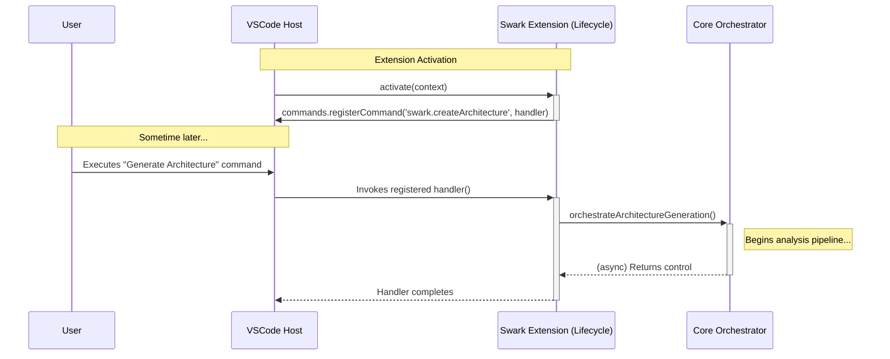

# Chapter 7: VS Code Extension Lifecycle & Activation

- Reference: [Core Command Orchestrator](chapter_06.md)

### Architectural Intent & Motivation

This module serves as the primary entry point and integration layer between the `swark` application and the Visual Studio Code host environment. Its precise responsibility is to implement the mandatory VS Code Extension API lifecycle hooks, `activate` and `deactivate`.

The structural requirement satisfied by this component is fundamental: for `swark`'s functionality to be accessible, it must register itself with the VS Code framework. This module acts as the "main" function for the extension, bootstrapping the application by connecting user-facing commands to the internal `Core Command Orchestrator`. Without this bridge, the entire `swark` analysis pipeline would remain dormant and inaccessible.

### Contextual Use Case

A developer has installed the `swark` extension and wants to generate a diagram for their current project. They open the VS Code Command Palette (Ctrl+Shift+P) and type "Swark: Generate Architecture Diagram". Upon selecting this command, the handler registered within this module is invoked by the VS Code host. This action triggers the `Core Command Orchestrator`, initiating the full sequence of workspace reading, LLM analysis, and diagram visualization. This command registration, occurring during the extension's activation, is the sole mechanism by which a user can initiate the `swark` workflow.

### Concept Decomposition

*   **Activation (`activate` function):** The designated entry point function that VS Code calls exactly once when the extension is activated. Activation is typically triggered by the first invocation of a registered command or on VS Code startup, as defined in `package.json`. Its primary role is to perform initial setup, most critically, command registration.
*   **Deactivation (`deactivate` function):** The cleanup hook called by VS Code just before the extension is shut down. It is used to release resources, terminate child processes, or perform other necessary teardown operations.
*   **Command Registration:** The process of associating a unique string identifier (e.g., `swark.createArchitecture`) with a callback function. This makes the command discoverable and executable within the VS Code UI.
*   **ExtensionContext:** A context object provided by the VS Code host to the `activate` function. It provides access to extension-specific utilities and, crucially, a `subscriptions` array. Disposables (like command registrations) are pushed to this array to ensure they are properly cleaned up by VS Code upon deactivation.

### Reference Implementation

The canonical implementation registers the `swark.createArchitecture` command and ties it to the `orchestrateArchitectureGeneration` function from the core orchestrator.

```typescript
// File: extension.ts

import * as vscode from 'vscode';
import { orchestrateArchitectureGeneration } from './core/commandOrchestrator';

/**
 * This function is called when the extension is activated.
 * It sets up the command registration.
 */
export function activate(context: vscode.ExtensionContext) {
    // Register the primary command that triggers the diagram generation workflow.
    const createArchitectureCommand = vscode.commands.registerCommand(
        'swark.createArchitecture',
        () => {
            orchestrateArchitectureGeneration();
        }
    );

    // Ensure the command is disposed of when the extension is deactivated.
    context.subscriptions.push(createArchitectureCommand);
}

/**
 * This function is called when the extension is deactivated.
 */
export function deactivate() {}
```

### Architectural Mechanics (White-Box Analysis)

#### Design Pattern Identification

*   **Observer (Implicit):** The extension follows an observer pattern where VS Code is the subject (or event publisher). By calling `vscode.commands.registerCommand`, the `swark` extension subscribes a handler to the "command executed" event for `swark.createArchitecture`. When the user triggers this event, VS Code notifies the subscriber by invoking its registered callback.
*   **Inversion of Control (IoC):** The VS Code host framework dictates the application's lifecycle, not the `swark` codebase itself. The framework decides when to instantiate the extension and invoke the `activate` and `deactivate` functions. Our code provides the implementation logic, but the framework controls its execution.

#### Control Flow/State

The control flow is initiated entirely by the external VS Code environment.

1.  **Activation:** A defined activation event in `package.json` (e.g., `onCommand:swark.createArchitecture`) occurs.
2.  **Invocation:** The VS Code host calls the exported `activate(context)` function.
3.  **Registration:** The `activate` function executes `vscode.commands.registerCommand`, passing a handler function to the host. The registration is a side-effect; the function itself completes immediately.
4.  **User Trigger:** The user invokes the command from the UI.
5.  **Execution:** The VS Code host looks up the handler associated with `swark.createArchitecture` and executes it, which in turn calls `orchestrateArchitectureGeneration`.

This module is **stateless**. It does not maintain any internal state regarding the application's status. It receives the `ExtensionContext` from the host and uses it to manage the lifecycle of disposable resources, but does not modify or store application data itself.

### Architectural Visualization (Mermaid)

A sequence diagram best illustrates the interaction between the user, the VS Code host, and the `swark` extension's components during command execution.



### System Topology & Integration

*   **Upstream (Dependents):**
    *   **Core Command Orchestrator (Chapter 6):** This module is the sole and direct dependent. The activation module's primary purpose is to provide an entry point to invoke this orchestrator.

*   **Downstream (Dependencies):**
    *   **VS Code API (`vscode` module):** This is the sole external dependency. It provides the functions (`commands.registerCommand`) and types (`ExtensionContext`) necessary to integrate with the host environment.

*   **Data Propagation:**
    *   **Ingress:** The `ExtensionContext` object is the only data structure passed into this module, supplied by the VS Code host during activation.
    *   **Egress:** This module produces no direct data output. Its output is the **side effect** of registering a command handler with the VS Code command registry. The `IDisposable` object returned by this registration is managed internally by adding it to the context's subscriptions list for later cleanup.

### Engineering Standards

#### Performance Implications

The `activate` function must be extremely lightweight and execute near-instantaneously. Its complexity is **O(1)**, as it only involves a simple registration call. Any computationally expensive or I/O-bound operations (e.g., reading the entire workspace) must be deferred to the command handler itself. Placing heavy logic in `activate` will negatively impact the VS Code editor's startup performance and is a critical anti-pattern.

#### Anti-Patterns

*   **Blocking Activation:** Performing synchronous file system reads, network requests, or heavy computation within the `activate` function. This freezes the extension host and delays VS Code startup.
*   **Leaking Disposables:** Calling `vscode.commands.registerCommand` or creating other disposable resources (e.g., `WebviewPanel`, `StatusBarItem`) without pushing the returned `IDisposable` object into the `context.subscriptions` array. This prevents VS Code from properly cleaning up resources, leading to memory leaks and ghost UI elements upon extension deactivation or update.
*   **Global State Contamination:** Defining mutable global variables within `extension.ts` to share state between command invocations. This creates unpredictable behavior and makes the extension difficult to test and maintain. State should be encapsulated within classes managed by the orchestrator.

### Conclusion

The VS Code Extension Lifecycle & Activation module is the essential, albeit thin, membrane between the `swark` application and its host environment. It performs the critical bootstrapping task of command registration via the `activate` hook, adhering to the Inversion of Control model mandated by the VS Code API. By deferring all complex logic to the `Core Command Orchestrator`, it remains a highly performant and stable entry point, ensuring a seamless user experience and proper resource management throughout the extension's lifecycle.