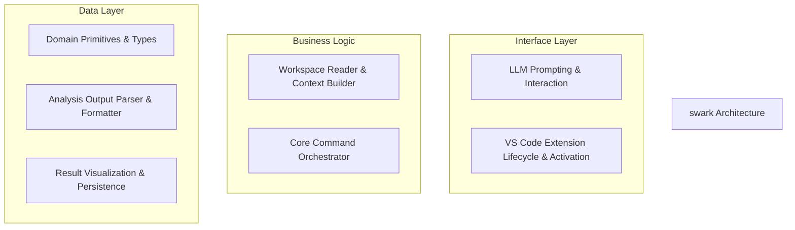
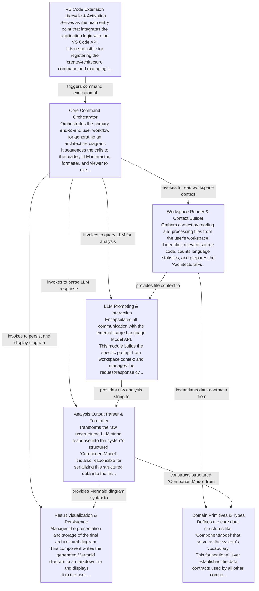

# swark Tutorial

Welcome to the comprehensive tutorial for swark. This tutorial is automatically generated from the codebase to help you understand the core concepts and implementation patterns.

## Project Overview

swark is a VS Code extension that automates architectural diagram generation by analyzing source code through an external LLM. The system is designed with a layered, pipeline architecture where a central orchestrator executes a sequence of components for context gathering, AI-driven analysis, data parsing, and final visualization.

## System Architecture

## Component Relationships

## Table of Contents

1. [Chapter 1: Domain Primitives & Types](chapter_01.md) - Comprehensive documentation for Domain Primitives & Types following structured methodology...
2. [Chapter 2: Workspace Reader & Context Builder](chapter_02.md) - Comprehensive documentation for Workspace Reader & Context Builder following structured methodology...
3. [Chapter 3: LLM Prompting & Interaction](chapter_03.md) - Comprehensive documentation for LLM Prompting & Interaction following structured methodology...
4. [Chapter 4: Analysis Output Parser & Formatter](chapter_04.md) - Comprehensive documentation for Analysis Output Parser & Formatter following structured methodology...
5. [Chapter 5: Result Visualization & Persistence](chapter_05.md) - Comprehensive documentation for Result Visualization & Persistence following structured methodology...
6. [Chapter 6: Core Command Orchestrator](chapter_06.md) - Comprehensive documentation for Core Command Orchestrator following structured methodology...
7. [Chapter 7: VS Code Extension Lifecycle & Activation](chapter_07.md) - Comprehensive documentation for VS Code Extension Lifecycle & Activation following structured method...

## How to Use This Tutorial

1. **Start with Chapter 1** to understand the foundational concepts
2. **Follow the sequence** - each chapter builds upon previous concepts
3. **Practice with code examples** - every chapter includes practical examples
4. **Refer to diagrams** - use architecture diagrams for visual understanding
5. **Cross-reference concepts** - chapters link to related topics

## Tutorial Features

- **Progressive Learning**: Concepts are introduced in logical order
- **Code Examples**: Every chapter includes practical, executable code
- **Visual Diagrams**: Mermaid diagrams illustrate complex relationships
- **Cross-References**: Easy navigation between related concepts
- **Beginner-Friendly**: Written for newcomers to the codebase

## Contributing

This tutorial is auto-generated from the codebase. To improve it:
1. Update the source code documentation
2. Add more detailed comments to key functions
3. Regenerate the tutorial using the documentation system

---

*Generated using AI-powered codebase analysis*
