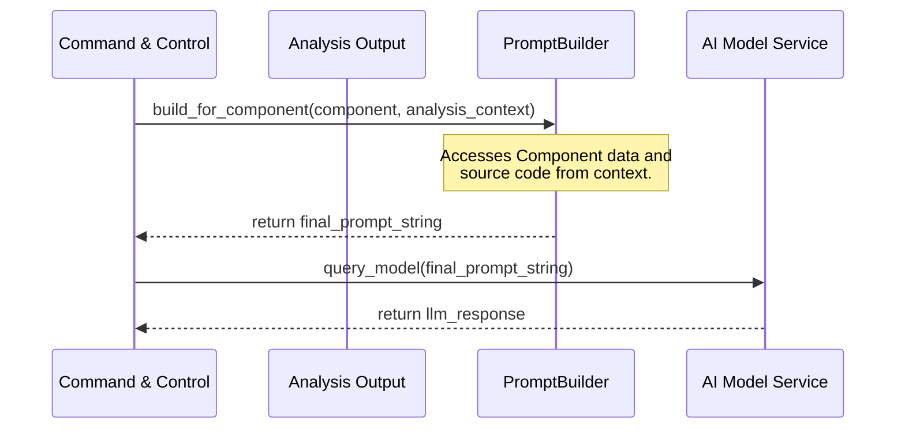

# Chapter 3: LLM Prompt Engineering

- **Reference**: [Chapter 2: Codebase Ingestion & Analysis](chapter_02.md)

## Architectural Intent & Motivation

The LLM Prompt Engineering module serves as the primary translation layer between the system's internal domain models and the AI's natural language interface. Its precise responsibility is to convert the structured, machine-readable output from the `Codebase Ingestion & Analysis` phase into a coherent, context-rich, and unambiguous prompt for the Large Language Model.

This abstraction is mandated by the fundamental business requirement of the `swark` project: leveraging a generic LLM for a specialized software architecture analysis task. The LLM cannot directly interpret the `Component` objects or file system metadata. This module bridges that gap, encapsulating the complex and iterative art of "prompt engineering" into a predictable, testable, and isolated system component. It ensures that the AI receives instructions and codebase context in an optimal format to produce a high-fidelity dependency graph.

### Contextual Use Case

Within the `swark` pipeline, after the `RepositoryReader` has successfully scanned the target codebase and produced a collection of `Component` domain models, the `Command & Control` orchestrator initiates the prompt engineering process. For each `Component` that requires dependency analysis, it invokes the `PromptBuilder`. The builder takes the target `Component` and its associated source code, constructs a detailed prompt instructing the LLM to identify its internal dependencies, and returns the formatted prompt string. This output is then ready to be passed to the `AI Model Interaction Service`.

## Concept Decomposition

Deconstruction of this module reveals several key logical concepts:

*   **Prompt Template**: A pre-defined, static string structure that outlines the prompt's format. It contains placeholders for dynamic content injection, ensuring consistency across all AI requests.
*   **System Message**: A high-level instruction embedded within the prompt that sets the persona, capabilities, and constraints for the LLM (e.g., "You are an expert software architect specializing in dependency analysis. You will respond only in JSON format.").
*   **Context Injection**: The core process of populating the prompt template with dynamic data. This includes injecting the source code of the target `Component`, its file path, and any other relevant metadata gathered during the analysis phase. This provides the LLM with the necessary "world knowledge" for the specific task.
*   **User Message**: The specific question or command directed at the LLM, which is framed by the system message and enriched by the injected context.

## Reference Implementation

The canonical usage pattern involves instantiating the `PromptBuilder` and invoking its primary construction method with a `Component` object sourced from the initial analysis phase.

```python
#
# main_orchestrator.py
# (within the Command & Control flow)
#

# Assume 'component_to_analyze' is a Component object from Chapter 1
# and 'repository_context' is output from the RepositoryReader in Chapter 2.

from swark.prompting import PromptBuilder
from swark.models import Component

# 1. Instantiate the builder
prompt_builder = PromptBuilder()

# 2. Build the prompt for a specific component
final_prompt = prompt_builder.build_for_component(
    target=component_to_analyze,
    full_codebase_context=repository_context
)

# 'final_prompt' is now a formatted string ready for the AI service.
```

## Architectural Mechanics (White-Box Analysis)

### Design Pattern Identification

The `PromptBuilder` class is a direct implementation of the **Builder** design pattern. It encapsulates the multi-step construction of a complex object (the final prompt string) from simpler parts (templates, system messages, `Component` data). This pattern is advantageous here because:

1.  **Separation of Concerns**: It decouples the complex logic of prompt formatting and context injection from the `Command & Control` flow that simply needs the final product.
2.  **Flexibility**: It allows the prompt construction algorithm to be modified independently of the components that use it. Different builder strategies could be swapped in for different LLMs or analysis tasks.

The `PromptBuilder` also acts as a **Facade**, providing a simple, high-level interface (`build_for_component`) that hides the more complex internal subsystems of template rendering and context formatting.

### Control Flow/State

The `PromptBuilder` is designed to be a **stateless** service. Each call to its `build` methods is an independent, idempotent operation. It receives all necessary data as arguments, performs the transformation, and returns a new value. It does not retain any state related to previous build operations. The control flow is strictly linear and synchronous: data in, process, data out.

## Architectural Visualization (Mermaid)

The interaction pattern is best represented by a Sequence Diagram, as it highlights the orchestrated flow of data from one component to the next within the `swark` pipeline.



## System Topology & Integration

### Dependency Graph

*   **Upstream (Dependents)**: The `Command & Control` module (Chapter 6) is the sole dependent. It invokes the `PromptBuilder` to advance the architectural analysis pipeline.
*   **Downstream (Dependencies)**:
    *   **Core Domain Models (Chapter 1)**: Consumes `Component` objects as its primary input for context injection.
    *   **Codebase Ingestion & Analysis (Chapter 2)**: Relies on the output of this module (e.g., file contents, module lists) to provide the necessary context to the LLM.

### Data Propagation

The data flow across this module's boundary is unidirectional and well-defined:

*   **Ingress**: The `PromptBuilder` ingests `Component` objects and associated metadata (e.g., `Dict[str, str]` mapping file paths to content) from the upstream analysis phase.
*   **Egress**: It produces a single, formatted `str` containing the complete prompt. This string is then passed downstream to the `AI Model Interaction Service`.

## Engineering Standards

### Performance Implications

The primary performance characteristic of this module is tied to string formatting and concatenation. The computational complexity is `O(N)`, where `N` is the total size of the context (primarily source code) being injected into the prompt. For projects with very large source files, this step can introduce latency and significant memory allocation. This also has a direct cost implication, as a larger `N` results in a higher token count for the LLM API call.

### Anti-Patterns

*   **Context Bleeding**: Allowing irrelevant or overly broad codebase information to be injected into the prompt. This can confuse the LLM, degrade the quality of its analysis, and needlessly increase token consumption. The builder must be precise about the context it includes.
*   **Ambiguous Instructions**: Crafting prompt templates that lack explicit constraints or a clear definition of the desired output format (e.g., not specifying JSON). This leads to non-deterministic responses from the AI that are difficult to parse.
*   **Tight Coupling to a Specific Model**: Hardcoding model-specific keywords or formatting tricks directly into the main builder logic. A better approach is to abstract these specifics into configuration or strategy objects to allow for easier integration with different AI models in the future.

## Conclusion

The LLM Prompt Engineering module is the intellectual core of `swark's` AI integration. By formalizing the translation from structured data to natural language instruction, it transforms a generic LLM into a specialized tool for architectural analysis. Its stateless, builder-pattern design ensures that this critical and complex step remains modular, testable, and adaptable as both the `swark` project and AI capabilities evolve.

- **Forward Link**: [Chapter 4: AI Model Interaction Service](chapter_04.md)