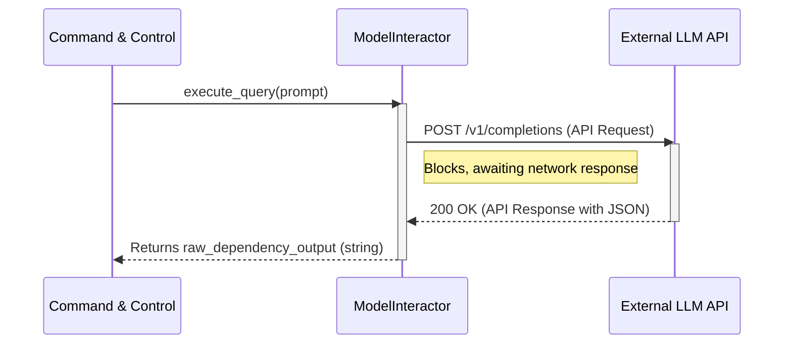

# Chapter 4: AI Model Interaction Service

- Reference: LLM Prompt Engineering

### Architectural Intent & Motivation

The AI Model Interaction Service acts as a dedicated gateway for all communication with the external Large Language Model (LLM). Its primary responsibility is to abstract the low-level details of API requests, authentication, and response handling.

This abstraction satisfies a critical architectural requirement: decoupling the core application logic of `swark` from the specific implementation of a third-party AI provider. By isolating this interaction behind a stable internal interface, the system gains the flexibility to swap LLM providers, update to new API versions, or implement advanced communication strategies (e.g., retry logic, caching) without impacting upstream components like the `Command & Control` flow.

### Contextual Use Case

Within the `swark` analysis pipeline, after the `PromptBuilder` from Chapter 3 has engineered a precise prompt to analyze a `Component`, the `Command & Control` orchestrator must send this prompt to the LLM for processing. It delegates this task entirely to the `ModelInteractor`. The orchestrator simply invokes the service with the prompt string and awaits a string-based result containing the raw dependency data, without any knowledge of the underlying HTTP requests or API specifics.

### Concept Decomposition

The service is deconstructed into the following logical units:

*   **ModelInteractor:** The primary public-facing class and entry point into the service. It exposes high-level methods for executing queries against the LLM.
*   **LLM Client:** An internal, encapsulated instance of a third-party SDK (e.g., `openai`, `anthropic`). The `ModelInteractor` manages the lifecycle and configuration of this client.
*   **API Response:** The raw data structure returned from the external API. The service is responsible for parsing this structure and extracting the relevant content (the model's completion) before returning it as a simple string.

### Reference Implementation

The canonical usage involves instantiating the `ModelInteractor` and invoking its query method with a prompt generated by the `PromptBuilder`.

```python
# Segment 1: Initialization
# The interactor is configured with API credentials and model parameters.
model_interactor = ModelInteractor(api_key="...", model_name="gpt-4-turbo")

# Segment 2: Execution
# The structured prompt is passed to the interactor for processing.
structured_prompt = prompt_builder.build_for_component(target_component)
raw_dependency_output = model_interactor.execute_query(structured_prompt)

# The raw string output is now ready for parsing and visualization.
print(raw_dependency_output)
```

### Architectural Mechanics (White-Box Analysis)

#### Design Pattern Identification

The `ModelInteractor` implements the **Facade** design pattern. It provides a simplified, unified interface (`execute_query`) to a more complex underlying subsystem—the entire machinery of interacting with an external LLM API. This includes client instantiation, request serialization, authentication, network communication, and response deserialization. This pattern shields the rest of the application from this complexity.

#### Control Flow/State

The control flow is a linear, blocking request-response cycle.

1.  The `execute_query` method is called with a prompt string.
2.  The `ModelInteractor` uses its internal LLM client instance to construct and send a request to the external API endpoint.
3.  The service blocks and waits for a response.
4.  Upon receiving a response, it extracts the primary text content.
5.  If the API call fails or returns an error status, the service is responsible for catching the low-level SDK exception and wrapping it in a domain-specific exception (e.g., `AIInteractionError`).
6.  The extracted string is returned to the caller.

State is minimal and immutable after initialization. The `ModelInteractor` holds the configured LLM client instance as internal state but does not modify it during its operational lifecycle.

### Architectural Visualization (Mermaid)

The interaction is a classic remote procedure call across a network boundary, best represented by a Sequence Diagram.



### System Topology & Integration

#### Dependency Graph

*   **Upstream (Dependents):** The `Command & Control` module (Chapter 6) is the sole direct consumer of this service. It depends on the `ModelInteractor` to execute a core step in its orchestrated pipeline.
*   **Downstream (Dependencies):** This service depends on the data structures produced by `LLM Prompt Engineering` (Chapter 3), specifically the final prompt string. It has a critical external dependency on the third-party LLM provider's network API.

#### Data Propagation

*   **Ingress:** The service's boundary accepts a single, structured `prompt` string. This data originates from the analysis of `Core Domain Models` (Chapter 1) and is formatted by the `PromptBuilder`.
*   **Egress:** The service outputs a single raw `string`. This string contains the LLM's unstructured analysis of component dependencies, which is then passed to the `Output Visualization` layer for parsing and graph construction.

### Engineering Standards

#### Performance Implications

The performance of this service is not determined by its own computational complexity (which is negligible, O(1)) but is entirely dominated by the I/O-bound task of network communication. Key implications include:

*   **Latency:** Each call to `execute_query` introduces significant latency (hundreds of milliseconds to several seconds) while waiting for the remote API.
*   **Timeouts:** Aggressive timeout configurations are necessary on the underlying HTTP client to prevent the entire `swark` application from hanging due to an unresponsive API.

#### Anti-Patterns

*   **Logic Bleed:** The `ModelInteractor` must not contain any logic for building prompts or parsing results. Its role is strictly to transport data. Placing logic here would violate the separation of concerns.
*   **Direct SDK Usage:** Bypassing the `ModelInteractor` and using the LLM client SDK directly from other parts of the application is a significant anti-pattern. This would re-introduce the tight coupling that the service was designed to eliminate.
*   **Ignoring Errors:** Failing to catch and wrap exceptions from the underlying SDK would expose low-level implementation details to the rest of the application, making the abstraction leaky.

### Conclusion

The AI Model Interaction Service is a foundational component for architectural robustness in `swark`. By acting as a stringent Facade, it isolates a volatile external dependency, thereby enhancing the system's maintainability, testability, and future flexibility. It ensures that the core logic of the application remains agnostic to the specific AI technology being used.

- Forward Link: Output Visualization