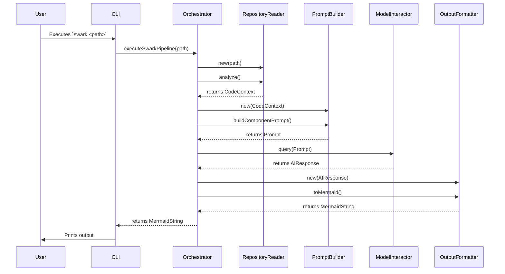

# Chapter 6: Command & Control Flow

- Reference: [Output Visualization](chapter_05.md)

### Architectural Intent & Motivation

The Command & Control Flow component serves as the central nervous system for the `swark` application. Its singular responsibility is to orchestrate the end-to-end execution of the code analysis pipeline, ensuring each processing stage is invoked in the correct sequence with the appropriate data.

This abstraction satisfies the architectural requirement for a decoupled, pipeline-based workflow. By centralizing the orchestration logic, it isolates the core processing modules (`Codebase Ingestion`, `LLM Prompt Engineering`, etc.) from each other. This enforces a unidirectional data flow and allows individual stages to be modified or replaced with minimal impact on the overall system.

### Contextual Use Case

A developer invokes `swark` from their terminal to analyze a local software repository. The Command & Control Flow is the first component to receive this execution request after initial command registration via the `activate` function. It interprets the user's intent, initializes the pipeline, and sequentially triggers each stage:

1.  It directs the `RepositoryReader` to ingest the codebase.
2.  It passes the resulting context to the `PromptBuilder`.
3.  It sends the engineered prompt to the `ModelInteractor`.
4.  Finally, it forwards the AI's response to the `OutputFormatter` to generate the final Mermaid.js graph, which is then presented to the user.

This entire sequence is managed exclusively by the Command & Control Flow component.

### Concept Decomposition

The Command & Control Flow is implemented as a stateless orchestrator that executes a predefined processing pipeline.

-   **Orchestrator**: The primary logic that drives the workflow. It holds no internal state regarding the analysis itself; its role is purely to invoke services and pass data between them.
-   **Pipeline**: The conceptual sequence of operations: Ingestion → Prompting → AI Interaction → Formatting. This sequence is hard-coded within the orchestrator to guarantee predictable execution.
-   **Command Registration**: The entry point, represented by the `activate` function, which registers the `swark` command suite with the host environment (e.g., a CLI framework), binding them to the orchestrator's execution logic.

### Reference Implementation

The following conceptual snippet demonstrates the orchestrator's canonical execution path. It wires together the primary services from preceding modules.

```typescript
// Conceptual execution logic within the main command handler

async function executeSwarkPipeline(repoPath: string): Promise<string> {
  // Stage 1: Ingestion
  const reader = new RepositoryReader(repoPath);
  const codeContext = await reader.analyze();

  // Stage 2: Prompt Engineering
  const promptBuilder = new PromptBuilder(codeContext);
  const systemPrompt = promptBuilder.buildComponentPrompt();

  // Stage 3: AI Interaction
  const model = new ModelInteractor();
  const rawArchitecture = await model.query(systemPrompt);

  // Stage 4: Visualization
  const formatter = new OutputFormatter(rawArchitecture);
  return formatter.toMermaid();
}
```

### Architectural Mechanics (White-Box Analysis)

#### Design Pattern Identification

-   **Pipeline**: The core pattern employed. The architecture is structured as a series of processing stages where the output of one stage becomes the input for the next. This promotes a clean, unidirectional data flow.
-   **Facade**: The orchestrator acts as a Facade over the more complex subsystems. It provides a single, simplified method (`executeSwarkPipeline`) to the command interface, hiding the intricate details of initializing and coordinating the `RepositoryReader`, `PromptBuilder`, and other services.

#### Control Flow/State

The control flow is strictly linear and synchronous (from the orchestrator's perspective, though individual stages may be asynchronous). There is no branching logic or deviation from the defined pipeline. State is not maintained within the orchestrator. Instead, data objects (`codeContext`, `systemPrompt`, `rawArchitecture`) are passed sequentially from one stage to the next, acting as transient data carriers for the duration of the execution.

### Architectural Visualization (Mermaid)

A Sequence Diagram is the most effective way to visualize the interactions orchestrated by this component. It clearly illustrates the ordered, linear flow of calls and data transformations across the system's modules.



### System Topology & Integration

#### Dependency Graph

-   **Upstream (Dependents)**: The application's main entry point (e.g., the command-line interface handler registered by `activate`). This is the only component that should directly invoke the Command & Control Flow.
-   **Downstream (Dependencies)**: This component is a high-level module that depends on nearly all other core services in the system:
    -   `Codebase Ingestion & Analysis` (via `RepositoryReader`)
    -   `LLM Prompt Engineering` (via `PromptBuilder`)
    -   `AI Model Interaction Service` (via `ModelInteractor`)
    -   `Output Visualization` (via `OutputFormatter`)

#### Data Propagation

-   **Ingress**: The orchestrator's primary input is configuration data, such as the target repository path.
-   **Egress**: The final output is a primitive data type, typically a string containing the Mermaid.js graph definition, ready for display or file storage.
-   **Internal Flow**: The orchestrator manages the transformation of data across architectural boundaries: `string` (path) → `CodeContext` (object) → `Prompt` (string) → `AIResponse` (structured object) → `string` (Mermaid graph).

### Engineering Standards

#### Performance Implications

The overall performance of the pipeline is the sum of the latencies of its constituent parts. The execution time is dominated by two stages:
1.  **Codebase Ingestion**: I/O-bound, dependent on the size and number of files in the target repository.
2.  **AI Model Interaction**: Network-bound, dependent on the LLM API's response time.

The orchestrator itself adds negligible computational overhead. Its complexity is O(1) relative to the pipeline stages it invokes.

#### Anti-Patterns

-   **Bypassing the Orchestrator**: Directly instantiating and calling services like `PromptBuilder` or `ModelInteractor` from the command-line layer. This violates the separation of concerns and breaks the guaranteed data flow, potentially leading to inconsistent or erroneous behavior.
-   **Introducing State**: Modifying the orchestrator to hold mutable state between executions. The orchestrator must remain a stateless coordinator to ensure each run is idempotent and isolated.
-   **Adding Branching Logic**: Introducing complex conditional logic within the orchestrator to alter the pipeline. The pipeline's sequence should remain static and predictable. Variations in behavior should be handled by injecting different configurations or specialized stage implementations, not by adding `if/else` complexity to the flow itself.

### Conclusion

The Command & Control Flow component is the architectural backbone of `swark`. By providing a simple, robust facade over a sequential pipeline, it ensures system predictability, enhances maintainability, and rigorously enforces the unidirectional data flow that defines the application's design. It successfully decouples the "what" (the individual processing stages) from the "how" (the order in which they are executed).